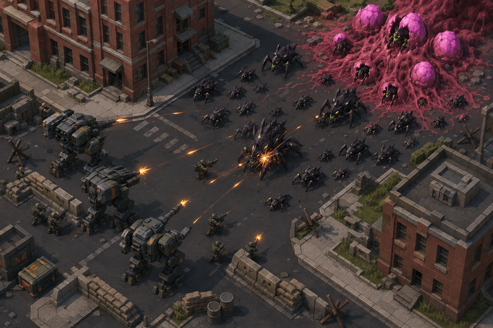

# Concept: tactical firefight

- **Asset**: `docs/design/concepts/tactical-firefight.png`, 1536×1024, documentation only (not a runtime asset).
- **Generator**: Codex CLI 0.152.1 built-in `image_gen` via `tools/art/gen-image.sh`, quantised to 256 colours (2.8 MB → 970 KB).
- **Date**: 2026-09-04
- **Prompt file**: [`prompts/tactical-firefight.txt`](prompts/tactical-firefight.txt)

## What it is for

The other sheets show one subject on a grey background. This one shows a **whole mission**: what the models, tiles, textures and VFX are supposed to add up to once they are in the same scene. It is the reference for style guide §12 (tactical scene presentation), and the picture to argue with when a screenshot of the real thing looks wrong.

## Keep

- **Read at a glance**: TDF cool grey and olive on the left, bug near-black chitin on the right, one fleshy magenta mound as the objective. Faction separation is by value and hue, not by outline.
- **Orange is the only warm colour on the TDF side** and it is doing three jobs — unit markings, muzzle flashes, tracers — which is exactly the budget §4.1 allows (≤ 10 % of a model's surface).
- **Green bioluminescence is small and bright**: eyes and vein lines only, never a wash over the chitin (§4.2).
- Cover is legible as geometry: sandbag lines, low walls, crates, a barrier. A player can see which tiles are defensible before any overlay is drawn.
- Ground is not flat colour — asphalt, kerbs, grass patches and rubble all read at this zoom, which is the bar the env atlas has to clear (§7, #441).

## Change next pass

- The concept is more painterly than the engine's flat shading, and its light is warmer than the neutral key in §12.1. Treat the composition and the colour separation as the brief; the shading is not.
- Bugs here are one silhouette family; the shipped swarmer, lurker and brute have to read apart from each other at 64 px, which this crowd does not test.
