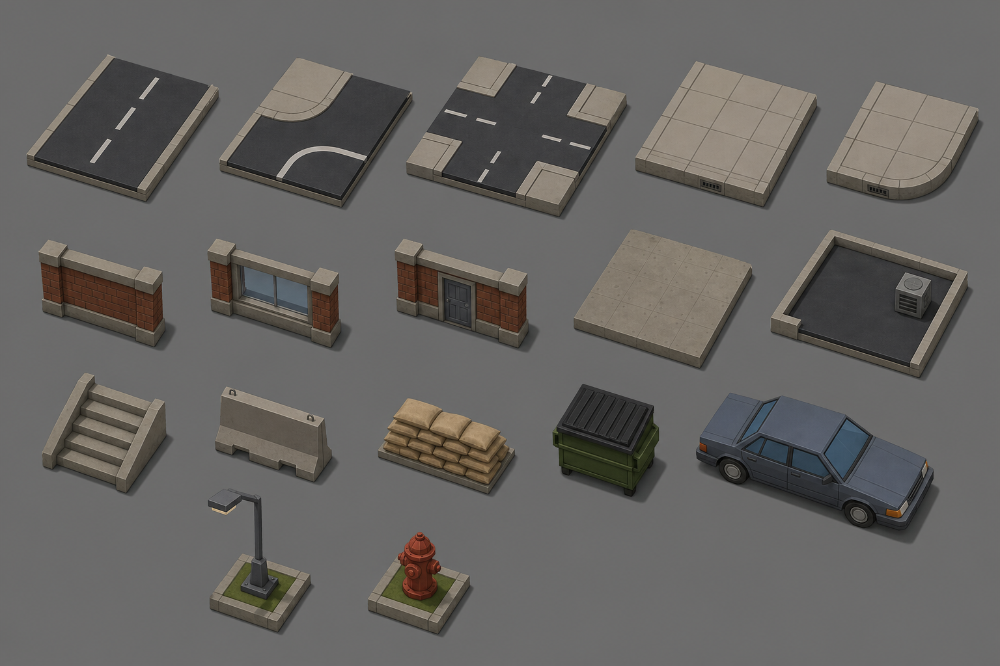

# Concept: City street tile set



- **Generator**: Codex CLI 0.152.1 built-in `image_gen` (model gpt-5.6-sol session; image model as served by the tool), via `tools/art/gen-image.sh`.
- **Date**: 2026-09-02
- **Prompt file**: [`prompts/tileset-city-street.txt`](prompts/tileset-city-street.txt) (exact text passed to the generator, plus the standard save-path suffix the script appends)
- **Style guide refs**: §3 scale/silhouette, §4 palette

## Prompt

```
Concept sheet for a modular low-poly city street tile set for an isometric near-future Earth turn-based tactics game, shown as separate pieces laid out neatly on a grid with gaps between them. Pieces: straight road tile, road corner, road crossroads, sidewalk tile, sidewalk corner, a wall segment, a wall with a window, a wall with a door, a floor slab, a flat roof with a low parapet, a straight staircase, and props: concrete barrier, sandbag stack, dumpster, sedan car, lamp post, fire hydrant. Every piece fits a square tile of the same size; walls are thin and one tile long; the car is two tiles long. Temperate city, daylight. Colours: asphalt #3A3D42, concrete #8E8A82, sidewalk #A7A297, brick #8A4B3A, glass #6E8FA6, roof #55524C, metal #6F7378, rust #8C5A3A, grass #5E7A3A. Low-poly game model style, flat shading, hard edges, clean fills with no gradients or noise, isometric three-quarter view from 35 degrees above, plain neutral background #6E6E6E, no text, no labels, no watermark. Wide landscape format.
```

## Keep

- Grid layout of equal-sized pieces: three road tiles, two sidewalks, three wall variants, floor, roof with parapet and vent, stairs, six props. Kerb and wall-footer conventions match style guide §7.
- Good reference for prop proportions (dumpster 1 u tall = high cover; barrier 0.5 u = low cover).

## Change next pass

- Dumpster came out olive; it should be `env-metal` so it does not read as TDF.
- Missing pieces for next pass: road T-junction, sidewalk-to-road ramp, wall-half (low cover), roof edge parapet piece, ladder.
