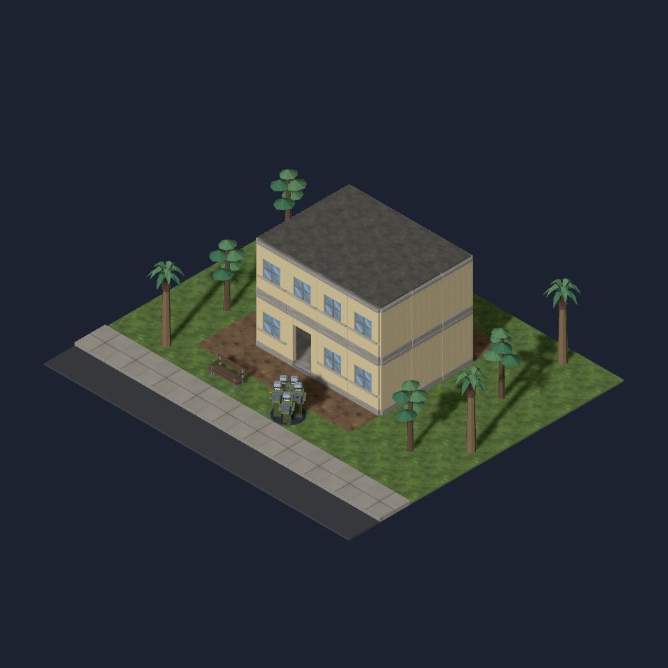

# Lagos art kit

A compact planted urban frontage: tiered almond crowns, arching oil-palm
fronds and warm rendered masonry. The composite is a hand-built **kit
assembly**, not evidence that the campaign selects a Lagos environment.
City selection, planting distribution and the reported two-seed Map Lab
comparisons belong to the #1082 geographic integration.

The local reference is [Lagos State’s Resilience Strategy, printed pp18–19](https://lasbca.lagosstate.gov.ng/wp-content/uploads/2021/05/Lagos_Resilience_Strategy.pdf):
coastal lowland, substantial built fabric and varied land/water contacts.
The kit represents a planted residential/commercial block; it is not a
claim that every Lagos neighbourhood is lush or that imported trees are absent.
The [Lagos Island tree study](https://www.ccsenet.org/journal/index.php/enrr/article/view/28466)
and [Lagos metropolis inventory](https://doi.org/10.1016/j.tfp.2023.100470)
provide the urban planting context. The almond’s tiered horizontal branching
is based on [NParks’ botanical description](https://www.nparks.gov.sg/florafaunaweb/flora/3/1/3181).
The new forms are stylised young/pruned specimens fitted to game scale.

| Model ID | Footprint | Height | Triangles | Bytes |
| --- | --- | --- | --- | --- |
| `prop.tree-tropical-almond` | 1×1 | 2.0 | 200 | 18,916 |
| `prop.tree-oil-palm` | 1×1 | 2.3 | 232 | 23,108 |
| `building.wall-plaster` | 1×0 | 1.5 | 100 | 10,344 |
| `building.wall-window-plaster` | 1×0 | 1.5 | 216 | 23,604 |
| `building.wall-door-plaster` | 1×0 | 1.5 | 212 | 21,236 |

Each has committed `_045`, `_135`, `_225` frames under `docs/design/renders/`.
All fifteen were opened, including the revised almond crown. Every material
primitive is watertight with consistent winding after welding the exporter’s
split vertices. [Bounds and validation](model-validation.json) confirm grounded
pivots and tree canopies within one tile. Trees export three/four material
primitives from one joined node, rather than a separate batch per leaf.

All three plaster variants have [exactly the same world-space triangles](wall-geometry-comparison.json)
as their existing concrete counterparts; sill, doorway, cornice and door
socket contracts are retained. Plaster is available through
`wallModel(kind, "plaster")` and keeps the existing concrete half wall.
It is deliberately outside the original three-family hash pool, preserving
the appearance of existing buildings. The tree prop kinds resolve through
`PROP_MODELS`; geographic generation owns their definitions and placement.
No existing GLB, atlas, ground material, roof, frontage or cutaway changed.

Rebuild each model with `blender -b --python-exit-code 1 --python
 tools/art/make_model.py -- --script tools/art/models/<name>.py --id <id>
 --category <props|buildings> --file <name>.glb --quality final
 --max-triangles <300|800>`. Scripts share `lagos_kit_parts.py`.

The assembly uses existing ground, road, roof, bench and infantry assets:
`node tools/art/preview/render-scene.mjs tools/art/preview/layouts/lagos-kit.json
 docs/design/renders/lagos-kit-composite.png`.
That browser explicitly launches SwiftShader; Blender’s three-angle renders
use CPU Cycles. `TUT_GPU` is not used for either evidence path.

Validation: typecheck, full lint/format, build and 2,364 unit tests passed
(one skipped), including manifest synchronisation and the unchanged legacy
wall-family order. These checks establish the asset/lookup contract; the
composite supplies the visual review.
