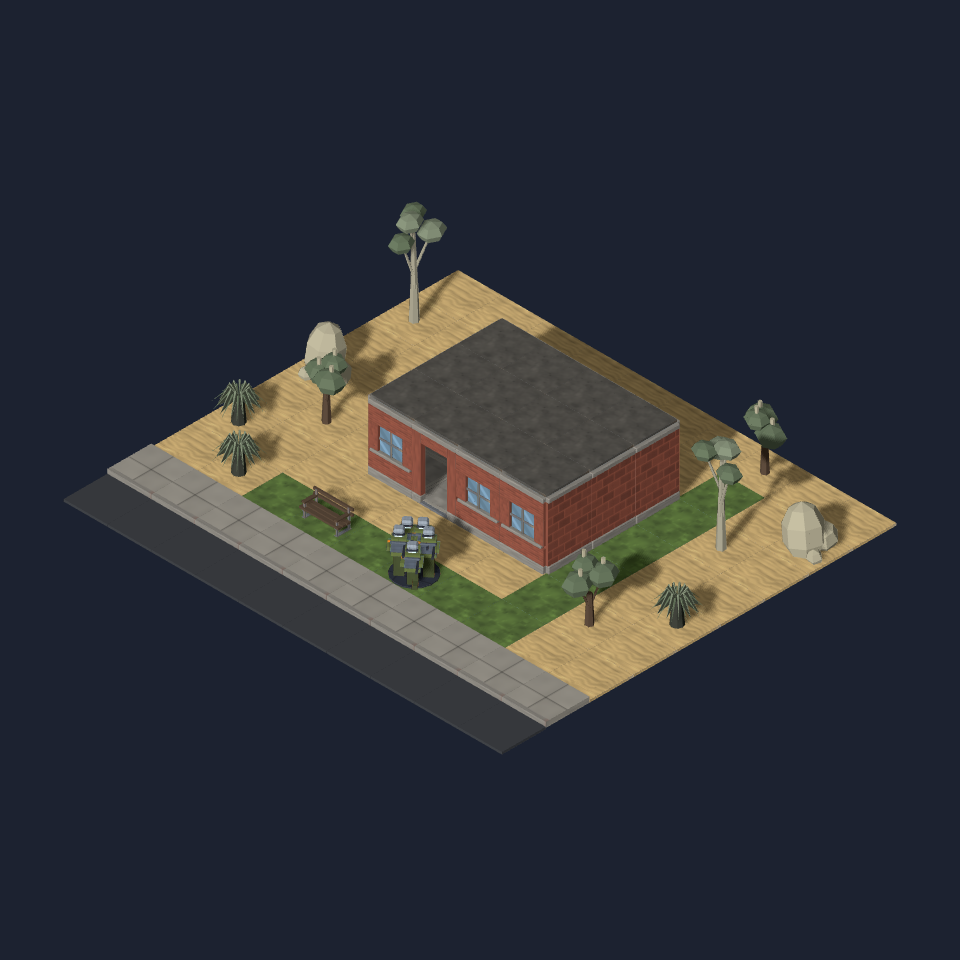

# Perth landscape kit

Tuart, Banksia, grass tree and pale limestone provide a south-west Australian
landscape vocabulary for #1083. This is a hand-built **kit assembly**, not a
generated Perth mission. The geographic integration still needs the reported
map, reverse angle, second seed and distinct-place control on the same runtime.

The local reference is [the WA park authority's Bold Park bushland description](https://www.bgpa.wa.gov.au/bold-park/attraction/bold-park-bushland):
tuart/Banksia woodland, limestone heath and grass trees within urban Perth.
The [DBCA tuart identification guide](https://library.dbca.wa.gov.au/FullTextFiles/631996.pdf)
informs the grey fibrous trunk. These are compact young/pruned specimens at
game scale. They provide a local planting choice, without claiming every Perth
street is bushland or excluding planted palms and lawns.

| Model ID | Footprint | Height | Triangles | Bytes |
| --- | --- | --- | --- | --- |
| `prop.tree-tuart` | 1×1 | 2.2 | 264 | 22,384 |
| `prop.banksia` | 1×1 | 1.4 | 248 | 20,724 |
| `prop.grass-tree` | 1×1 | 0.75 | 160 | 16,888 |
| `prop.limestone-outcrop` | 1×1 | 0.9 | 132 | 10,828 |

Each has committed `_045`, `_135`, `_225` frames under `docs/design/renders/`.
All twelve final angles and the assembly were opened. Every material primitive
is closed with consistent winding after welding split export vertices; the
[validation report](model-validation.json) records exact bounds. All four
models stay inside one tile with a grounded centre pivot. The grass-tree leaf
tip reaches 0.755; its manifest height follows the model loop's two-decimal
rounding. Each plant is one joined node with a primitive per palette material.

All four prop kinds resolve through `PROP_MODELS`. The proposed generation
contract is HIGH cover/non-LOS for the two trees, LOW cover/non-LOS for the
grass tree and the existing boulder's HIGH cover/LOS contract for limestone.
Definitions and distribution belong to the Perth place profile; adding a
local plant must not populate the old global random yard pool. Existing ground,
road, building, water and cutaway assets are unchanged by this kit.

Rebuild with `blender -b --python-exit-code 1 --python tools/art/make_model.py --
--script tools/art/models/<name>.py --id <id> --category props --file <name>.glb
--quality final --max-triangles 300`. Scripts share `perth_kit_parts.py`.

The assembly uses existing sand/grass ground, street, brick walls, roof, bench
and infantry assets: `node tools/art/preview/render-scene.mjs
tools/art/preview/layouts/perth-kit.json docs/design/renders/perth-kit-composite.png`.
The browser explicitly uses SwiftShader; the model angles use CPU Cycles.

Validation: typecheck, full lint/format and 2,364 unit tests passed (one
skipped), including manifest synchronisation and the prop lookup contract.
