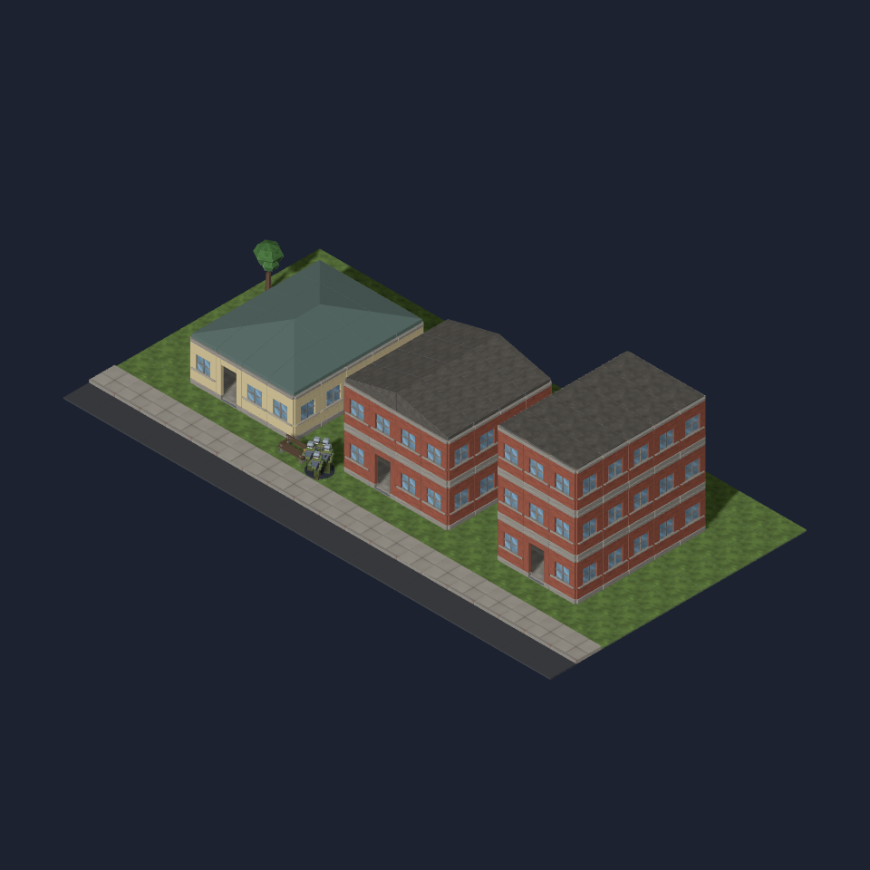

# Johannesburg roof form

The muted green hipped cap adds a different domestic roof form to #1084.
The composite is a hand-built **kit assembly**, using the production roof
fitter on a 4×5 rendered house beside the existing gabled brick house and
flat-roof block. It is not a generated Johannesburg mission. Local profile
selection and the two-seed generated comparisons are still required for the
geographic issue.

The intended context is an older mixed suburban street, informed by
[Johannesburg's description of Region B](https://joburg.org.za/about_/regions/Pages/Region%20B%20-%20Northcliff%20Randurg/Region-B---Northcliff-Randurg.aspx).
It is a mix of domestic and commercial forms, not a reconstruction of a named
landmark. The city's [Brixton heritage survey](https://ags.joburg.org.za/StoryMaps/Heritage/Corridors/Empire-Perth/pdf/7.6.28BP.pdf)
records a metal-roof house with a side gable and stoep; its
[Salisbury House record](https://arts-culture-heritage.joburg/heritage-sites/salisbury-house/)
shows the combination of brick/rendered masonry and a green hipped metal roof.
The kit abstracts the broad roof form and painted finish, without miniature
ornament or changes to the playable floor plan.

`building.roof-hipped` is a closed 1×1 cap, base-centred, 0.37 high in its
authored form: **30 triangles, 3,272 bytes**. All three `_045`, `_135`, `_225`
angles under `docs/design/renders/` and the composite were opened. The
[validation report](model-validation.json) confirms closed geometry and bounds.

The graphics consumer fits nine upper points to the lower of two perpendicular
roof profiles. The triangle diagonal follows each hip fold, including corners
and odd-width ridges; the ceiling stays at the wall line. Five complete roofs
(4×7, 5×8, 7×4, 8×5 and 5×5) were ray-sampled through their interiors and on
both sides of every tile seam. Fitting borrows the source material and leaves
the loader prototype unchanged. The existing gabled profile and its cache key
are unchanged; the hip's second profile forms part of its cache key.

Rebuild: `blender -b --python-exit-code 1 --python tools/art/make_model.py --
--script tools/art/models/building-roof-hipped.py --id building.roof-hipped
--category buildings --file building-roof-hipped.glb --quality final
--max-triangles 800`.

Assembly: `node tools/art/preview/render-roof-kit.mjs
tools/art/preview/layouts/johannesburg-kit.json
docs/design/renders/johannesburg-kit-composite.png`.
This Vite page uses the production roof factory and the established kit
lighting; Chromium explicitly uses SwiftShader. Blender angles use CPU Cycles.

Validation: typecheck, full lint/format, build and 2,371 unit tests passed
(one skipped). The 29 focused model/roof checks were repeated after the final
static typing cleanup, including the original gabled shelter checks.
