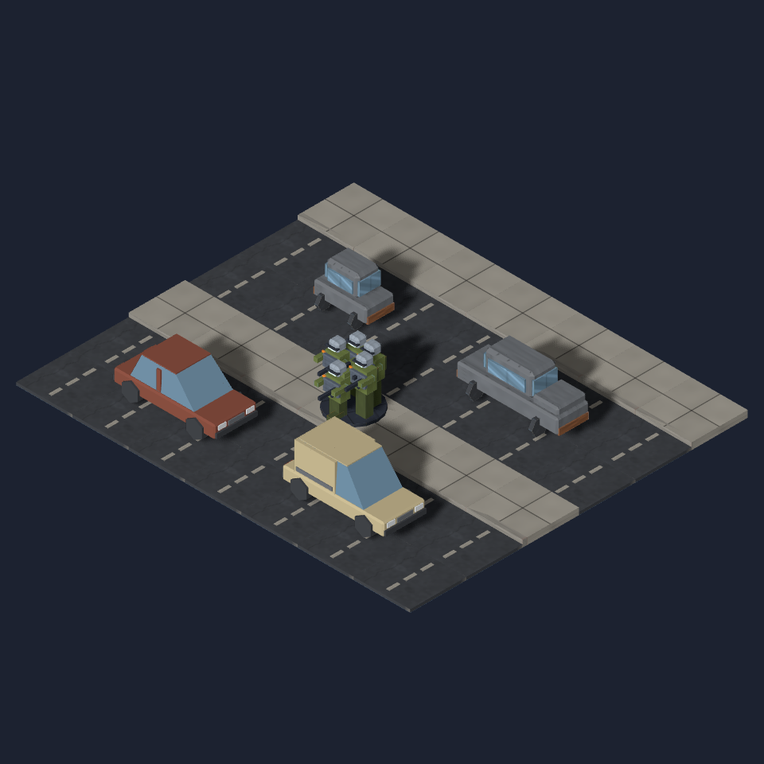

# Map variety and environmental realism

One iterative review for #1110. Baseline: `5008477`. All close-up pairs use the
same seed, place profile, viewport, camera, and real production models. Images
come from Map Lab; the live-mission image additionally shows the gameplay HUD
and fog of war.

## Initial critique

- Normal three- and four-lane streets reject street prop placement because
  adjacent carriageway lanes are mistaken for intersections. The baseline
  city (`mc-resume-01`) has 14 buildings and 435 props, but no cars, dumpsters,
  barriers, or sandbags. The town and desert controls also have no road props.
- Registered lamp-post and hydrant models are unused. Pavements have no
  small-scale infrastructure to establish street rhythm.
- Mirrored exterior ground-floor walls lose their building ownership outside
  Johannesburg, producing repeated brick bases even where the upper floors
  use a different wall family.
- Yard groups and repeated vegetation silhouettes need variation while keeping
  doors, windows, hooks, and traversal clear.

## Reproduce the close-ups

The committed case list covers city, town, snowy rural, desert town, Perth,
and Lagos. The `control` flag preserves each place profile in **both** phases.
The capture tool checks page errors and failed model loads and records the
camera and image hashes alongside the PNGs. It can repeat each frame in a
fresh browser to check capture stability.

```sh
PLACE_OUTPUT=docs/design/diagnostics/1110/after \
PLACE_MAP_OUTPUT=/workspaces/tut/.git/map-variety/maps \
PLACE_CASE_FILE=tools/mapgen/map-variety-cases.json \
CAPTURE_REPEATS=1 node tools/mapgen/capture-place-profiles.mjs after
```

For the baseline, set `PLACE_ROOT` to a detached worktree at `5008477`, change
the output directory to `before`, and pass `before` as the phase. Dependencies
must be available in that worktree. Set `CAPTURE_CASES=city` for one case, or
`CAPTURE_REPEATS=2` to verify a frame in two independent browsers.

```sh
CAPTURE=1 pnpm exec playwright test e2e/map-variety-screenshot.spec.ts --workers=1
```

The second command captures a city overview and a mission reached through
the real deployment flow, with asset fallback guards.

## Review criteria

Street assets must follow the carriageway direction and leave intersections,
doors, ramps, and bypass lanes clear. Small sidewalk fixtures must inherit
their tile's fog. Yard variants must stay within the existing cover budget.
Vegetation must remain rooted and inside its supported footprint. Building
finishes must be consistent across mirrored exterior walls and preserve local
place identities. Generation must remain deterministic and pass the map
invariant sweep; restored road cover is also checked in the mission simulation.

## Two-tile vehicle scale

The first street pass exposed the old compact car's toy-like proportions. The
user requested two-tile cars during review, so the next pass reserves two real
cells and uses the existing sedan plus new hatchback and utility van models.
The new meshes are approximately 3.7 metres long at the game's 2 metres/tile
scale. Both stay within the two-cell footprint; their roof heights remain
0.76 and 0.86 world units. They validate as watertight at 256/268 triangles and
under 33 KB each, below the prop budget.



All vehicles above share the same camera scale: old compact upper-left, existing
sedan upper-right, new hatchback lower-left, new utility van lower-right. This
is a composed art comparison, not a generated map. Reproduce it with:

```sh
node tools/art/preview/render-scene.mjs tools/art/preview/layouts/vehicle-scale.json docs/design/diagnostics/1110/vehicle-scale.png
```

The art source is `tools/art/models/vehicle_variants.py` and the two
`prop-car-*.py` entry scripts. The new models follow the standard +Z glTF front;
the model selector accounts for the original sedan's +X front. All three
therefore align with the same recorded carriageway direction.

Legacy saves without `occupiedTiles` keep their one-tile car collision and the
original compact mesh. New street density counts **occupied tiles**, preventing
the larger vehicles from doubling the intended amount of road cover. The
contract and compatibility decision are recorded in ADR 0004 §4.4.

## Final review

The critic reviewed matching close-ups in both city orientations and across
town, desert, snowy rural, Perth and Lagos. The implementation was revised
through the same PR, including full-size vehicles, footprint-aware fog,
consistent exterior walls and grounded vegetation.

| Case | Cars before → after | Road cells occupied before → after |
| --- | ---: | ---: |
| City | 0 → 32 | 0 → 79 / 1,584 |
| Town | 0 → 4 | 0 → 12 / 414 |
| Desert town | 0 → 4 | 0 → 12 / 414 |
| Perth | 0 → 19 | 0 → 53 / 1,052 |
| Lagos | 0 → 30 | 0 → 79 / 1,584 |
| Snowy rural | 1 → 0 | No paved road tiles |

Every generated car in these final controls occupies two cells. The snowy
control's old compact car is omitted because its short stretch has no safe,
level two-cell space; this is a consequence of the larger footprint. Building
counts stay unchanged. Counts above describe simulation props; decorative
lamps and hydrants do not add collision. Full counts are in [metrics.json](metrics.json).

The city image was captured independently twice with a byte-identical SHA-256
(`d21e1acd807d971cc8bab3ed9343e27e9d4525e4500f206ba87059ed44ddfd61`).
Camera settings and hashes for all seven close-ups are in
[after/captures.json](after/captures.json). The production changes are at
`61c2f29`; subsequent commits add review artifacts.

## Validation

- Typecheck, lint and production build passed.
- Unit/property suite: 2,436 tests passed; one opt-in test skipped.
- The two-tile tests exercise atomic reservation/removal, frozen map validation,
  save round trips, infantry/mech movement, sight lines, cover, rotation,
  loaded-model alignment and visibility from either half.
- The 60-mission simulation passed with zero invariant violations. Both baseline
  and final runs produced 44 wins and 16 unresolved missions within the existing
  15-turn cap, 141 survivors and 621 total turns. Seventeen individual reports
  differ; aggregate equality does not imply unchanged mission behavior. See
  [baseline results](simulation-before.json) and [final results](simulation-after.json).
- New vehicle GLBs are watertight and were inspected from all three fixed angles.

Browser and live-mission capture results are recorded after the final run.

