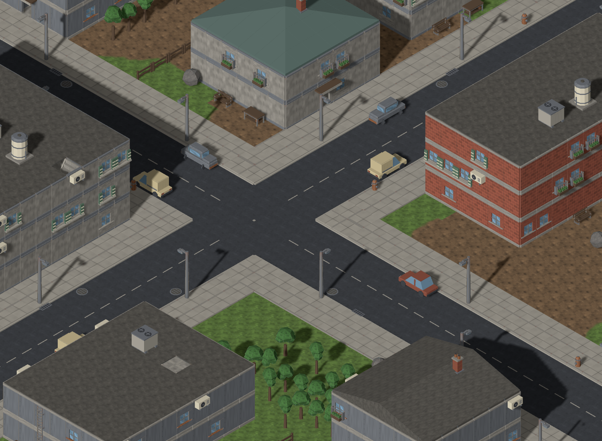
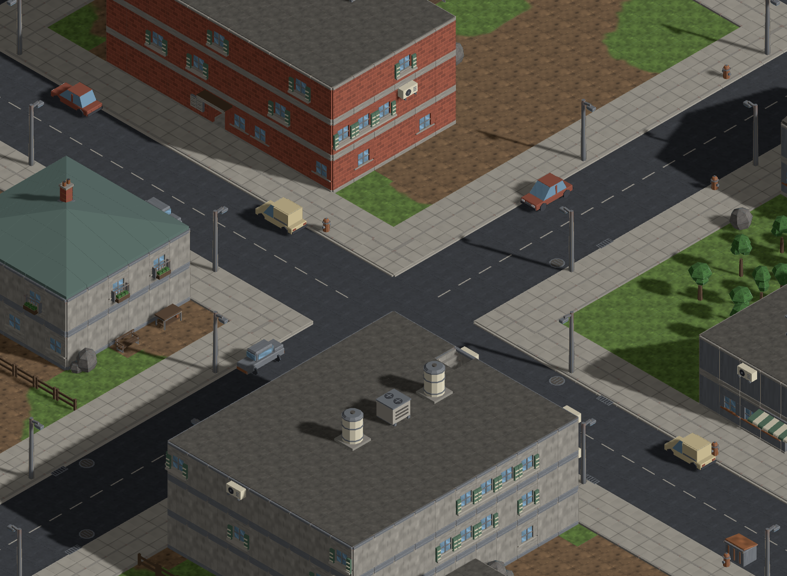
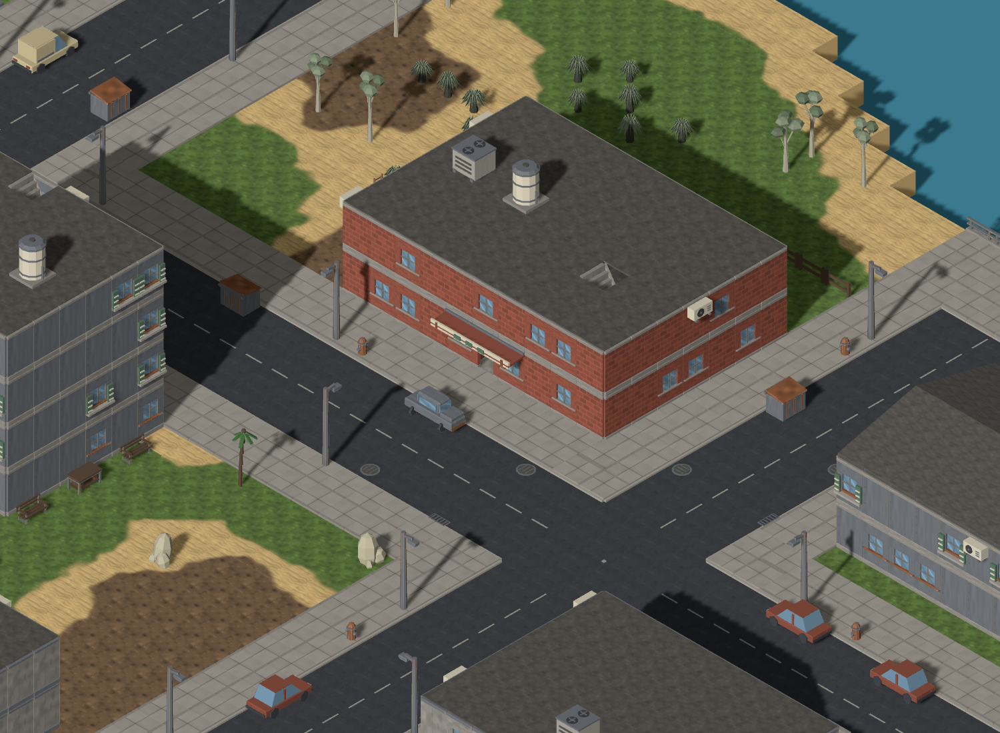
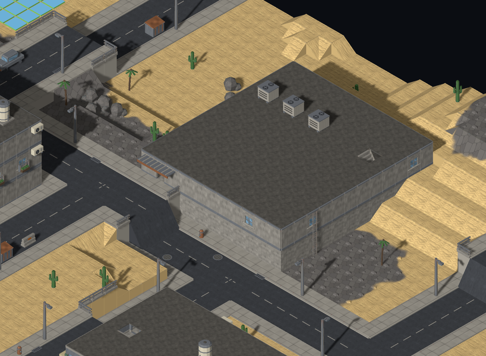
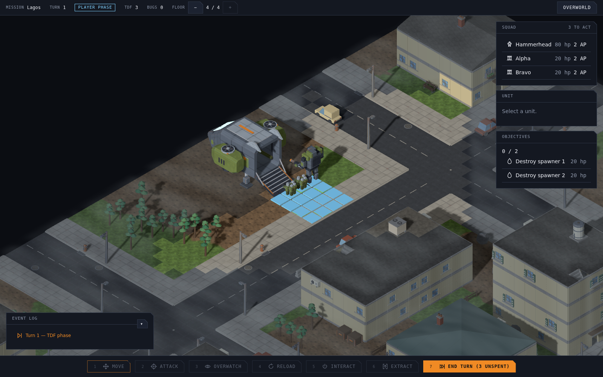
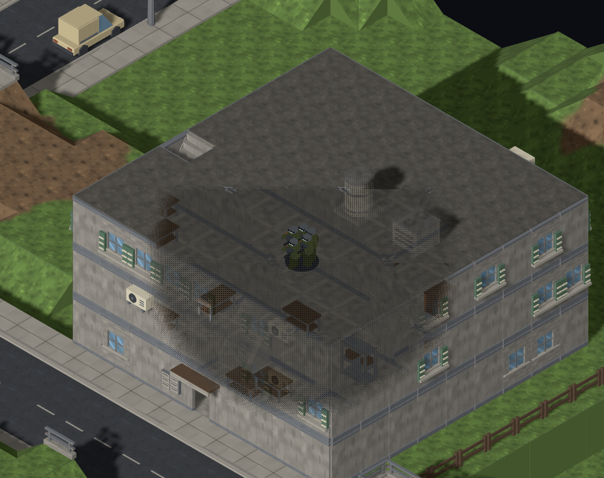
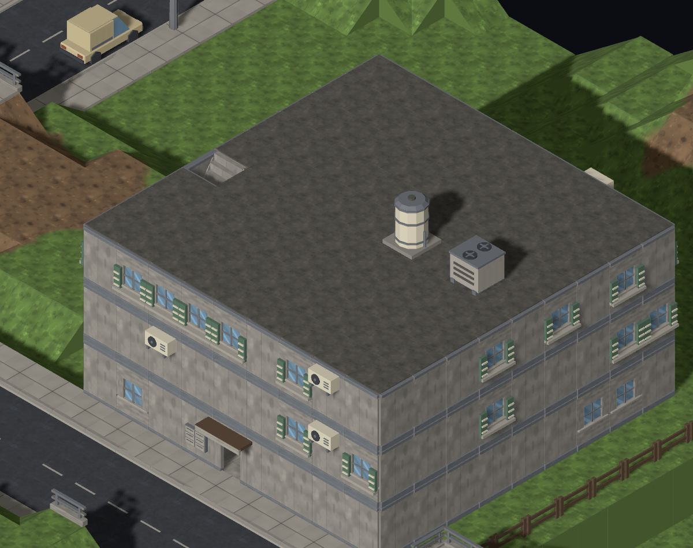

# Second art pass: inhabited roofs and distinct facades

The first pass concentrated on road placement and two-tile vehicles. The user
asked for broader art improvements, and the critic identified empty roof areas
and generic building frontages as the highest-value remaining gaps.

Production implementation: `72fe6f4`. The new [nine-model urban life kit](../../../kits/urban-life-kit.md)
adds HVAC, water tanks, chimneys, open shutters, AC units, a warehouse canopy,
a second shop awning/sign, drains and manholes. Models were built in Blender,
validated watertight and inspected from three angles; all are below 30 KB.

Rooftop equipment occupies real tiles and gives high cover. Small service rows
keep roof perimeters and landings free, with connectivity checked after each
proposed group. Roof equipment fades with the building for indoor unit views.
Chimneys are embedded in the pitched/hipped roof profile. Shutters leave the
existing window aperture open; AC stays on solid upper wall bays, on a seeded
opposite pair of facades. Existing fabric awnings remain alongside the new sign
variant. Flush road utility details add no collision.

## Review evidence

The first seven images repeat the original control seeds and cameras; the last
two focus on a Perth storefront and desert warehouse. Compare the city below
with the [first street pass](../after/city.png) or [original baseline](../before/city.png).









Camera settings and hashes are recorded in [captures.json](captures.json).
The capture began with the production edits present before they were committed;
its baseCommit records that starting HEAD, while the implementation commit
above identifies the source that produced all nine frames.

```sh
PLACE_OUTPUT=docs/design/diagnostics/1110/round2 \
PLACE_MAP_OUTPUT=/workspaces/tut/.git/map-variety/round2/final-maps \
PLACE_CASE_FILE=tools/mapgen/urban-life-cases.json \
CAPTURE_REPEATS=1 node tools/mapgen/capture-place-profiles.mjs after

CAPTURE=1 CAPTURE_OUTPUT=docs/design/diagnostics/1110/round2 \
  pnpm exec playwright test e2e/map-variety-screenshot.spec.ts --workers=1
```

The latter command captures Map Lab at play zoom, an actual deployed mission,
and the existing production-controller cutaway fixture with an indoor unit
present and then absent. The cutaway fixture is labelled separately from the
live mission; it does not override ghost opacity or radius.

The city control adds 13 roof props (7 HVAC, 6 tanks); town adds 7, desert 8,
Perth 10 and Lagos 10. The snowy rural control adds no roof equipment. Existing
car counts and their two-cell footprints are retained across all six controls;
see [metrics.json](metrics.json). These counts exclude visual wall/road attachments.

## Validation

- Typecheck, lint and production build passed.
- Full unit/property suite: 2,449 passed; one opt-in test skipped.
- Full browser suite: 70 passed; 48 opt-in tests skipped.
- All three dedicated review capture tests passed, including actual deployment
  and the production-controller cutaway fixture, with page-error/asset guards.
- The 60-mission simulation passed with zero invariant violations (seven checks;
  optional paired experiment skipped). The existing turn cap remains 15.
- The critic approved all nine map views, Map Lab context, live gameplay and
  both cutaway states. No blocking findings remain for this iteration.



| Indoor squad present | Squad leaves |
| --- | --- |
|  |  |

