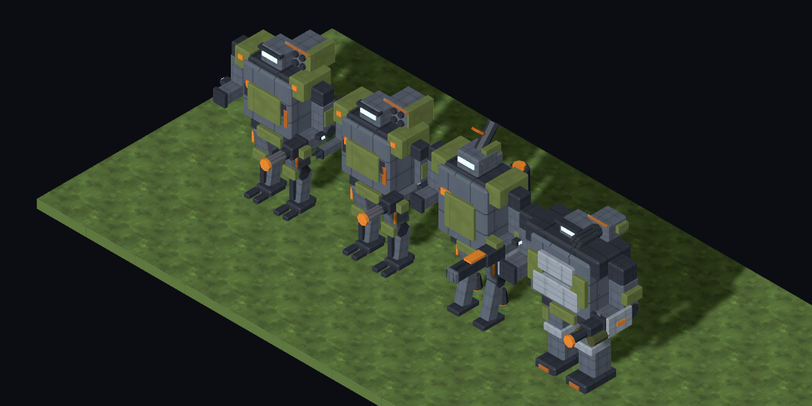
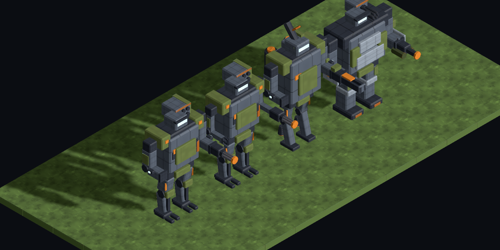
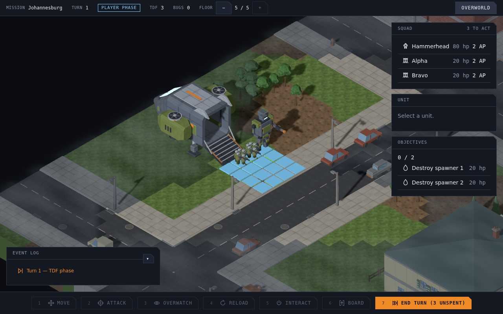

# #1115 — mechs on the field draw the loadout they were built with

Executive Director, from play (2026-09-12): *"Mechs all look the same! Despite having a different preview in the mech bay all the mechs look the same, the mech model should be different depending on equipment."*

`mechUnit` stamped every mech template with the one reference assembly (`tdf.mech.assembled-a`), and the tactical scene builder loaded that id. The template now carries the mech's loadout and `LoadoutUnitModelSource` assembles the parts through the same table and `MechAssembler` the mech bay preview uses, flattened so the motion rig finds the limbs as it does on a reference GLB.

Frames from `tools/art/preview/mech-loadouts.html` (`zoom=120`), four mechs through the production `TacticalSceneBuilder`, left to right:

1. the reference assembly every mission drew before (Vanguard, Strider, Tracker, Autocannon, Missile Pod);
2. the starter loadout as it is now drawn (Vanguard, Strider, **Manipulator**, Autocannon, Missile Pod);
3. Atlas, Jumper, Tracker, Railgun, Mortar;
4. Bulwark, Bastion, Brace, Flamer, Rotary Cannon.

| yaw 0 | yaw 1 |
|---|---|
|  |  |

What to look for: the starter mech's fingered manipulator arms against the reference's sensor-pod tracker arms; the railgun's long barrel and the mortar tube on the third; the bulkier Bulwark chest, Bastion legs and flamer on the fourth. All four stand the same height for the same legs and chassis, and every weapon points the way the unit faces.

In play (`node tools/art/preview/shoot-mission.mjs`, seed 4242, turn 1): the starter mech Hammerhead on the drop-ship pad, assembled from the Skirmisher loadout.

