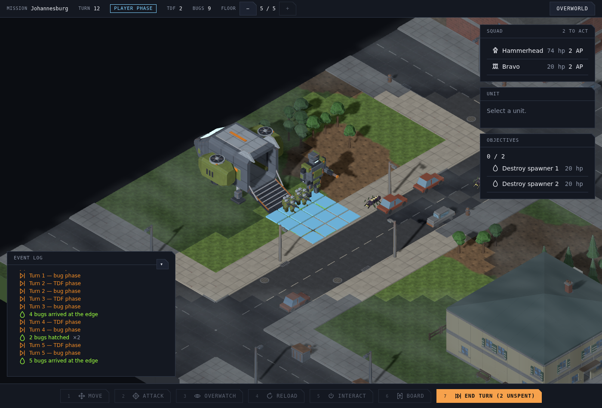

# #1116 — a bug that walks into view is seen walking in

Executive Director, from play (2026-09-12): *"When bugs move in from out of sight, they don't animate, they just sorta pop in."*

The scene has no object for an unspotted enemy (ADR 0006 §2.4) and the bug phase is one event batch, so a bug that started in the dark had its moves offered to an animation queue that found nothing to walk, and then appeared at its destination when the scene redrew. Now `placeArrivals` (`src/app/service/tactical-scene-steps.ts`) puts every unit that moves during the batch and is in view by its end on the board at the tile its walk began, hidden; its spot is phased ahead of its first move and shows it, and the walk plays in full.

Seed 4242, Johannesburg, the eleventh End turn with the force left on the drop-ship pad. Frames from a 1400×950 viewport during the bug phase (each screenshot costs about five seconds under SwiftShader, so three frames cover the phase):

| 0 s | 6 s | 11 s |
|---|---|---|
|  |  |  |

The bug beside the red car was spotted on an earlier turn. The one that walks in this phase (`unit-5`) is behind the Objectives panel at 0 s, emerges at its left edge at 6 s, and is on the road by the grey car at 11 s, on its way to the tile it ends the phase on. Before the change it had no object until the redraw and appeared on that tile at once.

The same run traced the drawn position of every unit once per frame through `__tutTactical__.unitScreenPosition` (client pixels, 1400×950); `unit-5` between its first drawn frame and its last:

| t (ms) | x, y |
|---|---|
| 321 | 1257, 349 |
| 755 | 1246, 356 |
| 1147 | 1234, 363 |
| 1161 | 1232, 364 |
| 2086 | 1220, 371 |
| 2540 | 1208, 377 |
| 3382 | 1197, 384 |
| 3856 | 1185, 391 |
| 4718 | 1173, 398 |
| 5233 | 1161, 405 |
| 6084 | 1149, 411 |
| 6588 | 1138, 418 |
| 6958 | 1126, 425 |
| 6963 | 1124, 426 |
| 7118 | 1112, 433 |
| 7127 | 1110, 434 |
| 7938 | 1098, 441 |
| 8355 | 1087, 448 |
| 8793 | 1075, 455 |
| 9238 | 1063, 461 |
| 9681 | 1051, 468 |
| 10501 | 1039, 475 |
| 11408 | 1028, 482 |
| 11522 | 1016, 489 |
| 11928 | 1004, 495 |
| 11940 | 1002, 497 |
| 12368 | 990, 503 |
| 12375 | 988, 504 |
| 13184 | 977, 504 |
| 13588 | 965, 497 |
| 14093 | 955, 491 |
| 14568 | 955, 491 |
| 15021 | 955, 491 |
