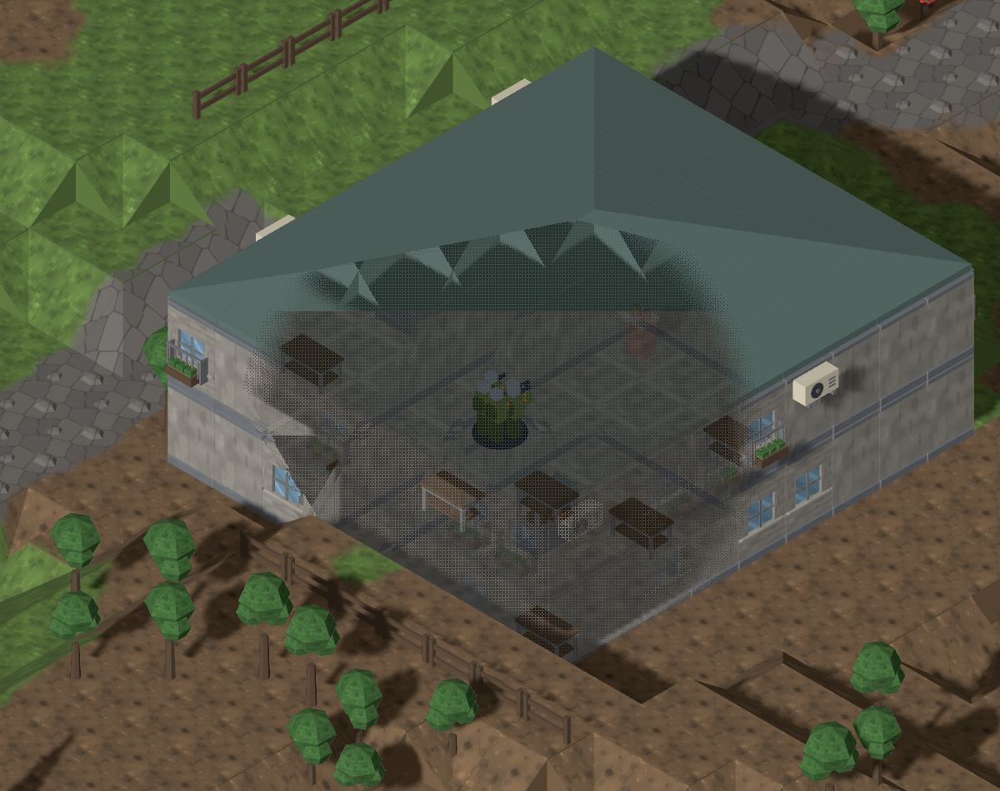
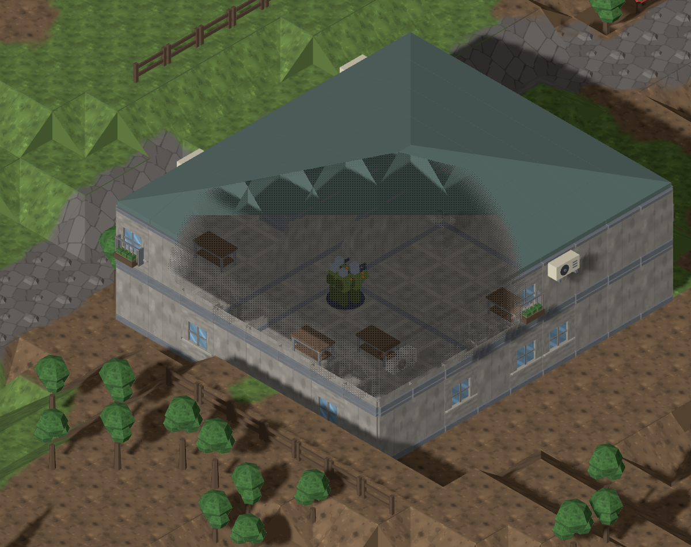
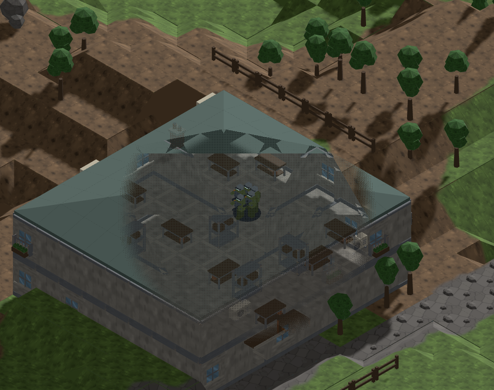
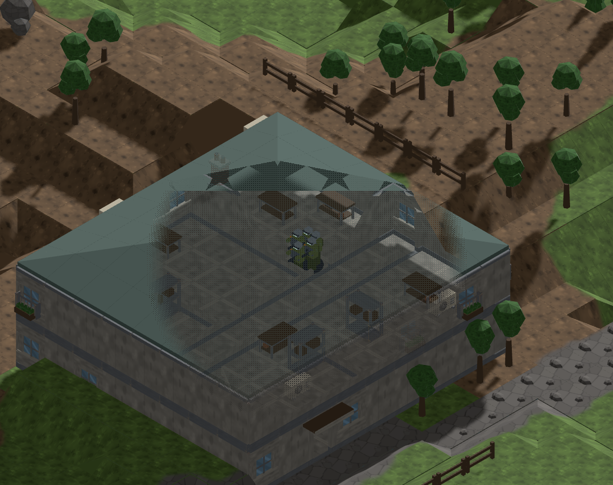
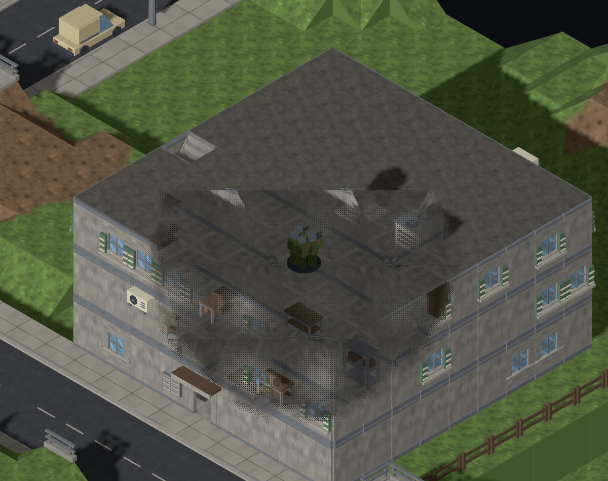
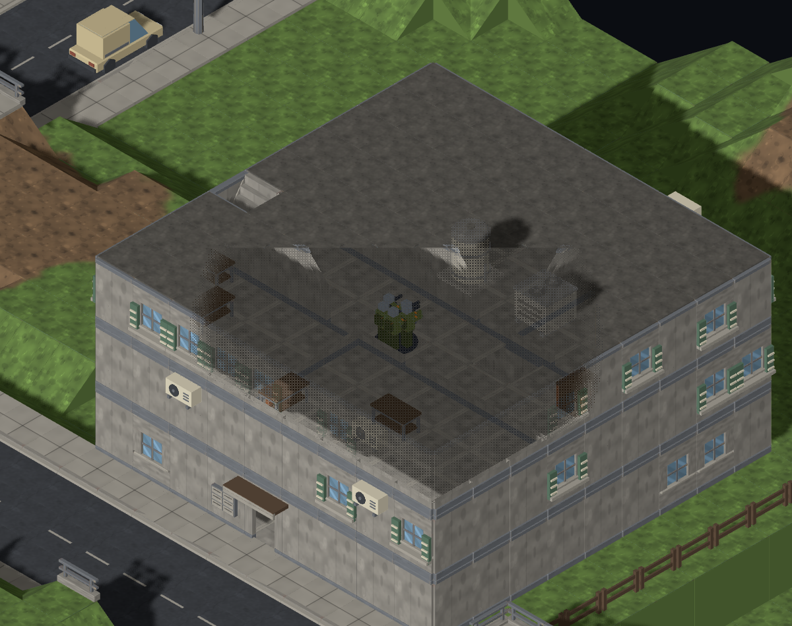
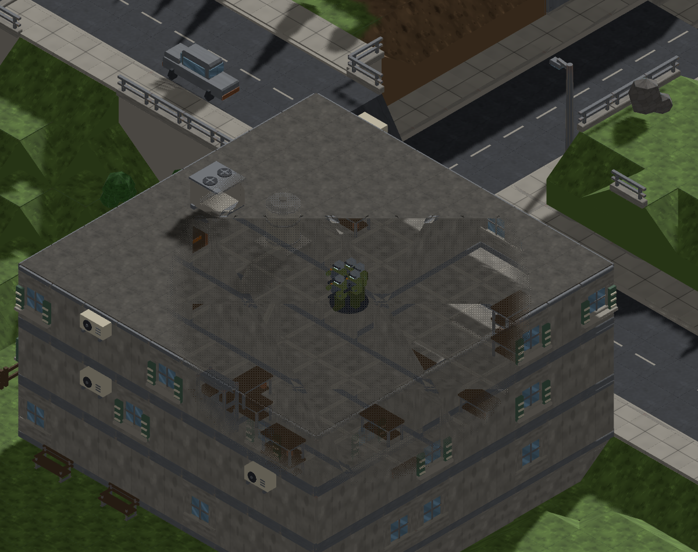
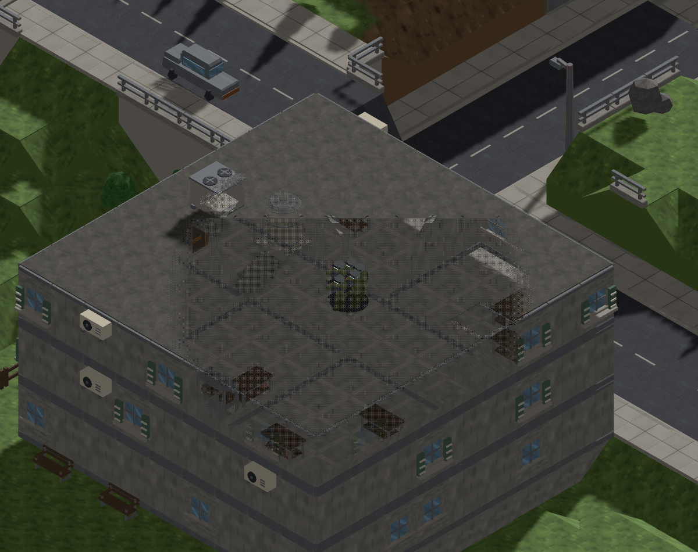

# #1118 — the cutaway keeps the floor a unit stands on

Executive Director, from play (2026-09-12): *"Ghosting should not ghost the floor under the current view level. If I'm viewing level 3 and a unit is on level 3 of a building the floor should be solid, I should not be able to see through to level 2."*

The cutaway faded any building fragment nearer the camera than the unit and inside the radius. A unit's centre sits on its floor plane, so the slab in front of it qualified and the storey below showed through. The shader now also requires a fragment to rise above the unit's feet (`GHOST_FOOT_MARGIN`, 0.3 u) before it fades: walls beside the unit and slabs over it still open, the slab under it never does.

Frames from `tools/art/preview/roof-cutaway.html` (`units=1`, `ghost=1`, radius 4, floor 0.175), one squad on the upper storey of the same generated house the #937 comparison used.

| | before | after |
|---|---|---|
| pitched roof, yaw 0 |  |  |
| pitched roof, yaw 2 |  |  |
| flat roof, yaw 0 |  |  |
| flat roof, yaw 2 |  |  |

What to look for: before, the lower storey's furniture shows through the floor around the squad and the front wall of the lower storey is dissolved with it. After, the floor is one solid slab, the lower storey's wall stands, and the roof and the upper wall still give way.

Pixel difference between before and after (12 % threshold): pitched yaw 0 2.8 %, flat yaw 0 3.4 %, pitched yaw 2 0.7 %, flat yaw 2 0.3 %. The `ghost=0` control frames are byte-identical before and after.
