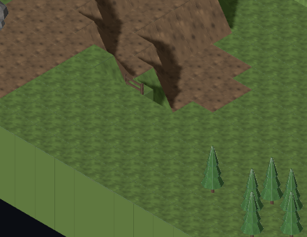
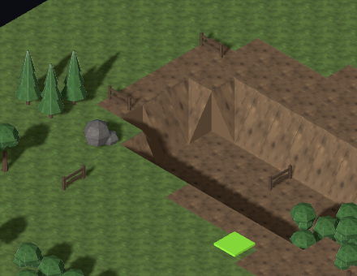

# #817: slope-gap diagnosis on v0.2.7

Confirmed classification-side reproduction in #801. The scene mapping and
quarter-turn reconciliation pass all four turns of both corner kinds in
hand-built 3 × 3 neighbourhoods, using the shipped GLBs through
`TacticalMapView.loadModels` and raycasts on its final instances. Each test
compares both sides of every shared edge with both adjoining straight
wedges and both flat neighbours: eight cases, 160 edge comparisons.

The failure is upstream: `SlopePass` chooses visual geometry from
`buildGroundComponents(draft).nodes`. `isPassableGround` excludes a column
with any ground prop. `isNaturalStepUp` therefore fails to count a high
neighbour with a prop. A concave corner becomes a straight when one high
neighbour disappears from that graph, or remains unmarked when both do.
A prop on the candidate tile excludes it entirely. The outer-corner path
also requires the diagonal to be in the same walkable-node set.

## Exact grass reproduction

Tag `v0.2.7`, commit `306a562`. Map Lab:
`?seed=817-0&biome=temperate&settlement=rural&size=medium&models=1`.
Slopes at 100%, camera at its initial orientation.



Centre **(x=23,y=0,z=41)** has `slope={kind:"straight",turns:0}`.
Both west and south are one level higher, so its geometry needs `inner/0`.
The west neighbour **(22,1,41)** has `prop-130`, a fence; the classifier
counts only south. The renderer correctly loads `tile.slope.straight`
from that supplied metadata.

North is up; each cell below is `(x,y,z): slope`, with `—` meaning absent.

| | West | Centre column | East |
| --- | --- | --- | --- |
| North | (22,0,40): straight/1 | (23,0,40): — | (24,0,40): — |
| Centre | (22,1,41): —, fence prop-130 | **(23,0,41): straight/0** | (24,0,41): straight/0 |
| South | (22,1,42): inner/0 | (23,1,42): straight/0 | (24,1,42): straight/0 |

Every listed column's ground level equals its recorded natural level;
none has a wall or touches the one-column lot exclusion. Only the fence
column is absent from the walkable-node set. [Full machine-readable dump](817/neighbourhoods.json)
also includes two independent `hills-1` reproductions: grass (36,0,22),
where a pine on the north neighbour changes inner/2 to straight/3, and dirt
(6,1,27), where a fence on the west neighbour changes inner/0 to straight/0.



## Sweep and controlled checks

Rendered and inspected Map Lab for all 12 combinations of seeds `hills-1`,
`817-0`, `817-1` with temperate, snowy, desert and coastal biomes; rural,
medium, 100% slopes. This is a diagnosis, **not a clean-corner acceptance**:
the shipped maps still contain gaps, and classification must be corrected
and swept again by MapGen in #808.

A controlled classifier check uses the same eight corner neighbourhoods.
With identical terrain heights and natural levels, adding only one pine
on a high neighbour changes all four inner turns to straight; adding it
on the high diagonal removes all four outer turns. All 16 diagnostic tests
pass on v0.2.7: eight rendered-geometry checks plus eight assertions of the
shipped classification defect. No mapping, model or generation code changed.
These diagnostic assertions describe the defect and must become assertions
of the intended classification in MapGen's fix; they are not a new rule.

To reproduce the diagnostic tests on v0.2.7, save the following as
`src/graphics/service/slope-817-diagnostic.test.ts` and run
`pnpm exec vitest run src/graphics/service/slope-817-diagnostic.test.ts`.

```ts
/// <reference types="node" />
import { readFileSync } from 'node:fs';
import { BoxGeometry, InstancedMesh, Mesh, MeshStandardMaterial, Raycaster, Vector3 } from 'three';
import type { Object3D } from 'three';
import { GLTFLoader } from 'three/addons/loaders/GLTFLoader.js';
import { describe, expect, it } from 'vitest';
import { FixtureMapBuilder } from '../../mapgen/service/fixture-map-builder';
import type { Rotation } from '../../mapgen/model/prop';
import type { Tile } from '../../mapgen/model/tile';
import type { ModelAssetId } from '../../content/data/model-ids';
import { MODEL_MANIFEST } from '../data/model-manifest';
import { TacticalMapView } from '../view/tactical-map-view';

/** West/south corner and its two flanking straights, rotated together. */
function neighbourhood(kind: 'inner'|'outer', turns: Rotation) {
  const base = new FixtureMapBuilder(3,3,2).fillGround().build();
  const tiles: Tile[] = base.tiles.map(tile=> {
    const dx=tile.x-1, dz=tile.z-1;
    const high=kind==='inner' ? dx<0 || dz>0 : dx<0 && dz>0;
    let slope: Tile['slope'];
    if(dx===0 && dz===0) slope={kind,turns:0};
    if(kind==='inner') {
      if(dx===0 && dz===-1) slope={kind:'straight',turns:1};
      if(dx===1 && dz===0) slope={kind:'straight',turns:0};
    } else {
      if(dx===-1 && dz===0) slope={kind:'straight',turns:0};
      if(dx===0 && dz===1) slope={kind:'straight',turns:1};
    }
    let x=dx,z=dz;
    for(let i=0;i<turns;i++) [x,z]=[-z,x];
    return {...tile,x:x+1,z:z+1,y:high?1:0,slope:slope?{...slope,turns:((slope.turns+turns)%4) as Rotation}:undefined};
  });
  return {...base,tiles};
}

/** Shipped slope GLBs; exact-size ground slab without a texture dependency. */
function loader() {
  const cache=new Map<ModelAssetId,Promise<Object3D>>();
  const load=async(id:ModelAssetId):Promise<Object3D> => {
    if(!cache.has(id)) cache.set(id,(async()=>{
      if(!id.startsWith('tile.slope.')) return new Mesh(new BoxGeometry(1,.05,1),new MeshStandardMaterial());
      const bytes=readFileSync(new URL(`../../../public/${MODEL_MANIFEST[id].path}`,import.meta.url));
      return (await new GLTFLoader().parseAsync(bytes.buffer.slice(bytes.byteOffset,bytes.byteOffset+bytes.byteLength),'')).scene;
    })());
    return (await cache.get(id)!).clone(true);
  };
  return {load,preload:async(ids:readonly ModelAssetId[])=>{await Promise.all(ids.map(load));}};
}

describe('#817 actual scene corner neighbourhoods',()=>{
  for(const kind of ['inner','outer'] as const) for(const turns of [0,1,2,3] as const) {
    it(`${kind} turn ${turns}: both flanking slopes and both flat neighbours meet every shared edge`,async()=>{
      const view=new TacticalMapView(neighbourhood(kind,turns));
      await view.loadModels(loader());
      view.root.updateMatrixWorld(true);
      const meshes: InstancedMesh[]=[];
      view.root.traverse(object=>{if(object instanceof InstancedMesh && object.name.startsWith('tiles-model:'))meshes.push(object);});
      const height=(x:number,z:number)=>{
        const hits=new Raycaster(new Vector3(x,5,z),new Vector3(0,-1,0)).intersectObjects(meshes);
        expect(hits.length,`missing top at ${x},${z}`).toBeGreaterThan(0);
        return hits[0]!.point.y;
      };
      const e=.00001;
      for(const t of [.01,.25,.5,.75,.99]) {
        expect(height(1-e,1+t)).toBeCloseTo(height(1+e,1+t),3);
        expect(height(2-e,1+t)).toBeCloseTo(height(2+e,1+t),3);
        expect(height(1+t,1-e)).toBeCloseTo(height(1+t,1+e),3);
        expect(height(1+t,2-e)).toBeCloseTo(height(1+t,2+e),3);
      }
      view.dispose();
    });
  }
});

import { MapDraft } from '../../mapgen/model/map-draft';
import { SequentialIdGenerator } from '../../core/service/sequential-id-generator';
import { Mulberry32Rng } from '../../core/service/mulberry32-rng';
import { SlopePass } from '../../mapgen/generator/slope-pass';
import { createDefaultRegistries } from '../../mapgen/service/default-registries';
import { resolveMapGenParams } from '../../mapgen/service/param-resolver';
import { DEFAULT_MISSION_HOOKS } from '../../mapgen/data/hook-requirements';
import { DiagnosticsCollector } from '../../mapgen/service/diagnostics-collector';

/** Same geometry and natural levels; only the high-neighbour prop varies. */
function classified(kind:'inner'|'outer',turns:Rotation,blocked:boolean) {
 const map=neighbourhood(kind,turns);
 const draft=new MapDraft(3,3,new SequentialIdGenerator(),'grass');
 for(const t of map.tiles) {
  draft.setGroundLevel(t.x,t.z,t.y);
  draft.setNaturalLevel(t.x,t.z,t.y);
 }
 let x=-1,z=kind==='inner'?0:1;
 for(let i=0;i<turns;i++) [x,z]=[-z,x];
 if(blocked) draft.addProp('tree-pine',{x:x+1,y:1,z:z+1});
 const registries=createDefaultRegistries();
 const params=resolveMapGenParams({archetype:'settlement',biome:'temperate',settlement:'rural',size:'small',hooks:DEFAULT_MISSION_HOOKS,slopeShare:1},registries);
 new SlopePass().run({draft,params,registries,rng:new Mulberry32Rng(817),diagnostics:new DiagnosticsCollector().forPass('slopes')});
 return draft.slopeAt(1,1);
}

describe('#817 shipped classification diagnosis (observed bug, not a proposed rule fix)',()=>{
 for(const kind of ['inner','outer'] as const)for(const turns of [0,1,2,3] as const) {
  it(`${kind} turn ${turns}: a high-neighbour prop changes shape without changing the terrain`,()=>{
   expect(classified(kind,turns,false)).toEqual({kind,turns});
   expect(classified(kind,turns,true)).toEqual(kind==='inner'?{kind:'straight',turns}:undefined);
  });
 }
});
```
