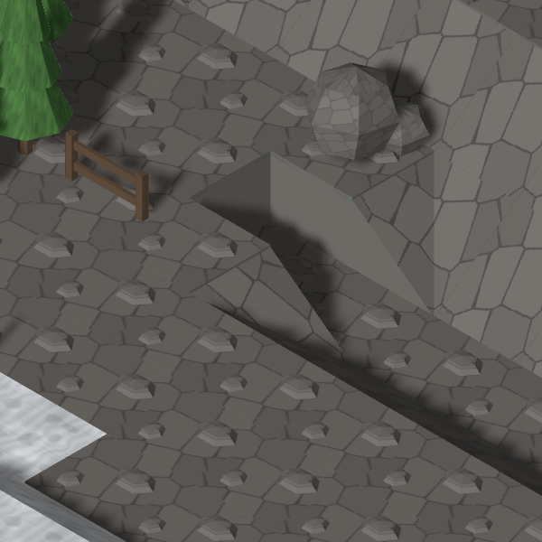
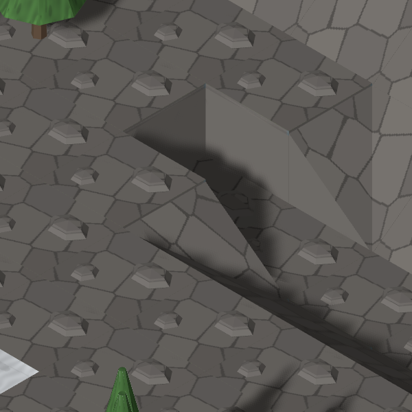
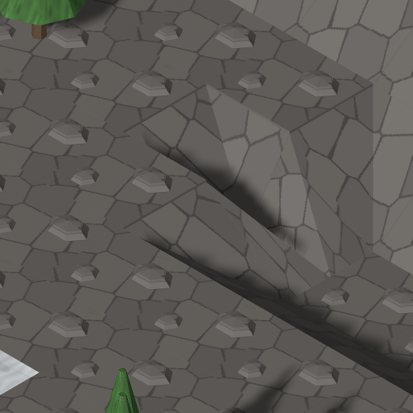

# #849: J3 three-sided concavity

## First decision: the diagonal does not cover it

Re-rendered from current main `4244675` (after #862 and #866), before changing
any model or scene mapping. Seed `hills-1`, snowy/rural/medium, `slope=100`,
models and units enabled; target `(10,3,29)`. The current crop is 600 × 600 at
140 screen pixels per tile, matching the catalogue's capture scale.

| Original catalogue (`f4557b4`) | Current main (`4244675`) |
| --- | --- |
|  |  |

The narrow dark slot remains. The diagonal piece covers **none** of this
configuration: the target has no `Tile.slope`, resolves to `tile.ground.rock`,
and receives no diagonal or transition appearance. Its opening tile also
receives none; there are zero diagonal appearances on this whole map.
[Current target, opening and eight neighbours](before/neighbourhood.json).

The three high orthogonal neighbours are north, west and south; the opening
is east. A monotone diagonal plane cannot meet three high sides while keeping
a low opening. This needs a concave surface. The Director's latest instruction
authorises cutting it after this comparison is posted; the earlier
accepted-for-now ruling is superseded for this task.

Map scale and prop placement have changed since the original catalogue; the
same terrain slot is still visible at the recorded coordinate. The new image
is a fresh Map Lab render, not the unchanged control from #848.

## Authorised repair

The comparison above was committed as `7af3a73` and
[posted on #849 before any model edit](https://github.com/BenjaminBenetti/tut/issues/849#issuecomment-5558888199).
QA's [final audit](https://github.com/BenjaminBenetti/tut/issues/813#issuecomment-5558930962)
subsequently confirmed J3 unchanged on the same main head.

| Current main | Three-sided kit |
| --- | --- |
|  |  |

Both fresh images use the same camera, target and 140 px/tile scale. The new
concave end covers the three terrace faces; two existing outer-corner halves
fit its opening to the low ground. The dark vertical slot becomes a textured
V-shaped gully. Both images were opened and inspected.
[After placement and unchanged neighbourhood](after/neighbourhood.json).
[Three angles, two-material composite and model contract](../../kits/terrain-slopes.md#three-sided-gully-849).

The [108-map sweep](sweep.json) uses QA's `qa813-{biome}-{settlement}-{size}-{0,1,2}`
matrix at slope share 1: 495 unmarked natural three-high tiles, 27 four-high,
173 fitted ends and 173 mouths ([all coordinates](fitted-ends.csv)). It preserves configurations whose exit or
existing perimeter cannot meet this two-tile surface, and never replaces
walls, connectors, a prop's support or the accepted diagonal/cap family.
This is a fitted three-sided end, not a blanket replacement of QA's broader
three-or-more-high category.

Reproduce with `tools/art/preview/capture-three-sided-controls.mjs before|after`
against each source tree, setting `CAPTURE_BASE_URL` to its Vite server.
The script resumes completed captures; use a fresh output directory when
intentionally regenerating an existing phase.

## Fog controls

Both seed-4242 frames (turns 1 and 7) were regenerated and opened. They are
**byte-identical to fresh captures of main `4244675`** in a detached checkout.
The PNGs previously committed on main predate its ramp-plank change and are
stale; this PR includes the refreshed frames. [Three-way SHA-256 comparison](fog-controls.json)
distinguishes the tracked old images, newly rendered main, and this branch.
The new three-sided kit changes neither fog frame relative to live main.

Validation: Blender/trimesh passes; typecheck, lint, build, 2,057 unit tests
(one skipped), seven simulation tests and 59 browser tests pass, with zero
flaky tests. The two opt-in composite/fog capture tests also pass. All three
neutral angles, the composite, both J3 crops and both fog frames were opened.
