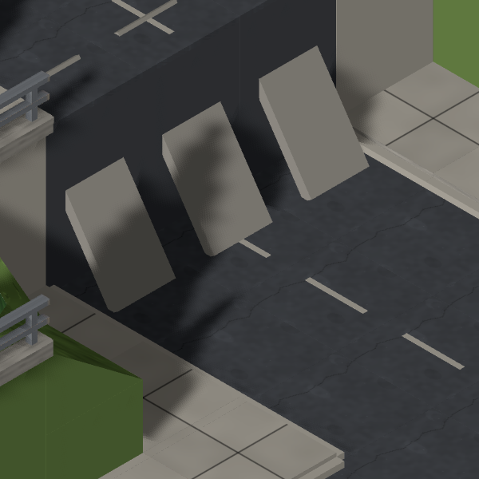
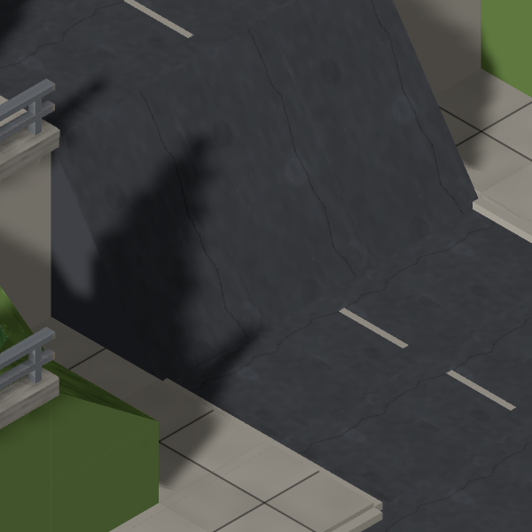
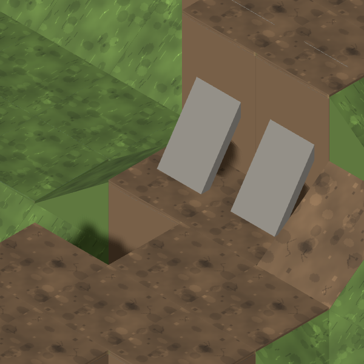
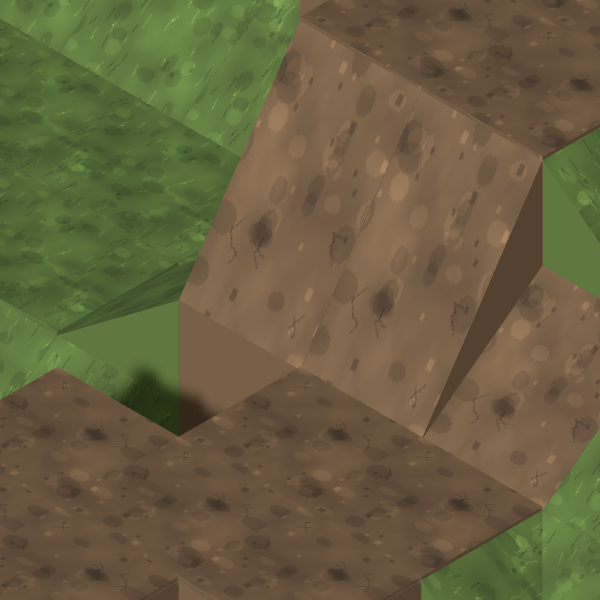

# #875: ramp connectors receive terrain-kit art

The bare grey planks now use a full-width, textured wedge that meets the
upper terrace at its edge. It uses the shared terrain rise parameter and
material selection. [Model, three angles and four-panel composite](../../kits/ramp-connectors.md).

## K2 carriageway

Seed `qa813-temperate-town-small-0`, temperate/town/small, slope 100, models
and units enabled. The three connectors are:

```
(32,2,11) → (31,4,11)
(32,2,12) → (31,4,12)
(32,2,13) → (31,4,13)
```

| Before | After |
| --- | --- |
|  |  |

The same tile target `(32,2,12)` and 140 px/tile camera are used on both sides.
QA's original exhibit is [V5-K2](../813/final/shots/V5-K2-after-labelled.png).
The three narrow planks become one asphalt surface across the carriageway.

## Ground control

Seed `qa813-temperate-rural-small-0`, temperate/rural/small. Dirt-to-dirt
connectors `(8,2,8) → (8,4,7)` and `(9,2,8) → (9,4,7)`, without retaining walls.
The crop targets `(8,2,8)` at the same 140 px/tile scale.

| Before | After |
| --- | --- |
|  |  |

Both controls were captured before changes on main `997945b`, then after the
ramp consumer was implemented with #874's `7b9e3c7` integrated. Map data is
unchanged. All four crops were opened and inspected. The separate composite
shows one- and two-layer rises in asphalt and grass through the same consumer.
[Exact connector endpoints and neighbourhoods](neighbourhoods.json).

## Sweep and checks

The [108-map QA matrix](sweep.json) contains **3,779 ramp connectors**, all
with a two-layer rise. **All 3,779 resolve to the registered ramp model; zero
remain unresolved and zero use a legacy slope shortcut.** Surface combinations
are recorded, including road, sidewalk, dirt, grass, rock, snow and sand.
Rural road ramps use the resolved trail material rather than asphalt.
Three lower tiles have two exits; those use half-length ramps with a low
centre. Actual-GLB regressions cover both adjacent and opposite exits.

The sweep measures resolver coverage. Rendered controls and real-GLB tests
verify material borrowing and placeholder retirement through the live scene;
it is not a claim to have visually reviewed 108 whole maps. Wall/parapet
placement remains the separate finding documented by QA on #869.

Both seed-4242 fog frames were regenerated and opened. They now show the
materialled connector at the city plat; they change with this art and are
committed with it. The accepted fog settings are unchanged.

Validation: Blender/trimesh, typecheck, lint, build, **2,078 unit tests**
(one skipped), **7 simulation tests** and **59 browser tests** pass, with
zero flaky tests. The two opt-in composite/fog capture specs pass separately.
All three neutral renders, four Map Lab crops, the final composite and both
fog frames were opened and inspected.
