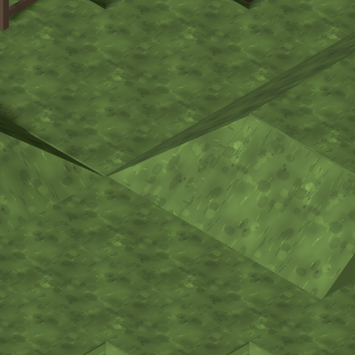
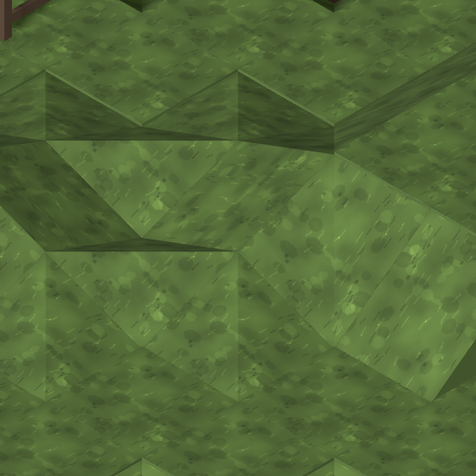

# #876 — why the diagonal skips V2

**Diagnosis, not a proposed terrain fix.** Current main is `f2dbae0`; its map
classification and diagonal resolver reproduce QA's final #813 counts exactly.
The [finding was posted before any trial](https://github.com/BenjaminBenetti/tut/issues/876#issuecomment-5559358784).
No runtime code, model, material or map data changes in this evidence PR.

## V2 is two opposite banks at one level

Seed `qa813-temperate-rural-medium-1`, temperate/rural/medium, slope 100%:

| Tile | Classification | High diagonal |
| --- | --- | --- |
| `(7,2,31)` | outer, turns 2 | NE `(8,3,30)` |
| `(6,2,32)` | outer, turns 0 | SW `(5,3,33)` |

Both bases are level **2**, and both corners descend to their shared low vertex.
Their high corners face away from each other. The two straight flanks around each
high diagonal justify the existing classification. These are two banks meeting at
a low point; they are not a sequence climbing from one bank to the other.

In `N NE E SE S SW W NW` order, neighbouring ground levels are respectively
`2 3 2 2 2 2 2 2` and `2 2 2 2 2 3 2 2`. The full 6×6 patch, slopes and rendered corner
heights are in [neighbourhoods.json](neighbourhoods.json). No wall or connector
is present in this patch.

The graphics resolver requires matching turns and `next.y = current.y + 1`
along the high diagonal. Its minimum length is already two. V2 therefore fails
the orientation/elevation qualification before the perimeter fit is considered.
This is a difference between the graphics coverage rule and QA's broader grouping;
the classifications agree with the neighbourhoods. No MapGen rule correction is
indicated.

## Same definition, same counts

Top ground tiles, excluding building floors; group `outer` tiles connected through
any of the four diagonal neighbours, regardless of their levels or turns. Resolve
each map's graphics and count the tiles taking `diagonal`. Use the same 108 maps:
`qa813-<temperate|snowy|desert|coastal>-<rural|town|city>-<small|medium|large>-{0,1,2}`,
settlement archetype, default mission hooks, `slopeShare: 1`.

| Group size | Tiles | Current diagonal | Rejected trial diagonal |
| --- | ---: | ---: | ---: |
| 1 | 1,694 | 0 | 0 |
| 2 | 76 | 28 | 46 |
| 3 | 12 | 9 | 9 |
| 4 | 4 | 4 | 4 |
| **Connected total** | **92** | **41** | **59** |

The **48 skipped two-chain tiles** consist of:

- 24 tiles in 12 same-level opposite-facing pairs, including V2;
- 18 tiles in nine same-level quarter-turned pairs;
- six tiles in the three climbing pairs refused at existing cliff boundaries
  and already accepted as refusals with #862.

The skipped three-chain is also at one level with mixed turns.
[coverage.json](coverage.json) includes every connected group and both tallies.
Current coverage remains **41 of 92**: the trial was discarded.

## Visual check of the existing mesh

| Current main: V2 | Rejected trial: V2 |
| --- | --- |
|  |  |

The trial admitted opposite-facing pairs that do not belong to climbing chains,
using each corner's own turn. It reused the diagonal GLB and fitted the surrounding
ground vertices with the existing caps. It fitted nine of the 12 pairs; the other
three retained their existing boundaries. V1 stayed byte-identical.

The joins pass the geometry tests, but **the trial looks worse**. Replacing an
outer corner's folded top with one plane raises its side vertices by half a
layer. Here that raises isolated points in the surrounding ground, producing
triangular ridges. Both cap diagonals were tried; neither gives a clean read.
The pictured trial uses the alternative cap split. I rejected it after opening
the frames and restored the runtime files.

[rejected-fit.patch](rejected-fit.patch) records that experiment for reproduction;
it is deliberately **not applied**. The 29 existing diagonal tests passed, as did
eight scratch actual-GLB tests over both materials and four turns checking the
planes, shared low point, surrounding edge joins and immutable data. Those checks
did not make the picture acceptable.

**Art recommendation:** keep the current V2 shape unless the Director wants these
two banks regraded over a larger area. One plane cannot preserve two opposite high
corners and their common low point. Treat this separately from a missing piece in
an aligned climbing chain. No new mesh is proposed, and #876 remains open for the
Director's judgement of the diagnosis and comparison.

## Reproduce the crops

Run the dev server, then from the repository root:

```sh
CAPTURE_BASE_URL=http://127.0.0.1:5173 node tools/art/preview/capture-diagonal-pair-controls.mjs current
```

The helper uses QA's Map Lab inputs, real tile projection, 140 px/tile and a
600×600 crop. It skips existing output; remove the target PNG and its entry in
`captures.json` to recapture. `CAPTURE_ONLY=v2-opposite-pair` selects only V2.
For the discarded experiment, apply the archived patch in an isolated checkout,
restart Vite, and pass `rejected-fit` as the output argument. A server in a `.git`
worktree needs a local Vite configuration allowing that path and must restart
after source edits, since its file watcher ignores `.git`.

[V1 climbing-pair control](current/v1-climbing-pair.png): same seed,
`(60,1,28)` and `(59,2,29)`. Its image did not change in either trial. Every
committed image was opened and inspected.
