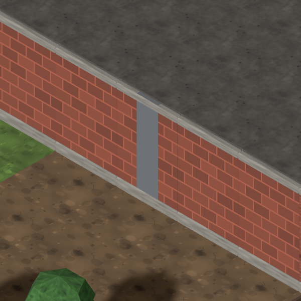
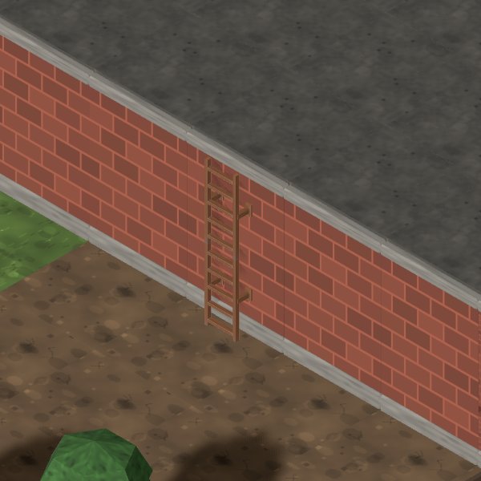
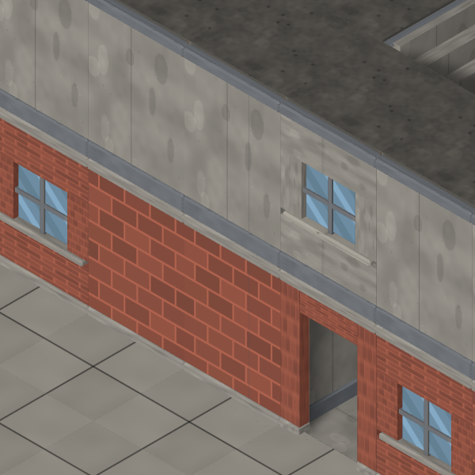
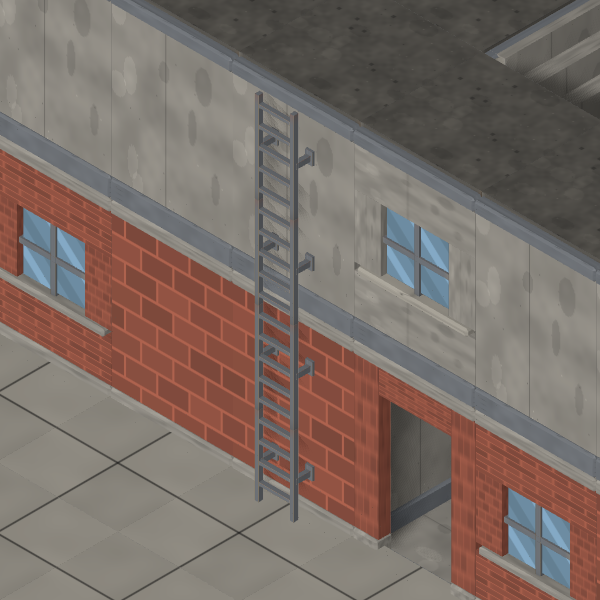

# #891 — the final connector placeholder class

Before is current main **`fe7872c`**, after is the ladder-kit branch. Both use the
same map inputs, the same 140 px/tile camera, and a 600×600 crop centred between
the projected connector endpoints so the entire height can be judged.

## Seeded comparisons

| Brick, two layers — before | After: weathered steel |
| --- | --- |
|  |  |

`qa813-temperate-town-small-0`, temperate/town/small:
**`(30,4,36) → (30,6,35)`**, ladder-1. The owning building's family is concrete,
but the actual ground-floor wall is brick; the ladder follows the rendered wall.

| Concrete facade, four layers — before | After: brushed steel |
| --- | --- |
|  |  |

`qa813-temperate-city-small-0`, temperate/city/small:
**`(5,2,34) → (5,6,33)`**. At its midpoint the ladder is mounted to the concrete
upper facade, above the brick ground floor. Its finish stays consistent through
both storeys. The stand-offs put its rails in front of the facade; the old flat
placeholder was largely buried in it.

All four frames are opened and committed. The [kit contract, three fixed angles
and composite](../../kits/ladder-connectors.md) accompany them.

## Same QA matrix

108 maps: `qa813-<temperate|snowy|desert|coastal>-<rural|town|city>-<small|medium|large>-{0,1,2}`,
settlement archetype, default mission hooks, `slopeShare: 1`.

| Rise | Ladders | Repeated sections |
| --- | ---: | ---: |
| 2 layers | 64 | 128 |
| 3 layers | 12 | 36 |
| 4 layers | 90 | 360 |
| **Total** | **166** | **524** |

**All 166 resolve, zero unresolved**. There are 98 brushed-steel and 68 weathered-steel
ladders, selected from their actual supporting wall. [sweep.json](sweep.json) records
the aggregate and every connector. This is resolver coverage across 108 maps;
the visual claims are limited to the committed controls and composite.

## Verification

37 actual-GLB tests cover the base footprint and atlas, every direction in both
finishes at 2/3/4/8 layers, rung hits and open gaps at fixed spacing, exact total
height, back-plate contact plane, retained ground, permanent placeholder retirement,
arrival vision and level peeling. A generated regression checks the building-id vs
actual brick-wall distinction. Four scene batches at two elevations/two finishes
share one mist material and load one prototype per finish; atlas remapping leaves
the loader's UVs and material intact.

Both seed-4242 fog frames were regenerated and opened. They are **byte-identical
to main**; [hashes](fog-controls.json). The ladder/composite capture specs pass.
Full gate results are recorded in the PR and handoff.

## Reproduce

Run Vite, then:

```sh
CAPTURE_BASE_URL=http://127.0.0.1:5173 node tools/art/preview/capture-ladder-controls.mjs after
```

Map Lab inputs include `slope=100&models=1&units=1`. The helper uses the real tile
projection hook, keeps the midpoint of the two endpoints centred, measures tile
pitch at the lower level, and waits two animation frames after camera input.
It skips completed records; remove the PNG and corresponding `captures.json` entry
to recapture. For the before tree, run Vite on `fe7872c` and point the same helper at
that server with the `before` output argument. A `.git` worktree requires a local
Vite configuration allowing that path; restart it after source edits.
