# #906 — visible support below building ground floors

Before is current main **`3a9fc50`**; after is `fix/906-building-foundations`.
The recipes, camera pitch and crop match within each pair. All views use models
on, slopes 100%, levels all and preview units on, matching the Critic's primary
exhibits. No floor cut is applied.

## Reported buildings

| Snowy, D01 neighbourhood — before | After |
| --- | --- |
| 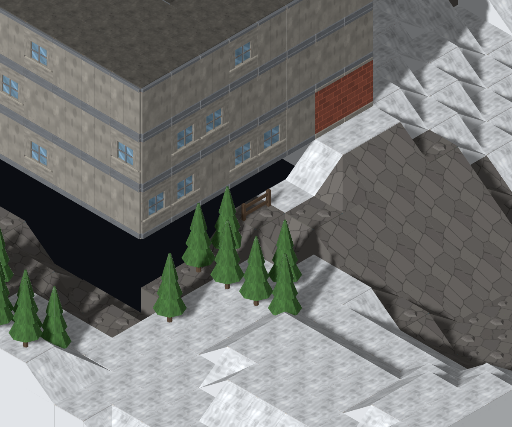 | 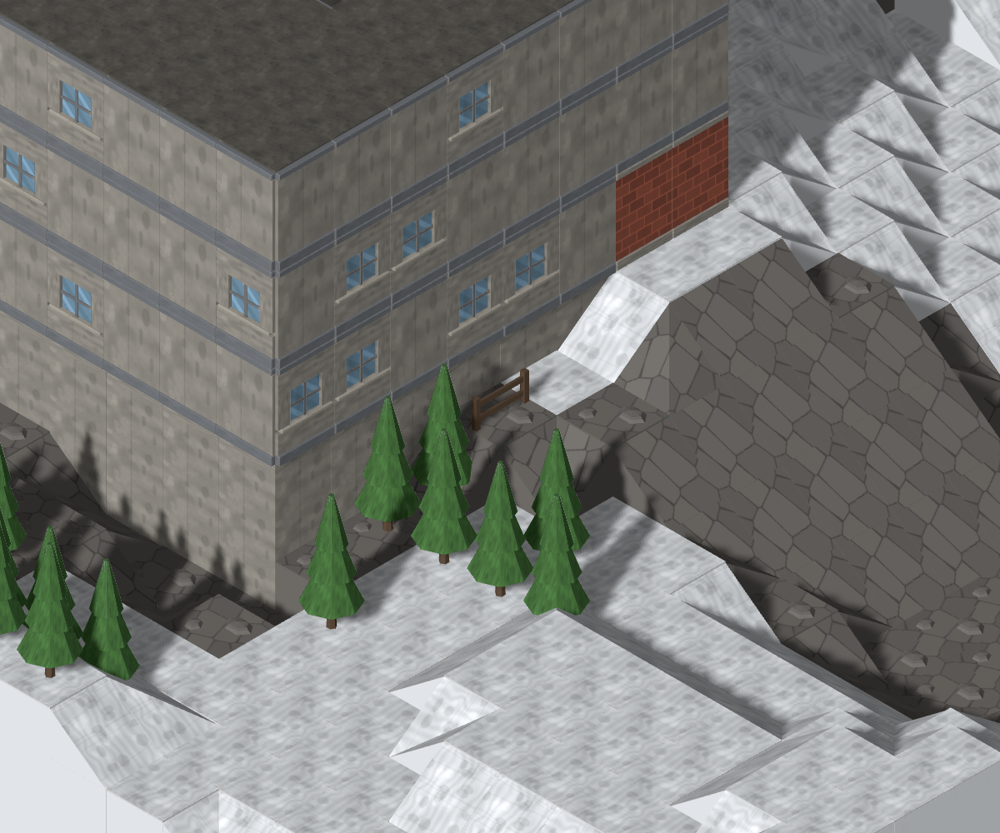 |

| Snowy, D02 second angle — before | After |
| --- | --- |
| 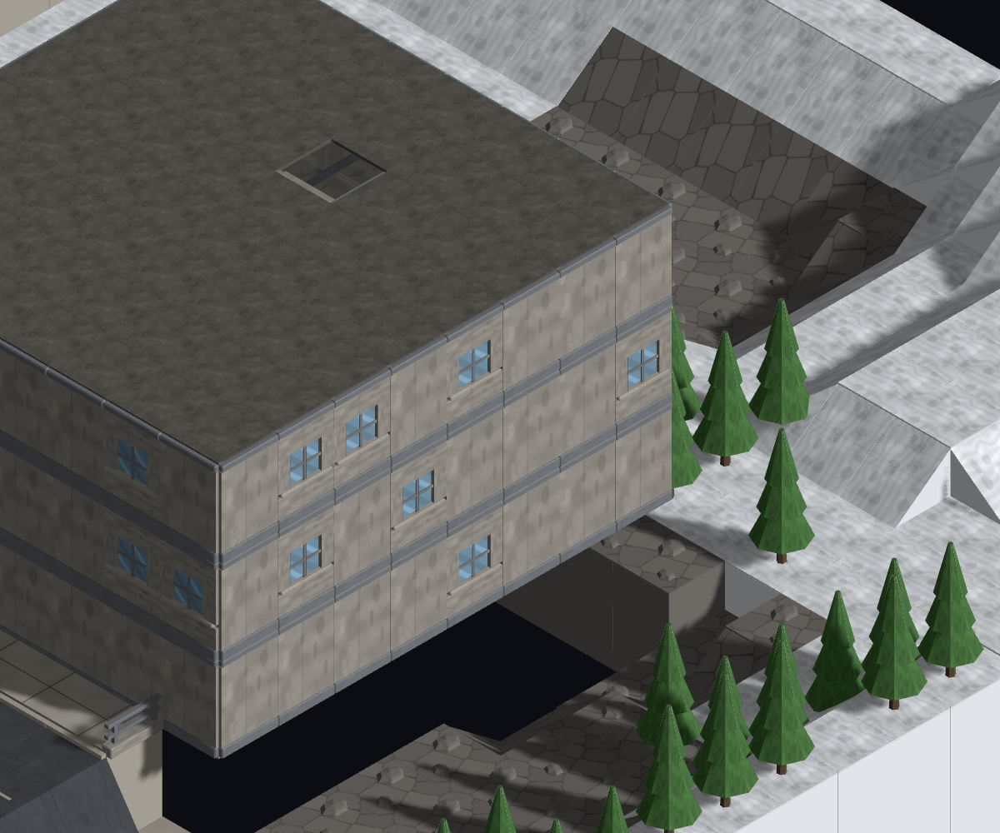 | 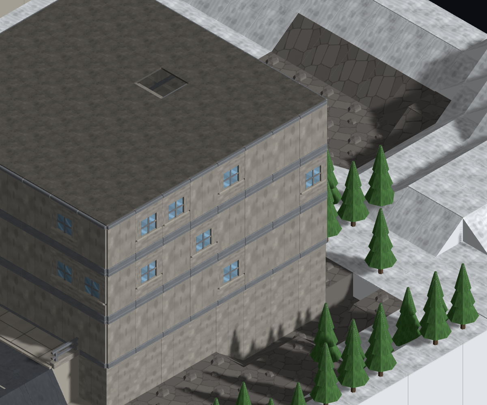 |

`mc-opening-01`, snowy/town/small, focus **`(37,3,39)`**. The apartment
`building-1` occupies `(29,35)`, 8×8, with its ground floor at layer 4.
Column `(36,39)` contains floors at 4/6/8 and a roof at 10. Its neighbour
`(37,3,39)` is lower rock. The concrete foundation now reaches the land beneath
the original walls; the nearby snow wedges, cliff, rocks and trees retain their
geometry.

| Desert, D05 neighbourhood — before | After |
| --- | --- |
| 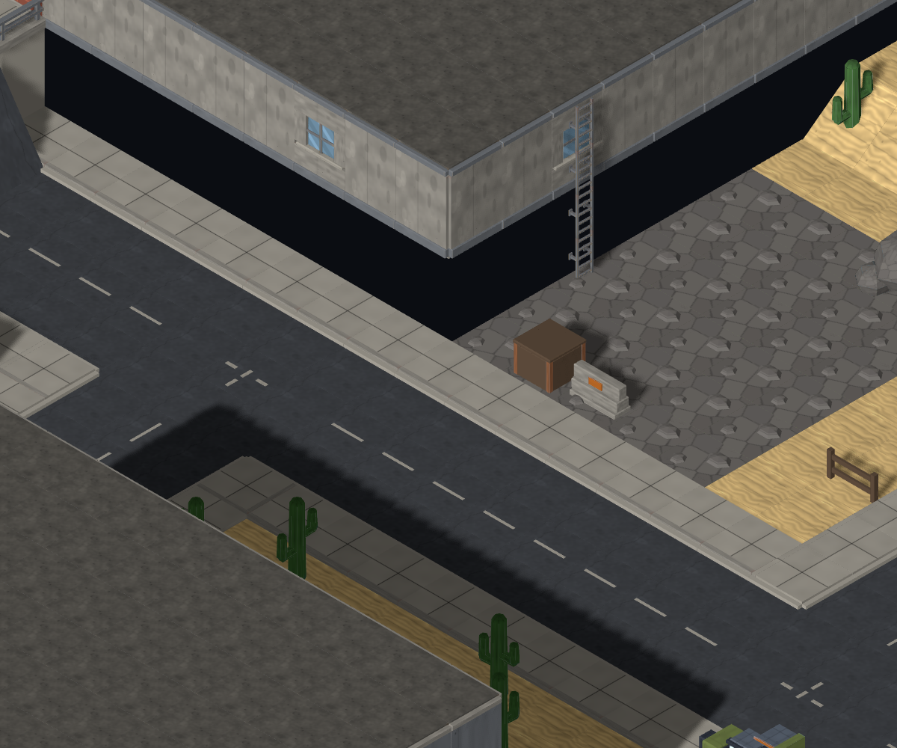 | 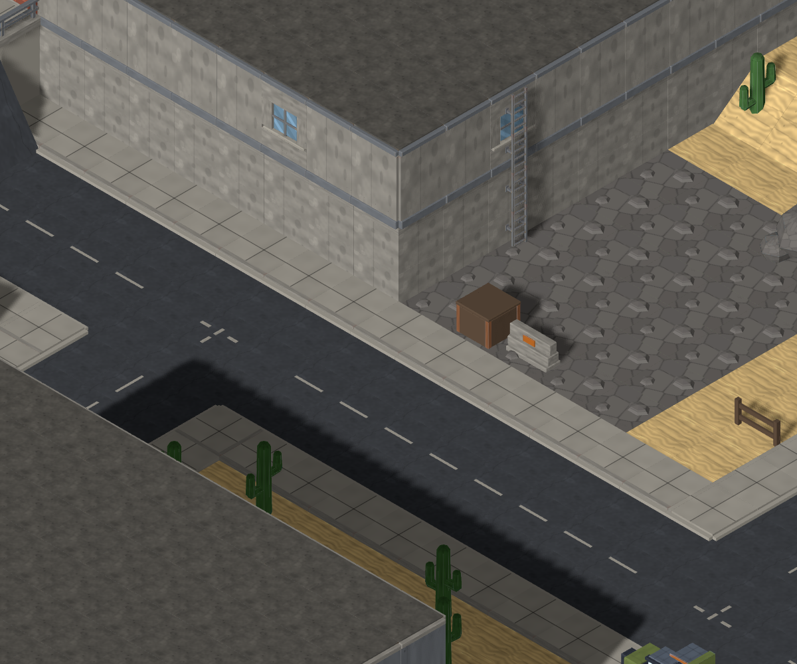 |

| Desert, second angle — before | After |
| --- | --- |
| 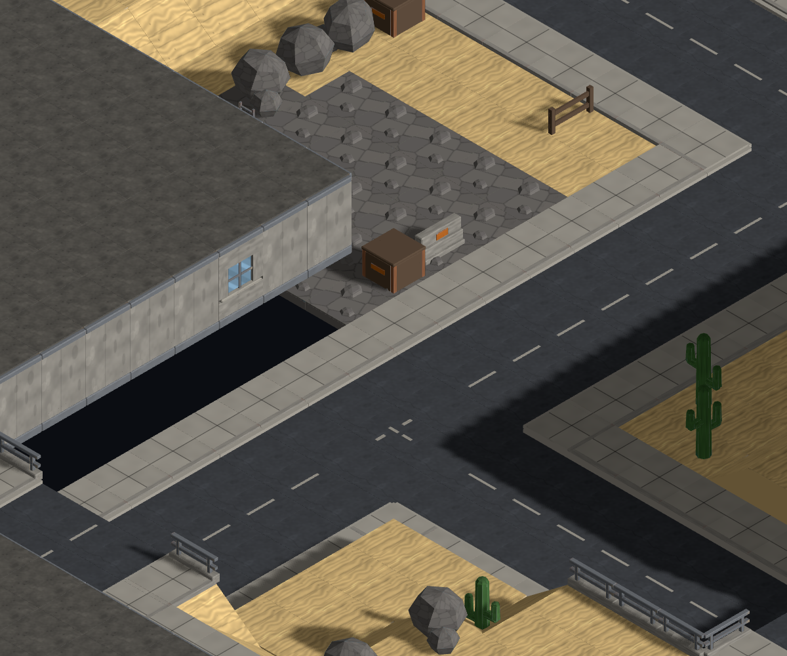 | 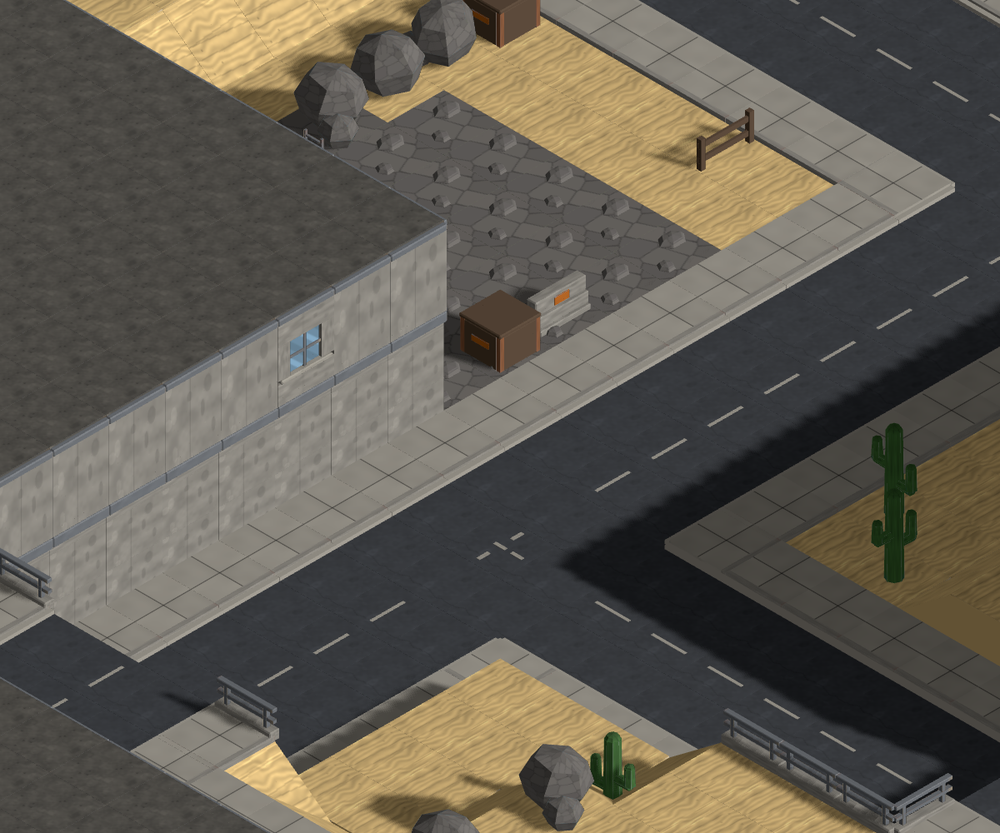 |

`mc-opening-02`, desert/town/small, focus **`(32,0,18)`**. Warehouse
`building-1` occupies `(21,6)`, 11×12, with floor 0 at layer 2. Column `(31,17)`
has floor y=2 and roof y=4, beside rock `(32,0,17)` and pavement `(32,0,18)`.
The existing ladder now has visible support behind its lower run. Its mesh,
position and rung spacing remain as accepted in #891.

## Already-grounded control

The same desert seed's `building-2`, footprint `(33,28)`, 10×8, is at ground
level **0**. One view shows it meeting higher surrounding terrain; the other
looks toward its west entrance. These are preservation controls for a building
that already has visible ground at its base.

| Grounded building — before | After |
| --- | --- |
| 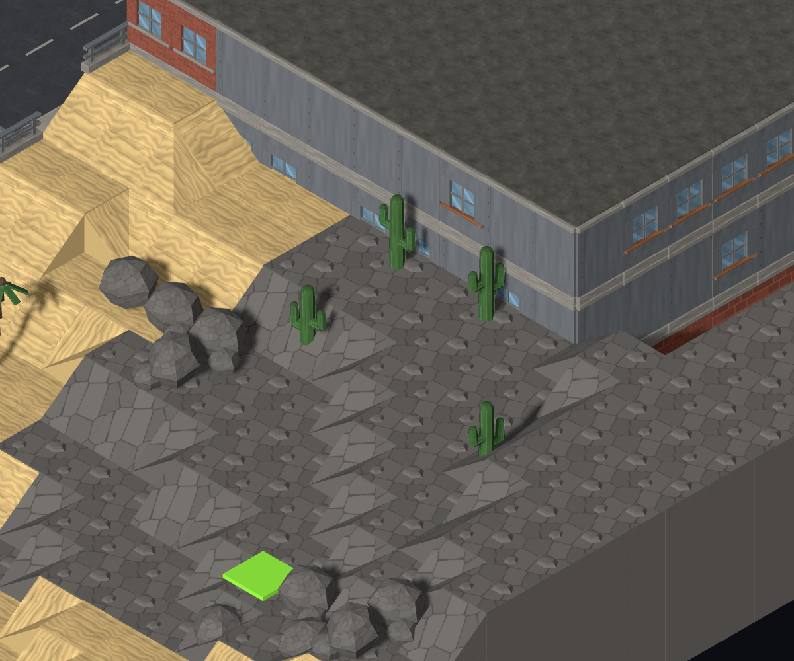 |  |

Focus **`(38,0,35)`**. The adjacent outside column `(38,36)` is at layer 3;
it is not a valid y=0 focus tile. This pair is byte-identical.

| Entrance-side control — before | After |
| --- | --- |
|  | 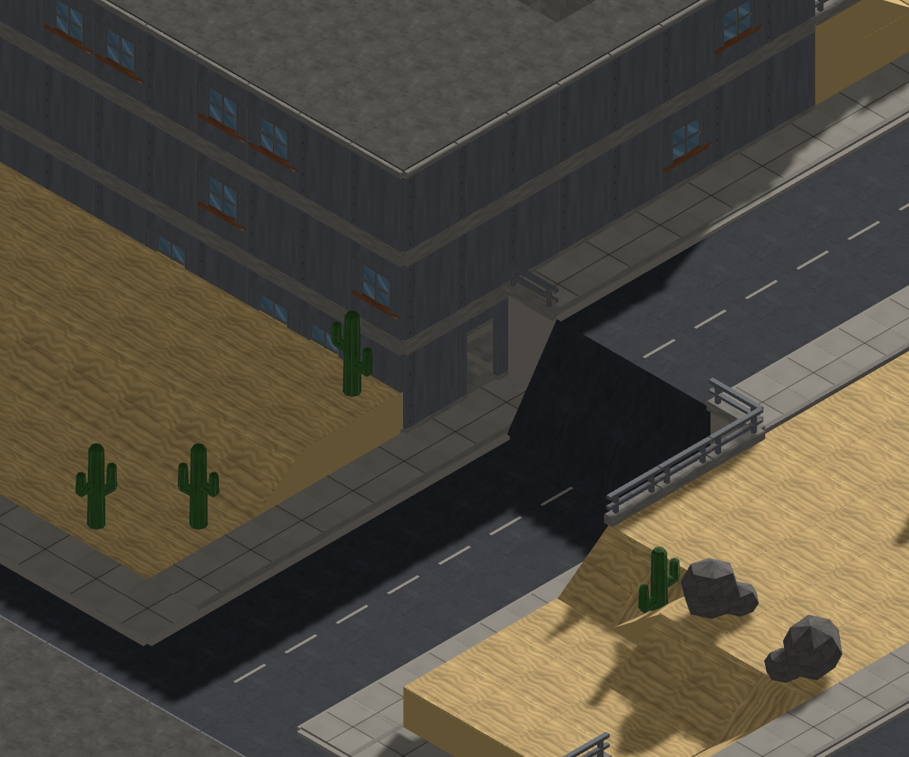 |

Focus **`(33,0,29)`**, two E turns. The [hash record](controls.json) reports the
exact comparison for each control and both fog frames. Both views of the
already-grounded building are byte-identical.

## Cause and boundary

`TacticalMapView.buildTiles` created a full ground pillar only for tiles without
`buildingId`. Every building tile, including floor zero, received a thin slab.
The missing volume below raised ground floors was therefore never drawn.
ADR 0004 deliberately represents only standable surfaces: solid rock below a
covered footprint is implicit. The repair draws that volume; it adds no map
tiles and changes no grading, traversal, footprints, interiors or connectors.

The diagnosis was posted before modelling in #906 comment 5561572589. MapGen
independently checked all 669 footprint columns across the nine buildings in
both recipes: zero height mismatches, uncovered columns or missing ground-floor
tiles (comment 5561657314). The Director confirmed Art ownership in 5561643308.
[Exact local neighbourhood records](neighborhoods.json).

## Foundation model and consumer

`tile.foundation.concrete`: **12 triangles, 2,212 bytes, watertight**.
Source `tools/art/models/tile-foundation-concrete.py`, through the Blender loop;
registered in both manifests and the live map model table. The base-centred
footprint is **1×1**, height the terrain kit's shared **`RISE = 0.75`**.
It samples the existing environment atlas's concrete cell.

The resolver repeats full courses from world y=0 and fits the final course to
the base of the actual ground-floor model. The shipped floor GLB is base-centred
and placed half a slab below `tileTop`; stairs start directly at `tileTop`.
Real-GLB tests caught an initial 0.025-u slit from assuming a centred floor asset;
the final support meets the shipped geometry exactly. The discarded trial
captures are scratch only.

Only tiles carrying `buildingId` and `floorIndex: 0` own support. Upper floors
remain hollow. Foundation instances share their loader material and mist
material across elevation batches. The terrain model id keeps foundations out
of wall cutaways, so revealing a unit cannot reopen the void. They retain
floor-zero vision and level peeling. A support box remains until the model
loads; it retires permanently afterward.

| 045 | 135 | 225 |
| --- | --- | --- |
| 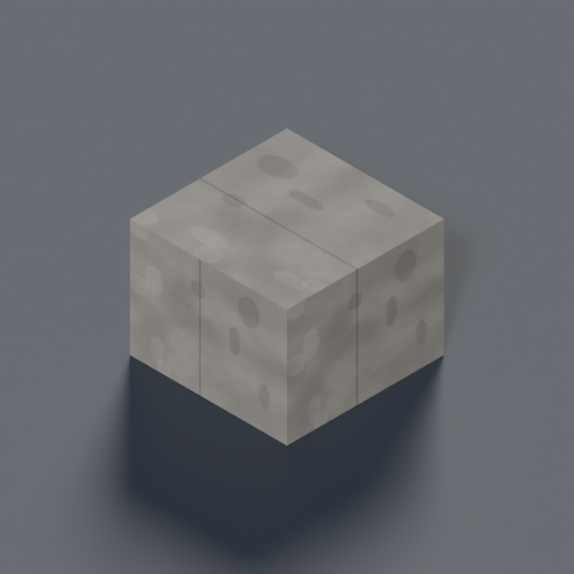 | 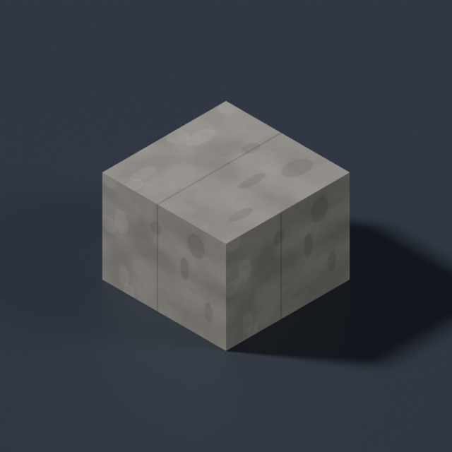 | 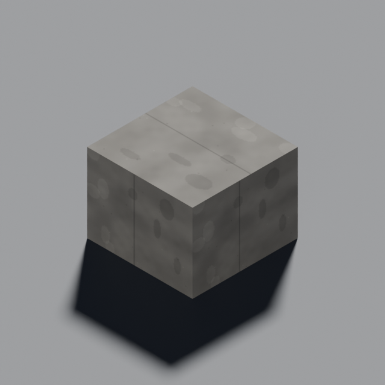 |

## Verification and reproduction

12 actual-GLB tests cover 0/1/2/4-layer floor and stair bases, ray hits through the
former void from all four sides, the exact upper contact, hollow upper storeys,
placeholder retirement, fog, cutaways, level peeling and material ownership.
The two exact reported map columns are regressions. Full gate: typecheck,
ESLint, 2,146 unit tests (one skipped), seven simulation tests, build and
59 browser tests (27 opt-in captures skipped, zero flaky) pass. The final
`pnpm lint` check passes with all capture metadata formatted.

Both seed-4242 fog frames were regenerated and opened; they are byte-identical
to main. The [standard seed-730982385 no-fog control](../../shots/782-preview-models-seed730982385-parapets.png)
is also regenerated and opened. The two capture specs pass.

```sh
blender -b --python-exit-code 1 --python tools/art/make_model.py -- \
  --script tools/art/models/tile-foundation-concrete.py --id tile.foundation.concrete \
  --category tiles --file tile-foundation-concrete.glb --quality final --max-triangles 60
CAPTURE_BASE_URL=http://127.0.0.1:5173 node tools/art/preview/capture-foundation-controls.mjs after
CAPTURE=1 pnpm exec playwright test e2e/fog-screenshot.spec.ts e2e/viaduct-parapet-screenshot.spec.ts --workers=1
```

For `before`, run Vite on `3a9fc50` and point the same helper at it with the
`before` argument. `CAPTURE_CONTROL=<id>` limits a run to one named control.
The helper records 78 px/tile crops at 1200×1000 from a 2400×1500 viewport,
waits for model and preview readiness, and waits two frames after input.
It skips completed PNG/metadata pairs. Use separate Vite cache directories
for baseline and current servers to avoid dependency-cache reloads during a shot.
