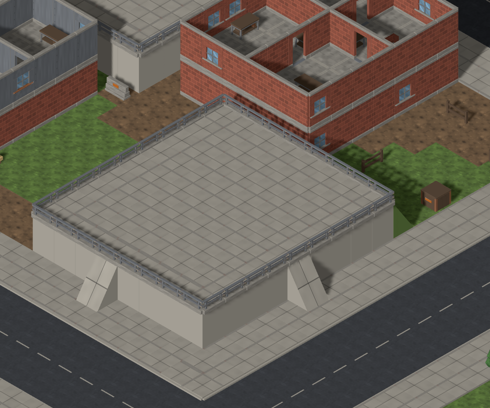
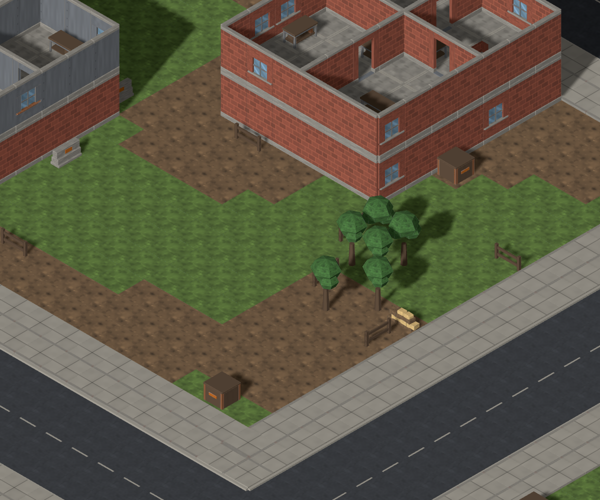
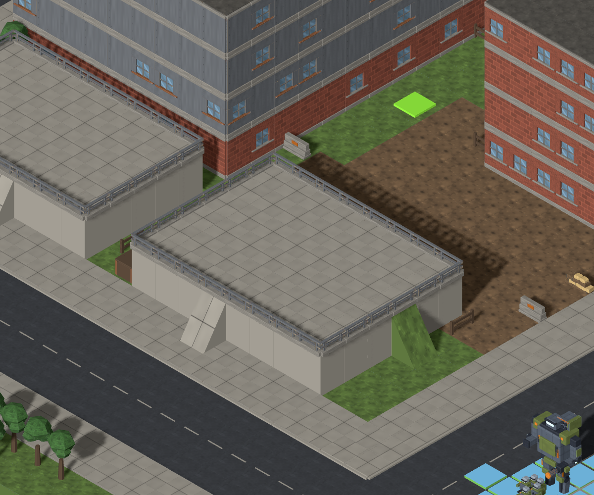
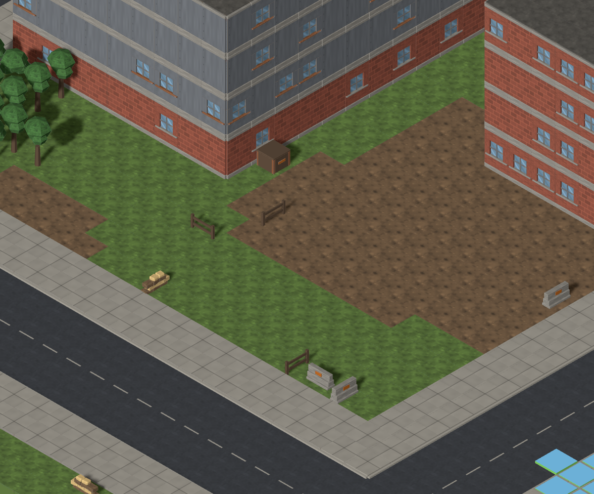
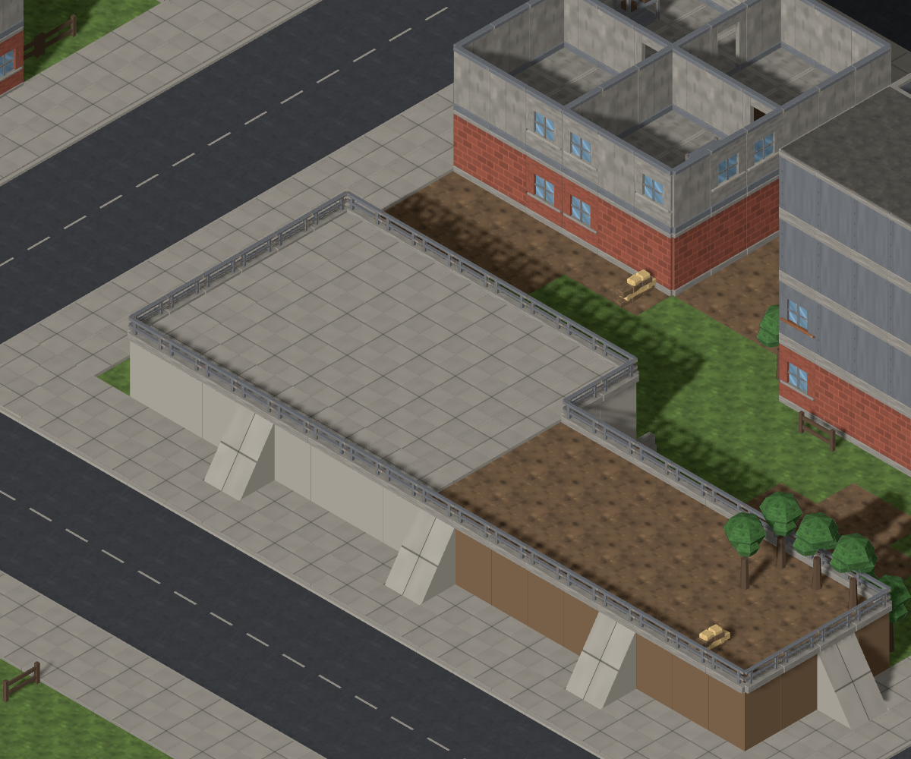
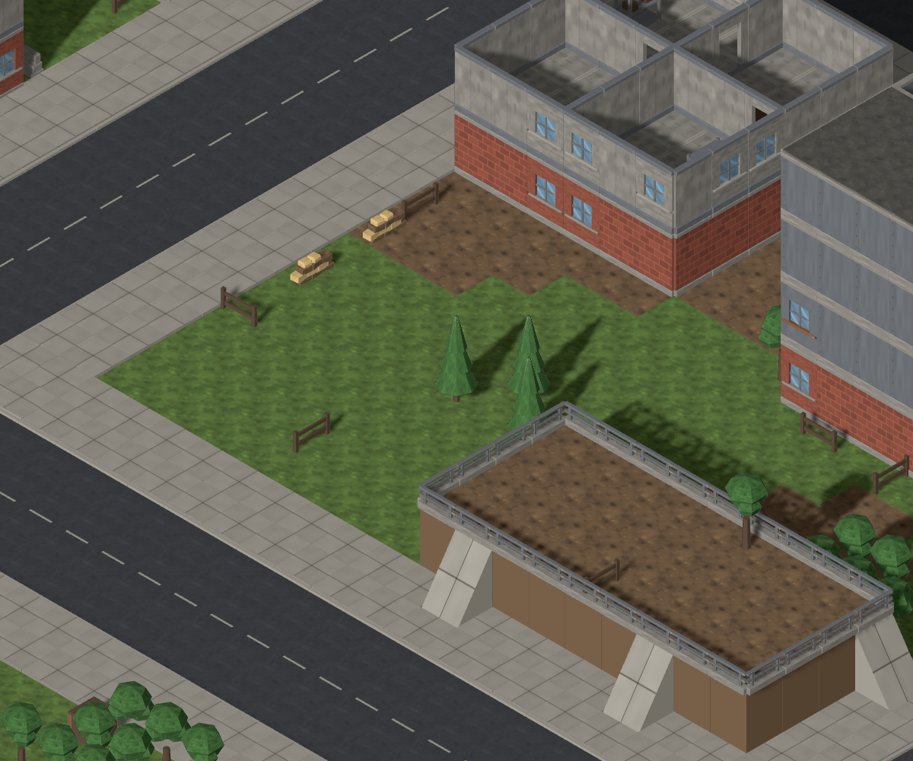
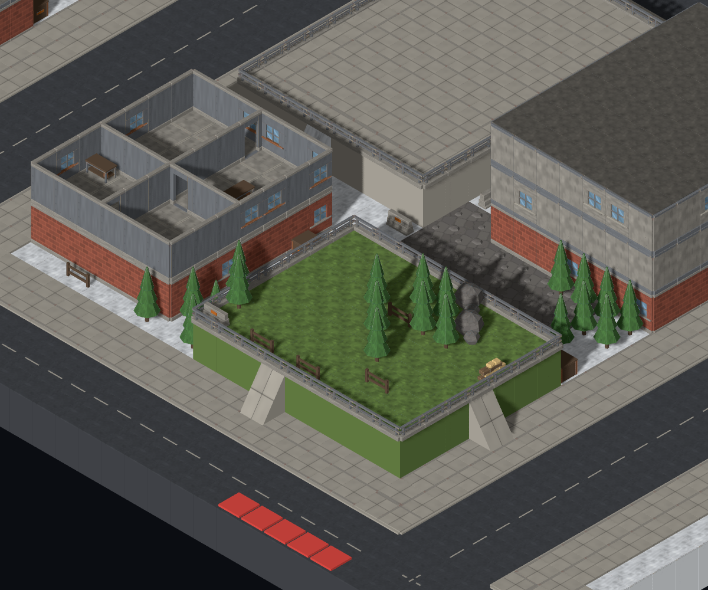
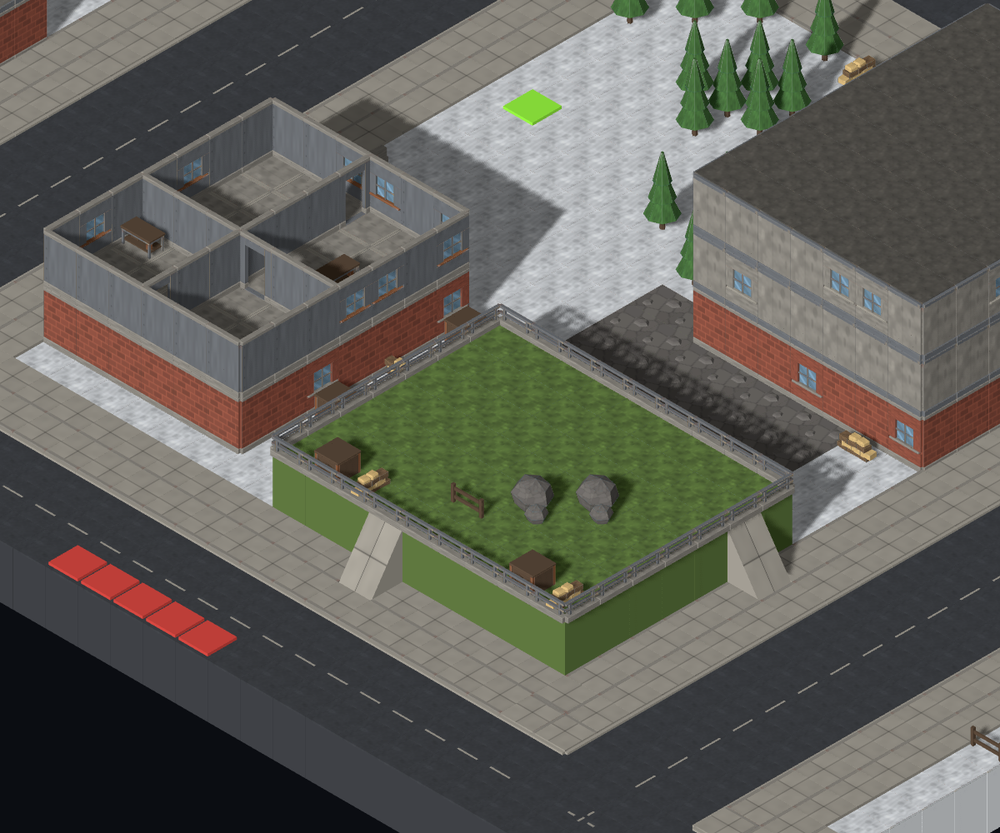
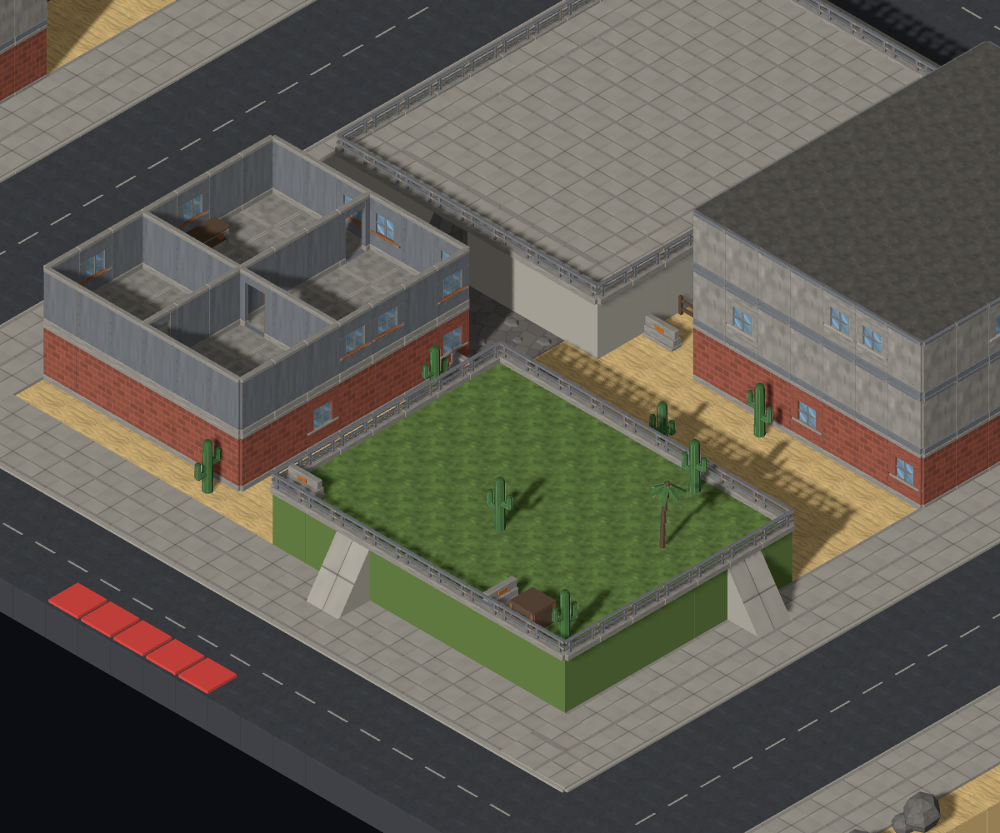
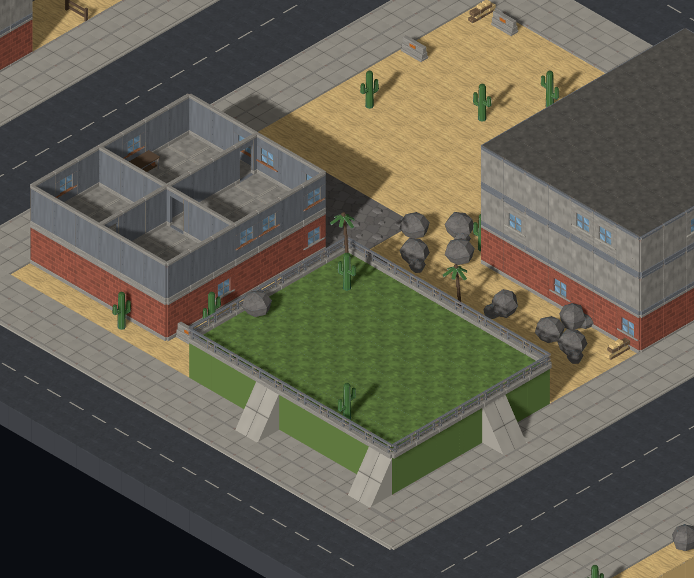

# #910 — withdraw routine paved platforms

Baseline: `e093702`. [Cause recorded before implementation](https://github.com/BenjaminBenetti/tut/issues/910#issuecomment-5562126199).

The criticised `(33,5,30)` platform is a **podium**. The `podium` and `plaza` families stamp raised sidewalk rectangles; the elevation pass then gives them retaining edges and ramps. The city preset proposes 22/50/89 features on small/medium/large maps, and these two families own 7 of the 16 eligible weight units. Exhaustive fitting and shrinking make them common. Rural and town presets never enable this pass.

## The change and its factors

`podium.maxPerMap` and `plaza.maxPerMap` are **0**. Their proposals become ordinary, unraised ground with its original biome surface. No models, decoration tables, roads, lots, buildings, wall rules or ramp rules change.

The pass first reserves its usual feature layout, then restores over-limit proposals to their original ground before railing or any later pass runs. This preserves the location, shape, height and surface of every retained feature. The family cap is data; the pass has no podium/plaza id special cases. A capped proposal consumes its normal planning draws and space, so its removal leaves open ground instead of moving or multiplying the other features.

I rejected removing the two entries and reducing the 50-attempt midpoint to 28 (50 × 9/16): that eliminated paving but grew the soil/grass-bed count from **213 to 377**, because more proposals now fitted the freed land. Even a midpoint of 14 produced 342 beds. The first rendered trial replaced the criticised podium with another large raised bed. The final implementation keeps the original planning budget and leaves the withdrawn plots open; it preserves the original **213** beds instead.

## Frequency sweep

108 recipes: four biomes × three settlement scales × three size presets × `mc-opening-01`, `mc-opening-02`, `mc-opening-03`; default Map Lab hooks and slope 100%. The probe records elevation-pass proposals, then counts only columns realised in the finished draft. It does **not** classify every parapet, terrain step, raised road, foundation or rock as a paved platform. Every finished map passes the map validator.

Raw per-recipe records: [before.jsonl](before.jsonl), [after.jsonl](after.jsonl). Each line includes feature ids, footprint bounds, surface, realised tile count, props and mech reachability.

| Settlement | Biome | Maps | Maps with paved platforms, before → after | Paved placements, before → after |
| --- | --- | ---: | ---: | ---: |
| rural | all four | 36 | 0 → 0 | 0 → 0 |
| town | all four | 36 | 0 → 0 | 0 → 0 |
| city | temperate | 9 | 9 → 0 | 48 → 0 |
| city | snowy | 9 | 9 → 0 | 48 → 0 |
| city | desert | 9 | 9 → 0 | 48 → 0 |
| city | coastal | 9 | 9 → 0 | 43 → 0 |

Across the twelve city maps of each size, paved placements change **22 → 0** (small), **54 → 0** (medium), **111 → 0** (large). All 187 unwanted paved platforms are removed.

## Useful high ground

All **213 soil/grass beds**, covering **7,873 tiles**, retain their exact footprint, height and surface. All 213 still have a mech route from deployment, using the shipped `ReachabilityService` and connectors. The number of city maps containing these beds remains **30/36**. The other six small cities previously had only paved platforms; their removal intentionally leaves those plots at grade.

| Biome | Beds, before → after | Mech-reachable bed tiles, before → after |
| --- | ---: | ---: |
| temperate | 55 → 55 | 1,857 → 1,830 |
| snowy | 55 → 55 | 1,837 → 1,861 |
| desert | 55 → 55 | 1,851 → 1,817 |
| coastal | 48 → 48 | 1,536 → 1,502 |
| **Total** | **213 → 213** | **7,081 → 7,010** |

The downstream prop pass sees more open land, so individual props and some routes move: bed props change 787 → 851, and unoccupied bed tiles outside mech reach change 5 → 12. No whole bed loses access. Beds containing a tree or boulder change 108 → 109. Keeping their geometry does not promise byte-identical vegetation or mission outcomes.

## Frames

Both columns use the real Map Lab scene, models and preview units on, slope 100%, all levels, no floor cut, viewport 2400×1500. Each JSON sidecar records the recipe, original layer-coordinate focus, exact camera state and crop. The capture script only exposes the existing camera rig to set its normal methods directly; it replaces no scene or generation module. This avoids timing-dependent keyboard panning.

| Control | Before | After |
| --- | --- | --- |
| Critic's example: temperate/city/small `mc-opening-01`, focus `(33,5,30)` |  |  |
| Second seed: temperate/city/small `mc-opening-02`, focus `(32,3,34)` |  |  |
| Third seed: temperate/city/small `mc-opening-03`, focus `(24,4,33)` |  |  |
| Critic's snowy bed: snowy/city/medium `mc-opening-02`, focus `(56,4,62)` |  |  |
| Critic's desert bed: desert/city/medium `mc-opening-02`, focus `(55,3,61)` |  |  |

MapGen inspected all five after frames: the paved pads are gone; the third seed retains its soil terrace, and both planted-bed controls retain their raised form. Director frame judgment and the Map Critic's re-check remain the acceptance gates.

## Reproduce

From the repository root:

```sh
node tools/mapgen/survey-elevated-features.mjs .git/mapgen-910/before-reproduced.jsonl --uncapped
node tools/mapgen/survey-elevated-features.mjs .git/mapgen-910/after-reproduced.jsonl
pnpm dev --host 127.0.0.1 --port 5173
node tools/mapgen/capture-platform-controls.mjs after
```

`--uncapped` restores the pre-change family limits without changing the seed or any other registry. The committed before frames were captured on the actual baseline before any generator edit, with the same capture script. To recapture them, run that script against `e093702` with argument `before`.

The regression test uses the critic's three seeds across all four biomes. It compares the capped generator to the uncapped layout, requires non-paved ground to retain its exact height and surface, and rejects any newly raised sidewalk platform. The test failed on the original podium at `(18,19)` before the fix. Existing elevation/reachability tests remain in place; only the intentional city golden changes.

## Validation

- `pnpm typecheck`, `pnpm lint`, and `pnpm build`: passed.
- `pnpm test`: 2,147 passed, one intentionally skipped.
- `pnpm test:sim`: all seven checks passed both before and after. The final 60-map mission report has no invariant violations.
- `pnpm test:e2e`: 59 passed, 27 opt-in screenshot/benchmark cases skipped; no retries. The five control pairs above were captured separately.
- `MAPGEN_WIDE=1 pnpm exec vitest run generation-wide-sweep`: all 1,200 maps passed, with no hook relocations.
- The committed survey tool with `--uncapped` reproduces all 108 baseline records exactly.
