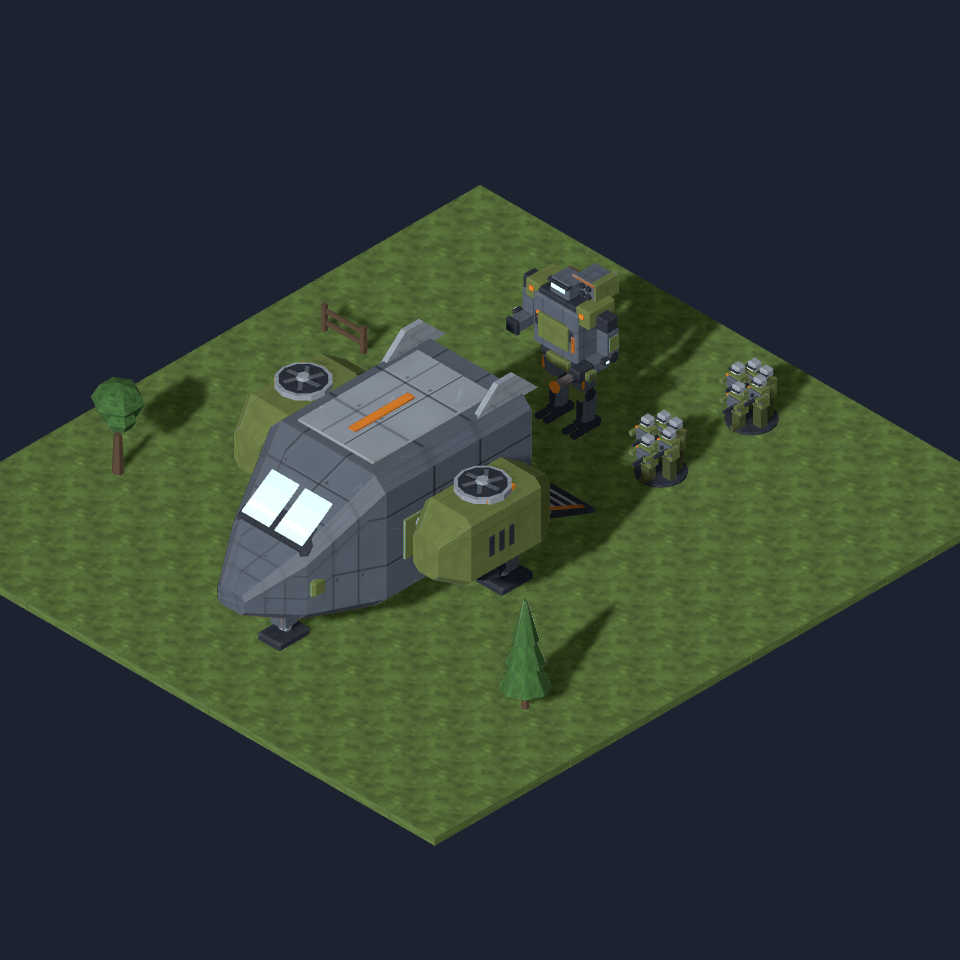
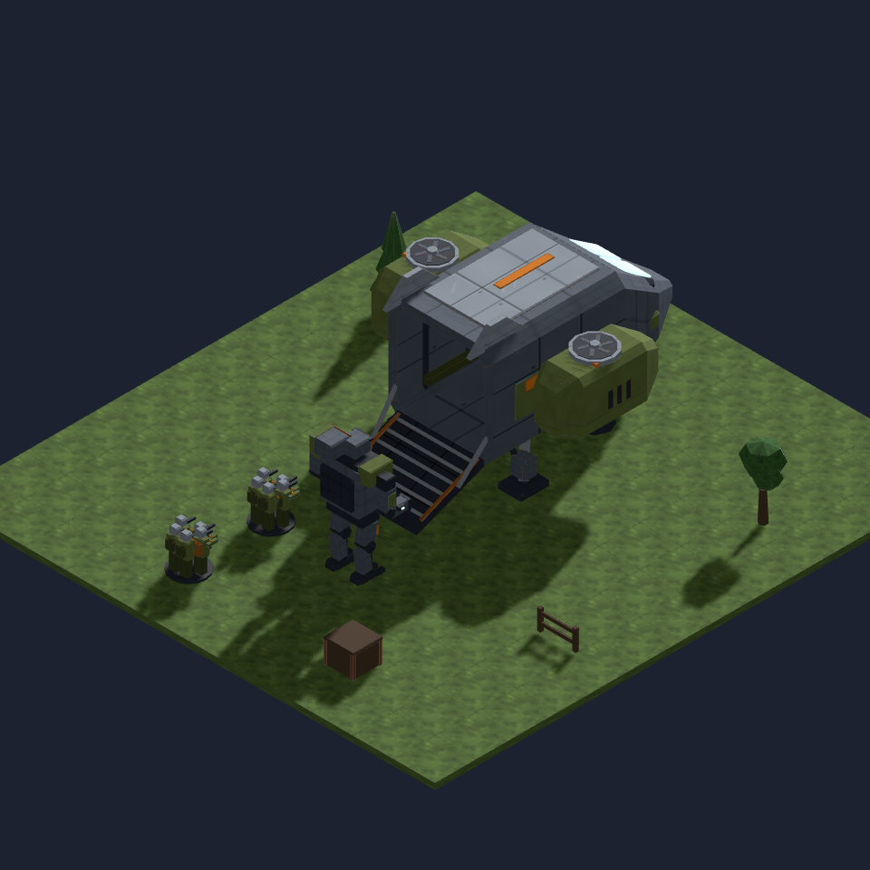
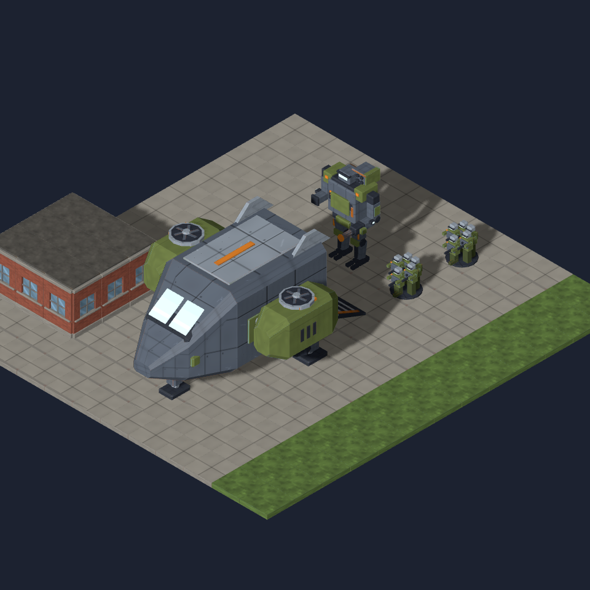
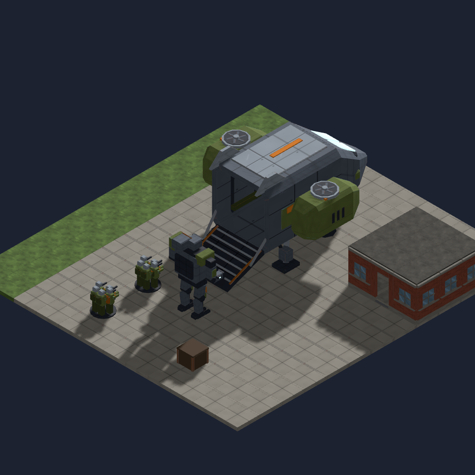

# Dropship scale and ground contact (#911)

These are **constructed art fixtures**, pending MapGen's reserved-site placer.
They use the exported `tdf.dropship`, existing mech and squad models, existing
ground materials, and the shared art scene's game lighting. The model has no
landing platform. Both ground surfaces finish at y=0.15, with feet and the
ramp's rear contact on that surface.

| Surface | Front view | Rear / boarding view |
|---|---|---|
| Rural grass |  |  |
| Town paving |  |  |

The 5×7 hull occupies x=−2…3, z=−2…5. Its pivot is (0.5, 0.15, 1.5).
The separate 4×4 boarding patch occupies columns x=−1…2, z=−6…−3,
meeting the rear ramp without a unit-start column inside the aircraft.
The neighbouring building stops one column short of the hull reservation.
The mech and squads are unchanged scale references.

The broad enclosed body, two short lift nacelles and open rear bay carry the
transport silhouette. The dim rear view exposes the bay, ramp and planted aft
feet; the front view exposes the nose foot and cockpit. Grass and paving show
how its light roof, olive engine pods and contact shadows separate it from
two different grounds.

Each frame was reproduced **byte-identically across three separate browser
launches on identical code** before being used as evidence. [Capture records](captures.json)
contain all twelve hashes, camera yaws and placement coordinates.
[The model report](model-validation.json) records the mesh closure, dimensions,
file budget, asset hash and five ground-contact sockets.

Reproduce with `node tools/art/preview/capture-dropship.mjs`. The helper constructs
its layouts from the registered model IDs, serves the existing `scene.html`,
awaits every loaded GLTF and a rendered frame, then captures at 960×960 and
64 px/u. The raw grass and paving reference slabs are scaled vertically to the
game's 0.15-u ground thickness; their bottoms remain at y=0. The generated
layouts live in `.git/art-911/layouts/` and can be inspected there.

See the [kit contract and three Blender angles](../../kits/tdf-dropship.md) for
socket positions, the 3.6-u maximum height and MapGen's placement obligations.
