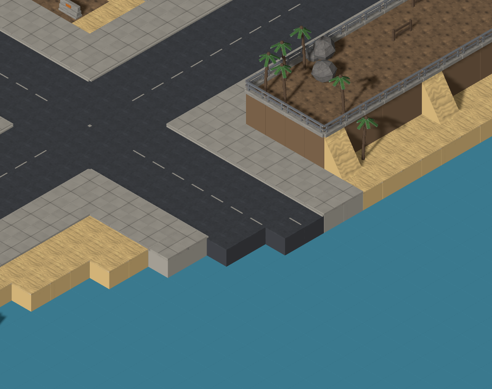
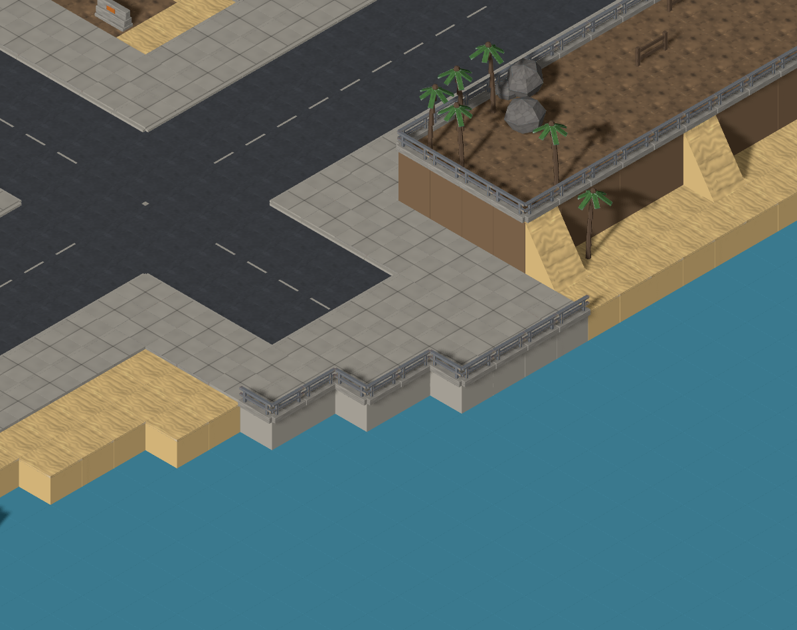
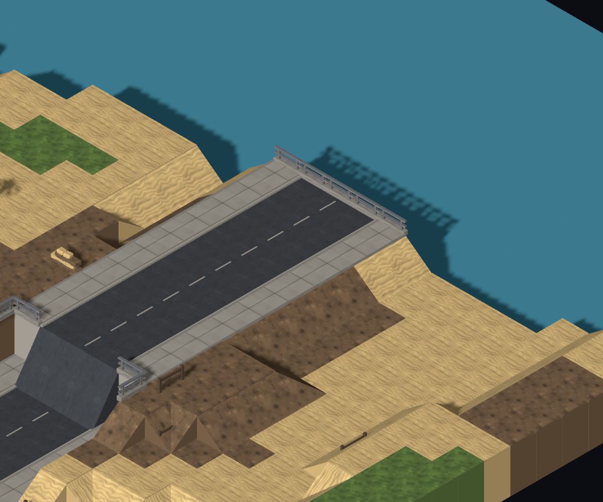
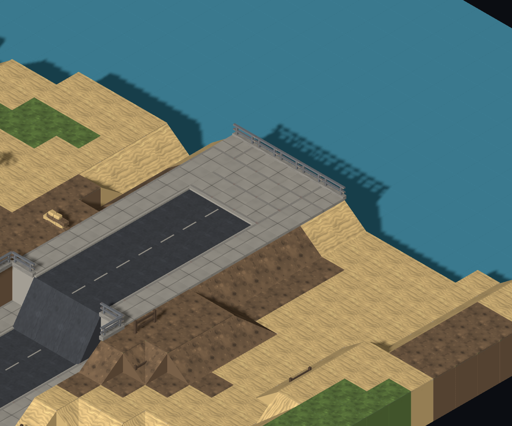
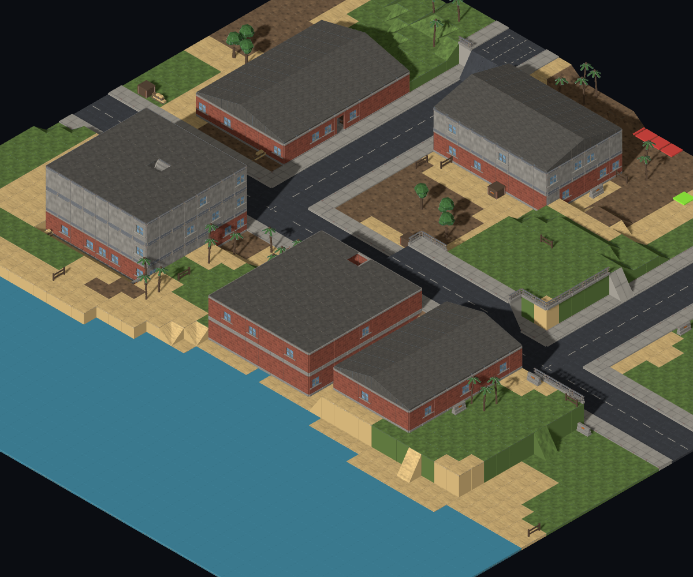

# #915 — streets end at a pedestrian waterfront

Baseline `58f6fc0`, including the accepted #910 platform removal and #916 roof fix. [Cause stated before implementation](https://github.com/BenjaminBenetti/tut/issues/915#issuecomment-5562411459).

## Cause and chosen treatment

City grid lanes were individually clipped at water. In the reported city, lanes z=39–42 ended at x=53/53/52/52, layer 1, giving the asphalt its stepped tip. Town side streets stopped together when any lane became wet: the reported three lanes x=35–37 ended at z=12, layer 2. The generic kerb pass supplied the town's height-drop railing but supplied no destination. Its two-layer threshold did not rail the city tip. Road art was drawing the supplied road surfaces correctly.

The new coastal-road pass gives a shore-facing carriageway a **three-row pedestrian apron** before the water, joining the existing pavements at their existing grade. The road now stops before this waterfront space; its water-facing pavement edges receive the existing half-wall barrier. Three tiles are six metres of pedestrian depth, visibly distinct from an ordinary one-tile kerb. Where lane tips differed, the most inland tip sets a straight end across all lanes; the apron retains the existing dry shoreline outline.

Only existing asphalt becomes pavement. There is no raising, reclamation, new prop family, or new road/art style. The pass runs after lots, elevation and interiors so this local change cannot reorder building or planted-feature placement, and before props, ramps and hooks so those passes see the final street end. Road-segment records are trimmed to match vehicle space. Half-walls facing impassable water do not remove a dry crossing.

Recognition requires an inland approach longer than the carriageway width, preserving roads that already run along the shore. The first trial looked only through the end pavement; `coast-control-7`, town/large, exposed a missed end where two lanes were farther from the wobbly waterline. The final search includes one carriageway's breadth beyond the shoreline, groups the complete end, and has an explicit regression for that case.

## Scope boundary

The almost straight blue strip comes from `WaterPass`: a single edge band, small noise wobble, then two beach columns. A shoreline that shapes the whole settlement needs a separate coastal-layout change. This ticket makes the street's immediate meeting with the existing coast intentional; it does not reshape that coast.

## Frames

Real Map Lab, models and preview units on, slope 100%, all levels visible. Viewport 2400×1500; each JSON sidecar records the URL, focus, camera and crop. The capture script exposes only the existing camera rig to set the frame; it substitutes no map or scene content.

| Control | Before | After |
| --- | --- | --- |
| Reported city: coastal/city/medium `mc-opening-03`, focus `(51,1,40)`, 55 px/tile |  |  |
| Reported town: coastal/town/small `mc-opening-01`, focus `(37,2,14)`, 60 px/tile |  |  |
| Known-good coastal/town/small `coast-control-12`, focus `(24,2,24)`, 25 px/tile |  |  |

The known-good control already sends its main street parallel to the south shore, with side streets inland and roads continuing through the board edges. Its complete generated map is unchanged, and its before/after PNGs are byte-identical. The lower framing scale shows that existing street/coast relationship rather than a cropped endpoint.

MapGen inspected the reported before/after frames: the marked surface stops before the pedestrian apron, and the city now has a continuous seaward barrier. Director frame judgment and Map Critic re-check remain required.

## Paired coastal sweep

[Raw records](survey.jsonl): 72 recipes, town/city × small/medium/large × 12 seeds (`mc-opening-01/02/03`, `coast-control-0` through `7`, and `coast-control-12`). The water edge covers north/east/south/west in 24/12/18/18 maps. Before omits only the new pass; every before and after map is frozen and checked with the shipped map validator.

| Settlement / size | Maps treated / checked | Connected apron groups | Asphalt columns converted |
| --- | ---: | ---: | ---: |
| town / small | 11 / 12 | 17 | 153 |
| town / medium | 11 / 12 | 17 | 153 |
| town / large | 11 / 12 | 17 | 153 |
| city / small | 12 / 12 | 24 | 312 |
| city / medium | 12 / 12 | 35 | 458 |
| city / large | 12 / 12 | 46 | 634 |
| **Total** | **69 / 72** | **156** | **1,863** |

All 156 groups have a mech route from deployment. The city reproduction has three groups (40 converted columns); the pictured group has 14 columns, all reachable. The town reproduction has two groups (18 converted columns), all reachable.

The probe also verifies every original tile remains at its original coordinate/height and that only `road → sidewalk` surface changes occur. All building records are identical. All **6,522 soil/grass columns raised by the elevation pass** preserve their geometry and surface; their mech-reachable count remains **5,939 → 5,939**. The city reproduction preserves 211 such high-ground columns, with 190 reachable before and after. Carriageway and pavement widths upstream, and all art/marking definitions, are unchanged.

`roadWaterEdgesBefore/After` in the raw records count all asphalt/water adjacencies, including the *sides* of shore-parallel roads. They are not a count of unfinished street ends. The reported city changes 16 → 0 and the town 4 → 0; the control is 0 → 0.

## Reproduce and validate

```sh
node tools/mapgen/survey-coastal-roads.mjs docs/design/diagnostics/915/survey.jsonl
pnpm dev --host 127.0.0.1 --port 5173
node tools/mapgen/capture-waterfront-controls.mjs after
pnpm exec vitest run coastal-road-pass
```

To recapture before frames, use the same capture script against baseline `58f6fc0` with argument `before`. The committed before images were captured on that actual baseline before any generator edit.

Regression coverage: stepped lane tips at every coast orientation, shore-parallel through streets at every orientation, both critic recipes, the additional wide-shore town case, unchanged control/non-coastal maps, retained heights/buildings/high ground, and mech access to the reported destinations. Only the coastal golden changes; the other five remain fixed.

Validation on the final implementation: `pnpm typecheck`, `pnpm lint`, `pnpm build`, **2,167 unit tests** and **59 browser tests** pass (one opt-in unit test and 27 opt-in browser cases skipped). All seven simulation checks pass before and after; the complete 60-map report is identical, with 45 wins and 15 unresolved at the turn cap. The wide-sweep result is recorded in the PR body.
