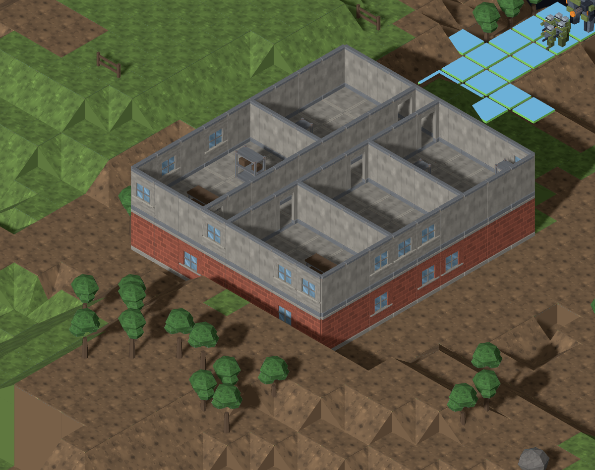
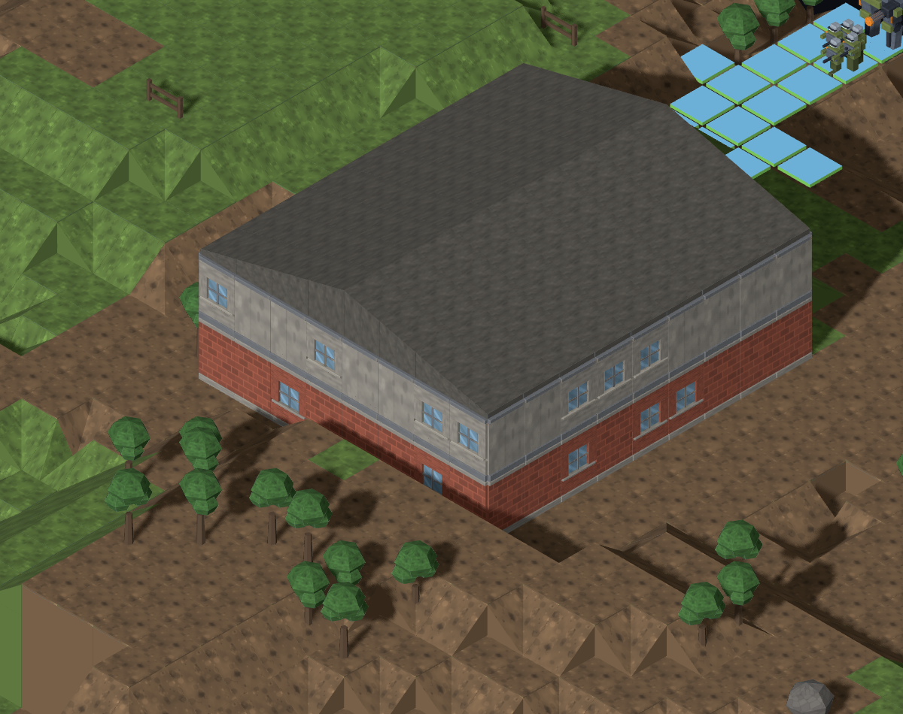
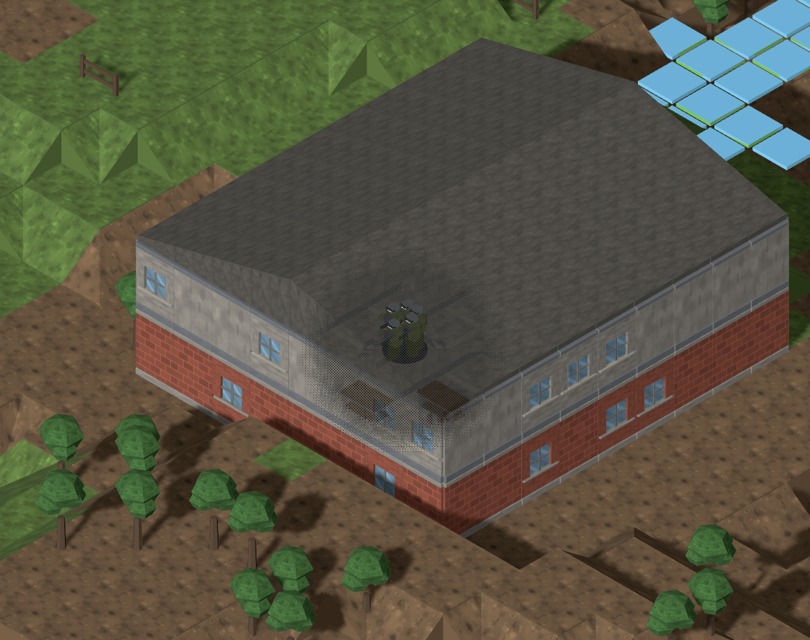

# #916 — pitched roof shelter and local cutaway

Baseline: `e093702` (main, foundations already merged). Model/runtime checkpoint:
`a5f4deb`. These are actual generated maps, not reconstructed buildings.
The Director judges these frames before Tech Lead merge; Map Critic re-checks
the merged result.

## Before and after

All Map Lab frames use models on, slope 100%, small 48×48 maps. The house
close-ups use the reporter's `(24,4,15)` focus, 55 px/tile, a 2400×1500 viewport
and 1200×950 crop. Rotation is the initial view or E once. Whole-map controls
use initial framing with units off; no floor cut except the explicitly named
interior control. URLs, camera and level settings are in each `captures.json`.

| View | Before | After |
| --- | --- | --- |
| `mc-opening-01`, temperate/rural, reported house | [open rooms](before/house.png) | [pitched shelter](after/house.png) |
| Same house, E once | [open rooms](before/house-rotated.png) | [pitched shelter](after/house-rotated.png) |
| Same house, top floor visible, maximum layer 4 | [interior](before/house-floor.png) | [identical interior](after/house-floor.png) |
| Same seed, temperate/rural, units off | [whole map](before/temperate-units0.png) | [both houses sheltered](after/temperate-units0.png) |
| Same seed, snowy/rural, units off | [whole map](before/snowy-units0.png) | [both houses sheltered](after/snowy-units0.png) |
| `mc-opening-02`, temperate/town, existing flat roofs, units off | [positive control](before/flat-roof-control.png) | [identical control](after/flat-roof-control.png) |




The flat-roof overview and the top-floor interior control are **byte-identical**
before/after, zero changed pixels. The flat-roof close-up with the cutaway
controller off is also byte-identical. Hashes and decoded RGBA comparisons are
in [comparisons.json](comparisons.json); no tolerance, retouching or alignment
transform is applied.

## Cause, stated before building

[Initial diagnosis on #916](https://github.com/BenjaminBenetti/tut/issues/916#issuecomment-5562040887).
The two rural houses already declare `pitched, walkable: false`. `InteriorPass`
correctly emits roof tiles only for walkable roofs (ADR 0004). Graphics drew
`building.roof` only through those tiles and had no pitched-roof asset or
consumer for that building record. Furnishing and occupancy were not the trigger.

The two temperate houses occupy `(20,9,8,9)` at floor layers 2/4 and `(17,27,6,8)`
at layer 0. Snow moves the first house to layers 4/6. Both recipes have zero
walkable roof tiles and now receive 120 visual caps. The four flat-roof
apartments in the positive control retain their 294 roof slabs and four stair
landings. [Exact records](roof-records.json).

## The cutaway check found a second defect

[Finding posted before changing the shader](https://github.com/BenjaminBenetti/tut/issues/916#issuecomment-5562204710).
`GhostController` updated `uGhostStrength`, and the shader used it, but
`applyGhostCutaway` never bound that uniform. On the baseline, the controller
reported one visible unit while controller off/on produced **zero changed
pixels**, even under an existing flat roof. Binding the existing uniform fixes
that path without changing the 2-u radius, 0.35 opacity floor, depth test, 150-ms
fade or visible-unit source.

Map Lab does not run this controller for its sample units. The separate
`roof-cutaway.html` control therefore uses the real `TacticalSceneBuilder`,
`GhostController` and `SceneService`, assembled as in `TacticalSceneHost`. It
places the real five-figure rifle squad at `(24,4,15)` in the house or `(25,6,14)`
in the flat-roof apartment. The scene uses normal lighting and shadows, all
levels visible, 80 px per world unit, 1200×950 viewport; no simulated shader or
HTML overlay. `cutaway.json` records the actual controller count and unit tile.

| Control | Baseline | Repaired |
| --- | --- | --- |
| Pitched house, controller off | [open roof](before/pitched-ghost-0.png) | [closed shelter](after/pitched-ghost-0.png) |
| Pitched house, controller on | [inactive effect](before/pitched-ghost-1.png) | [squad revealed locally](after/pitched-ghost-1.png) |
| Visible squad removed | [empty room](before/pitched-unit-left.png) | [roof closed again](after/pitched-unit-left.png) |
| Existing flat roof, controller off | [closed roof](before/flat-ghost-0.png) | [byte-identical roof](after/flat-ghost-0.png) |
| Existing flat roof, controller on | [squad hidden](before/flat-ghost-1.png) | [squad revealed locally](after/flat-ghost-1.png) |



Controller off/on now changes 35,932 pixels for the pitched house and 35,887
for the flat roof, confined to the local patch (bounds in `comparisons.json`).
After the squad leaves, the pitched roof is byte-identical to its opaque frame.
The dark interior shadows remain; this repairs the intended reveal without a
lighting or cutaway-strength retune. The capture script fails if the controller
runs without changing pixels, or if the pitched roof does not close again.

## Kit and live consumer

- `building.roof-pitched`: Blender-authored closed cap, **20 triangles, 2,744
  bytes**, watertight, base-centred 1×1 footprint, authored height 0.37 u.
- Source: `tools/art/models/building-roof-pitched.py`; registered in the model
  ids, both manifests and map model table. Shared `env-roof` atlas material.
- [45°](../../renders/building.roof-pitched_045.png),
  [135°](../../renders/building.roof-pitched_135.png),
  [225°](../../renders/building.roof-pitched_225.png): all rendered and opened.
- The consumer fits the three upper profile points while keeping the ceiling
  closed at the wall line. Ridge along the longer footprint axis, 0.12-u eave,
  0.25-u rise per tile; the middle profile point closes odd-width ridges.
  Current buildings have one rectangular footprint; no new L/T roof design is
  claimed by these controls.
- Caps use the highest real building tile below for per-tile fog, including a
  lower landing below a stairwell hole. Geometry caches by profile; loader
  material and scene ghost/mist material share across profiles and levels.
- A retained maximum level keeps an early floor cut applied when asynchronous
  roof art creates a new visual level. No tiles, rooms, props, walls, connectors,
  movement rules or map-generation parameters change. A visual roof is not a
  new standable surface.

## Reproduce and verify

Start Vite on the baseline checkout or this branch, then:

```sh
CAPTURE_BASE_URL=http://localhost:4173 node tools/art/preview/capture-roof-controls.mjs before
CAPTURE_BASE_URL=http://localhost:4173 node tools/art/preview/capture-roof-cutaway.mjs before
# Use `after` for the repaired tree. The controls script resumes completed records;
# start with an empty phase directory when deliberately replacing a capture set.

blender -b --python tools/art/make_model.py -- \
  --script tools/art/models/building-roof-pitched.py --id building.roof-pitched \
  --category buildings --file building-roof-pitched.glb --quality final

CAPTURE=1 pnpm exec playwright test e2e/fog-screenshot.spec.ts e2e/viaduct-parapet-screenshot.spec.ts
pnpm exec vitest run src/graphics/service/pitched-roof-geometry.test.ts src/graphics/service/ghost-cutaway.test.ts
```

The baseline needs the capture-only files copied into `tools/art/preview/`;
it uses its own unchanged `src/` and assets. Separate Vite cache directories
avoid shared-worktree reloads. Scratch-only roof-without-uniform and mismatched
camera trials are not final evidence. The baseline Map Lab close-up helper
used a redundant flat-roof detail view with different subpixel framing; the
fixed-camera flat-roof control above is the preservation proof.

Eight actual-GLB tests cover both ridge axes, even/odd spans, wall-line contact,
roof coverage including stairwells, map immutability, non-walkable picking,
early floor cuts, shared materials, mixed per-tile mist and both reporter
biomes. The ghost test pins the missing live uniform binding.

Full unit suite: **2,154 passed, one skipped**. Seven simulation tests pass.
Typecheck, full lint/format check and build pass (existing bundle-size warning). Full browser suite:
**59 passed, 27 opt-in captures skipped, zero flaky**. The two standard capture
specs pass. Both seed-4242 fog frames and the seed-730982385 no-fog control were
regenerated, opened and committed. Fog-frame differences from the tracked
baseline are confined to the rightmost 16-pixel UI strip; no map-region pixels
change in those two controls. The pitched roofs are visible in the no-fog
overview and the dedicated house frames above.
