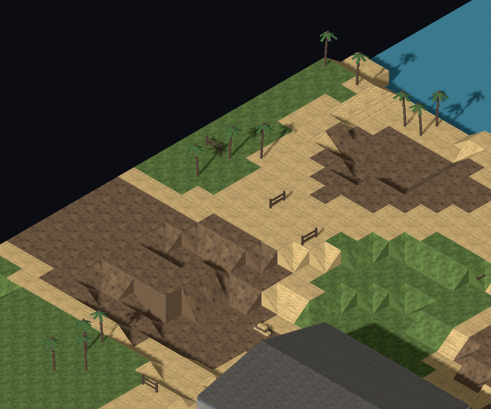
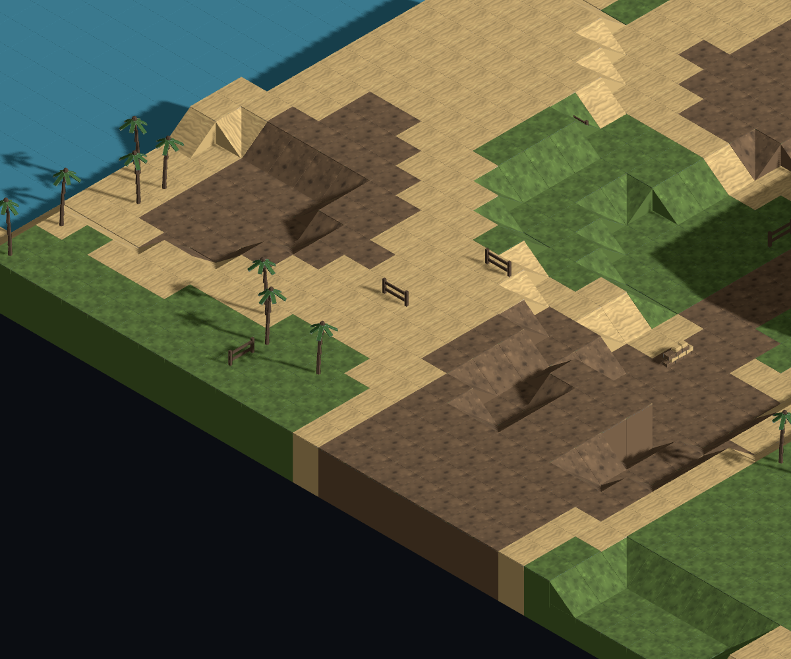
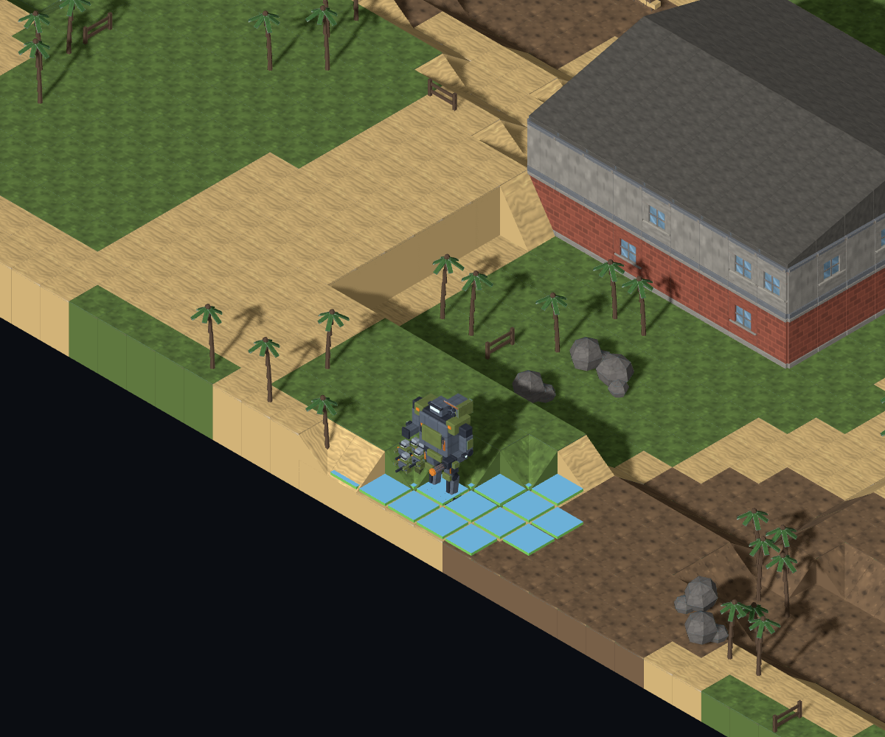
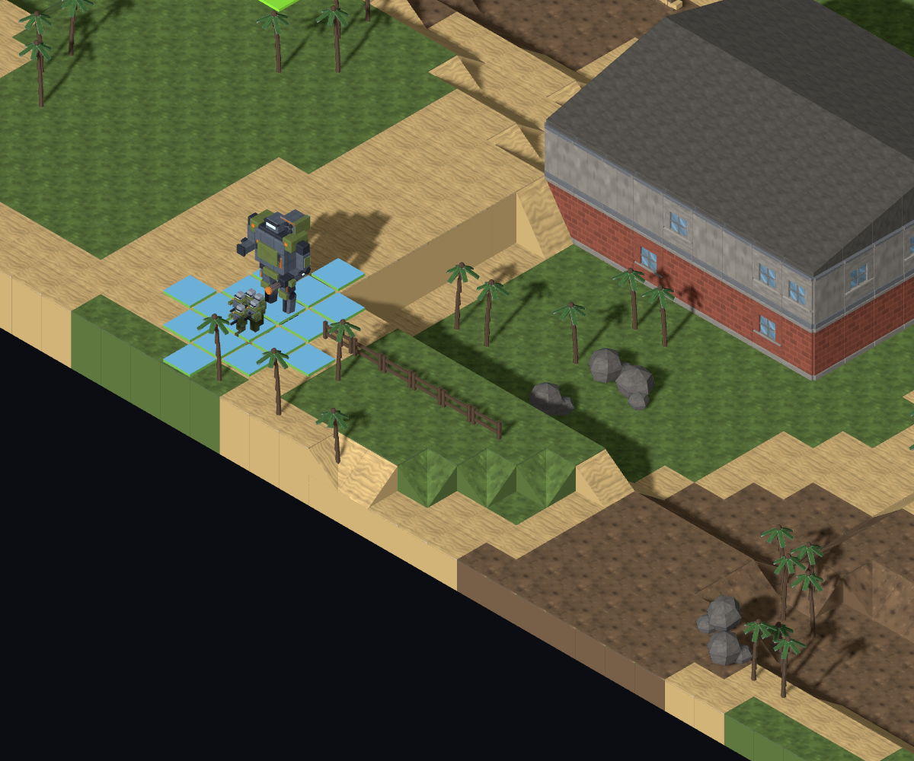
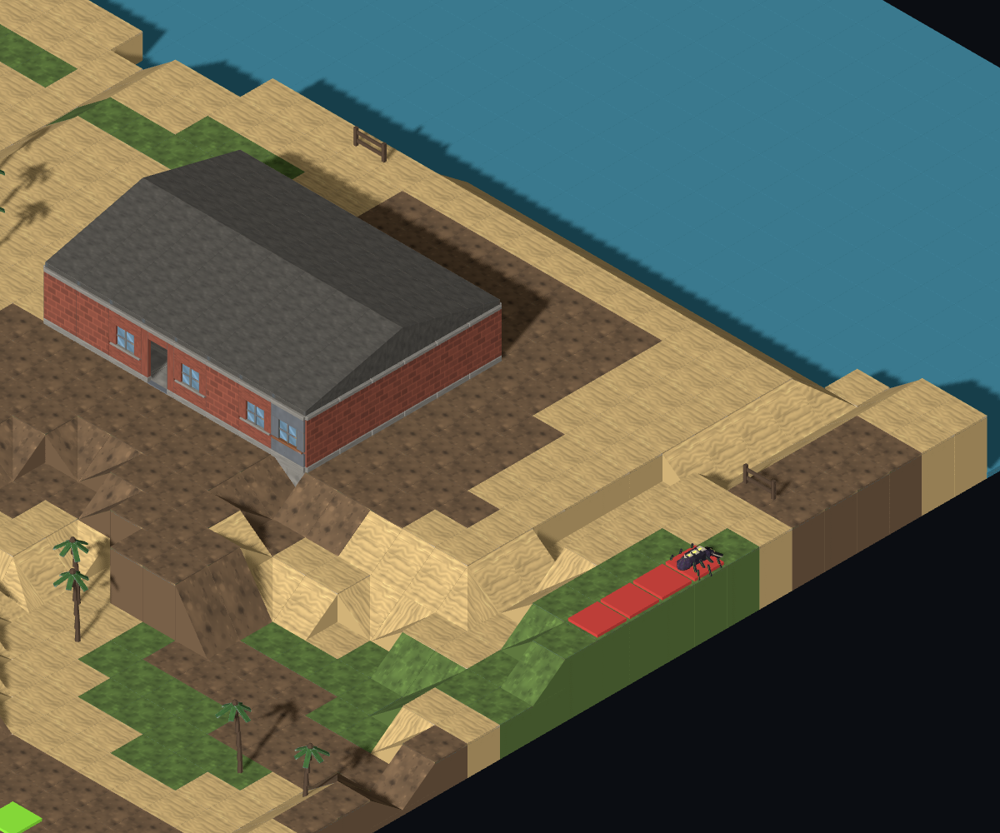
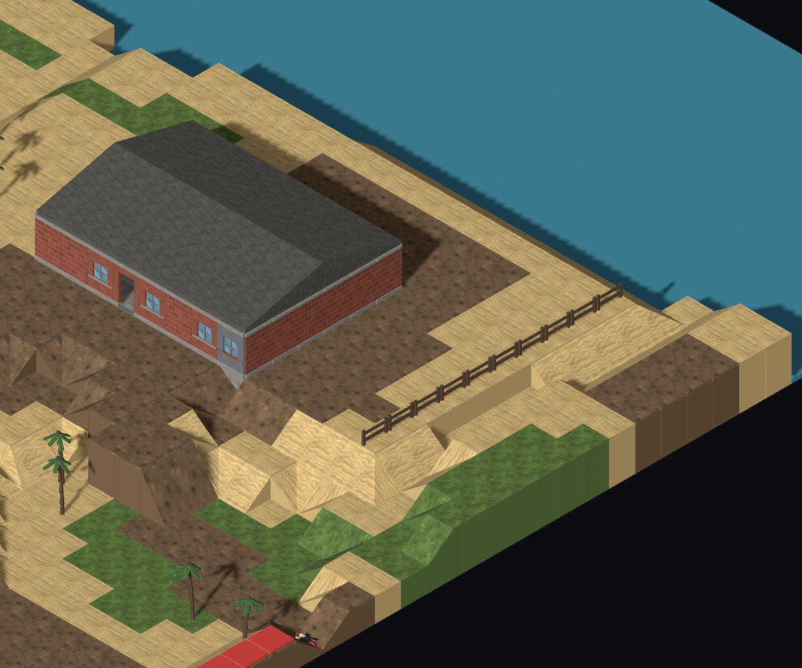
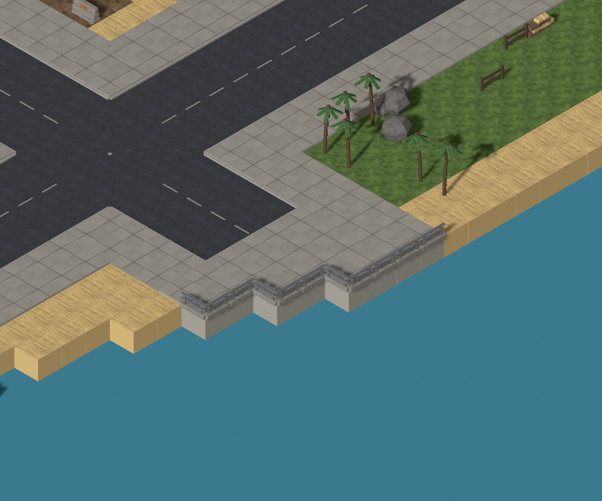
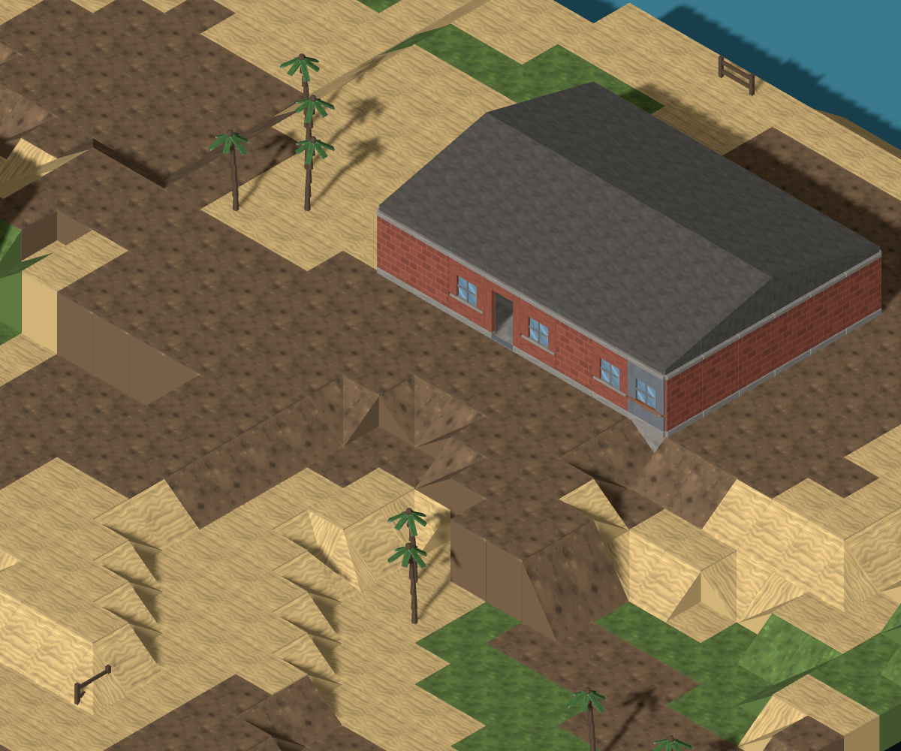
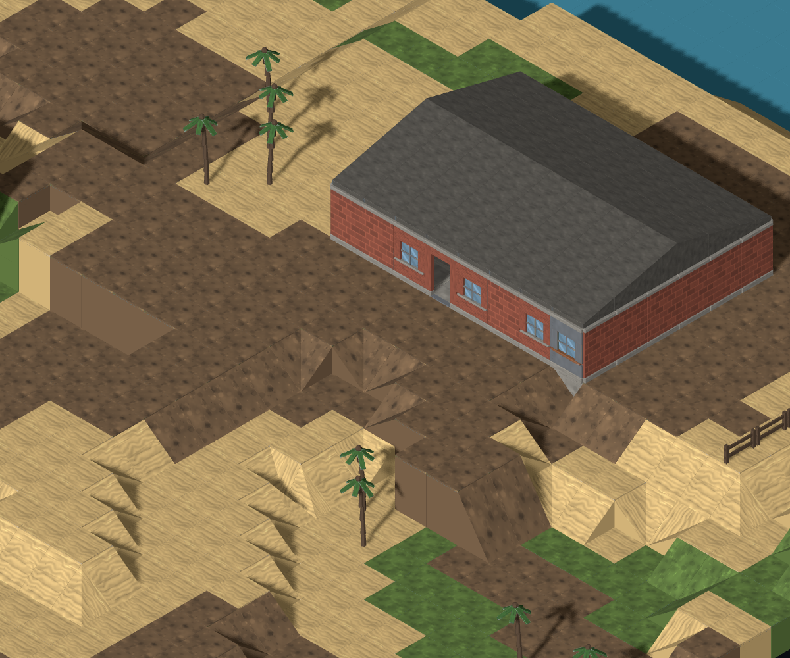

# #917 — rural fences follow existing boundaries

Baseline: main `360778a`. Runtime change: `75bb5e3`. The [cause was posted on the issue before implementation](https://github.com/BenjaminBenetti/tut/issues/917#issuecomment-5589244991). Director frame judgment is pending; the Tech Lead merges and the Map Critic re-checks afterwards.

## Cause and placement decision

`PropPass.placeVegetation` draws fence panels as independent vegetation points with random quarter-turns. Temperate, snowy and coastal give that kind density 1 without a cluster rule. `placeYardClutter` can also draw and rotate a fence from the generic low-cover pool. Neither path gives the panel a boundary to mark. The complete timber model is visible in both reported angles: this is a generation defect.

A rural-only pass now arranges the existing fence allocation along real lot edges or beside trails. Keeping the original prop draws preserves every tree, rock and other prop; it does not increase the fence density to connect scattered points. The pass follows slope, ramp and kerb generation so it can reject unsupported ground and protect existing access. Hooks and connectivity run afterwards.

The dimensions live in `FENCE_PLACEMENT_TUNING`:

- **3–10 panels per straight run (6–20 m).** Three establishes a readable boundary; ten caps the detour and avoids spending the whole allocation on one long wall. A shorter supported part can be used if a longer candidate is obstructed. One- and two-panel remainders are omitted.
- **Two clear columns (4 m) between separate runs.** Door approaches reserve a 3×3 area outside each entrance, and existing connector landings remain free. Runs are incomplete boundaries with access at their ends, not newly enclosed fields or claimed gate assets.
- **One or two open verge columns beside a trail.** The trail itself remains clear. Plot candidates follow the lot perimeter or at most two columns outside it, allowing a supported edge without terrain grading. The reported plot run sits at x=43 beside the eastern building lot.
- **Same height throughout each run, no walls, occupied tiles or potential slopes.** Potential slope classification includes diagonal corners and is independent of the visual slope-share knob. A pass after kerbs respects the ramps and walls already placed.
- **Distribute runs between existing plots and the trail before adding more to one boundary.** Seeded tie-breaking gives different placements between seeds. No random field outline, new art, or cover-density retune is introduced.

## Same-seed frames

All twelve PNGs were rendered in the real Map Lab and inspected. Sidecars record the full URL, camera, viewport and crop. Before frames use the baseline checkout; after frames use the final runtime. The capture tool exposes only the existing camera rig to reproduce focus, rotation and zoom; it does not replace generation, materials or scene geometry.

The critic's original baseline predates the shipped roof fix. These paired frames both include the current roof rendering.

| View | Before | After |
| --- | --- | --- |
| Reported F01 — coastal/rural/small, `mc-opening-01`, focus (5,2,22), 45 px/tile |  |  |
| Reported F02 — same recipe/focus, one E turn |  |  |
| Where six panels went — same map, trail beside the house, focus (20,2,43), 45 px/tile |  |  |
| Where ten panels went — same map, building plot edge, focus (40,2,18), 45 px/tile |  |  |
| Additional boundary control — accepted #915 waterfront, coastal/city/medium, `mc-opening-03`, focus (51,1,40), 55 px/tile |  |  |
| Known-good rural entrance control — same affected map, focus (34,2,24), 55 px/tile |  |  |

The reported map retains **all 16 panels**, in runs of **10 at (43,2,13–22)** and **6 at (17–22,2,44)**. The original beach/palm views lose the unrelated fragments; the extra views show their destination rather than implying that deleting every fence was the fix. Both runs have clear ends and align with surrounding land use. Deploy and edge-spawn hooks can move because their placement runs after props; the unit markers in these frames reflect that real change.

**Control selection:** the rural baseline sweep contained only two accidental aligned pairs, not an evidenced timber boundary that already read correctly. The primary preservation control is therefore the existing clear entrance and yard approach of `building-2`, at (34,2,22), on the affected rural map. A boundary algorithm can fail this control by fencing across the entrance or crowding its approach. The baseline doorway and open yard remain visibly clear with the new plot fence nearby; [the paired nine-column approach record](entrance-control.json) confirms no prop occupies that area in either phase. This is an access control, not a claimed good baseline timber run.

The Director-accepted waterfront railing from #915/#932 is an additional control. Its before/after PNGs are byte-identical, but the rural-only guard makes it insufficient on its own to test the new placement. The isolated urban timber props also visible there remain outside this rural ticket. This distinction follows the evidence rule in Discussion #968.

## Frequency and tactical cost

[Paired raw records](survey.jsonl): four biomes × three settlement scales × three sizes × three opening seeds = **108 maps**, including **36 rural maps**. Each phase is frozen and validated. The tool reconstructs baseline generation by omitting the sole new pass; frames use an actual baseline checkout.

| Rural biome (9 maps each) | Panels before → after | Isolated panels before → after | Mean cover adjacency before → after | Fence panels beside deploy-reachable infantry ground before → after |
| --- | ---: | ---: | ---: | ---: |
| Temperate | 480 → 453 | 478 → 0 | 14.685% → 13.429% | 479 → 447 |
| Snowy | 480 → 456 | 480 → 0 | 12.653% → 11.496% | 473 → 420 |
| Desert | 7 → 0 | 7 → 0 | 18.559% → 18.536% | 7 → 0 |
| Coastal | 364 → 364 | 362 → 0 | 13.574% → 12.261% | 363 → 362 |

**1,331 → 1,273 panels (95.6% retained); 1,327 isolated panels → 0.** The other four baseline panels formed two pairs. Every final rural group has at least three aligned panels; none occupies a rendered slope. Desert has only occasional one-/two-panel yard allocations, so its seven panels are omitted rather than inventing extra density to build a run.

The existing fence remains LOW cover with the same model and rules. **Cover is less widely distributed:** mean cover adjacency falls about 1.2–1.3 percentage points in the three fence-heavy biomes, even in coastal where panel count is fully retained. This is a real tradeoff of grouping cover, not proof of equal tactical value. The reachable-neighbour measure is a local access proxy, not a firefight score; snowy placement retains 456 panels but only 420 have that measured access. The #281 density knobs are unchanged. The Director and critic should judge whether the preserved boundary cover is useful in the resulting places.

Preservation assertions pass for all 108 pairs: ground heights, ground surfaces, road mask, building records and every non-fence prop have identical hashes. All **72 town/city complete map hashes are identical**. Rural hook positions may change; terrain and vegetation do not. No new asset or natural terrain treatment is included. Material patch edges remain visible and belong to #945.

## Reproduce and validate

```sh
node tools/mapgen/survey-rural-fences.mjs docs/design/diagnostics/917/survey.jsonl
# Run each capture against its checkout's Vite server:
CAPTURE_BASE_URL=http://127.0.0.1:5175 node tools/mapgen/capture-fence-controls.mjs before
CAPTURE_BASE_URL=http://127.0.0.1:5173 node tools/mapgen/capture-fence-controls.mjs after
pnpm typecheck
pnpm lint
pnpm test --maxWorkers=4
MAPGEN_WIDE=1 pnpm exec vitest run generation-wide-sweep
pnpm test:e2e
SIM_REPORT=docs/design/diagnostics/917/sim-after.json pnpm test:sim
pnpm build
```

Validation passes: typecheck, lint and build; **2,172 unit tests** with four workers (68.5 s); **59 browser tests** (2.3 min); **1,200 wide-sweep maps with zero hook relocations** (424.6 s); **seven simulation checks**, with all 60 per-mission records identical before/after (46/60 wins; 24/24 at difficulties 1–4). The default parallel unit run hit three timing limits while browser/simulation/wide checks were running concurrently; the complete four-worker rerun passed without changing any timeout or assertion. [Machine-readable validation record](validation.json), [before simulation](sim-before.json), [after simulation](sim-after.json). Five new regression tests cover contextual runs, door/connector/slope protection, unsupported remainders, the rural-only boundary and visual-knob independence on the reported seed. Existing pipeline expectations include the new pass. The slope-pass isolation test excludes its new downstream consumer on both sides, preserving its assertion that the slope pass itself moves no props. Only the rural golden changes, `3029796126 → 743992674`.
