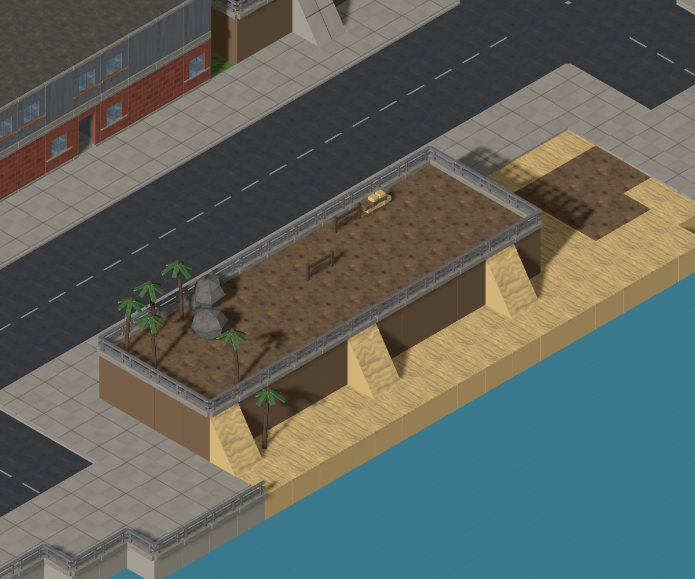
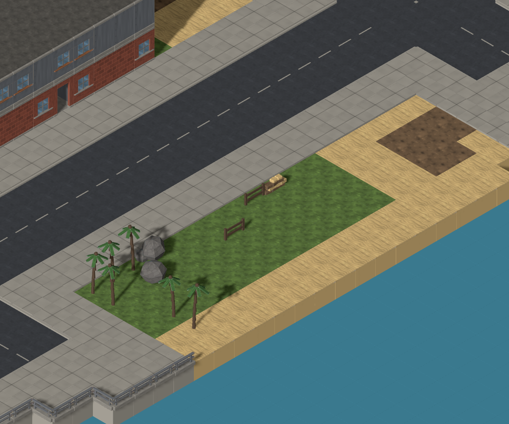
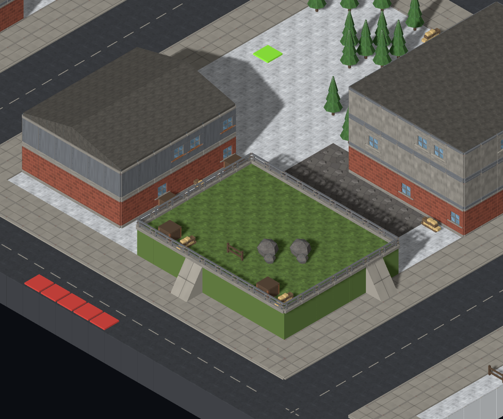
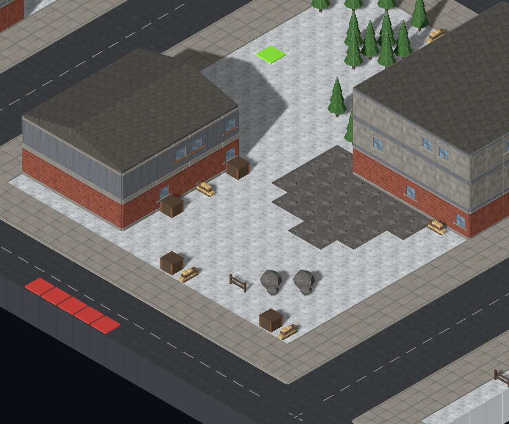
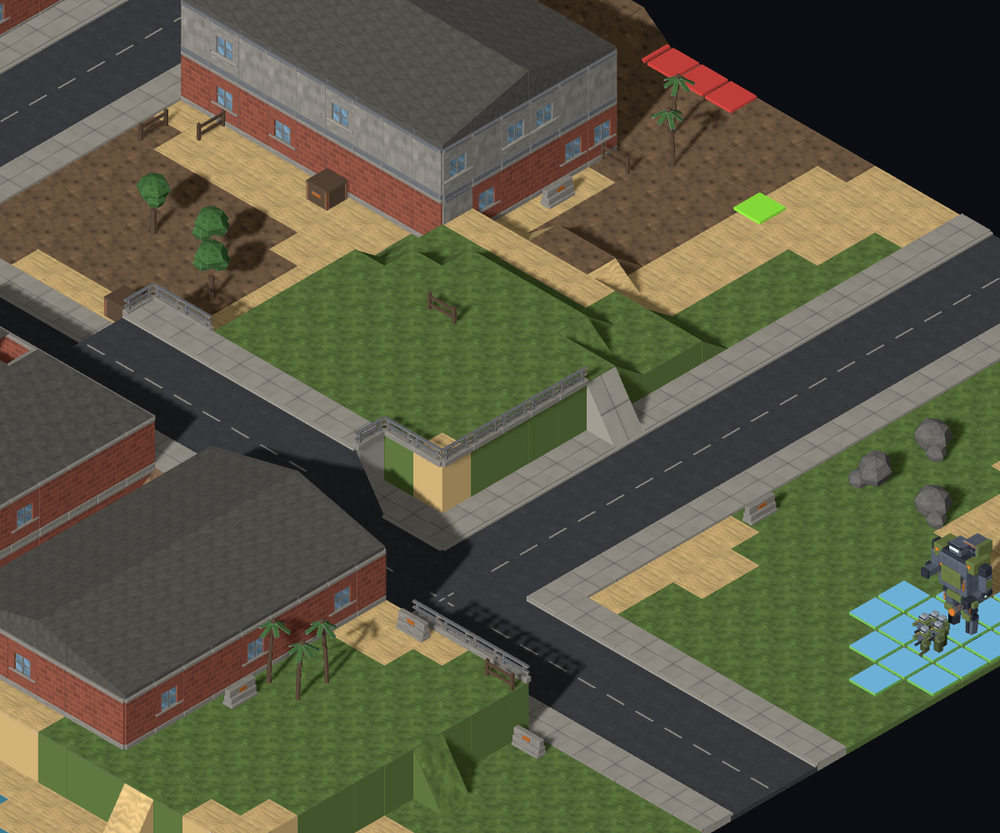
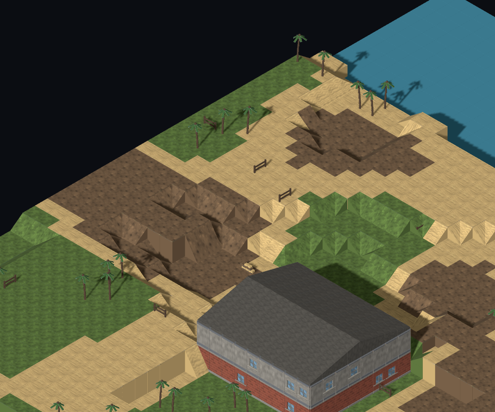

# #936 — Withdraw artificial vegetated plinths

The Executive Director withdrew the planted-bed preservation requirement from
#910. The generator now emits **zero artificial plinths** in the 108-recipe
opening-seed sweep: 213 soil/grass beds and 85 rock-topped blocks are gone.
Their plots recover their original height and surface. Natural terrain and all
rural/town map output are unchanged in the paired sample.

Baseline: `2878dfc` (after #915/#932). The
[cause was posted before implementation](https://github.com/BenjaminBenetti/tut/issues/936#issuecomment-5562738987).
Director frame judgment and the critic's subsequent re-check remain required.

## Cause and change

`ElevationPass` stamps a rectangle exactly one storey above its base and adds
retaining-edge half walls. Later prop placement supplies vegetation. #910 capped
podium/plaza but deliberately retained soil/grass families under the Director's
then-current instruction. These blocks are artificial stamps, not natural hills.

Set `maxPerMap: 0` on `terrace`, `raised-park`, `rail-embankment` and
`rubble-mound`. The last two are included because their rock surfaces disguise
the same artificial railed blocks, sometimes with trees; the embankment family
has no railway. Leaving them enabled would retain another version of the
rejected object. Podium/plaza stay capped; road-bearing families stay disabled
by the existing pass filter.

The #910 planning/restoration mechanism is unchanged: proposals retain their
weights, random draws and planning occupancy, then withdrawn plots recover their
original columns before walls or later passes see them. No attempts move to
another family, no replacement assets are added, and no terrain or lot-grading
rule changes. Existing ground-level planting can occupy the recovered ground.

## Frequency sweep

Four biomes × three settlement presets × three map sizes × three seeds
(`mc-opening-01`, `mc-opening-02`, `mc-opening-03`) = **108 recipes per version**.
Every frozen map passes the shipped validator. Counts below are realised
`ElevationPass` families, traced through their actual final columns; a natural
hill with a railing is not counted as an artificial feature. A soil/grass bed
need not happen to receive a tree to count.

Each row covers nine maps, three per size. The three size columns give
soil/grass-bed counts **before → after**. The final column includes rock-topped
families too.

| Biome | Settlement | Small beds | Medium beds | Large beds | All artificial plinths |
| --- | --- | ---: | ---: | ---: | ---: |
| temperate | rural | 0 → 0 | 0 → 0 | 0 → 0 | 0 → 0 |
| temperate | town | 0 → 0 | 0 → 0 | 0 → 0 | 0 → 0 |
| temperate | city | 2 → 0 | 15 → 0 | 38 → 0 | 79 → 0 |
| snowy | rural | 0 → 0 | 0 → 0 | 0 → 0 | 0 → 0 |
| snowy | town | 0 → 0 | 0 → 0 | 0 → 0 | 0 → 0 |
| snowy | city | 2 → 0 | 15 → 0 | 38 → 0 | 79 → 0 |
| desert | rural | 0 → 0 | 0 → 0 | 0 → 0 | 0 → 0 |
| desert | town | 0 → 0 | 0 → 0 | 0 → 0 | 0 → 0 |
| desert | city | 2 → 0 | 15 → 0 | 38 → 0 | 79 → 0 |
| coastal | rural | 0 → 0 | 0 → 0 | 0 → 0 | 0 → 0 |
| coastal | town | 0 → 0 | 0 → 0 | 0 → 0 | 0 → 0 |
| coastal | city | 6 → 0 | 15 → 0 | 27 → 0 | 61 → 0 |
| **Total** | | **12 → 0** | **60 → 0** | **141 → 0** | **298 → 0** |

Soil/grass beds occurred in 30/36 city maps (83.3%) before and 0/36 after.
The three inland biomes share feature planning for these recipes; their equal
counts are not independent placement samples. Coastal water changes available
plots. All town and rural entries were already zero.

| Family | Footprints before → after | Columns before → after |
| --- | ---: | ---: |
| terrace (dirt) | 138 → 0 | 4,703 → 0 |
| raised-park (grass) | 75 → 0 | 3,170 → 0 |
| rail-embankment (rock) | 48 → 0 | 1,580 → 0 |
| rubble-mound (rock) | 37 → 0 | 984 → 0 |
| **Total** | **298 → 0** | **10,437 → 0** |

Raw records: [before.jsonl](before.jsonl), [after.jsonl](after.jsonl).
The before file was measured on the actual baseline before editing the caps;
restoring only these four families on the final branch reproduces all 108 rows
exactly. Do not use `--uncapped` to reproduce #936's baseline: that would also
restore the already-withdrawn paved platforms from #910.

## Real Map Lab frames

All eight frames were rendered and inspected. Models and units enabled, all
levels visible, `slope=100`. No scene or generation module is substituted.
Capture tooling exposes the existing camera rig solely to set identical focus
and zoom. Each PNG's adjacent JSON records the exact Map Lab URL, focus, camera,
viewport and crop. Baseline frames were captured before the caps changed.

### City soil terrace: coastal / city / medium / mc-opening-03

Focus `(50,3,30)`, 55 pixels per projected tile. The dirt terrace at
`x=48,z=25,w=4,d=12,y=3` returns to its original grass ground. Its retaining wall,
rail and access ramps disappear; the planted yard is at the surrounding grade.
The #915 waterfront apron remains visible at lower left.

| Before | After |
| --- | --- |
|  |  |

### City raised park: snowy / city / medium / mc-opening-02

Focus `(56,4,62)`, 45 pixels per projected tile. The 63-column raised park at
`x=54,z=60,w=9,d=7,y=4` becomes an ordinary snowy yard. There is no substitute
plinth or decorative retaining wall.

| Before | After |
| --- | --- |
|  |  |

### Town preservation control: coastal / town / small / coast-control-12

Focus `(33,2,15)`, 40 pixels per projected tile. **The town-removal recipe is
still unconfirmed.** The shipped town preset has no elevated-feature budget,
so it never runs this stamping pass. Enabling a dormant knob for a screenshot
would manufacture the reported defect.

This existing coastal town view is therefore an unchanged control, not evidence
of a removed town bed. Its prominent railed grass bank at `x=32–33,z=13–17`
starts at natural layer 2 and stays there through roads, lots and elevation.
The two smaller railed grass columns at `(40,2,23)` and `(41,2,23)` belong to a
graded building lot, a separate cause. The recorded column trace is in
[town-grading.json](town-grading.json). Both PNGs are byte-identical.

| Before | After |
| --- | --- |
|  |  |

### Rural natural hills: coastal / rural / small / mc-opening-01

Focus `(8,2,24)`, 35 pixels per projected tile. Natural hills, slopes, shore,
vegetation and the rural building are retained. Both PNGs are byte-identical.

| Before | After |
| --- | --- |
|  |  |

## Preservation and tactical cost

The paired probe in [preservation.jsonl](preservation.jsonl) verifies:

- Natural terrain height/surface hashes match in **108/108** recipes.
- After the feature pass, every column has its input height and surface in
  **108/108** recipes. The 10,437 withdrawn columns recover their original grade;
  all columns outside those stamps also match the baseline at this stage.
- Complete frozen map hashes match for **36/36 rural and 36/36 town maps**.
  Thus rural hills, props, roads, hooks, buildings and connectors are unchanged,
  not merely similar aggregate counts.
- Building records match in **108/108** recipes. Across the 36 cities, upper
  building-floor tiles remain **42,071**, roof tiles remain **13,775**, and each
  city's tallest building still has three or four floors.

The cost is substantial: **mech-reachable outdoor tiles above the median road
height fall from 9,271 to 5** across the 36 city recipes. City maps with any such
tile fall from **30/36 to 1/36**. This measures deployed-mech reachability in the
final map; it is not a claim that every tile was an effective firing position.
Retained indoor/roof height is not a like-for-like replacement for a mech's
outdoor platform. The critic should assess whether these cities now feel
tactically flat and how useful their existing building access is. No compensating
height change is part of #936.

Props and hooks may move in changed city maps as later passes consume the
restored grade/surface. Rural/town full-map identity is the stronger unchanged
control; we do not claim full city-map identity.

## Reproduce

```sh
node tools/mapgen/survey-elevated-features.mjs .git/mapgen-936/reproduced-before.jsonl --restore=terrace,raised-park,rail-embankment,rubble-mound
node tools/mapgen/survey-elevated-features.mjs .git/mapgen-936/reproduced-after.jsonl
node tools/mapgen/survey-plinth-preservation.mjs .git/mapgen-936/reproduced-preservation.jsonl
pnpm dev --host 127.0.0.1 --port 5173
# Separate terminal; run on baseline checkout for before, final checkout for after:
node tools/mapgen/capture-plinth-controls.mjs before
node tools/mapgen/capture-plinth-controls.mjs after
```

The capture script is new in this PR: to recapture before, copy that script into
a clean baseline checkout without changing its source modules. Every URL can
also be opened directly from its JSON sidecar and the listed focus inspected in
Map Lab.

## Validation

The new stock-preset regression failed against the previous catalogue and passes
with the caps. The existing enabled-feature mechanics tests use explicitly
uncapped fixtures so that stamping, railings, ramps and lot clearance continue
to receive meaningful coverage. Only the city ASCII golden changes, from
`2666589793` to `4220186506`; all five rural/town goldens remain unchanged.

| Check | Result |
| --- | --- |
| `pnpm typecheck`, `pnpm lint`, `pnpm build` | Pass |
| `pnpm test --maxWorkers=4` | 2,167 passed; normal 216-map sweep included |
| `MAPGEN_WIDE=1 pnpm exec vitest run generation-wide-sweep` | 1,200 valid maps, zero hook relocations; 366 s |
| `pnpm test:e2e` | 59 passed, no retries |
| `SIM_REPORT=… pnpm test:sim` | All seven checks pass before and after |
| Paired frequency and preservation probes | 108 recipes each; all assertions pass |

The simulation uses the shipped 15-turn cap: **45/60 → 46/60 wins**, with
15 → 14 missions unresolved at the cap. Difficulties 1–4 stay **24/24 wins**.
Five higher-difficulty outcomes change (three unresolved → won, two won →
unresolved); this small sample does not establish a difficulty improvement.
[Before](sim-before.json) and [after](sim-after.json) reports preserve the seeds
and outcomes. No simulation assertion or tuning value was changed.
