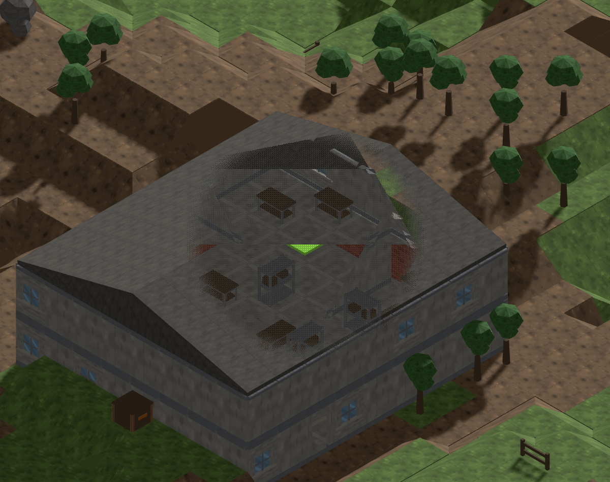
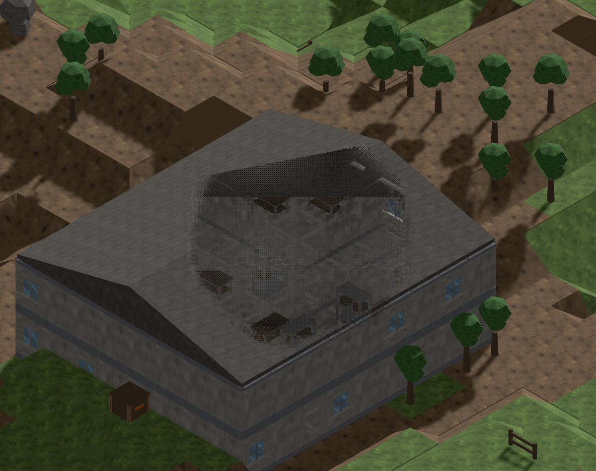

# Pointer depth comparison before the final #947 pass

Same empty pitched building, seed `mc-opening-01`, yaw 2, raw cursor (600,475),
radius 3, floor 0.175. Source `b396287`.

| Floor + 0.05 u | Same ray, raised by 0.65 u |
|---|---|
|  |  |

The initial anchor opens the room but also exposes lower brickwork and a bright
ground patch through the near part of the floor. The shallower window retains
that floor, furniture and room divisions while keeping the far wall readable.
Art chooses **floor + 0.70 u**, capped just below a lower hit surface, for the
final pointer-only depth rule. The squad source and shared shader stay fixed.

The right frame is a diagnostic override of the picked centre before the
controller projects it: `centre.addScaledVector(cameraDirection, 0.65 /
cameraDirection.y)`. It stays on the cursor ray. The final implementation will
choose the inspection height before applying the existing footprint exit cap;
the full acceptance matrix will be regenerated using that implementation.
