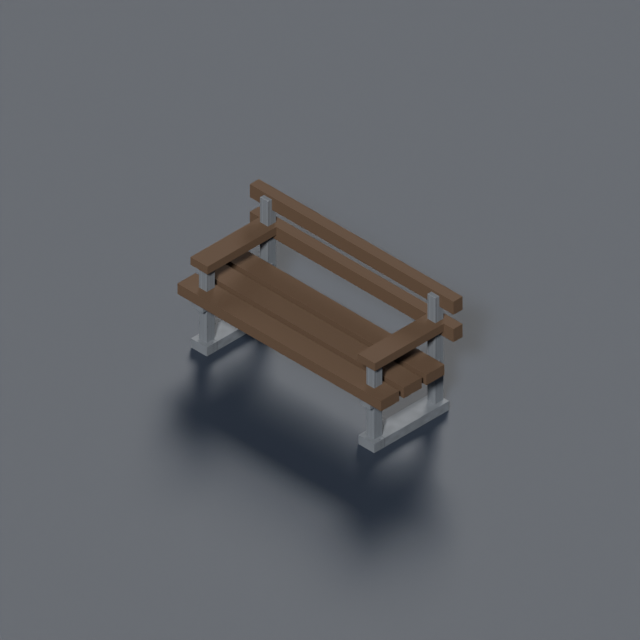
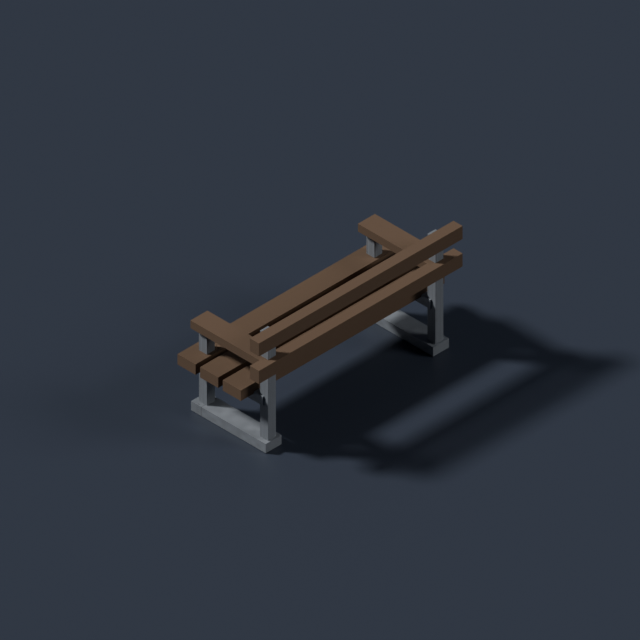
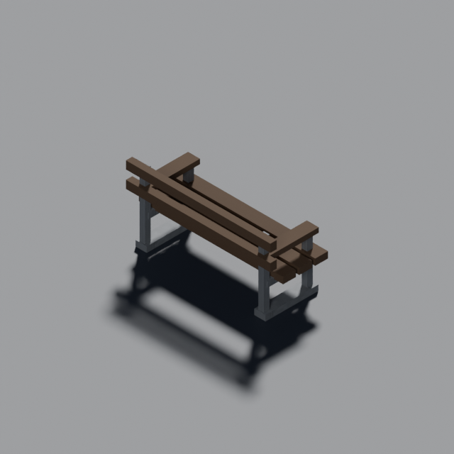

# Outdoor bench for building-use arrangements (#960)

One ordinary slatted timber bench on open metal supports, requested by MapGen for shared gardens and workplace entrances. The seat and back read as seating; there is no workshop shelf or storage payload. Existing environmental palette/atlas tokens supply the timber and metal.

[Contract before modelling](https://github.com/BenjaminBenetti/tut/issues/960#issuecomment-5594726548): model `prop.bench`, occupied footprint 1×1 tile, actual envelope **0.90 X × 0.36 Z × 0.45 Y**, feet-plane base-centre pivot, long axis X. Seated users face **+Z at rotation 0**, with the back on −Z. Seat height 0.23. One tile is two metres, so this is a 1.8 m bench with a 0.46 m seat and 0.90 m back.

The three final Blender-loop renders were opened:

| 45° | 135° | 225° |
| --- | --- | --- |
|  |  |  |

[Validation](validation.json): **180 triangles, 14,932 bytes, two watertight material primitives**, exact feet at Y=0, all geometry inside the declared tile and envelope. Joining the slats/supports by material keeps two instanced parts rather than fifteen. The source is `tools/art/models/prop-bench.py`; the JSON and TypeScript manifests register the real GLB, and `propModel("bench")` supplies the graphics consumer.

```sh
blender -b --python-exit-code 1 --python tools/art/make_model.py -- \
  --script tools/art/models/prop-bench.py --id prop.bench \
  --category props --file prop-bench.glb --quality final --max-triangles 300
art-python tools/art/validate_glb.py public/assets/models/props/prop-bench.glb \
  --max-triangles 300 --max-bytes 61440
```

MapGen owns the LOW-cover, non-opaque ground definition and use-specific placement, including entrance/route clearance and rotation into the garden. [The registry boundary is explicit](https://github.com/BenjaminBenetti/tut/issues/960#issuecomment-5594761887): adding a LOW ground definition to the old generic yard selector would reroll those yards before the arrangement repair. This asset supplies the forward graphics mapping while MapGen registers the kind with the new selector. No generator or map definition changes in this PR; existing maps receive no new prop until that integration. Final generated-context evidence belongs to MapGen's remaining #960 work; this asset alone does not close the issue.

Validation: typecheck, full lint/format, build and all 2,268 unit tests pass (one existing skip). The first test attempt from the detached `.git` worktree passed 2,001 tests but could not resolve the 28 DOM test modules; the complete run from the primary checkout passed with unchanged game code. The manifest sync, real-GLB checks and model table/resolver tests are included.
