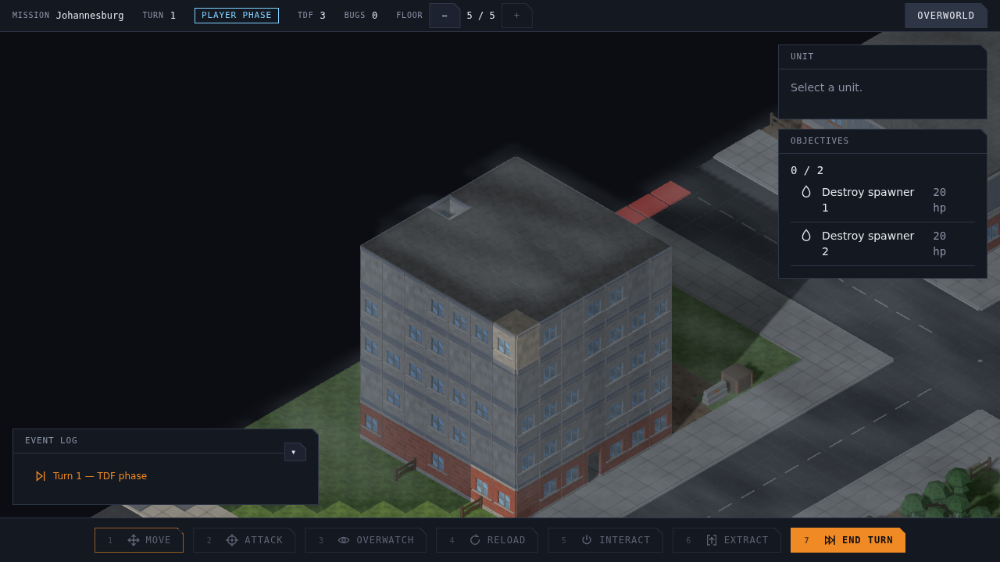
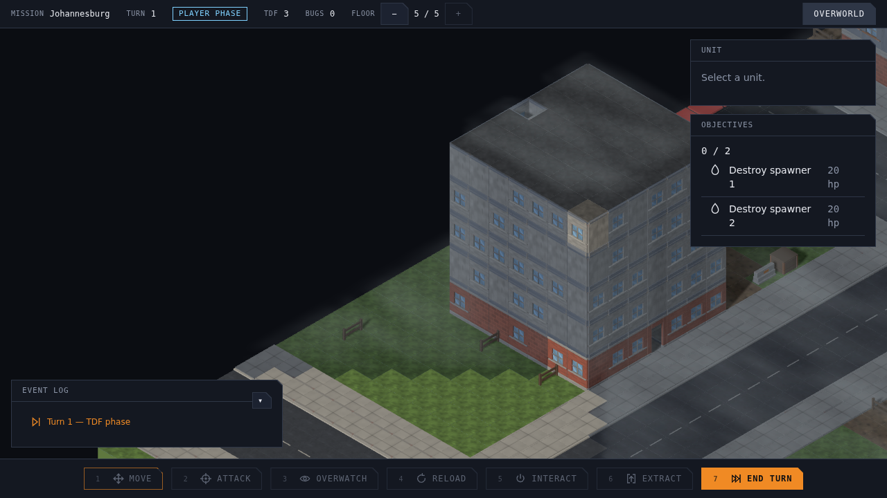
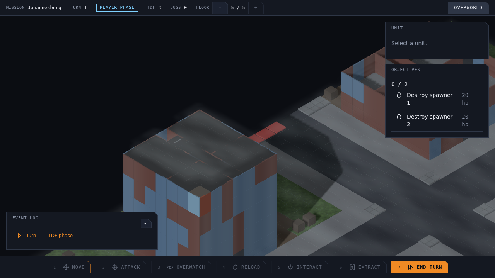
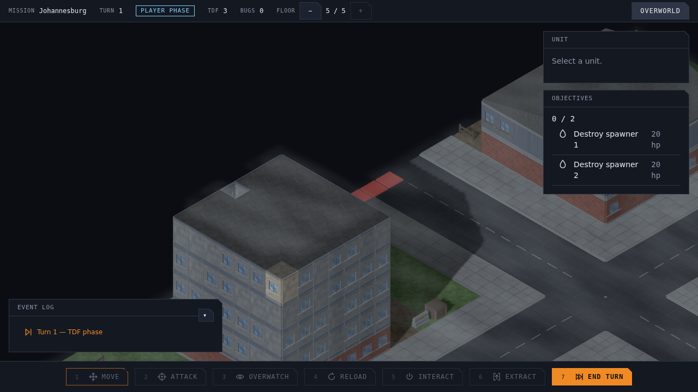
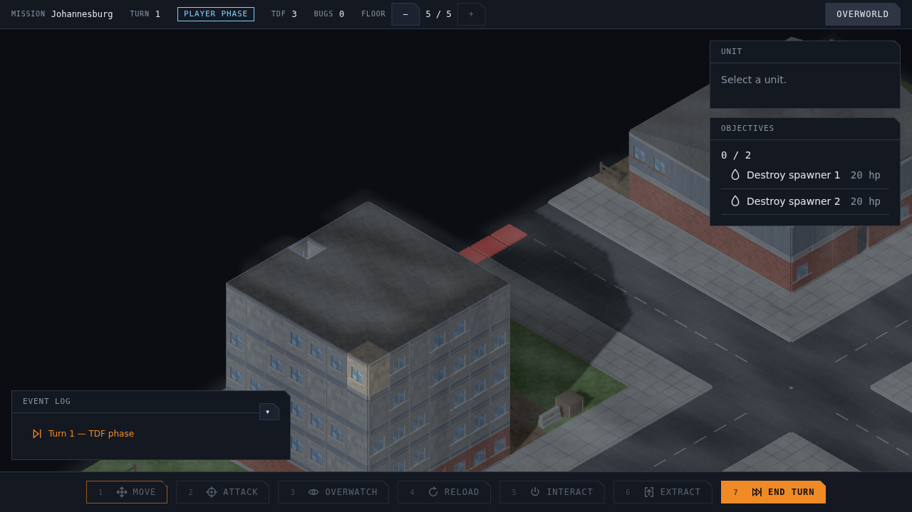
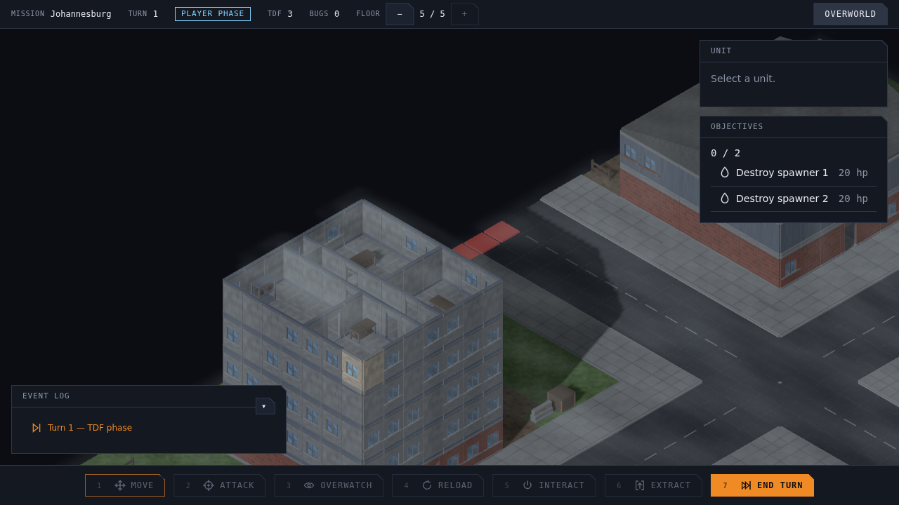

# Capture reproducibility — #996

Two harness causes were measured before changing behavior: browser-delivered taps can
span rendered frames and acquire continuous pan; the unit-count marker can
precede map-art loading. A later full-frame check also caught the top-focus roof regression described below.

## Diagnosis on main `5cead6e`

The original seed-4242 spec was instrumented to record actual DOM key events,
camera state and completion of the existing map/unit promises. Two runs changed
41.807% / 38.183% / 34.682% of pixels (top / one-down / ground). The calibration
`s` lasted 0.5 ms versus 1054.0 ms. Final camera target z was
23.72722988577358 versus 30.3636738519611, stationary during both captures.
`CameraInputController` adds a fixed tap on keydown and continuous pan on any
intervening frames. The rig does not ease, despite the old spec comments.

| Same code, same requested shot | First run | Second run |
|---|---|---|
| Original timed taps |  |  |
| One camera, real map response held/released across a no-op |  |  |

Initial units were ready at 1906.8 / 2465.2 ms, map+units at 1991.5 / 2588.2 ms;
first shots began at 3297.6 / 4870.8 ms. Assets were complete in both original
runs, so they do not explain that camera drift. Both original within-run no-op
pairs matched here. Separately holding `city-road-straight.glb` until after the
first shot reproduced **31.594% changed pixels** across a no-op with exactly the
same camera. This is a controlled loading race, not a claim that it occurred in
the original two runs. All percentages compare decoded RGBA pixels, not sizes.

## A real no-op regression at the integrated head

After #978 merged, candidate `f6d88ab` failed the full top/no-op capture despite
stable input and complete assets: 45,027 pixels (4.886%) changed, all on the
tallest roof. `groupCutFor()` treated an undefined cut as show-everything, but
`hiddenByCut()` still compared the roof's storey (5) with the top focus (4).
Initial attachment had no applied focus, so applying the unchanged top focus
removed the roof. The existing unit fixture had floors but no roof.

| Initial top | Same top focus applied |
|---|---|
|  |  |

The instance filter now honors the same undefined-cut contract as the group
filter. The repaired unit regression includes a roof above the final interior
floor and checks initial top, cut, and restored top. The browser control now
frames that roof; the earlier deploy-zone framing missed it. This is the one
runtime rendering correction in the PR, distinct from capture reproducibility.

## Fix and automated control

`capture-frame.helper.ts` dispatches keydown and keyup in one browser task through
the existing DOM input handler, then waits for a drawn frame. The new
`data-tactical-ready` marker follows the existing map+unit promises and clears on
release; both affected specs await it. No arbitrary settling delay, renderer
freeze, image masking or pixel tolerance is used. Normal input tests still use
Playwright's keyboard; held-key gameplay is unchanged.

The browser regression independently mounts two missions, captures a top/no-op
pair and a visibly panned view, and compares PNG buffers exactly. A real camera
move must change the image. It retains PNGs in Playwright artifacts. A separate
regression holds the map response after units arrive and checks readiness.
Delaying one keyup by two rendered frames makes the equality assertion fail;
publishing readiness before the map promise makes the readiness assertion fail.
The equality test has two ordinary test-time allowances for its two full mounts.

## Frames at the candidate

The repeated frames and hashes below are generated from the candidate code.
The old #961 and #978 accepted images remain historical evidence.

Reproduce each capture twice on one checkout, with separate output prefixes:

```sh
for run in 0 1; do
  CAPTURE=1 LAYER_FRAMES="docs/design/diagnostics/996/repeat-$run/layer" \
    pnpm exec playwright test e2e/layer-control-screenshot.spec.ts --workers=1 --timeout=120000
  CAPTURE=1 LAYER_FRAME="docs/design/diagnostics/996/repeat-$run/hillside.png" \
    pnpm exec playwright test e2e/layer-cut-hillside-screenshot.spec.ts --workers=1 --timeout=120000
done
```

[Exact frame proof](proof.json) records source commits, hashes and equality for
both runs and each no-op pair. The frame files are ordinary unmodified browser
screenshots. No-op equality is also asserted inside the layer-control spec.

## Reach of the defect

Two runs of each requested representative recipe were byte-identical:

| Control | Current repetitions | Historical comparison |
|---|---|---|
| #917 waterfront boundary, Map Lab | Exact | Exact match to committed #917 control |
| #943 flat empty/closed roof, art preview | Exact | Exact match to committed #943 control |
| #751 victory, game-over capture | Exact | Exact match to committed #751 control |
| #982 pitched yaw-0 hover, overlap, open ground | All three exact | Later rural fences change the historic image |

The Map Lab recipe is `capture-fence-controls.mjs` with
`CAPTURE_ONLY=04-waterfront-boundary-control`. The #943 recipe is the art-preview
URL `?roof=flat&units=0&ghost=0&yaw=0`, 1200×950, waiting for `data-ready`.
The #982 controls use the corresponding three recipes from
`capture-pointer-cutaway.mjs`, including its live pointer-strength checks.
#751 uses `capture-game-over.mjs`. Only output locations were redirected; the
capture routines were not given additional settling waits. Defeat also repeated
exactly. This establishes the measured reach, not universal renderer determinism.

The #982 matrix records verified runtime `bc2f47f`. Rural fences merged in
`07b40cd` (#917/#973) afterwards. Current open-ground and hover frames differ from
the historical PNGs by 3.292%, showing the new fence runs. That is a deterministic
map change, distinct from run-to-run drift; the older PNGs are not refreshed here.
