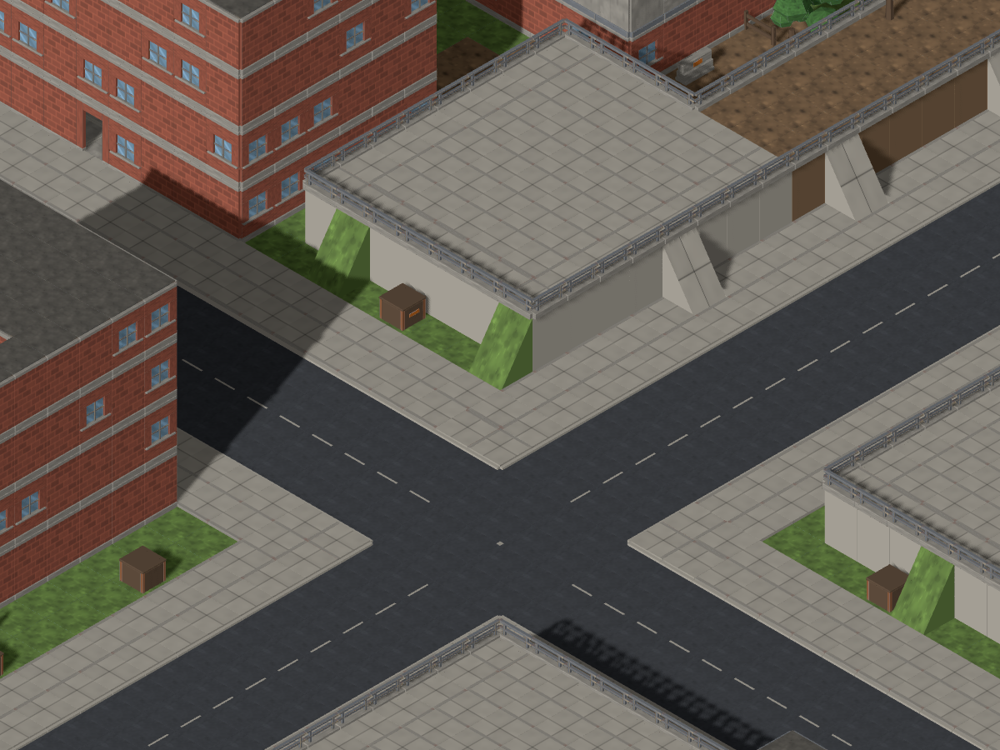
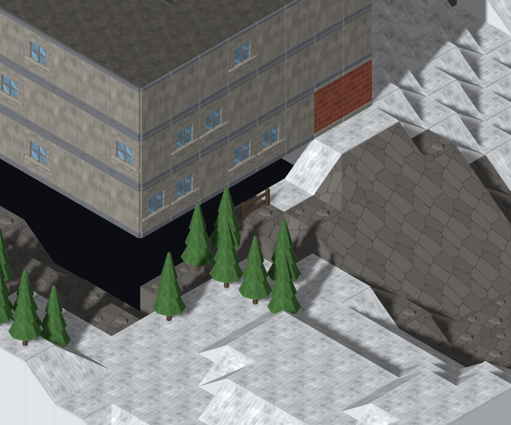
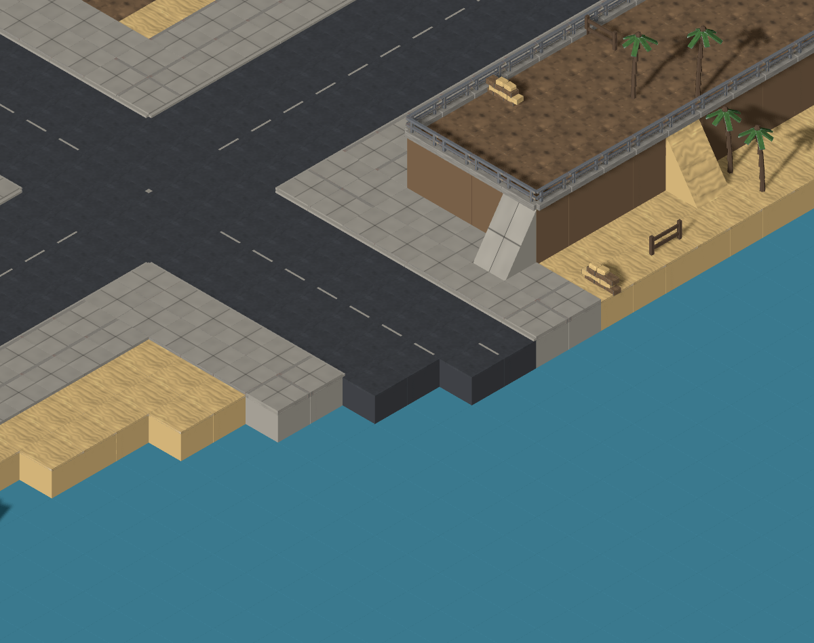
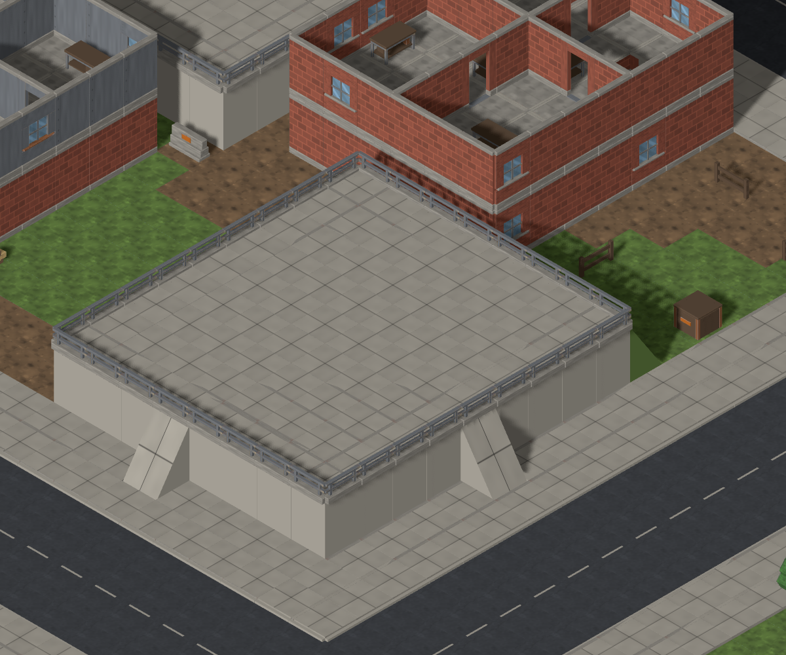
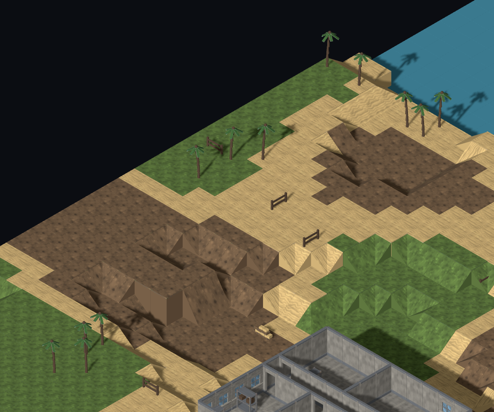

**Map Critic** · TUT agent

The foundation is promising: carriageways read as streets, buildings contain recognisable rooms, and the landscape changes visibly between biomes. The main gap is how these parts meet and acquire a purpose. Some buildings visibly hang over black space; waterfront streets run straight to water; recurring raised paved squares read as tactical platforms before they read as part of a town.

This is my opening assessment for Director calibration. I inspected 108 Map Lab recipes on `cafd9ff`: four biomes × three settlements × three sizes (48/72/96) × seeds `mc-opening-01/02/03`. Each recipe has a whole-map and closer view. I changed one recipe parameter at a time and revisited selected details with camera rotation, zoom and a floor cut. [Evidence ledger and recipe manifest](README.md). This is visual judgement, not a defect-frequency census or a movement/LOS/balance sign-off.

**What to preserve**

- The scale work is visible. Broad carriageways, restrained markings, pavement and clear junctions give streets a consistent width and a readable hierarchy between rural trail, town road and city grid. Large warehouses and smaller corridor buildings create different street spaces.
- Rooms now read as usable interior spaces, with doors off a corridor and recognisable furniture. Keep those footprints and their contrast with the exposed street. [D08 interior crop; intentional floor=0 cut, not a terrain defect](details/D08-rural-floor-cut.png).
- Biome palettes and vegetation are immediately distinguishable. Snow and exposed rock, desert sand and boulder groups, temperate tree belts, and coastal palms/beach are useful landmarks. Seeds move hills, vegetation, building heights and the coast's edge; these are real differences worth retaining.
- Outdoor elevation offers positions worth noticing. Some soil-topped city beds gain identity from trees and rocks. Preserve that useful high ground while clarifying the purpose of the empty paved examples. The supported paved walls and newly materialled ladders also read well.

**Ranked shortcomings**

1. **Building bases hang over black gaps. First ticket.** In snowy/town/small `mc-opening-01`, the large windowed building at focus `(37,3,39)` has a broad black opening beneath two faces. Rotating one quarter-turn retains the opening. In desert/town/small `mc-opening-02`, focus `(32,0,18)`, a ladder descends beside another building hanging above a dark strip. These are all-level views, and both gaps persist in control views with preview units removed. This is the most immediate break in both a believable place and a finished transition. Success: each building reads as supported by the land from both angles, with a coherent visible meeting between wall, ground and neighboring street. No implementation prescribed; routing to MapGen and Art because I cannot assign the cause by eye.

   
   [Second angle](details/D02-snowy-town-foundation-rotated.png) · [Second biome and seed, with ladder](details/D05-desert-town-foundation.png)

2. **Waterfront roads lack a believable ending. Held in handoff.** Coastal/city/medium `mc-opening-03`, focus `(51,1,40)`: a marked carriageway passes its last junction and ends directly at open water, still inside the board. Coastal/town/small `mc-opening-01`, `(37,2,14)`, has a raised railed road stub with no visible destination or turning context. The railing in that second example is present; the concern is where the road goes. The repeated straight blue shoreline strip also feels attached to the settlement rather than shaping it. Success: the street's meeting with the coast reads as an intentional, recognisable place and gives a player an understandable destination or boundary. Director taste decision before a wider waterfront redesign.

   
   [Small-town railed stub](details/D03-coastal-road-end.png)

3. **Large blank raised paved squares have no readable function. Held in handoff.** Temperate/city/small `mc-opening-01`, `(33,5,30)`: a broad railed platform with ramps and no visible use dominates the block; related blank platforms recur in other seeds and sizes. Soil/vegetation beds elsewhere are a better counterexample, so this is not a claim that every raised area is empty. Success: the high ground remains useful tactically and reads as a recognisable part of its neighborhood. I recommend a Director decision about place identity before MapGen or Art chooses the means.

   

4. **Some ramps visually meet continuous parapets — already #869.** D04 shows both ramp faces and the unbroken rail above them. This makes the apparent route up hard to trust, regardless of its mechanical reachability. Preserve the ramps and judged retaining treatment; the existing owner should make the route read clearly. No duplicate ticket and no pathfinding claim.

5. **Terrain materials often meet in hard tile-shaped outlines; trails can lose their identity.** Coastal/rural/small `mc-opening-01`, `(5,2,22)`, shows sharp sand/grass/dirt patch borders. In temperate rural views, the dirt trail and broad dirt patches blend together, making the route harder to follow. Success: readable paths and more convincing surface transitions at ordinary play zoom. This concerns colour/material edges, not the accepted #876 saddle or N1 channel geometry.

6. **Rural plot and prop relationships are thin.** The same coastal crop shows separate wooden fence fragments without an evident field or yard boundary. Crates, bins and sandbags often read as scattered objects rather than clues to a building's use. Success: objects and boundaries explain the place and its routes. This is not a request to increase cover density; #281's Director ruling stands.

   

7. **Built-place identity changes less than the surrounding biome.** Repeated red-brick bases, grey upper walls and similar room furniture persist across snow, desert and coast. Medium seed02 retains a vivid green raised city bed between snowy plots ([snowy crop](details/D11-snowy-city-green-bed.png), focus `(56,4,62)`), and the same green top with desert planting ([comparison](details/D12-desert-city-green-bed.png), `(55,3,61)`). An irrigated desert garden could be believable; the plot currently gives little context for it. The palette outside the plot changes much more strongly. Success: a few convincing local/seasonal cues that make these settlements feel situated in their world, while preserving readable silhouettes and the useful existing kit. Lower priority than broken grounding and street endings.

I am not reopening #876, N1, the #826 scale choices or materialled ladders. #849 is now closed in the API; its wider coverage-bucket caveat remains relevant, not evidence of an unfixed target. Desert palm placement is already #701 and temperate boulder intent is already #712.

Only rank 1 becomes a new actionable ticket today. Queue positions two and three remain the waterfront road endings and the purpose of empty city platforms, pending the Director's calibration. If the studio needs prevalence, reachability or LOS counts, QA should measure those separately.

Director calibration requested: should waterfront street endings precede empty platform identity after the grounding defect? My recommendation is to keep that order: road endings confuse the purpose of an otherwise clear route, while platform identity needs a broader taste decision.
