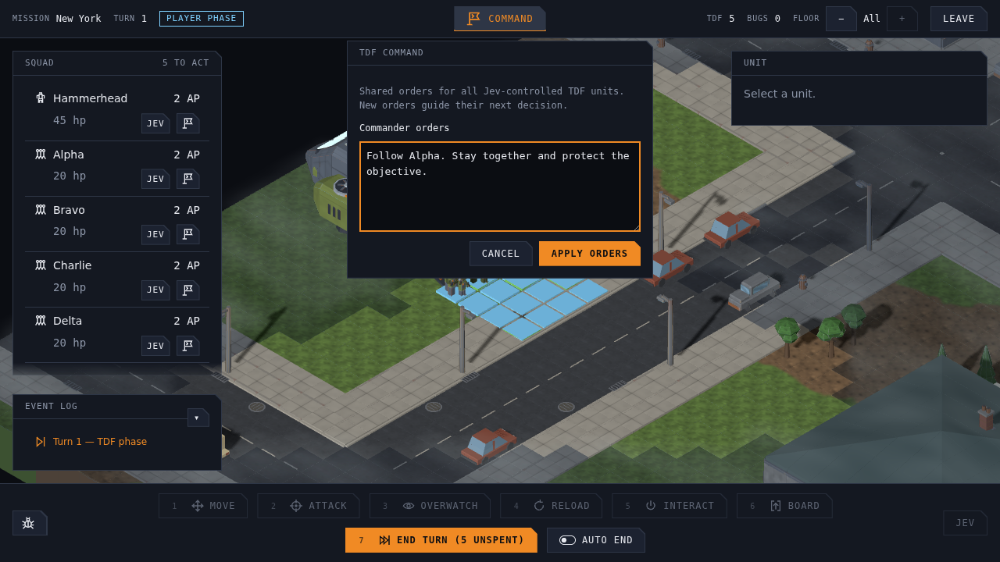
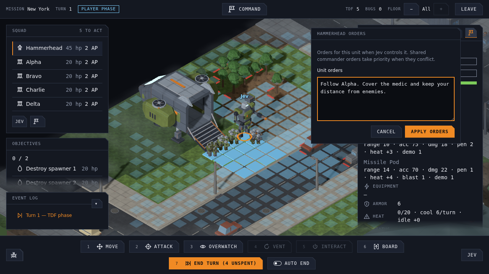
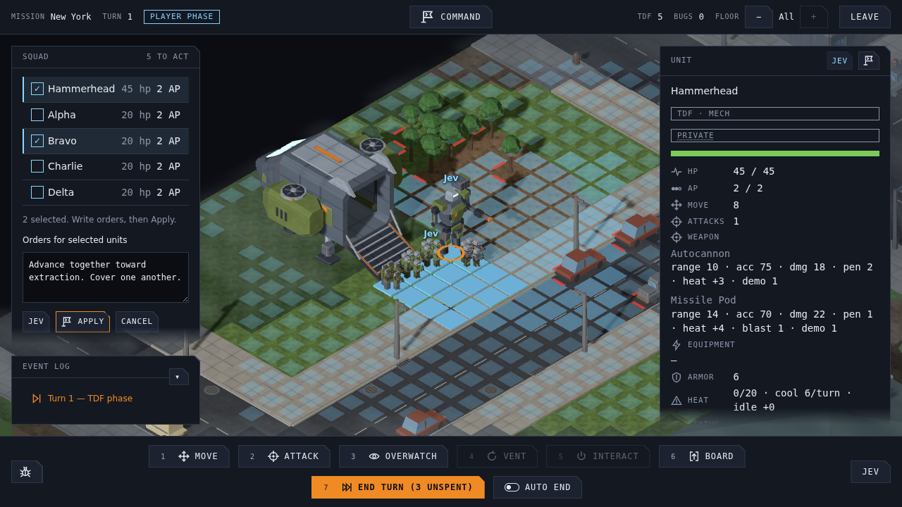
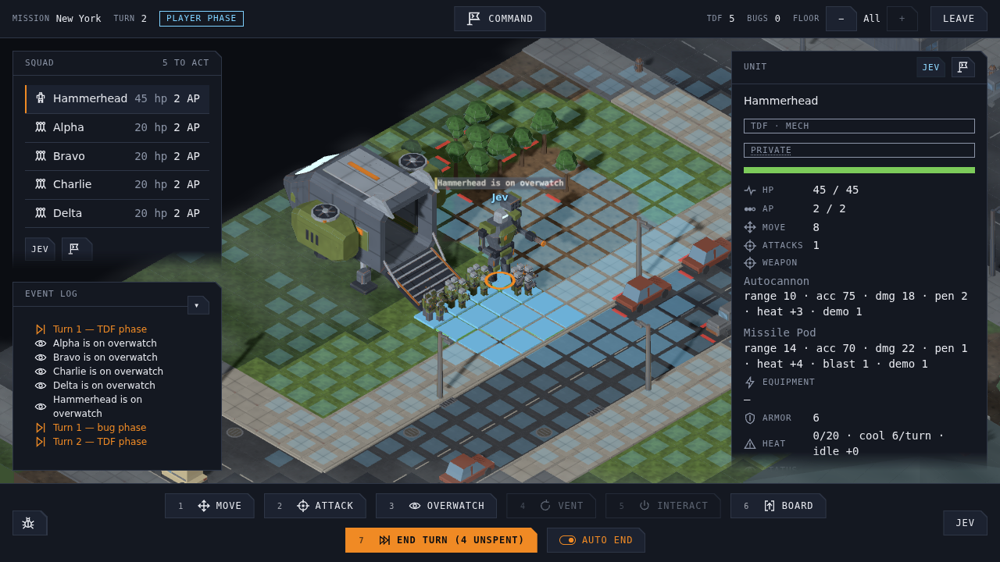

# Jev control and development inspector

Jev control is opt-in per tactical unit and uses **shared faction vision**. The entity's prompt describes its role and tactics; the faction commander prompt sets priorities and wins explicit conflicts. Model selection uses `jev-latest`; every raw response records the resolved model. See [ADR 0012](../adr/0012-jev-entity-control.md).

The [Jev AI approach](jev-ai.md) records the high-level decision design, starting with the movement approach validated in our evaluations.

## Run locally

Put the runtime secret in the repository root's ignored `.env`. There is no API-key field in the UI; only the relay reads the key:

```dotenv
JevKey=your-key
ALLOWED_ORIGINS=http://localhost:5173,http://localhost:4173
```

Start both services together:

```sh
./run.sh
```

Open `http://localhost:5173`. Ctrl+C stops both services; if either exits, the script stops the other too. Run `pnpm install` first on a fresh checkout.

Restart `./run.sh` after changing the key so the relay reloads it. A hosted relay receives `JevKey` as a container environment variable.

Alternatively, run these in separate terminals:

```sh
pnpm dev:relay
pnpm dev
```

Development defaults to `http://localhost:8080`. To use another relay, set `VITE_JEV_RELAY_URL` in `.env` and restart Vite. Never prefix the API key with `VITE_`.

## Give TDF orders

The **Command** flag button is centered in the tactical top bar and is available in normal gameplay, with no unit selection required. It opens a small editor for the shared TDF commander prompt. Write orders such as “Follow Alpha. Stay together and protect the objective,” then press **Apply orders**. Every Jev-controlled TDF unit receives those orders with its next decision. Clearing the field and applying removes the shared orders.

Orders are saved with the mission. Applying them costs no AP and preserves each unit's control setting and individual prompt, the bug faction's orders, and turn progress. A pending Jev response based on old orders is discarded before acting. Cancel, Escape or clicking outside dismisses unsaved edits. Typing and scrolling in the editor do not control the battlefield.



## Control individual units

Select a TDF unit to find its **Jev** toggle and icon-only **command flag** in the header of the right-hand unit panel. The squad list keeps compact, single-line rows with name, HP and AP. Jev lights blue when the selected unit is controlled by Jev; click again to return it to player control. Switching preserves its saved orders and costs no AP. Enabling requires an available Jev service; turning control off remains available.

The flag opens **Unit orders**, which edits only that entity's `entity_prompt`. Apply saves the text without changing its control setting or the faction orders. You can prepare orders before enabling Jev. Cancel, Escape, clicking outside or selecting another unit discards the draft. The editor stays outside the scrolling unit panel, preserves drafts across updates to the same unit, and keeps typing and scrolling out of the battlefield. Both settings persist with the mission. Enemy and autonomous turret cards show no player command controls.



## Control several units

The bottom of **Squad** has a **Jev** button and a **command flag**. Either starts a selection mode: compact squad rows become checkboxes, and the active button highlights and changes to **Apply**. Selecting rows in this mode leaves the battlefield selection and camera alone.

- **Jev:** currently controlled units start checked. Change the selection and press **Apply**. Checked units use Jev; unchecked units return to player control. Each unit keeps its own saved orders. An empty selection releases everyone.
- **Command flag:** write orders, check the recipients, then press **Apply**. The same text replaces each selected unit's `entity_prompt` without changing control settings or faction orders. Clearing the field clears their individual orders.

Changes remain drafts until Apply. **Cancel**, **Escape**, or switching modes discards the draft. Jev decisions and Auto end pause while either selection mode is open, then resume after Apply or Cancel; opening the development inspector also keeps that pause held until both editors close. Applying costs no AP, and the settings persist with the mission.



## Inspect a decision


1. Launch a tactical mission and select a TDF unit, or select/target a visible bug so its card is shown.
2. Press **Jev** in the bottom bar. Automatic Jev actions pause while the panel is open.
3. Inspect the exact **State** and **Questions** JSON. Entity and faction prompt fields are editable drafts.
4. Press **Evaluate current state**. This sends only the first question, then pauses so you can inspect its answer, probabilities, confidence, raw response, request ID and elapsed time. Preview never executes an action or saves draft prompts.
5. Press **Evaluate next step** to send exactly one follow-up. Use the **Jev evaluation step** selector to review any completed question and its matching response, or inspect the next question before sending it. Large target lists may need an intermediate group selection. Every step retains the original captured state and prompts.
6. Change a prompt and press **Re-run captured state** to start a new evaluation on the same battlefield. It also pauses after the first question. **Refresh state** captures the latest battlefield without making a request.
7. Use **History** for actual automatic decisions or earlier previews. Old snapshots remain labelled as old. Each exchange is labelled `action-type`, `movement-target`, `movement-distance`, `action-group`, or `action`, with its request size in bytes and upstream token usage when supplied.
8. **Copy request & output** or **Export JSON** provides the whole trace, including every exchange and any unsent follow-up, without credentials.
9. To enable autonomous control, check **Jev controls this entity**, press **Save control & prompts**, then close the inspector. Uncheck and save to restore normal control. Saving the commander prompt changes orders for the entire selected faction in this mission.

The actor and observed entities carry `name` (the roster identity, such as `Alpha` or `Hammerhead`). Entity `capability_ref` points into shared `capabilities` for its type, weapons, equipment IDs and other static facts; equipment IDs resolve through `equipment_definitions`. Current HP and known remaining resources stay on each entity. The actor keeps its full capabilities inline. Names match the game's unit labels, so an order such as “follow Alpha” can reference that entity's position and capabilities. Units without a roster identity use their template name. Fog-of-war filtering still applies to every entity.

Jev first chooses a **specific available action** from the entity's current loadout: for example, **Attack with Carbine**, **Attack with Autocannon**, **Use Grenade**, **Use Medkit**, move or overwatch. Each weapon and usable item has its own top-level choice, with its name and capability. When needed, a follow-up selects only targets or tiles for that chosen weapon or item. Weapon fire and immediate explosives such as grenades offer only visible hostile entities (units or nests); AOE blasts are centered on the selected entity, with friendly-fire information retained. Empty-ground shots are omitted. Healing, deployables and delayed charges retain their placement tiles. Explosive items include shared hit/damage and blast-victim previews; healing choices list beneficiaries, HP restored and resulting HP. Large enemy footprints supply an alternate legal aim tile when their anchor is out of reach. Preview footprint tile lists stay local. A single concrete action, such as overwatch, executes without a redundant target question. The menu is rebuilt from currently legal actions, so depleted items and weapons without a legal shot disappear. Large lists narrow through region or target groups first, keeping all legal candidates reachable. Detail pages are bounded by both option count and description size.

There is no `finish` choice. Movement offers named entities and objectives, visible harvestable carcasses, radar contacts, unconfirmed last-seen positions, `move_to_extraction`, `move_north`, `move_east`, `move_south`, `move_west`, and `move_away_from_enemies`. The game prepares each route using the full map layout and faction-known units, and caps the proposed movement at **one AP**. Extraction selects the cheapest reachable tile inside the zone; occupied tiles are skipped. A TDF extraction move explicitly requests withdrawal. If it reaches the zone using the last AP, a saved continuation executes the normal zero-AP Extract command after the walk animation finishes, without calling Jev again. With AP remaining, Jev chooses Extract separately. Ordinary movement into the zone and units already standing there do not authorize automatic extraction; disabling Jev cancels a pending withdrawal. End Turn and save/resume retain the continuation until it completes. Bugs may approach the zone but cannot extract. Carcass endpoints use the injected harvest handler to check capability and range; arrival does not harvest. Radar and historical sightings lead to investigation positions and never become visible attack targets. Radar choices contain coordinates and contact kind only, with no hidden entity ID or metadata. Historical positions already in faction sight are omitted. Unavailable or already-reached destinations are omitted. Retreat maximizes distance from the nearest known hostile footprint; compass directions use north = −z, east = +x, south = +z, west = −x. After an action, automatic play captures the updated position, vision and remaining AP and asks again while the entity can still act. Other actions retain their normal game costs. Overwatch costs **1 AP** and ends the actor's activation, forfeiting any remaining AP. Attacks likewise report their base AP cost separately from whether they end the activation.

A Jev-controlled TDF unit has light-blue **Jev** text above its head, visible without holding Shift. Tab skips it. It waits while manual units still have AP, then takes its actions once they are spent. Pressing **End turn** starts Jev's remaining activations immediately and delays the bug phase until they finish; repeated End Turn and manual orders are blocked while that request is pending. Saving and loading during this interval resumes unfinished activations.

**Auto end**, beside End turn, optionally advances when manual units have spent their AP and Jev has finished its remaining activations, including queued extraction. It waits for all action animations and the bug-phase banner to settle. The toggle starts off when entering the tactical screen, stays enabled across turns, and can be switched off during playback. With it off, spent turns remain open. The development inspector and Squad selection modes pause automatic turn ending as well as Jev decisions.



Tile maps and exhaustive movement tile menus are no longer sent to Jev. Pathfinding stays in the game and uses the full current layout, including floors, walls, stairs, ladders and terrain costs outside faction vision. This matches the map geometry visible through fog. Occupancy and entity destinations use faction-known units; hidden enemies do not influence route selection. An approach to an entity on another floor follows the connectors to that floor: standing at the opposite end of its staircase is not arrival. Unreachable destinations are omitted. The authoritative command handler validates again before moving and can refuse a route blocked by an unseen unit.

After choosing a movement target, a separate **Score** request sends the full state plus `selected_movement`: intent, target identity/location, available movement points, proposed endpoint and the short one-AP path. Its five levels are minimal, quarter, half, three quarters and full. The game divides the returned score by four, scales the route's terrain cost, and **rounds up to the next legal stopping point**, capped at the proposed move. At least one step is taken; directional moves and retreat only stop where they satisfy that intent. Short movement still costs one AP. Score confidence is shown for inspection, not used as a distance multiplier.

The inspector pauses independently before the destination and distance questions. No move is ready to execute until distance evaluation succeeds; output includes the normalized fraction, rounded cost, endpoint and actual command. The same three stages run automatically in gameplay. Automatic decisions wait for each scene update and the phase banner to settle before continuing. This includes ordinary bugs in a mixed Jev phase, the final bug animation before returning control, and TDF decisions after the bug phase.

The `gameplay` block explains turns, AP/HP, movement, combat, knowledge and objectives. Every top-level option has contextual `instructions` and actual `ap_costs`; every follow-up repeats the selected ability's rules and weapon/item capability. Movement explains that a short move still costs one AP and loses unused range; the final decision records actual `movement_points` and `path_steps`. This allowance is taken from the actor's actual movement stat; terrain-weighted costs come from the ordinary path search. Other instructions distinguish healing, immediate and delayed explosives, radar, turrets, overwatch and mech abilities, including actions that end the activation. The inspector shows these exact inputs at every step.

An entity outside its faction's phase, out of AP or dead cannot act; the captured state offers no actions and no request is sent. Evaluation is also skipped when there are no available actions. History still shows the entity's last real decision. To evaluate a bug's decision while it can act, enable it and inspect its automatic trace, or pause at its phase through development tools. Turrets and other passive equipment retain their existing automatic abilities; attaching instructions does not grant them new AP or movement.

The inspector is absent from production UI. The runtime remains wired for explicitly configured mission state. No URL or no key leaves ordinary gameplay usable, and service failures produce visible traces and bounded fallback behavior.

## Container and release

The repository's release workflow publishes both architectures (`linux/amd64`, `linux/arm64`) after checks pass:

```text
ghcr.io/benjaminbenetti/tut-jev-relay:vX.Y.Z
ghcr.io/benjaminbenetti/tut-jev-relay:sha-<commit>
```

Build or run the relay:

```sh
docker build -f relay/Dockerfile -t tut-jev-relay .
docker run --rm -p 8080:8080 --env-file .env tut-jev-relay
```

The runtime exposes `GET /health` and `POST /v1/systemone`. Supply `JevKey` and comma-separated `ALLOWED_ORIGINS`; the default origin is localhost:5173. Origin values contain no URL path. For the published game include `https://benjaminbenetti.github.io`. Publish the service behind HTTPS, then set repository Actions variable `JEV_RELAY_URL` to that public base URL. The next frontend release bakes it in; it appends `/v1/systemone` itself.

The default port is 8080 (`PORT` overrides it). The relay allows at most 512 KiB per request, eight requests in flight and 120 requests per minute per process. Its upstream timeout is 15 seconds; the browser's is 20 seconds. It forwards only the fixed TypeSafe endpoint and never forwards browser authentication headers. Request logs include the actor ID/name, faction, phase, turn and question types alongside request ID, status and duration. This distinguishes a bug decision from a TDF decision; prompts and battlefield state are not logged. Bugs use their ordinary AI unless explicitly enabled in mission Jev settings; saving prompts alone does not enable them. CORS is browser access policy, not authentication: this deployment has no login, so keep the request budget appropriate to the host. A publicly distributed client cannot keep a shared relay password secret.

If the GHCR package is private, the host needs a package-read credential to pull it. No TypeSafe credential is needed to build or publish the image.

## Validation

```sh
pnpm typecheck
pnpm lint
pnpm test
pnpm test:relay
pnpm build
pnpm test:e2e
```

Focused coverage lives in `jev-movement.test.ts` (named destinations, walls, elevation, footprints, compass/retreat intent and terrain-weighted round-up scaling), `jev-destinations.test.ts` (every destination source, harvest approach/execution, intel privacy and upstairs radar investigation), `jev-request.test.ts` (knowledge boundaries and contextual weapon/item choices), `jev-controller.test.ts` (all three movement stages, failures, fresh state after each AP, opt-in, mixed turns, stale responses and resume), `jev-client.test.ts` (Choice/Score validation), `relay/server.test.mjs` (real HTTP relay), `e2e/jev-inspector.spec.ts` (stepped inspection and TDF turn scheduling in Chromium), `e2e/unit-orders.spec.ts` (unit-card toggles, individual orders, input isolation and save/resume), and `e2e/squad-orders.spec.ts` (bulk selection, Jev control, shared unit orders, cancellation and persistence). The earlier ASCII projection remains available to the evaluation tools through `navigation-snapshot.mjs`; it is not sent during gameplay.

A live integration smoke test used the fully visible `holdout-1-small-named-ally` scene with 100 stationary entities. Through the actual relay and browser transport code, Jev selected `move`, the correct named ally, and distance score **3.11/4**. The game rounded the five-point route up to four tiles and executed it for exactly one AP. The three requests used **17,705 / 20,360 / 17,098 input tokens**. This validates one complete decision; it does not establish full-mission performance or solve navigation under fog.

The earlier [real-map navigation evaluations](../experiments/jev-navigation/README.md) tested the destination-selection approach across six fully visible 48/72/96 maps and four order types. Shared capability definitions reached 24/24 targets with optimal AP; inline metadata reached 19/24, failing five equipment-based orders. The shared format averaged 17,157 input tokens versus 28,235 inline. Those runs used full-length moves, stationary entities and no combat or fog. The viewer preserves their exact requests and outcomes; the [AI approach](jev-ai.md) records the separate experimental distance-scoring result.

## Extending actions and loadouts

- **New weapons and usable items:** put named weapons and equipment IDs in the entity's normal loadout/catalogue. Jev enumerates all of them for either faction, checks the normal rules and rebuilds choices after each action. Bug species support optional `weapons` and `equipment` loadouts through `bugUnit`; species without them retain their legacy attack.
- **New tactical commands:** `JevActionCommand` derives from `TacticalCommandMap`, with explicit exclusions for mission lifecycle, controller, configuration and debug commands. Typechecking requires a provider in `jev-actions.ts`, owner-field registration in `jev-control.ts`, and gameplay instructions in `jev-instructions.ts`. Reuse authoritative validators/previews in the provider; never duplicate combat or targeting rules.
- **New equipment kinds:** define targeting and preview policy in `jev-equipment.ts` and explain the mechanic in `jev-instructions.ts`. Both tables are exhaustive over `EquipmentKind`; item IDs require no additions there. Placement range comes from the same service as the player overlay, including self-target tiles when discovering actions.
- **New destination sources:** add the faction-filtered source to `JevDestinationSources` and `jevDestinations`. Observation and planning consume the same projection. The movement provider registry and destination coverage test are exhaustive over its keys, so adding a source requires both routing and a representative test. Reuse normal interaction checks for arrival rules; position-only intel must never disclose hidden entity data or create attack targets.
- **New mech actions:** add the shared target shape and AP cost to `MECH_ACTION_DEFINITIONS`, implement normal validation/execution, and describe the mechanic in the exhaustive instructions table. Jev discovers targets from that shared definition.

Capability tests inject new weapon/item IDs on both factions, validate and execute choices through normal handlers, and cover the species-to-template path. Inspector cancellations discard their responses without spending AP or counting against the activation's action limit; closing the inspector resumes with a fresh decision.
