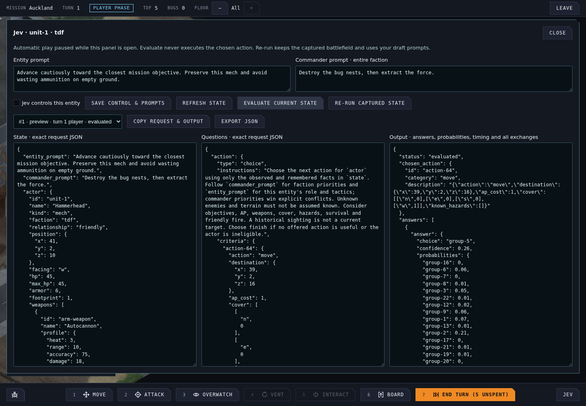

# Jev control and development inspector

Jev control is opt-in per tactical unit and uses **shared faction vision**. The entity's prompt describes its role and tactics; the faction commander prompt sets priorities and wins explicit conflicts. Model selection uses `jev-latest`; every raw response records the resolved model. See [ADR 0012](../adr/0012-jev-entity-control.md).

## Run locally

Put the runtime secret in the repository root's ignored `.env`. There is no API-key field in the UI; only the relay reads the key:

```dotenv
JevKey=your-key
ALLOWED_ORIGINS=http://localhost:5173,http://localhost:4173
```

Start both services together:

```sh
./run.sh
```

Open `http://localhost:5173`. Ctrl+C stops both services; if either exits, the script stops the other too. Run `pnpm install` first on a fresh checkout.

Restart `./run.sh` after changing the key so the relay reloads it. A hosted relay receives `JevKey` as a container environment variable.

Alternatively, run these in separate terminals:

```sh
pnpm dev:relay
pnpm dev
```

Development defaults to `http://localhost:8080`. To use another relay, set `VITE_JEV_RELAY_URL` in `.env` and restart Vite. Never prefix the API key with `VITE_`.

## Inspect a decision



1. Launch a tactical mission and select a TDF unit, or select/target a visible bug so its card is shown.
2. Press **Jev** in the bottom bar. Automatic Jev actions pause while the panel is open.
3. Inspect the exact **State** and **Questions** JSON. Entity and faction prompt fields are editable drafts.
4. Press **Evaluate current state**. This calls the real relay and records all answers, probabilities, confidence, raw response, request ID and elapsed time. It does not execute the selected action or save draft prompts.
5. Change a prompt and press **Re-run captured state** to compare decisions on the same battlefield. **Refresh state** captures the latest battlefield without making a request.
6. Use **History** for actual automatic decisions or earlier previews. Old snapshots remain labelled as old. State/Questions initially show the action-type question, then the latest exchange. Output/export retains every exchange, labelled `action-type`, `action-group`, or `action`, with its request size in bytes and upstream token usage when supplied.
7. **Copy request & output** or **Export JSON** provides a reproducible diagnostic artifact without credentials.
8. To enable autonomous control, check **Jev controls this entity**, press **Save control & prompts**, then close the inspector. Uncheck and save to restore normal control. Saving the commander prompt changes orders for the entire selected faction in this mission.

The actor and observed entities carry both `name` (the roster identity, such as `Alpha` or `Hammerhead`) and `type` (such as `Rifle Squad`, `Mech`, or a bug species). Names match the game's unit labels, so an order such as “follow Alpha” can reference that entity's position and capabilities. Units without a roster identity use their template name. Fog-of-war filtering still applies to every entity.

Jev first chooses the best **type of action**, such as move, attack or overwatch. A follow-up request selects a concrete action of **only that type**. Large families narrow through region or target groups first, keeping all legal candidates reachable without sending every tile/action combination at once. Detail pages are bounded by both option count and description size.

A Jev-controlled TDF unit has light-blue **Jev** text above its head, visible without holding Shift. Tab skips it. It waits while manual units still have AP, then takes its actions once they are spent. Pressing **End turn** starts Jev's remaining activations immediately and delays the bug phase until they finish; repeated End Turn and manual orders are blocked while that request is pending. Saving and loading during this interval resumes unfinished activations. When manual AP runs out without an explicit End Turn, Jev acts but leaves the player phase open afterward.

Navigation's `passMask` is a bitmask: `0` blocks both movement classes, `1` permits infantry, `2` permits mechs, and `3` (`1 | 2`) permits both. The state includes the complete legend and each entity's `movement_class`; bugs can use the infantry movement class too. The same mask applies to connector `pass` values. Occupancy, walls and other movement rules still determine legal paths.

An entity outside its faction's phase, out of AP or dead cannot act; the captured state says so and offers finish. History still shows its last real decision. To evaluate a bug's decision while it can act, enable it and inspect its automatic trace, or pause at its phase through development tools. Turrets and other passive equipment retain their existing automatic abilities; attaching instructions does not grant them new AP or movement.

The inspector is absent from production UI. The runtime remains wired for explicitly configured mission state. No URL or no key leaves ordinary gameplay usable, and service failures produce visible traces and bounded fallback behavior.

## Container and release

The repository's release workflow publishes both architectures (`linux/amd64`, `linux/arm64`) after checks pass:

```text
ghcr.io/benjaminbenetti/tut-jev-relay:vX.Y.Z
ghcr.io/benjaminbenetti/tut-jev-relay:sha-<commit>
```

Build or run the relay:

```sh
docker build -f relay/Dockerfile -t tut-jev-relay .
docker run --rm -p 8080:8080 --env-file .env tut-jev-relay
```

The runtime exposes `GET /health` and `POST /v1/systemone`. Supply `JevKey` and comma-separated `ALLOWED_ORIGINS`; the default origin is localhost:5173. Origin values contain no URL path. For the published game include `https://benjaminbenetti.github.io`. Publish the service behind HTTPS, then set repository Actions variable `JEV_RELAY_URL` to that public base URL. The next frontend release bakes it in; it appends `/v1/systemone` itself.

The default port is 8080 (`PORT` overrides it). The relay allows at most 512 KiB per request, eight requests in flight and 120 requests per minute per process. Its upstream timeout is 15 seconds; the browser's is 20 seconds. It forwards only the fixed TypeSafe endpoint and never forwards browser authentication headers. CORS is browser access policy, not authentication: this deployment has no login, so keep the request budget appropriate to the host. A publicly distributed client cannot keep a shared relay password secret.

If the GHCR package is private, the host needs a package-read credential to pull it. No TypeSafe credential is needed to build or publish the image.

## Validation

```sh
pnpm typecheck
pnpm lint
pnpm test
pnpm test:relay
pnpm build
pnpm test:e2e
```

Focused coverage lives in `jev-request.test.ts` (knowledge boundaries), `jev-controller.test.ts` (preview, opt-in, mixed turns, stale responses, fallback and resume), `jev-client.test.ts` (wire validation), `relay/server.test.mjs` (real HTTP relay), and `e2e/jev-inspector.spec.ts` (the development workflow through Chromium, with a deterministic mocked upstream).

A live Chromium → local relay → TypeSafe check used campaign seed `4242`, the first available mission and selected mech `unit-1`. With instructions to advance cautiously toward the objective, Jev `jev-1.13.0` selected a move into cover through two Choice requests. The inspector captured both responses; preview left the saved mission unchanged. This verifies connectivity and observability, not tactical quality: use captured-state reruns to assess different orders and battlefield situations.

The action-type routing update was also checked against live Jev `jev-1.13.0`: 5 action types → 12 movement regions → 48 concrete moves. The three requests used 9,121, 9,663 and 13,748 input tokens, with round trips of 404, 273 and 190 ms. These are measurements for that captured battlefield; the inspector exposes the same stage and size information for other states.
