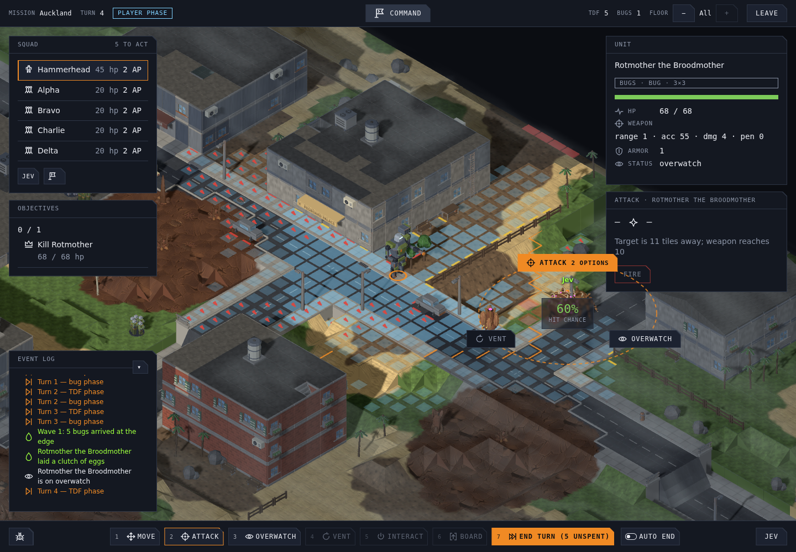
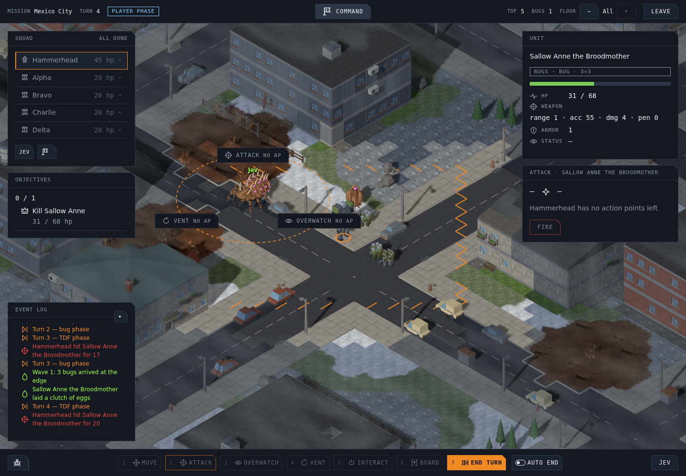
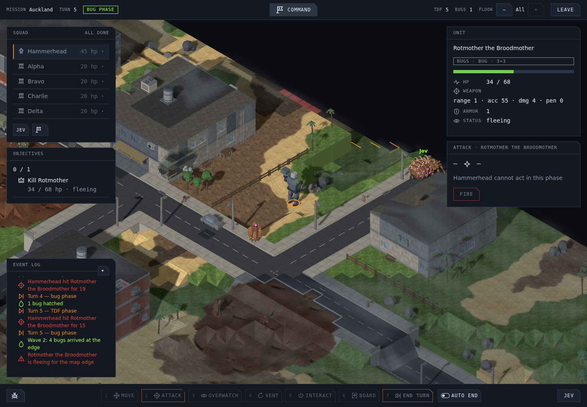
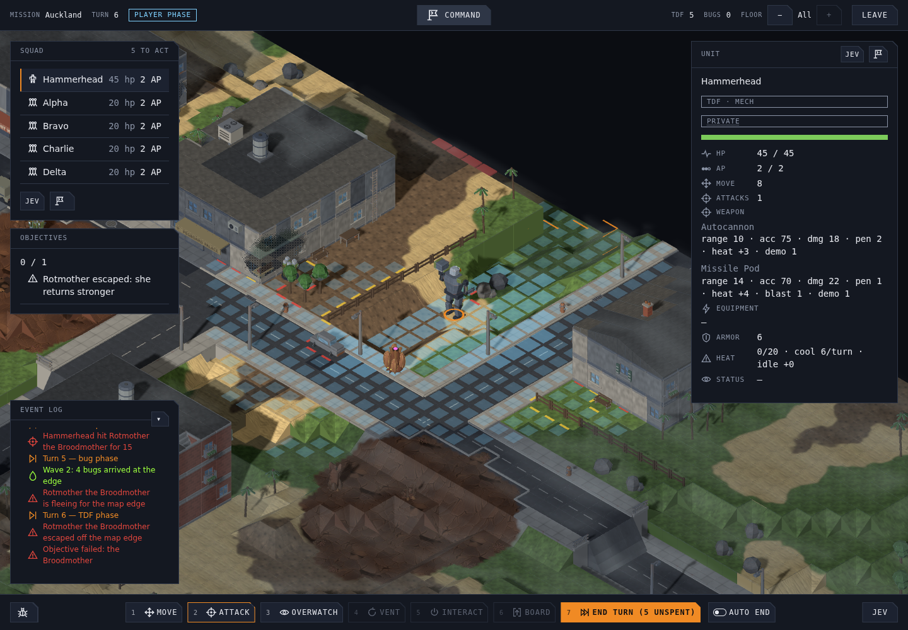
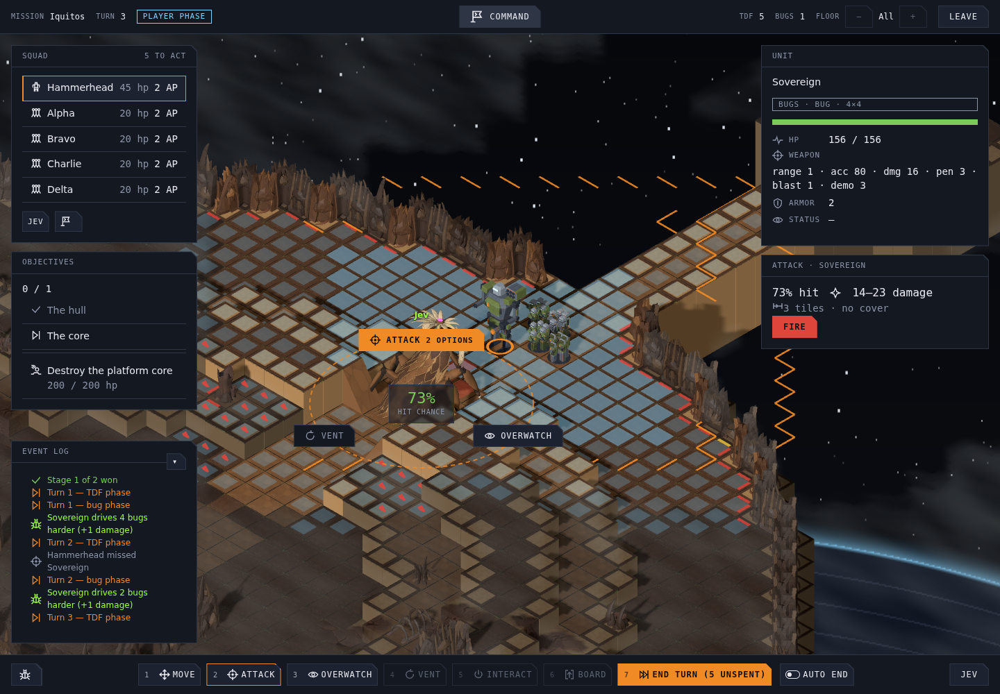
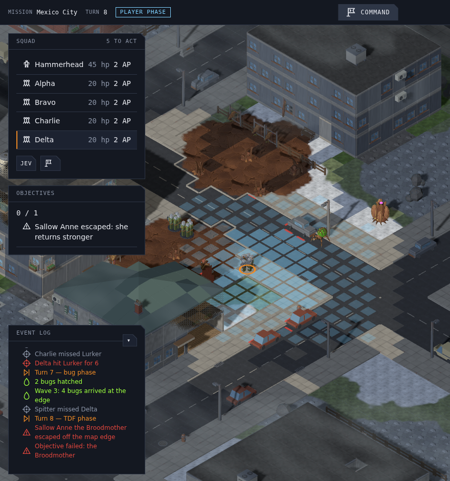
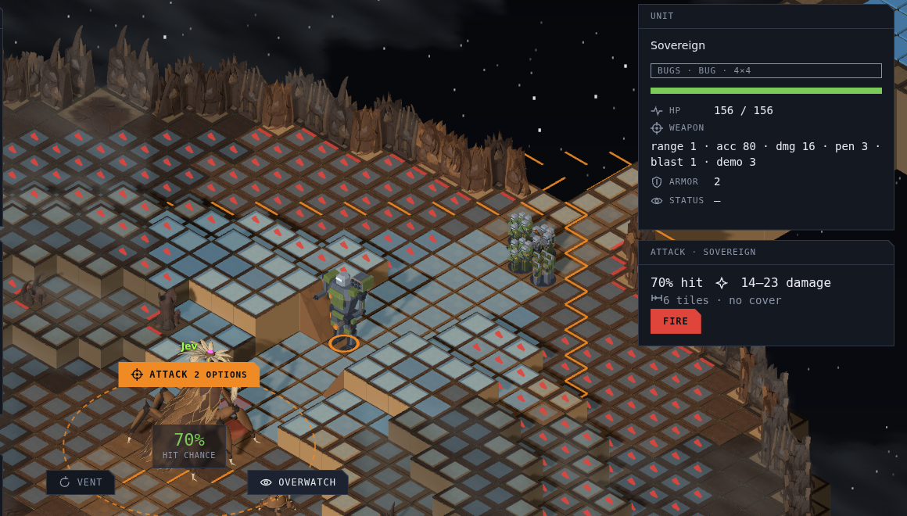

# Jev Broodmother under fog: validation review (#1179)

Campaign arc §9 asks for this review before Act II depends on Jev: a Jev-driven Broodmother played in combat under fog, then reviewed. This document records what was played, what she did, and whether Act II can depend on her.

**Verdict: ready, once the hosted relay is redeployed.** The first review found her flight to be the weak part: Jev had no way to find a map edge, so a fleeing Jev Broodmother ran *away from the TDF* rather than *off the map*. The follow-ups (W8) give her the fallback's own edge exit and run it whole. In the [re-check](#re-check-after-the-follow-ups) she kept her distance until half HP, then took the exit on every move at the full one-AP stretch, and escaped. No request failed. The conditions are in [Verdict](#verdict). The first review below is kept as it was found.

## Setup

| Item | Value |
| --- | --- |
| Build | `test/1179-jev-validation`: int/w1 at 70647dd1, plus the relay fix 91decb2f for every run after seed 7 Jev 1 |
| App | the real app on the vite dev server, the ADR 0012 relay with the live key, and Smart enemies ticked on the main menu |
| Mission | a new game on a fixed seed, staged into Act II with a hive in the home region, then days advanced with the shipped `AdvanceDay` until the `broodmother-sighting` story offered its Alpha Hunt. It was launched from the board through the briefing and deployment. Her placement, name, 68 HP (d5), persona and Jev configuration are the shipped ones. At launch the probe checked that her Jev entry was enabled with the Broodmother persona and that the bugs' commander prompt was set |
| TDF | the starting roster: Hammerhead (mech) and four squads |
| TDF driver | a single Node Playwright probe script, not a test suite. Each unit fires at her when the game's own attack preview allows, else at the nearest visible bug in reach, else walks one AP toward a tile about 6 tiles from her with a sight line. It knows her tile only from the objective marker (the fog never withholds an objective's location, #1173). It then ends the turn |
| Fog | the game's normal fog. Every request was audited against the swarm's spotted set in the save at that moment (see [Fog](#fog)) |
| Seeds | **7**: Mexico City, alpine city 72×72, "Sallow Anne". **11**: Auckland, coastal town 72×72, "Rotmother" |
| Recorded per call | turn, HP, AP, the stage and its choice or distance score, what she saw, the true state at that moment, and latency |

## Runs

| Run | Seed | Brain | Outcome | Relay calls | Failed |
| --- | --- | --- | --- | ---: | ---: |
| Fallback | 7 | fallback | escaped, turn 4, 23 HP | 0 | – |
| Jev 1 | 7 | Jev, relay before the fix | escaped, turn 7, 17 HP (fallback from turn 4) | 22 | 4 |
| Jev 2 | 7 | Jev, fixed relay | 2 HP on turn 9 and not out; stopped at its call cap | 50 | 0 (1 capped) |
| Fallback | 11 | fallback | escaped, turn 5, 31 HP | 0 | – |
| Jev | 11 | Jev, fixed relay | escaped, turn 5, 34 HP | 28 | 0 |
| Sovereign | – | Jev, fixed relay | 4 turns on the Spore Platform core | 24 | 0 (1 capped) |
| Alpha | 7 | Jev, fixed relay | 5 turns of "Grinder", an Alpha Lurker, under Alpha Present | 24 | 0 (1 capped) |

## Decision table (condensed)

Each turn she makes two decisions of one AP each. All but one of her Jev decisions were moves (the other was an overwatch): action type, then destination, then a distance score from 0 to 4. The "Jev" column gives the destination and score for each decision. `away` is `move_away_from_enemies`. "TDF → her" and "her → TDF" are the true nearest-TDF distances in tiles after each side's phase. "Sees" is how many hostiles were in her request. A clutch is laid by rule on every third turn, whoever drives her.

**Seed 7, Jev 2 (fixed relay)**

| Turn | HP | TDF → her | Sees | Jev (two decisions) | her → TDF | Edge | Clutch |
| ---: | ---: | ---: | --- | --- | ---: | ---: | :---: |
| 1 | 68 | 25 | 0, 0 | north 2.27, north 2.26 | 21 | 30 | |
| 2 | 68 | 6 | 1, 1 | away 2.16, away 2.38 | 12 | 30 | |
| 3 | 51 | 6 | 2, 1 | away 2.17, away 2.40 | 12 | 27 | ✓ |
| 4 | 31 → fleeing | 6 | 5, 2 | away 2.25, away 2.55 | 14 | 24 | |
| 5 | 26 | 6 | 5, 2 | away 1.81, away 2.37 | 13 | 20 | |
| 6 | 8 | 7 | 4, 3 | away 2.14, away 2.35 | 10 | 16 | ✓ |
| 7 | 8 | 8 | 5, 1 | away 2.36, away 2.34 | 12 | 13 | |
| 8 | 8 | 7 | 4, 2 | away 2.11, away 2.48 | 14 | 6 | |
| 9 | 2 | 10 | 3 | west, distance call capped → fallback | 10 | 11 | ✓ |

Jev 1 on the same seed made the same choices on turns 1–3, with scores within 0.2. From turn 4 every call was refused (bug 1 below) and the fallback ran her out at turn 7.

**Seed 11, Jev (fixed relay)**

| Turn | HP | TDF → her | Sees | Jev (two decisions) | her → TDF | Edge | Clutch |
| ---: | ---: | ---: | --- | --- | ---: | ---: | :---: |
| 1 | 68 | 29 | 0, 0 | north 2.06, north 1.91 | 34 | 17 | |
| 2 | 68 | 18 | 0, 0 | north 1.88, north 2.17 | 24 | 13 | |
| 3 | 68 | 8 | 1, 0 | away 2.29, **overwatch** | 11 | 11 | ✓ |
| 4 | 49 | 6 | 1, 1 | away 1.90, away 2.17 | 12 | 6 | |
| 5 | 34 → fleeing | 6 | 1, 1 | away 2.33, away 2.35 | off the edge | 0 | |

**The fallback on the same seeds**

| Seed | Turn | HP | TDF → her | her → TDF | Edge | Note |
| --- | ---: | ---: | ---: | ---: | ---: | --- |
| 7 | 1 | 68 | 25 | 15 | 27 | |
| 7 | 2 | 45 | 9 | 15 | 18 | |
| 7 | 3 | 23 → fleeing | 7 | 19 | 8 | clutch |
| 7 | 4 | 23 | 8 | – | – | escaped |
| 11 | 1 | 68 | 29 | 23 | 20 | |
| 11 | 2 | 68 | 7 | 17 | 18 | |
| 11 | 3 | 51 | 9 | 18 | 13 | clutch |
| 11 | 4 | 51 | 10 | 18 | 6 | |
| 11 | 5 | 31 → fleeing | 10 | – | – | escaped |

## Against §6.8

- **Clutches: yes, by rule.** She laid one on turns 3, 6 and 9, with or without Jev. Laying is not a Jev action, so Jev can neither skip one nor time one.
- **Keeps her distance: yes.** In 23 of her 24 decisions with a TDF unit in view she chose `move_away_from_enemies`. The 24th, on turn 9 at 2 HP and 6 tiles from the west edge, she chose `move_west`, toward the edge. She never attacked and never walked toward a TDF unit she could see. She keeps less distance than the fallback: after first contact she ended her phase 10–14 tiles from the TDF, against the fallback's 15–19. That is the distance-score effect below.
- **Flees at half HP: marked by rule, and her flight is where Jev falls short.** The game marks her fleeing at half HP and takes her off when her block touches an edge. Where she runs is Jev's choice. Jev is offered compass moves and "away from enemies", but no edge destination, and no map bounds to reason from. Her persona still tells her to "move toward the nearest map edge".
  - On seed 11 the TDF came from the side away from the near edge, so "away" was also "out". She escaped on turn 5, as the fallback did.
  - On seed 7 "away" led her west into a pocket near the west edge, 6 tiles from it by turn 8, but not out. When the fallback took over on turn 9, it walked her back east toward its cheapest exit. Between turns 4 and 9 she lost 31 → 2 HP without getting out. The fallback path-costs the cheapest edge exit and was gone on turn 4 with 23 HP.

  ```
  seed 7, from half HP     fallback                  Jev
                           cheapest edge exit        away from the nearest TDF
                           turn 4: off the map       turns 4–9: 31 → 2 HP, still on
  ```
- **Short moves.** Her 31 distance scores averaged 2.23 of 4 (range 1.81–2.57), so each Jev move covered about 55 % of what one AP allows. Measured as the larger axis of her displacement, she moved 2–7 tiles a turn under Jev (median 4), against 5–10 under the fallback (median 7). ADR 0012 marks distance scoring as experimental, and this is its largest measured effect: a Jev Broodmother retreats and flees at a little over half her fallback speed.
- **One wasted activation.** On seed 11, turn 3, with no enemy in view, she spent her second AP on overwatch. Her bite has range 1.

## Fog

- **The audit.** For all 151 requests, including the Sovereign's and the alpha's, the probe read the saved mission at the moment of the request and checked three things. Every hostile in the request was in the swarm's spotted set. Its position matched the true one. No unspotted TDF unit's id appeared anywhere outside `last_seen`. **There were no violations.** Before first contact, her requests held no hostiles.
- **What she is told that a player might not expect:**
  - **The TDF extraction zone, from turn 1**, as `move_to_extraction` ("contest it"). On Alpha Hunt that zone is where the TDF force deployed, so the swarm knows where the TDF landed before any contact. This is by ADR 0012's design, and she never chose it. Ben kept it (2026-09-28): the request stays simpler and the bugs attack sooner.
  - **`last_seen`**: the swarm's own memory of where it saw TDF units. It is offered only as a place to investigate, never as a target. Fair.
- **What she is not told:**
  - **Map bounds.** This is the flight gap above.
  - **That she is fleeing.** `actor.status` has no `fleeing`, so she infers it from her HP, which her persona states.

## Latency, failures and fallbacks

- **Latency, relay-measured** (full upstream round trip, 144 successful calls): median 131 ms, p90 193 ms, max 558 ms.
- **Latency, probe-measured** (browser request to response, through Playwright's interception on a heavily loaded host): median about 1.1 s, p90 about 3 s, max 9 s.
- **Timeouts:** none against either limit (relay 15 s, browser 20 s).
- **Wall time per bug phase:** 1–5 minutes, dominated by scene playback in headless SwiftShader. The controller waits for playback before each decision, by design. Jev time is a small share.
- **Failures:** 4 of 148, all before the fix. All 4 were relay rejections of the request shape, answered locally in 0–2 ms and never sent upstream (bug 1). After the fix: 0 of 126.
- **Fallbacks:**
  - Each refused call, and each of the 3 POSTs the probe's budget guard aborted, handed the decision to her deterministic behaviour.
  - There were no page errors. The only console error was the browser's line for a request the probe itself aborted. The mission carried on, and the turn after a failure started with Jev again.
  - When the distance call failed after a chosen move (seed 7, turn 9), the unscored `move_west` was dropped and the fallback moved her instead.

## Relay calls used

148 requests reached the relay, against a package cap of 200:

- 144 were answered by Jev.
- 4 were refused by the relay before any upstream call.
- 3 more were aborted in the browser by the probe's per-run caps and never reached the relay.

Per run: seed 7 Jev 1: 22. Seed 11: 28. Seed 7 Jev 2: 50. Sovereign: 24. Alpha: 24.

## Sovereign and named alpha (short checks)

- **Sovereign** (Spore Platform core, d10, 156 HP, one Jev actor). The hull was won in Node by extracting the force, as `tools/ui/capture-spore-platform.mjs` does, and the core was then played in the app.
  - Turn 1, blind: north twice, away from her core (from 4 tiles out to 10).
  - Turn 2, on first sight: `move_to_entity` on the mech twice. That left her 3 tiles from the TDF and 16 from the core.
  - Turns 3–4, after taking 28 and then 17 damage: `move_south` four times, back to 4 tiles from the core.
  - She never attacked. Her aura rule fired in the bug phases the event log shows ("Sovereign drives 4 bugs harder").
  - The first-sight charge goes against her persona ("Never chase a kill far from the core"). It also goes against her fallback, which ranges at most 8 tiles from the core while healthy.
- **Named alpha** ("Grinder the Alpha Lurker", 18 HP, crowned on turn 3 in a far corner).
  - Turns 4–5, with no TDF in view: `move_to_objective` on its nest.
  - Turns 6–7, with the TDF in view: `move_to_entity` on a TDF unit three times, and `move_east` once.
  - It closed from 48 to 14 tiles in its four Jev turns, and made no contact before its cap. That fits the alpha persona's "close fast if your attack is melee".
  - Its 8 distance scores averaged 2.98 of 4, clearly longer moves than the Broodmother's.

## Renders

Frames from the probe runs, all taken after the scene had caught up with the state. The fallback runs made none worth keeping: headless SwiftShader plays their instant bug phases minutes behind the state.











## Bugs and follow-ups

As found by the first review. Where each one stands now is in the [re-check](#re-check-after-the-follow-ups).

1. **Fixed in this package (91decb2f): the relay refused any request carrying a damage tag.**
   - The Spitter (acid) and the Hive Guard (spine) carry `tags` on their weapon profile, and the relay's closed profile shape did not list the field.
   - So any request whose state held one of those species got 400 "Invalid TUT game decision request", and the actor fell back.
   - Evidence: seed 7 Jev 1, calls 19–22, answered in 0–2 ms from the moment a wave brought a Spitter in. Replacing only the Spitter's capability in the recorded request made it valid.
   - Fix: one line in `relay/game-request.mjs`. `tools/jev/relay-contract.test.mjs` gives its rich weapon a tag, and fails without the line.
2. **Open: the relay also refuses `pierce`.** A mech fitted with Armour-Piercing Rounds, from the armoured carapace autopsy, gets `pierce` on its ballistic weapons (`mech-combat-profile.ts`). The same recorded request with `pierce: 2` on the mech's weapon is refused. Once that part is fitted, every Jev request that includes the mech will fall back. It was not seen live, because the starting roster has no autopsy parts.
3. **Open, design: no way to the map edge for a fleeing persona.** Offer an edge-exit destination computed the way the fallback's flight is, the cheapest edge anchor by path. Otherwise send the map bounds. Until then the persona asks for something the observation cannot support.
4. **Open, tuning: distance scores keep her at about 55 % of her movement** (mean 2.23 of 4 over 31 moves). Either calibrate the scale for retreat and flight intents, or let flight take the full route.
5. **Decided, kept:** the bugs' requests carry the TDF extraction zone from turn 1 (see [Fog](#fog)). Ben, 2026-09-28: keep it. It keeps the request simpler, and the bugs attack sooner.
6. **Open, minor:** `actor.status` has no `fleeing`. She spent one activation on overwatch with a range-1 bite (seed 11, turn 3). The Sovereign charged away from her core on first sight.

Not bugs, for whoever re-runs this: in headless SwiftShader the scene trails the store by minutes when bug phases resolve at once, so frames need a wait for the models to reach their tiles. The event log only *looks* stuck in such a frame.

## Re-check after the follow-ups

W8 (`fix/1179-jev-followups`) fixed bugs 2, 3, 4 and 6, and then played the Broodmother and the Sovereign again with the real app, the live relay and Smart enemies, under the setup above.

| Bug | After W8 |
| --- | --- |
| 1, 2: the relay refuses profile fields | Fixed. The relay now accepts `pierce` on a weapon, and `resist`, `pierce` and `seismicRange` on mech systems. A contract test builds its request from the game's types with every optional field set, so a new field fails a test before it can fail a live call |
| 3: no way to the edge | Fixed. A fleeing actor is offered `move_to_map_edge`. It is the fallback flight's own exit (`edgeExits`: the cheapest edge anchor by path), and it is sent as `map_edge_exit`. It is offered from the decision she is hurt enough to run, and never to a healthy Broodmother (see run A) |
| 4: short moves | Fixed for flight. The exit move takes its whole one-AP route, with no distance question. Other moves are still scored (ADR 0012, experimental) |
| 5: extraction zone in the bugs' requests | Kept by design. Ben's decision, 2026-09-28 |
| 6: `fleeing`, melee overwatch, the Sovereign's leash | Fixed. `actor.status` carries `fleeing`. Overwatch is offered only to an actor with a weapon of range above 1. The Sovereign is offered no move that ends beyond 8 tiles of her core, or 2 once she retreats, which are her fallback's radii |

### Runs

| Run | Build | Outcome | Relay calls | Failed |
| --- | --- | --- | ---: | ---: |
| A, seed 7 | edge exit offered at any HP (133fbc91) | killed on turn 6, 6 tiles from the north edge | 24 | 0 |
| Sovereign | final (4f53ab03) | 4 turns on the Spore Platform core | 22 | 0 (1 capped) |
| B, seed 7 | final (4f53ab03) | **escaped on turn 7 at 31 HP**; the objective failed | 34 | 0 |

- **Relay calls: 80**, against the package cap of 100.
  - Every one was answered with HTTP 200. **0 were 4xx**, and 0 were 5xx.
  - One further POST was aborted in the browser by the Sovereign run's own cap, and never reached the relay. Her fallback took that decision.
  - Relay-measured latency: median 141 ms, max 616 ms.
- **Fog.** The same audit as above, over 81 requests, found no violations.

### The Broodmother's flight

- **Run A showed that the exit must not be offered early.**
  - The exit was first offered to her at full health, because her persona flees.
  - On turn 3, at 51 of 68 HP and not yet fleeing, Jev took it twice (P 0.45, then 0.58). The cheapest route ran past the TDF, and she ended 2 tiles from them.
  - W8 then limited the offer to a Broodmother at or below her flight threshold (4f53ab03).
- **Run B, with that limit:**
  - Before she turned, she was offered no exit in any of her 6 movement requests. She chose `move_away_from_enemies` or `move_north` every time, and ended each phase 12 or more tiles from the nearest TDF unit.
  - She turned at 31 of 68 HP on turn 4. From then on every request carried `actor.status: ["fleeing"]` (16 of 16) and the exit, `(0, 3, 49)`. She took `move_to_map_edge` on all 8 moves.
- **How far she moves.** Every exit move ran the full one-AP route: 13 of the 14 exit moves in both runs walked 5 or 6 tiles on a movement of 5, the 6 on infested ground. The 14th walked 4 tiles and reached the edge.
  - That is 10–12 tiles a turn in flight. The first review measured 2–7 under Jev and 5–10 under the fallback, though by her displacement's larger axis rather than tiles walked.
  - Her scored moves before flight still walked 3 of 5 tiles each. That is the distance scale, which ADR 0012 lists as experimental.
- **Against the fallback on seed 7.** The fallback escaped on turn 4 with 23 HP, and the first review's Jev run was still on the map at 2 HP on turn 9. Run B escaped on turn 7 with 31 HP. Her route is the fallback's: it is computed by the same `edgeExits`.



### The Sovereign's leash

- Measured by the leash's own rule, the ground tiles from the nearest tile of her block to her core, she stood 5 from it at the start and **never more than 8**. The first review saw her charge to 16.
- Turn 1: `move_north` twice, which stopped at the leash's edge, 8 tiles out.
- Turn 2, on first sight: `move_to_entity` on the Hammerhead. The approach stopped at the leash's edge, 8 from the core and 6 short of the mech.
- Turns 3–4: `move_south` back toward her core, to 3 tiles from it. Her fallback, which took the capped decision, then moved her back out to 6.
- Neither she nor the Broodmother was offered overwatch, since both weapons have range 1. None of the 32 action-type requests across the three runs offered it. The first review's Broodmother spent a turn on it.



### Still open

- **The distance scale** for moves other than flight.
- **One seed.** Run B is one escape on one map.

## Verdict

**Ready** for Act II to depend on Jev for the Broodmother, once the hosted relay is redeployed. The first review said "ready with caveats". The re-check changes it for these reasons:

- **Her flight now does what §6.8 and her persona ask.** She takes the fallback's own exit at the full one-AP stretch, and she escaped where the first review's Jev run did not. The "should" conditions of the first review (bugs 3 and 4) are met for flight.
- **Must, before the next production release: redeploy the hosted relay from W8.** Local play runs its own relay (`run.sh`), so this blocks only production. Its request shape and its copy of the protocol text changed (`pierce` and the other profile fields, `map_edge_exit`, `move_to_map_edge`, the `fleeing` status). The relay checks the gameplay text against its own copy, so a game built from W8 against the old relay has every request refused, and Jev silently falls back.
- **Holds as is:** fair vision (no leak in 232 audited requests over both reviews), reliability (no failures in 80 calls after W8), latency (relay median 141 ms), and a clean fallback on every failure.
- **Decided:** bug 5, the extraction zone, stays in the bugs' requests (Ben, 2026-09-28).
- **Not blocking:** the distance scale for other moves stays experimental, as ADR 0012 says.
