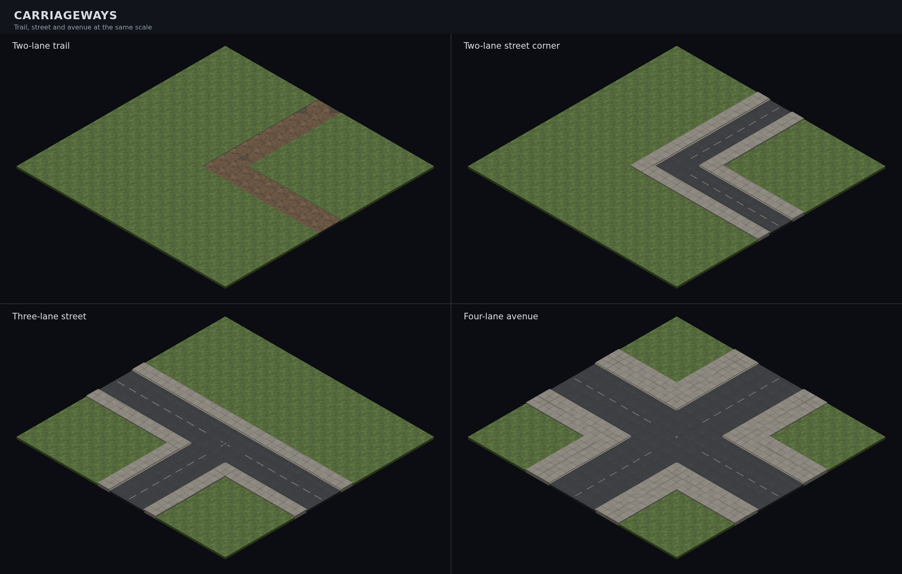

# Carriageway kit — #840

A road is one continuous surface across its width. The Blender kit supplies
an unmarked interior, a low concrete perimeter and a single centre divider.
The resolver selects details over the whole carriageway; a broad junction
gets at most one existing T/cross mark, leaving its interior open.



The composite uses the real `MapModelResolver`, `RoadModelFactory` and
`TacticalMapView`, with identical cameras for all four controls. It includes
an unpainted two-lane trail, a two-lane street corner with pavements, a
three-lane T junction and a four-lane avenue crossing with two pavements.

## Pieces and contract

| ID suffix (`tile.city.`) | Triangles | Bytes | Detail |
| --- | ---: | ---: | --- |
| `road-lane` | 12 | 2,020 | Plain slab |
| `road-kerb` | 24 | 3,688 | One kerb on +Z |
| `road-kerb-corner` | 36 | 5,216 | Kerbs on +Z and +X, butted at the corner |
| `road-centre-line` | 24 | 3,732 | One dash along the +Z edge |

All use the existing road tile's **centre pivot**, a 1 × 1 footprint and a
0.05-thick slab (Y = −0.025 … +0.025). Placement is unchanged. The kerb is
0.08 wide and rises 0.06 above the slab; the dash is 0.6 × 0.05 and rises
0.003. Runs follow X. A negative quarter turn about Y moves +Z to west.
Named GLB parts let the consumer combine details on exactly one slab.

`carriageway_parts.py` is the shared authoring source. Each script exports
one complete previewable module. Every mesh is closed and watertight, with
flat palette materials and planar UVs. These are neutral material sources;
the scene supplies the road style's actual ground atlas material and region.

| Style | Surface | Kerbs | Paint |
| --- | --- | --- | --- |
| `trail` | Dirt | None | None |
| `streets` | Asphalt | Concrete | One centre divider |
| `grid` | Asphalt | Concrete | One centre divider |

The factory accepts all three styles. Generated dirt trails already use the
dirt ground family and retain that unmarked appearance; ROAD tiles use the
settlement style through the resolver. Road width remains MapGen data.
The current fit recognises connected two- to four-lane roads by straight
runs; tiny legacy one-tile fixtures retain their existing road models.

Kerbs face only non-road neighbours. Even widths put the divider just
inside one central tile edge; odd widths centre it within the middle tile.
Existing T/cross assets contribute their paint only, at one owner tile per
junction. All other junction tiles use the plain interior. Short corners
suppress crossing marks and continue the perimeter.

`ROAD_MODELS` registers the four pieces; `mapModelIds` preloads their shared
parts. `RoadModelFactory` borrows materials and owns only its cloned geometry.
`TacticalMapView` caches each appearance independent of elevation and uses
the existing shared mist path. No material is allocated per road instance.

## Three fixed angles

| Piece | 45° | 135° | 225° |
| --- | --- | --- | --- |
| Interior | [View](../renders/tile.city.road-lane_045.png) | [View](../renders/tile.city.road-lane_135.png) | [View](../renders/tile.city.road-lane_225.png) |
| Kerb | [View](../renders/tile.city.road-kerb_045.png) | [View](../renders/tile.city.road-kerb_135.png) | [View](../renders/tile.city.road-kerb_225.png) |
| Corner kerb | [View](../renders/tile.city.road-kerb-corner_045.png) | [View](../renders/tile.city.road-kerb-corner_135.png) | [View](../renders/tile.city.road-kerb-corner_225.png) |
| Centre line | [View](../renders/tile.city.road-centre-line_045.png) | [View](../renders/tile.city.road-centre-line_135.png) | [View](../renders/tile.city.road-centre-line_225.png) |

All twelve angles and the composite have been opened and inspected by the
Art Director. Visual acceptance belongs to the Director.

## Reproduce

```sh
for piece in lane kerb kerb-corner centre-line; do
  blender -b --python-exit-code 1 --python tools/art/make_model.py -- \
    --script tools/art/models/city-road-$piece.py --id tile.city.road-$piece \
    --category tiles --file city-road-$piece.glb --quality final \
    --max-triangles 60 --no-textured
done
CAPTURE=1 pnpm exec playwright test e2e/carriageway-screenshot.spec.ts
pnpm exec vitest run src/graphics/service/road-model-resolver.test.ts src/graphics/service/road-model-factory.test.ts
```

Tests exercise widths two/three/four, L/T/cross neighbourhoods, both road
axes, perimeter ownership, style selection, actual GLB geometry, atlas
borrowing and shared mist materials across levels. The manifest sync guard
checks all four registrations.
