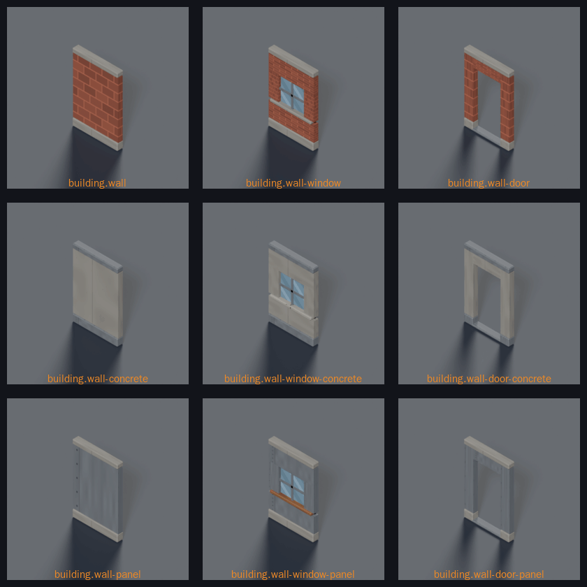
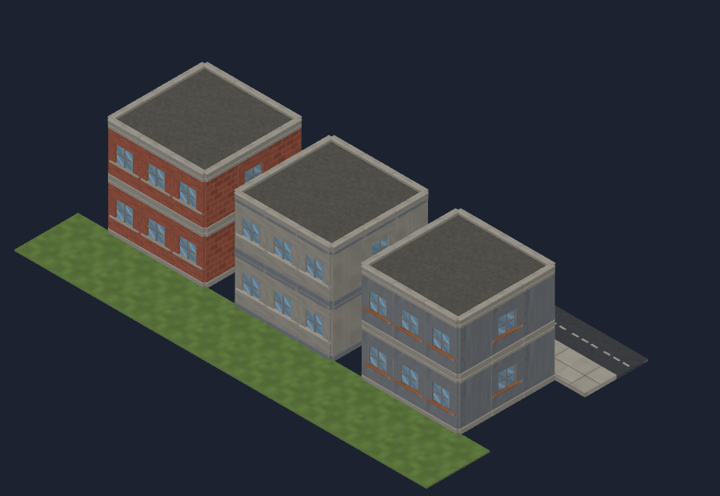
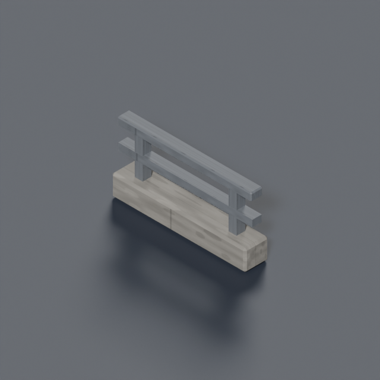

# Kit: city buildings


Eight Blender pieces that map generation assembles into city buildings (style guide §7, epic #274 batch E). Sources are `tools/art/models/building-*.py` on the shared builders in `tools/art/models/city_kit_parts.py`; they replaced the three.js placeholders of the same ids, so nothing downstream changes.

| Piece | Id | Footprint | Height | Snaps to | Tokens |
|---|---|---|---|---|---|
| Wall | `building.wall` | 1 × 0 | 1.5 | tile edge, runs along local +X | `env-brick`, `env-concrete` |
| Wall, window | `building.wall-window` | 1 × 0 | 1.5 | tile edge | + `env-glass`, `env-metal` |
| Wall, door | `building.wall-door` | 1 × 0 | 1.5 | tile edge, `socket_door` at the opening | + `env-metal` |
| Wall, half | `building.wall-half` | 1 × 0 | 0.5 | tile edge, low cover | `env-brick`, `env-concrete` |
| Floor | `building.floor` | 1 × 1 | 0.05 | tile centre, one per level | `env-concrete`, `env-sidewalk` |
| Roof | `building.roof` | 1 × 1 | 0.05 | tile centre, top level | `env-roof` |
| Roof parapet | `building.roof-parapet` | 1 × 0 | 0.15 | roof edge, runs along local +X | `env-concrete`, `env-sidewalk` |
| Stairs | `building.stairs` | 1 × 1 | 1.5 | tile centre, climbs toward +Z | `env-concrete`, `env-sidewalk` |

## Material families





A block where every building is the same brick reads as an atlas limitation, not a city. The three full-height wall pieces therefore ship in three families built from **identical geometry** — only the palette tokens change, so every piece stays inside its 800-triangle budget and mixed runs still line up course for course.

| Family | Ids | Body | Bands | Trim | Reads as |
|---|---|---|---|---|---|
| Brick | `building.wall`, `-window`, `-door` | `env-brick` | `env-concrete` | `env-concrete` | Residential and older stock |
| Concrete | `building.wall-concrete`, `building.wall-window-concrete`, `building.wall-door-concrete` | `env-concrete` | `env-metal` | `env-sidewalk` | Civic and office blocks |
| Panel | `building.wall-panel`, `building.wall-window-panel`, `building.wall-door-panel` | `env-metal` | `env-concrete` | `env-rust` | Industrial sheds and depots |

The band is lighter than the body on brick and darker than it on concrete. What matters at 64 px per tile is that a **floor line exists**, not which way the contrast runs.

**How a building picks one** (for whoever wires it — `map-model-resolver`, #474): tiles carry `buildingId`, so hash it and take that family for every wall of that building. One family per building, never per wall; a building that changes material halfway up reads as a bug. Walls with no `buildingId` — free-standing garden walls, compound walls — stay brick.

Building half walls use `building.wall-half` for brick and `building.wall-half-concrete` for concrete and panel (#766). The floor, roof, roof parapet and stairs remain shared.

The threshold plate on every door stays `env-metal` in all three families — a door gets walked on, and a worn steel plate is what that looks like whatever the wall is made of.

## Viaduct parapet (#782)



`building.viaduct-parapet` is a dedicated bridge edge: a 0.16 u concrete kerb
supporting two grey steel rails, with daylight between them. It replaces the
solid half-wall silhouette for civic edges only. The road family's half-wall
entry selects it for walls with no `buildingId`; this includes the existing
viaduct and raised-park lips. Buildings retain their three material families,
their fixed hash order, and all existing wall meshes.

The bounds match the half wall: 1 u along X, 0.18 u maximum depth, 0.5 u high;
footprint `1 × 0`, base midpoint at the origin. Rails reach both ends of the
module to join runs. No placement or rotation change. The model is 124
triangles / 13,380 bytes, with the existing `env-concrete` and `env-metal`
atlas cells, and all meshes pass watertight validation.

```bash
blender -b --python-exit-code 1 --python tools/art/make_model.py -- \
  --script tools/art/models/city-viaduct-parapet.py --id building.viaduct-parapet \
  --category buildings --file city-viaduct-parapet.glb --quality final --max-triangles 800
CAPTURE=1 pnpm exec playwright test e2e/viaduct-parapet-screenshot.spec.ts e2e/fog-screenshot.spec.ts
```

The no-fog control is [seed 730982385](../shots/782-preview-models-seed730982385-parapets.png),
temperate / city / small, all levels, `models=1`, 2400 × 1500. Tactical fog
controls remain seed 4242, turns 1 and 7. All three model angles are under
`docs/design/renders/building.viaduct-parapet_{045,135,225}.png`.

## Rules the kit follows

- **Bands line up.** Every full-height wall piece carries the same concrete plinth (0.16 u) and cornice (0.10 u), and the brick field between them starts and ends at the same heights, so a run of mixed pieces reads as one wall rather than eight stamps. `city_kit_parts.wall_bands()` is the single place those numbers live.
- **Openings are cut, not overlaid.** Jambs, lintels and spandrels are separate brick panels that meet edge to edge. An early version overlapped the lintel with the jambs; the coincident faces z-fought into black patches at the corners of every doorway.
- **No applied frames.** At 64 px per tile a metal frame around a door reads as noise; the opening itself is what has to be legible. The door keeps only a threshold plate.
- **Decks are flat.** The floor's trim ring and its centre sit at the same height and differ only in token. Recessing the centre a few millimetres looked better in isolation, but a floor is laid over a 0.05 u ground tile, so the recess let grass poke through every interior square.
- **The roof has no border.** Roof tiles cover whole rooftops, so a per-tile border would draw a grid over the building; `building.roof-parapet` is what edges a roof.
- **Nothing rises above its storey.** The staircase covers exactly 1.5 u; its side kerbs stop on the last step instead of continuing as a handrail into the floor above.
- **Brick courses run horizontally.** Vertical panels get `uv_rot=90` (`bpy_kit.box`), because `bpy.ops.uv.reset` orients u along whichever edge a face's loop starts on and an upright panel otherwise samples the brick cell sideways.

## Rebuild

```
blender -b --python tools/art/make_model.py -- \
  --script tools/art/models/building-wall.py --id building.wall \
  --category buildings --file wall.glb --quality final --footprint 1x0 --max-triangles 800
node tools/art/build-placeholders.mjs      # keeps the records it did not create
```

Renders for review are under `docs/design/renders/building.*_{045,135,225}.png`.
