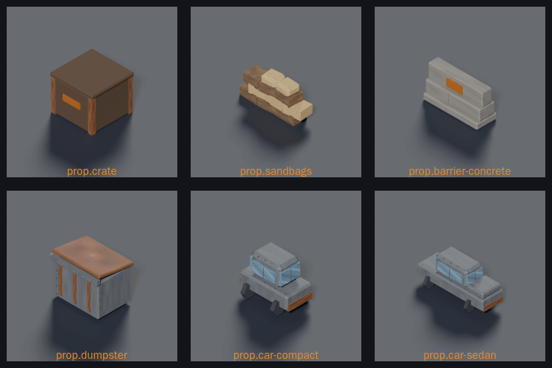
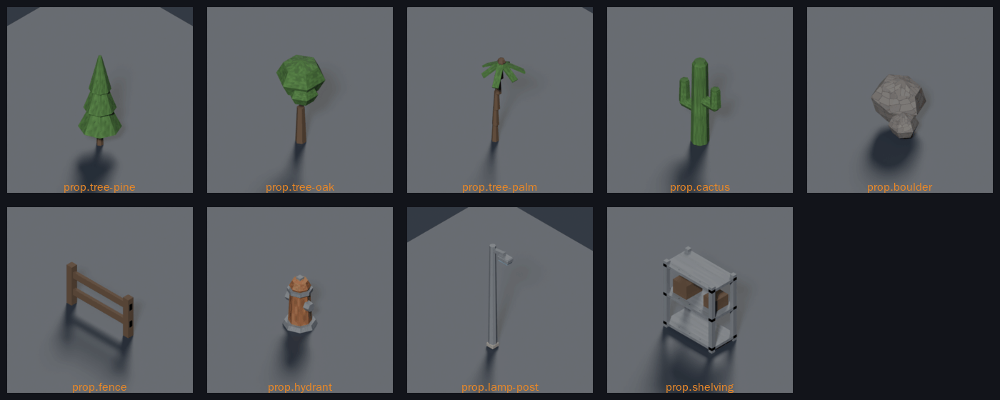

# Kit: props



Every prop mapgen can place, as Blender models (style guide §7, epic #274 batches F and G). Sources are `tools/art/models/prop-*.py` on the shared builders in `tools/art/models/prop_parts.py`; they replaced the three.js placeholders of the same ids, so mapgen's prop kinds resolve exactly as before.

## Cover

| Prop | Id | Footprint | Height | Triangles | Cover it reads as |
|---|---|---|---|---|---|
| Crate | `prop.crate` | 1 × 1 | 0.6 | 148 | Full, waist-high stack |
| Sandbags | `prop.sandbags` | 1 × 1 | 0.47 | 196 | Low, built emplacement |
| Jersey barrier | `prop.barrier-concrete` | 1 × 1 | 0.5 | 156 | Low, hard |
| Dumpster | `prop.dumpster` | 1 × 1 | 0.79 | 216 | Full, soft (a bin stops rifle fire badly) |
| Compact car | `prop.car-compact` | 1 × 1 | 0.74 | 240 | Full, hard at the body, glass above |
| Sedan | `prop.car-sedan` | 2 × 1 | 0.8 | 284 | Full, two tiles |



## Scenery

| Prop | Id | Footprint | Height | Triangles | Note |
|---|---|---|---|---|---|
| Pine | `prop.tree-pine` | 1 × 1 | 2.05 | 104 | Narrow taper — the silhouette that separates it from the oak |
| Oak | `prop.tree-oak` | 1 × 1 | 1.71 | 128 | Wide round crown, three overlapping lumps |
| Palm | `prop.tree-palm` | 1 × 1 | 1.87 | 208 | Leaning trunk, six drooping fronds of two lengths |
| Cactus | `prop.cactus` | 1 × 1 | 1.37 | 204 | Two arms at different heights, deliberately asymmetric |
| Boulder | `prop.boulder` | 1 × 1 | 1.01 | 82 | Two faceted lumps, both `cut_below` at ground level |
| Fence | `prop.fence` | 1 × 1 | 0.5 | 48 | Low cover that reads as a boundary, not a wall |
| Hydrant | `prop.hydrant` | 1 × 1 | 0.61 | 184 | `env-rust`, never orange — see below |
| Lamp post | `prop.lamp-post` | 1 × 1 | 2.63 | 140 | Cantilevered head; a symmetrical lamp reads as a pole from overhead |
| Shelving | `prop.shelving` | 1 × 1 | 1.0 | 108 | Three decks with two crates, so an interior is not empty |

## Rules the kit follows

- **Silhouette over surface.** These are read at 64 px per tile from four yaw stops. What survives is the outline: a barrier's taper, a bin's tilted lid, a car's glasshouse between a bonnet and a boot. Detail under about 0.04 u is invisible and only spends triangles.
- **Wheels start at hub height.** The body sits at `wheel_radius`, so wheels show below it from the side and as four dark corners from overhead. Tucked under a low sill, a car reads as a flatbed truck — which is exactly what the first two passes looked like.
- **A long car needs a boot.** With a cabin and one flat deck the sedan read as a pickup; `car_body(boot=True)` raises a boot deck behind the cabin, and the profile becomes low-high-mid.
- **Chamfer only what is seen.** A bevelled sandbag costs 44 triangles against a 300-triangle prop budget, so only the top course passes `soft=True`; lower bags are half-buried in their neighbours and their corners never read. Twelve chamfered bags came to 1 296 triangles, four times the budget.
- **Bags are boxes, not cylinders.** The first sandbag stack used six-sided cylinders and read as a pile of pipes. A yawed, heavily chamfered box keeps the soft corner without the barrel profile.
- **Hazard orange is a marker, not a colour scheme** (style guide §4): one `tdf-orange-dim` band on the barrier and one stencil on the crate, nothing more. A fire hydrant is the obvious place to want a bright warning colour, and it is `env-rust` instead: `tdf-orange` is the selection and line-of-sight colour on the tactical plane (§12.2), so no piece of scenery may wear it.
- **Trees are told apart by silhouette, not by leaf colour.** All three share `env-foliage`; pine tapers, oak is round and wide, palm is a bare trunk with a crown. At 64 px per tile that is the only difference a player can use.
- **Fronds have to droop.** A palm whose fronds radiate flat reads as a pinwheel from directly overhead, which is the angle this game is played at.
- **A prop that cannot be seen cannot be cover.** The lamp post is thicker than a real one for that reason.

## Rebuild

```
blender -b --python tools/art/make_model.py -- \
  --script tools/art/models/prop-crate.py --id prop.crate \
  --category props --file crate.glb --quality final --footprint 1x1 --max-triangles 300
node tools/art/build-placeholders.mjs      # keeps the records it did not create
```

Renders for review are under `docs/design/renders/prop.*_{045,135,225}.png`.
