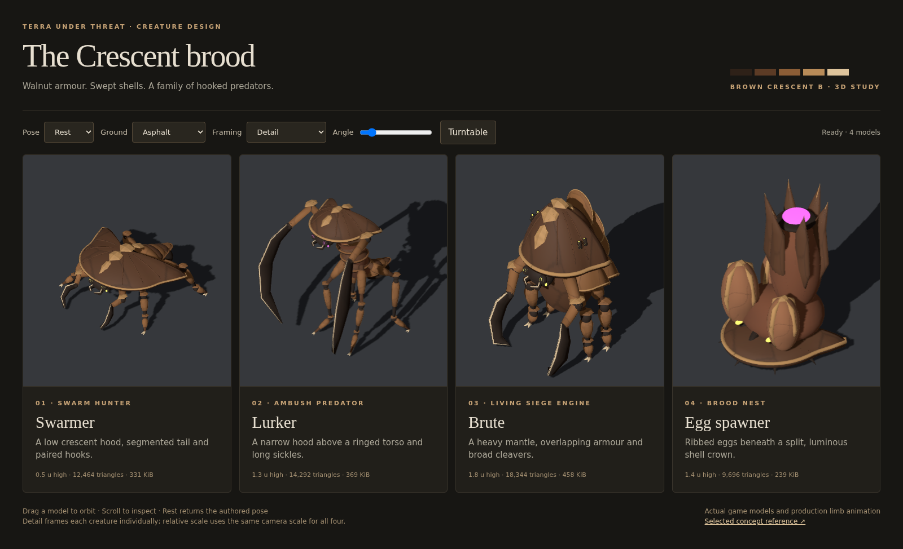
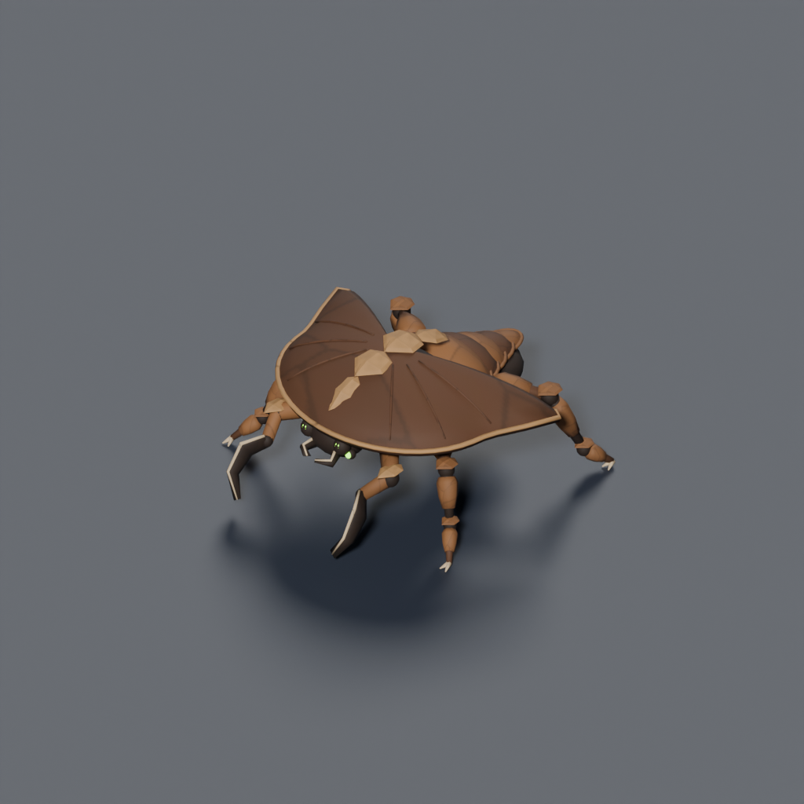
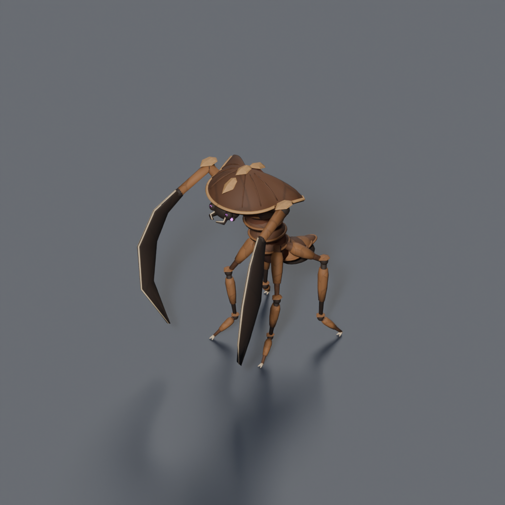
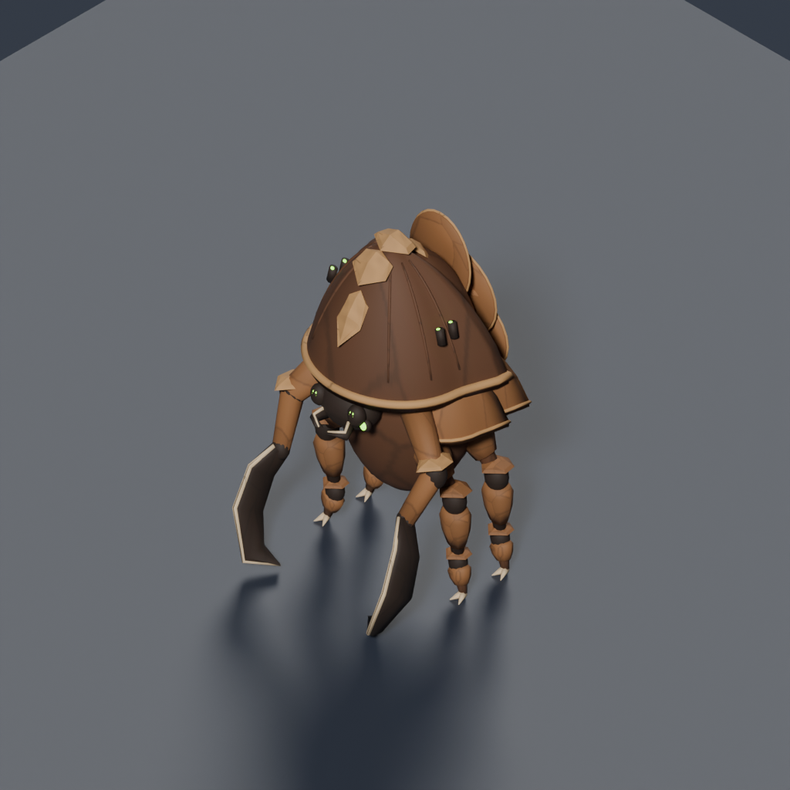
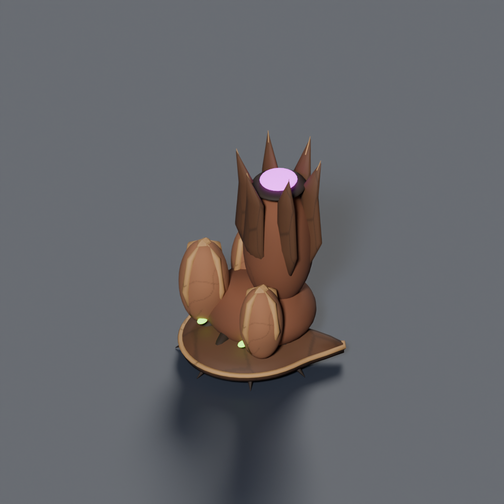

# Brown Crescent bug family

The Executive Director selected [brown Crescent B](../concepts/swarmer-redesign/b-crescent-brown.md) on 2026-09-12 and requested detailed replacement models for the entire family. These are the actual exported game assets, built in Blender from reproducible Python sources.



## Review the models

Run `pnpm dev`, then open **[/tools/art/preview/crescent-bugs.html](../../../tools/art/preview/crescent-bugs.html)** on the local Vite server. Drag to orbit, scroll to inspect, or use the shared turntable. Rest, Walk and Strike use the production `UnitMotionRig`; the rooted egg spawner stays stationary. Detail frames each creature individually. Relative scale uses one camera scale across all four, and 64 px / tile shows their tactical size.

| Swarmer | Lurker | Brute | Egg spawner |
|---|---|---|---|
| [](../renders/bug.swarmer_045.png) | [](../renders/bug.lurker_045.png) | [](../renders/bug.brute_045.png) | [](../renders/bug.egg-spawner_045.png) |
| [135°](../renders/bug.swarmer_135.png) · [225°](../renders/bug.swarmer_225.png) | [135°](../renders/bug.lurker_135.png) · [225°](../renders/bug.lurker_225.png) | [135°](../renders/bug.brute_135.png) · [225°](../renders/bug.brute_225.png) | [135°](../renders/bug.egg-spawner_135.png) · [225°](../renders/bug.egg-spawner_225.png) |

Browser captures: [relative scale](../diagnostics/crescent-bugs/relative-scale.png), [walking](../diagnostics/crescent-bugs/walking.png), [striking](../diagnostics/crescent-bugs/striking.png), [rear](../diagnostics/crescent-bugs/rear.png).

## Family language

Walnut primary shells, chestnut overlapping armour, tan dorsal lozenges and rims, dark umber joints, and narrow pale horn cutting edges. Green eyes/gills remain on the swarmer and brute; magenta identifies the lurker and the spawner's central hatch. Broad shapes carry the tactical silhouette; small growth seams and cuff edges reward inspection up close.

- **Swarmer:** thin swept hood over a low body; five overlapping abdominal plates; four running legs and two short hooks.
- **Lurker:** narrow elevated hood, five torso rings, slender four-legged stance and long curved sickles.
- **Brute:** deep mantle, layered shoulder shells and four overlapping back plates; heavy joint cuffs and wide cleavers.
- **Egg spawner:** rooted crescent husk, three ribbed eggs and six shell valves around a luminous central opening. The `socket_hatch` anchor remains available to gameplay effects.

The shared [style guide](../style-guide.md) records the brown palette and revised detailed-model budgets. Gameplay species, abilities and occupied tile counts remain unchanged.

## Geometry, materials and motion

Each GLB is below 500 KiB. The selected detail pass replaces the original 600 / 1,000 / 2,000 triangle bug budgets and 1,200 triangle spawner budget. Current budgets are 16,000 / 18,000 / 20,000 / 16,000 respectively. This increases geometry cost; these are detailed game meshes without a separate LOD tier. File caps and functional browser checks are not a hardware performance benchmark.

| Model | Height | Triangles | GLB | Budget |
|---|---:|---:|---:|---:|
| Swarmer | 0.5 u | 12,464 | 339,028 bytes (331.1 KiB) | 16,000 |
| Lurker | 1.3 u | 14,292 | 377,604 bytes (368.8 KiB) | 18,000 |
| Brute | 1.8 u | 18,344 | 469,500 bytes (458.5 KiB) | 20,000 |
| Egg-Spawner | 1.4 u | 9,696 | 244,624 bytes (238.9 KiB) | 16,000 |

[Validation report, bounds and SHA-256 hashes](../diagnostics/crescent-bugs/validation.json).

Dimensions use 1 u = 1 tile = 2 m, +Y up and +Z authored front. Pivots sit at the ground centre. Every exported mesh component is closed and passes the trimesh validator. The models share the external bug atlas rather than embedding four copies. Continuous authored UVs map each sculpted surface into its material cell; domes/cuffs use smooth shading and dorsal scutes retain hard edges. Chitin roughness is 0.74.

Each moving bug exports four `leg_[lr][01]` nodes and two `blade_`, `scythe_` or `cleaver_` nodes. Their origins sit at the hips/shoulders and carry `motion_joint: true` in glTF extras. `UnitMotionRig` uses these authored attachments instead of estimating a joint from a curved limb's bounds. Existing models without this marker retain their existing pivot behavior. Regression tests load the actual GLBs and check all six pivots, movement, attack, reset, facing, prototype isolation and ground/height alignment. The assets use rigid procedural motion rather than skeletal animation clips.

## Read checks and reproduction

All twelve Blender angles were inspected. The browser gallery uses the game's ambient/key intensities (0.55 / 2.9), with a tighter shadow frustum for close inspection. The existing scene harness retains the production shadow frustum for ground comparisons at 64 px / tile: [asphalt](../diagnostics/crescent-bugs/scene-asphalt.png), [grass](../diagnostics/crescent-bugs/scene-grass.png), [rock](../diagnostics/crescent-bugs/scene-rock.png). The gallery also records [brown earth](../diagnostics/crescent-bugs/tactical-earth.png). At tactical size, shell seams recede; the crescent outline, tan dorsal markings and distinct body proportions carry the read.

The builders are [bug_parts.py](../../../tools/art/models/bug_parts.py) and [crescent_geometry.py](../../../tools/art/models/crescent_geometry.py). Rebuild from the repository root:

```sh
node tools/art/build-textures.mjs
blender -b --python tools/art/make_model.py -- --script tools/art/models/bug-swarmer.py --id bug.swarmer --category bugs --file bug-swarmer.glb --quality final --max-triangles 16000 --size 1024 --samples 48
blender -b --python tools/art/make_model.py -- --script tools/art/models/bug-lurker.py --id bug.lurker --category bugs --file bug-lurker.glb --quality final --max-triangles 18000 --size 1024 --samples 48
blender -b --python tools/art/make_model.py -- --script tools/art/models/bug-brute.py --id bug.brute --category bugs --file bug-brute.glb --quality final --max-triangles 20000 --size 1024 --samples 48
blender -b --python tools/art/make_model.py -- --script tools/art/models/egg-spawner.py --id bug.egg-spawner --category props --file egg-spawner.glb --quality final --max-triangles 16000 --size 1024 --samples 48
node tools/art/preview/render-thumbnails.mjs bug.
# With pnpm dev running:
node tools/art/preview/capture-crescent-bugs.mjs
```

The exporter writes the JSON manifest; `src/graphics/data/model-manifest.ts` records matching heights and paths. Thumbnails keep their existing IDs. Captures are actual Blender/Three.js renders, with no generated paint-over. The selected concept and the archived A/C concepts preserve their original image-generation provenance.
