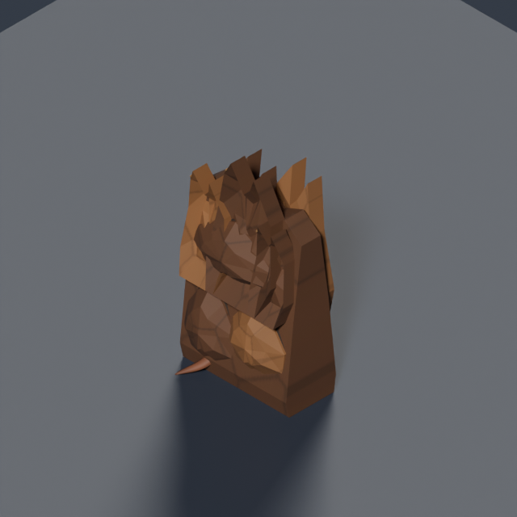
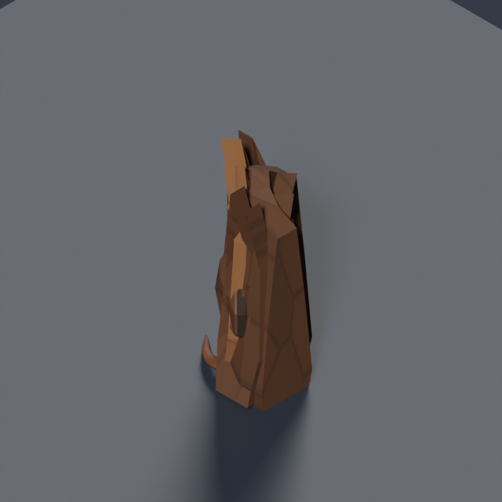
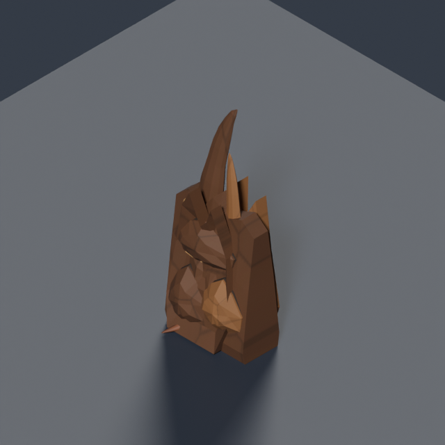
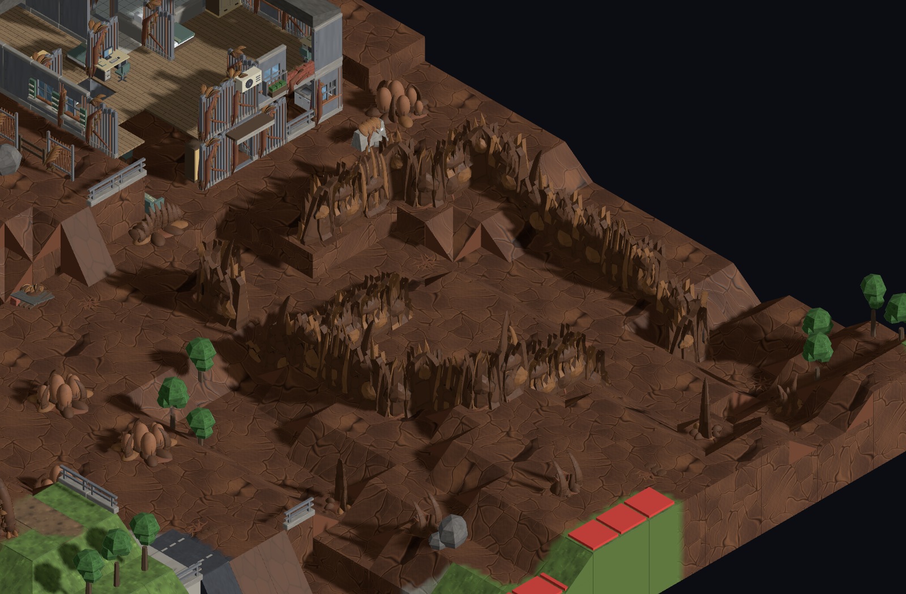
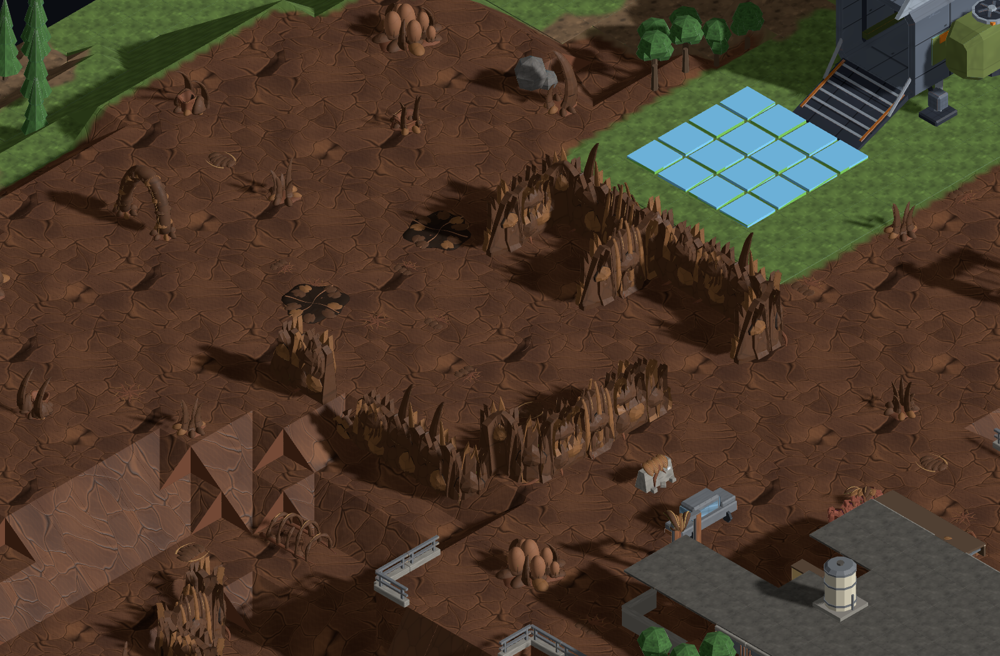

# Modular carapace structures

Mature infestation patches grow structures from joined shell walls, corners, branching partitions and spine buttresses. The generator lays out their shape a cell at a time. Open chambers, broken sight lines and broad gateways give them the spatial role of buildings.

The kit contains eight independently placed and demolishable pieces:

| Piece | Role | Height | Triangles |
| --- | --- | --- | --- |
| Ridge wall | Serrated carapace curtain | 1.88 u | 1,794 |
| Overlapping wall | Fused, layered shell plates | 1.76 u | 1,906 |
| Ribbed wall | Irregular structural ribs | 1.85 u | 2,548 |
| Curved corner | Joins two perpendicular wall runs | 1.85 u | 1,026 |
| Fork | Connects a partition to a wall run | 1.80 u | 1,588 |
| Torn end | Tapers a run into an opening | 1.69 u | 1,010 |
| Broken wall | Low fractured plates and low cover | 0.67 u | 1,066 |
| Spine buttress | Tall blade cluster attached to a wall | 2.45 u | 2,898 |

Each module occupies one tile. Straight walls join west/east at rotation zero; corners join north/east, forks west/east/north, and ends west. Clockwise quarter turns match map generation. The bases meet at tile boundaries, while overlapping plates and irregular tips break up the repeated grid.

## Generation and play

From infestation level 6, selected large colony cores reserve an irregular courtyard and circulation margin before human building lots are allocated. The planner constructs connected wall contours, opens two-cell gateways and grows partial dividers. Final placement respects mission approaches and reclassifies exposed ends when a protected route cuts a planned wall. Formations follow local ground heights; a narrow connected passage between gateways may be graded by at most one elevation layer to admit large bugs, with existing ramp endpoints held at their original heights. Levels 0–5 retain the approved generation.

Courtyards and gateways remain walkable infested ground, with enough room for large bugs. Ordinary colony obstacles are kept out of these routes. Each wall blocks only its own tile; demolishing one opens a local gap and leaves neighboring modules intact. High walls provide high cover and block sight through three half-height layers; tall spine buttresses occupy four. Broken sections provide low cover without blocking sight. Carapace walls use the existing building cutaway when they obscure a visible unit.

| Ridge wall | Curved corner | Spine buttress |
| --- | --- | --- |
|  |  |  |

## Reproduction and review

Source: [`infestation-carapace-kit.py`](../../../tools/art/models/infestation-carapace-kit.py). Export recipes are in [`infestation-kit.json`](../../../tools/art/infestation-kit.json). Each piece is exported with Blender, validated with trimesh and reviewed at 45°, 135° and 225°. Joined strips and corners are also reviewed to check continuity.

```sh
python3 tools/art/build-infestation-kit.py --only building.carapace-wall-ridge
python3 tools/art/build-infestation-kit.py --only building.carapace-wall-curve
python3 tools/art/build-infestation-kit.py --only building.carapace-spine-buttress
```

Review in Map Lab with models enabled, temperate / town / small, infestation 10. Seed `carapace-0` assembles 35- and 21-piece formations; `infestation-review` assembles 16- and 26-piece formations. Both retain ordinary colonies and require zero final connectivity repairs. For level 6, use `carapace-3`.





The eight pieces extend the accepted 64-model infestation kit. Every GLB stays under 500 KiB; each module is budgeted at most 10,000 triangles.

## Approved restore point

The version approved before this extension is commit [`97664986`](https://github.com/BenjaminBenetti/tut/commit/9766498603b0d07ebc5fddf3cb22290b7689db63), saved remotely as annotated tag `checkpoint/infestation-colonies-approved-2026-09-18`.

The [original level 0 / 4 / 10 comparison](infestation.md#review-in-map-lab) records that approved version.
