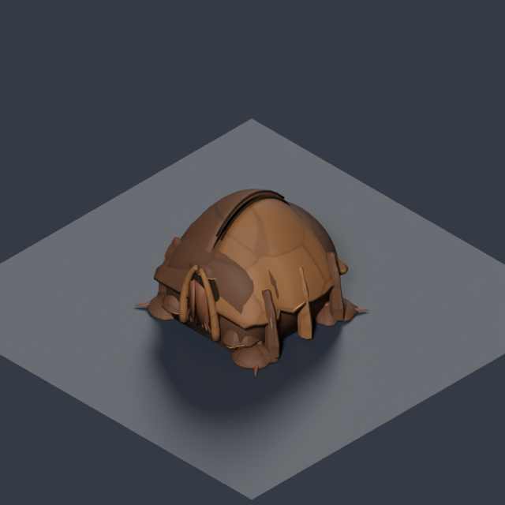
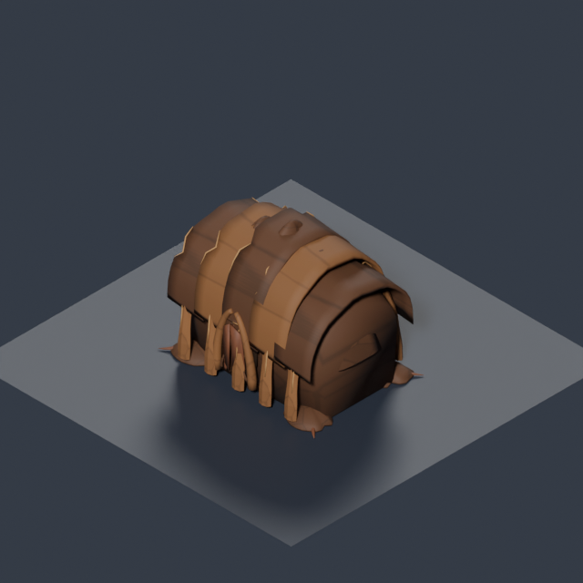
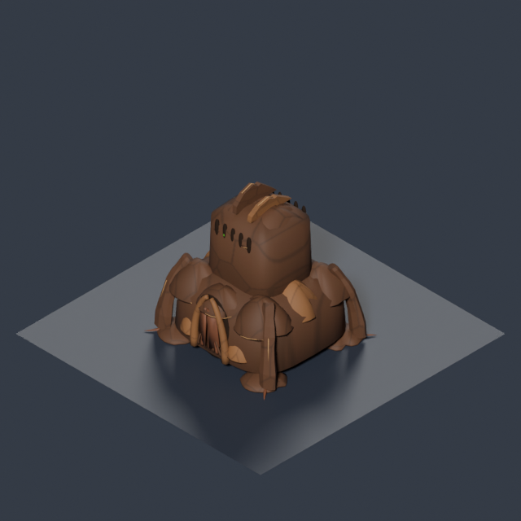
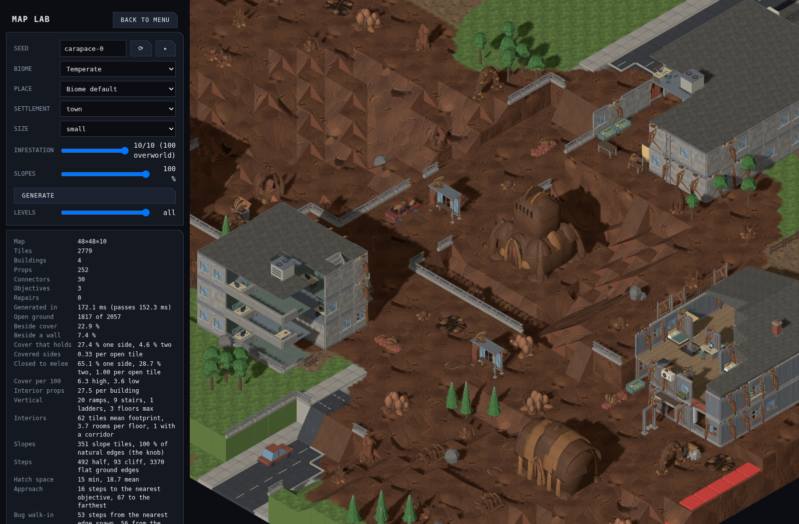

# Carapace colony buildings

Large infestation patches can grow enclosed carapace buildings in their mature cores. These are biological structures with overlapping shell roofs, heavy ribs and sealed chamber mouths. They use the approved walnut/chestnut colony palette and continuous shell grain.

| Structure | Footprint | Height | Triangles | Silhouette |
| --- | --- | --- | --- | --- |
| Shell lodge | 3×3 | 2.37 u | 8,634 | Low paired beetle vaults, split roof seam and lateral buttresses |
| Brood hall | 4×3 | 3.08 u | 11,612 | Long segmented roof, enclosed brood chambers and repeated structural ribs |
| Carapace keep | 4×4 | 4.13 u | 12,154 | Broad armoured body, stepped shell tiers and a raised vent crown |

From infestation level 6, selected colony cores reserve a level building site and circulation margin before settlement lots and slopes are generated. Placement checks the complete footprint against infestation, terrain, other structures and protected mission routes. Planning selects at most half the colonies, rounded up, and grades each affected tile by at most one elevation layer. A smaller shell may fit within the same reserved site when a mission firing route crosses its edge. A site that cannot safely hold a building retains its ordinary nest. Levels 0–5 retain their previous generation.

The structures are solid, demolishable high cover. Their full footprints block movement and their shell heights block sight, including elevated shots through the upper structure. Their sight volumes occupy 4, 5 and 6 half-height layers respectively; older props retain their existing one-storey rule. They do not provide walkable interiors or roofs. The renderer reveals the building when any occupied tile is seen and fades shells that hide visible units, using the existing building cutaway.

| Shell lodge | Brood hall | Carapace keep |
| --- | --- | --- |
|  |  |  |

## Reproduction and review

Source: [`infestation-carapace-kit.py`](../../../tools/art/models/infestation-carapace-kit.py). Export recipes join the existing infestation kit. Each model is exported with Blender, validated with trimesh and reviewed at 45°, 135° and 225° before registration.

```sh
python3 tools/art/build-infestation-kit.py --only building.infested-carapace-lodge
python3 tools/art/build-infestation-kit.py --only building.infested-carapace-hall
python3 tools/art/build-infestation-kit.py --only building.infested-carapace-keep
```

Review in Map Lab with models enabled, temperate / town / small, infestation 10: `infestation-review` shows a lodge and hall alongside existing nests; `carapace-0` shows the keep.




The complete structures use the detailed colony budget: at most 16,000 triangles and less than 500 KiB per GLB. The three models extend the accepted kit without replacing its 64 existing pieces.

## Approved restore point

The version approved before this extension is commit [`97664986`](https://github.com/BenjaminBenetti/tut/commit/9766498603b0d07ebc5fddf3cb22290b7689db63). It is also saved remotely as annotated tag `checkpoint/infestation-colonies-approved-2026-09-18`.

The [original level 0 / 4 / 10 comparison](infestation.md#review-in-map-lab) records that approved version.
