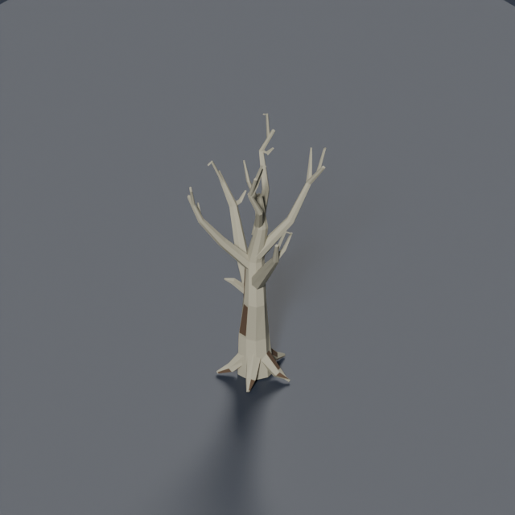
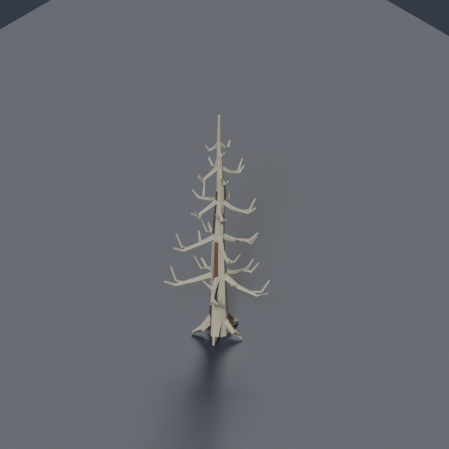
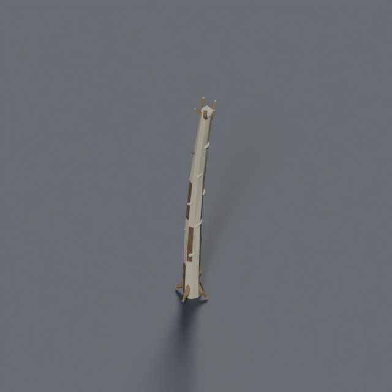
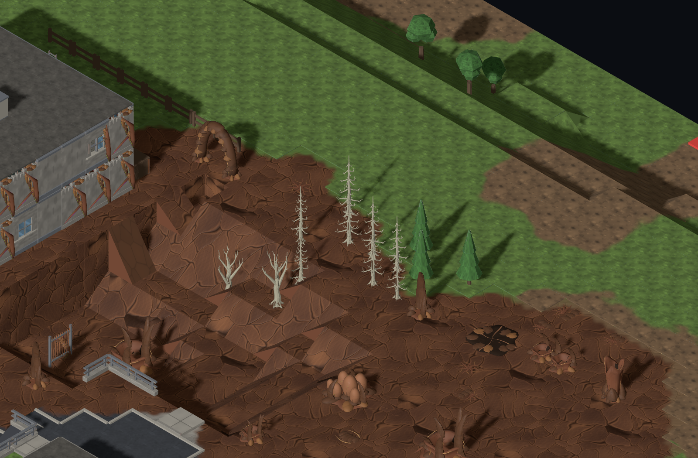

# Leafless trees in infestation

Trees rooted in infested ground lose all foliage. Oak, pine, palm, tropical almond, oil palm, tuart, banksia and grass-tree each have a dead variant with a recognizable bare silhouette. Weathered wood separates the branches from the brown resin beneath them.

The renderer selects the variant from the tree's actual supporting tile. This also catches trees preserved for mission cover and trees at the fringe of a patch. Clean ground retains living trees, even in a heavily infested district. The swap preserves position, orientation, seeded scale, footprint and demolition identity. It does not consume generation randomness or alter the saved map.

| Bare oak | Bare pine | Stripped palm |
| --- | --- | --- |
|  |  |  |

Source: [`infestation-dead-trees.py`](../../../tools/art/models/infestation-dead-trees.py). The eight recipes are part of [`infestation-kit.json`](../../../tools/art/infestation-kit.json). Each model is exported with Blender, validated with trimesh, and reviewed at 45°, 135° and 225°. All eight have closed meshes, ground-level pivots and a 1×1 footprint; they range from 818–2,316 triangles and 57,168–158,572 bytes.

```sh
python3 tools/art/build-infestation-kit.py --only prop.tree-oak-dead
python3 tools/art/build-infestation-kit.py --only prop.tree-pine-dead
python3 tools/art/build-infestation-kit.py --only prop.tree-palm-dead
```

Review seed `infestation-review`, temperate / town / small, with models enabled, at infestation 4 or 10. Infestation 0 retains the original trees.


