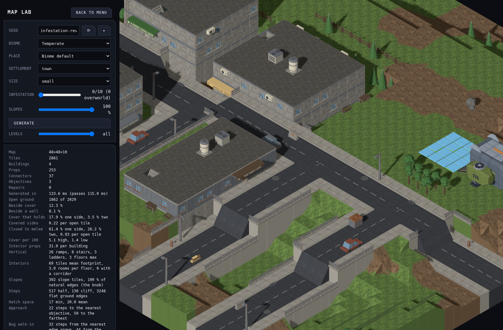
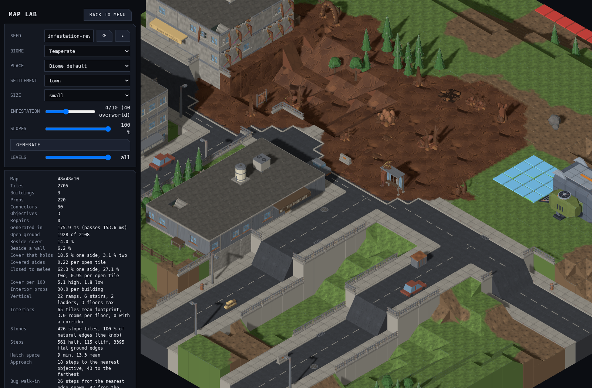

# Colony generation and environment kit

Infestation is a second land use generated alongside the settlement. It reserves colony districts before building parcels, connects them with feeding routes, invades streets and hills, reclaims vegetation, and breaches building corners. Increasing the level changes the playable layout as well as its appearance. Level zero is unchanged.

The colony pressure field also selects infested civilian assets. Cars keep their original orientation and footprint; concrete, panel, plaster and brick walls retain their architectural family. Destruction opens real wall gaps and removes upper floor and roof sections after checking access to the remaining building. An existing mech approach to a firing position is reserved before new colony obstacles are placed, preserving the ability to attack indoor objectives. Large organisms occupy explicit multi-tile footprints. Low ribs and broken masonry provide low cover; tall hives, spines and arches provide high cover. Shallow roots and resin sumps are surface detail.

## Art direction and scope

The kit contains **67 models**, replacing the initial nine and adding **58**, against **226 baseline models**. The new additions are approximately one quarter of that catalogue. The kit includes six resin ground modules, 24 organic structures/details, 34 infested urban/ruin models and three large carapace buildings.

The palette follows the Crescent bugs: dark walnut and chestnut shells, irregular tan fracture edges, recessed flesh and restrained biological green. Nest mouths are hollow; spines use swept, fractured blades; layered shells have chipped rims and fissures. Vehicles have opened cabins, broken glazing, rust and growth emerging through their bodywork. Building pieces expose broken masonry and supports.

The user's request for substantially higher quality supersedes the initial 60/300/800-triangle infestation budgets. Repeated base terrain remains only **56 triangles**. Detailed structures use several thousand triangles with all GLBs below the repository's **500 KiB** ceiling. Models retain closed meshes, base pivots and exact placement footprints.

## Sources and reproduction

- [Carapace buildings](infestation-carapace.md): enclosed shell lodges, brood halls and keeps for large colony cores.
- [Organic kit](infestation-organic.md): all 30 organic models and individual build arguments.
- `tools/art/models/infestation-organic-kit.py`: colony structures and terrain relief.
- `tools/art/models/infestation-urban-kit.py`: invaded city objects and fractured architecture.
- `tools/art/infestation-kit.json`: all 64 export recipes and footprints.
- `tools/art/build-infestation-textures.py`: seamless 1024² albedo, normal and roughness maps.

```sh
# One model, including validation, three review angles and JSON registration:
python3 tools/art/build-infestation-kit.py --only prop.infested-nest

# Entire kit; workers export independently and registration is serialized:
python3 tools/art/build-infestation-kit.py --jobs 3

# Continuous resin materials:
art-python tools/art/build-infestation-textures.py
```

Every model was exported through Blender and validated with trimesh. Review renders at 45°, 135° and 225° live in `docs/design/renders/`. Geometry was revised after both isolated and in-game review: toy-like vehicle glazing, smooth nest rims, round bases, floating masonry, repeated ground patterns and regular burrow ribs were corrected.

## Surface continuity

The ground uses one four-tile repeating PBR field projected in world coordinates, so rotating or changing a terrain module cannot rotate its texture. Sparse authored relief uses the same material. A map-specific contact field makes resin margins irregular and blends into the adjacent biome's substrate colour. Small shell bump and roughness variation adds grain to colony props while preserving their authored colours. Materials, fog, shadows and instanced rendering share the regular tactical renderer.

Most ground uses the quiet base module; sparse ribs, cracks and root plates indicate feeding routes and nest areas. The textures contain no baked lighting. Ground remains **2× movement cost for TDF, ½× for bugs**, including infested slopes and indoor floors. Infantry-only building access is retained.

The [carapace building review](infestation-carapace.md) shows the latest extension in generated maps, with the original approved comparison retained below.

## Review in Map Lab

Compare the same seed at infestation **0, 4 and 10**, with models enabled:

`/mapgen-preview.html?seed=infestation-review&biome=temperate&settlement=town&size=small&infestation=10&models=1`

The approved checkpoint before the carapace extension shows the transition from four intact buildings at level 0, to two colony clearings at level 4, to three connected colonies and two breached buildings at level 10. All three maps require zero connectivity repairs.

| Baseline: 0 | Outbreak: 4 | Mature colonies: 10 |
| --- | --- | --- |
|  |  |  |
