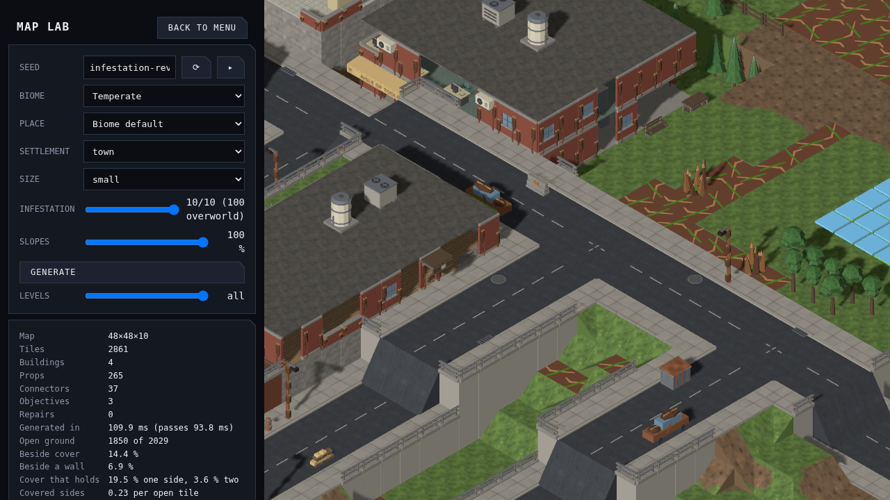

# Infestation environment kit

The tactical infestation pass adds resin ground, craggy burrows and building damage. Graphics swaps cars, lamps and wall sections to this kit according to the recipe's 0–10 infestation level. Doorways retain their opening, cars retain their footprint and rotation, and infested walls retain their original collision kind. Missing wall sections are removed in simulation; missing pitched roof sections are recorded on the building. Walkable floors and roofs stay supported.

All nine models are generated by `tools/art/models/infestation-kit.py`, using the existing brown chitin, tan ridges, rust and small dim-green resin accents. The script reuses the authored brick wall geometry so window and door openings agree with the clean kit. Every mesh is closed and grounded. The ground tile stays under 60 triangles, props under 300 and walls under 800.

| Build argument | Model id | Category | Footprint |
|---|---|---|---|
| ground | tile.ground.infested | tiles | 1x1 |
| nest | prop.infested-nest | props | 1x1 |
| car | prop.car-infested | props | 2x1 |
| compact | prop.car-compact-infested | props | 1x1 |
| lamp | prop.lamp-post-infested | props | 1x1 |
| solid | building.wall-solid-infested | buildings | 1x0 |
| window | building.wall-window-infested | buildings | 1x0 |
| door | building.wall-door-infested | buildings | 1x0 |
| half | building.wall-half-infested | buildings | 1x0 |

Rebuild a member with its row's arguments (the filename replaces the model id's dots with hyphens):

```sh
blender -b --python tools/art/make_model.py -- \
  --script tools/art/models/infestation-kit.py --build-arg kind=nest \
  --id prop.infested-nest --category props --file prop-infested-nest.glb \
  --footprint 1x1 --max-triangles 300 --quality final --no-textured
```

The loop exports GLB, validates with trimesh, records the manifest and renders 45°, 135° and 225° views. All three views were reviewed for each member. Review examples: [nest](../renders/prop.infested-nest_045.png), [car](../renders/prop.car-infested_045.png), [lamp](../renders/prop.lamp-post-infested_045.png), [door](../renders/building.wall-door-infested_045.png), [ground](../renders/tile.ground.infested_045.png).

In Map Lab compare the same seed at infestation 0, 4 and 10:
`/mapgen-preview.html?seed=infestation-review&biome=temperate&settlement=town&size=small&infestation=10&models=1`.


