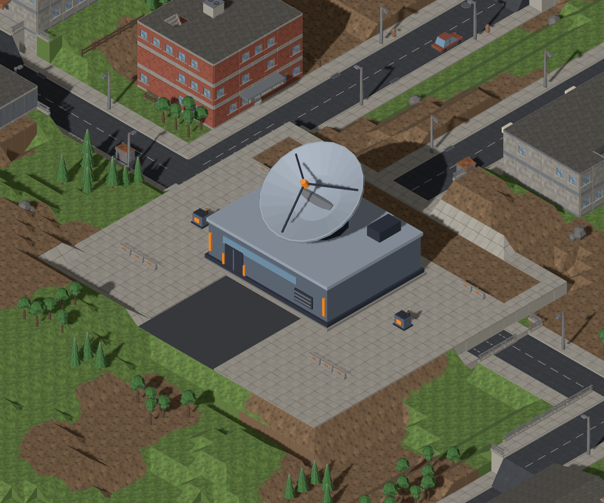
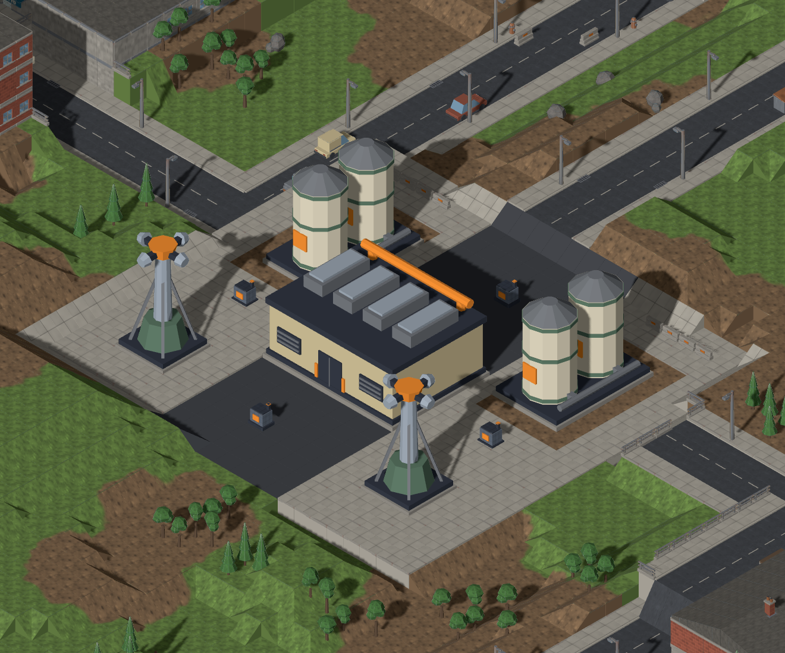
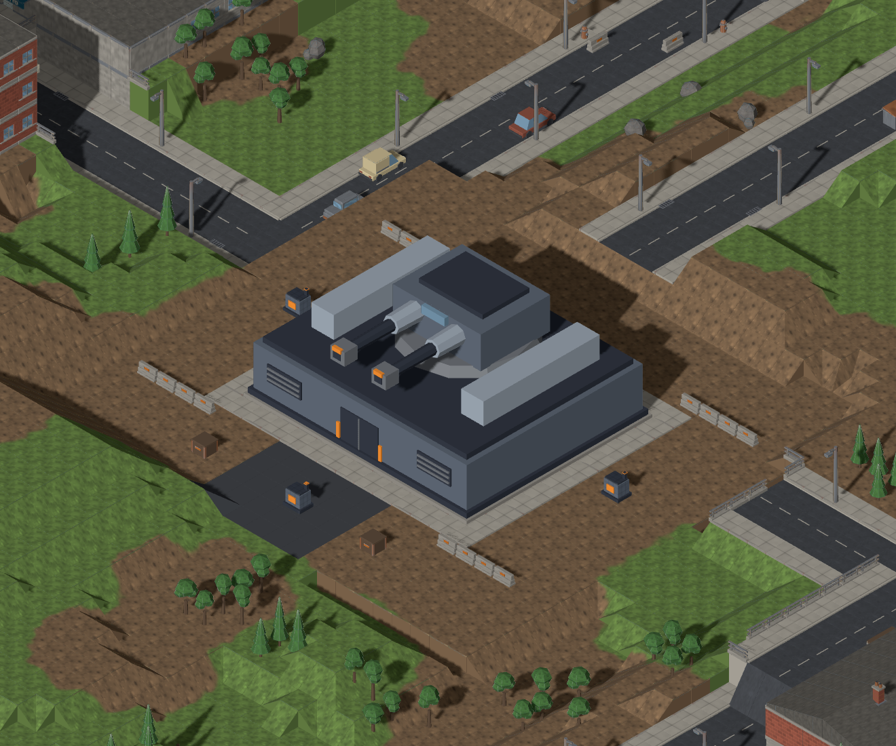
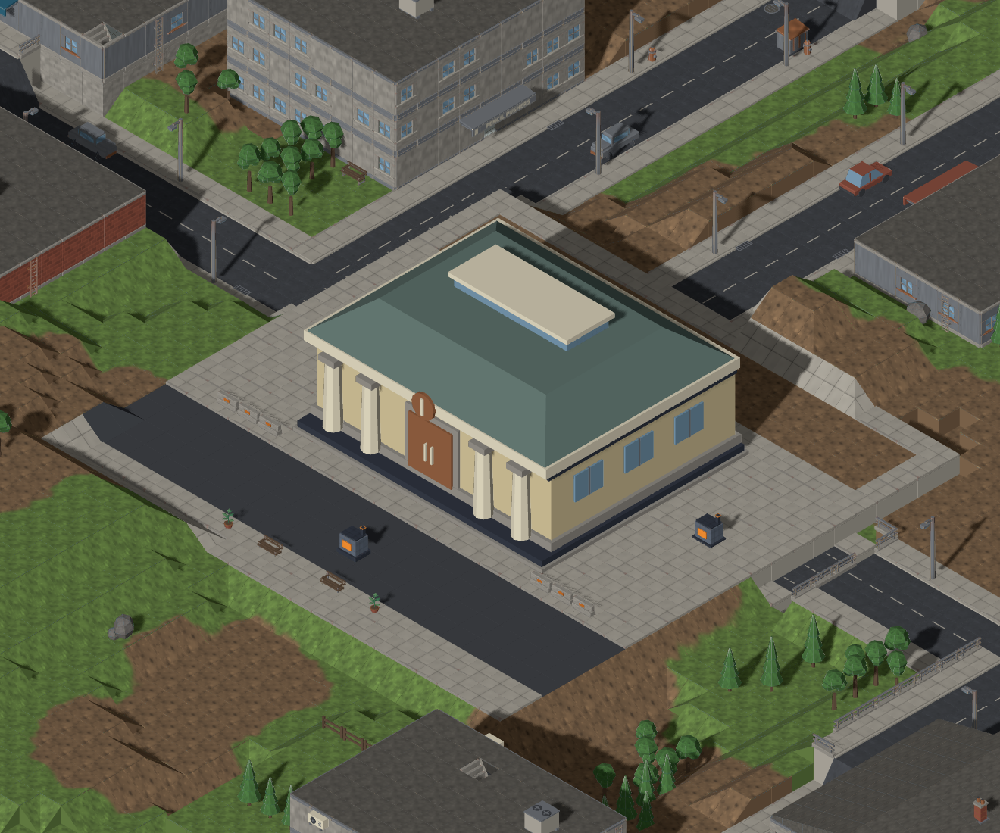

# Installation facilities (#1175)

Defense missions now reserve a purpose-built compound before ordinary settlement
lots. Each installation has building-scale geometry and a different yard layout.
The generator objectives, hit points, count, wave schedule and victory conditions
are unchanged.

| Installation | Main structure | Compound | Generators | Shape |
| --- | --- | --- | --- | --- |
| Sensor array | 10×8 tiles | 22×20 | 2 | Large concave reflector on a control bunker; flanking power units |
| Repellent dispersal | 8×6 pump hall, two 4×6 reservoir pairs, two 3×3 towers | 24×22 | 4 | Tank farm and spray towers with intersecting service lanes |
| Defensive battery | 12×10 tiles | 24×22 | 3 | Twin cannon, magazine bunker and blast walls; separated outer cover lines |
| Bank | 12×10 tiles | 22×22 | 3 | Colonnaded treasury with hipped roof, armored loading entrance and forecourt |

These are sealed facilities: their complete footprints obstruct movement and
provide cover. They have no accessible interior or walkable roof. Opaque heights
represent the main solid mass; the radar reflector and gun barrels stand above
the bunker sight volume. The plant's external generators remain the destructible
mission targets. Existing saved missions keep their original map and models;
newly launched missions use the compound recipe.

## Generated-map gallery

All four frames come from Map Lab's production generator and tactical renderer,
using seed `installation-review`, temperate / town / medium. Generator models are
placed at the real objective hooks. The captures wait for map and unit models
and reject asset fallbacks. They include the surrounding settlement for scale.

| Sensor array | Repellent dispersal |
| --- | --- |
|  |  |
| Defensive battery | Bank |
|  |  |

Reproduce with `pnpm exec playwright test e2e/installation-sites.spec.ts` or open
`/mapgen-preview.html?seed=installation-review&biome=temperate&settlement=town&size=medium&site=sensor-array&models=1&units=1`.
The Installation selector changes the facility and preserves it when generating
another seed or sharing the URL.

## Extending generation

`MissionSiteDefinition` in `src/mapgen/model/mission-site.ts` describes a local
composition: yard dimensions, a clear shoulder, base surface, terrain patches,
registered solid structures (including rotation), and objective sockets. The
four shipped definitions live in `src/mapgen/data/mission-sites.ts`; the pass
reads the injected `missionSites` registry, with no installation-type switch.
A new mission requests a registry id through `MapGenParams.site`. Custom prop
and surface ids are already open catalogues; graphics resolves their art
separately. A test registers a new research outpost without changing the pass.

```text
recipe.site -> registry definition
                    |
roads + landing -> select/grade site -> reserve shoulder -> ordinary lots
                    |                                         |
             terrain + structures                      surrounding town
                    |
recipe hooks -> authored objective sockets -> ordinary placers fill remainder
                    |
           ramps / final connectivity -> freeze ordinary tiles, props, hooks
```

The planner selects a central location clear of the aircraft, prefers dry ground,
and grades the yard to the median existing elevation. It removes obsolete road
ramp endpoints before the normal ramp pass builds joins on the new terrain.
Lots, elevated features, vegetation, fences, yard clutter and colony development
respect the reservation. Connectivity repair can open surrounding routes but
cannot erase authored structures to reach an objective.

Definitions are validated before stamping: registered surfaces/props, positive
integer dimensions, in-bounds terrain and structure footprints, and unblocked,
unique objective sockets. Recipes that cannot fit the facility fail explicitly.
`site` is optional; ordinary and legacy `landmark` recipes keep their existing
path. Site placements are draft metadata; saved maps use the existing multi-tile
prop and terrain contracts, so no save migration is needed.

The current composition stamps a level yard and surface patches. Future features
such as accessible bespoke rooms or authored elevation profiles can extend the
site realization stage while retaining reservation and objective placement.

## Art source and checks

`tools/art/models/installation-facilities.py` builds six models through the
repository's headless Blender workflow. Each is below 800 triangles, uses the
existing environment/TDF palette, stands on the ground, and fits its registered
footprint. Models were validated with trimesh and inspected at all three fixed
isometric angles. The 18 renders live under `docs/design/renders/installation.*`.

```sh
blender -b -t 4 --python-exit-code 1 --python tools/art/make_model.py -- \
  --script tools/art/models/installation-facilities.py --build-arg kind=sensor \
  --id installation.sensor --category buildings --file installation-sensor.glb \
  --footprint 10x8 --max-triangles 800 --no-textured
```

Other `kind`/footprint pairs: `pump-house`/8x6, `tanks`/4x6,
`spray-tower`/3x3, `battery`/12x10 and `bank`/12x10. Substitute the kind in
both the id and filename. Register the printed manifest entry after rebuilding.

The generation sweep covers four facilities × twelve biomes × three map sizes,
including mature infestation on the largest maps. It checks real map invariants,
exact socket placement, reachability, collision/LOS, reservation preservation,
determinism, serialization and an injected custom catalogue. The browser test
checks all six GLBs through four complete generated compounds.
