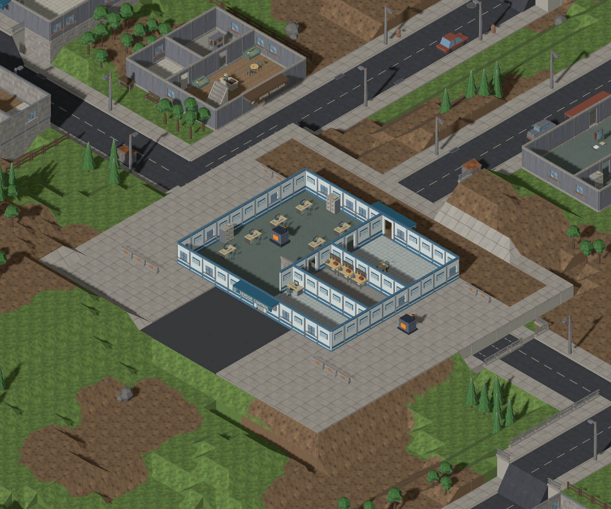
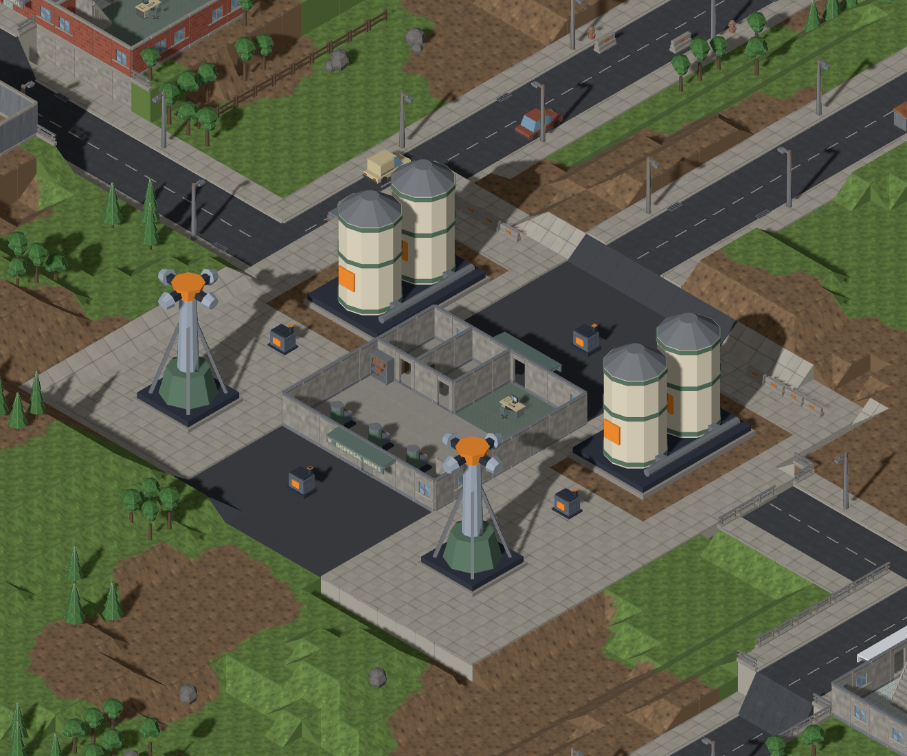
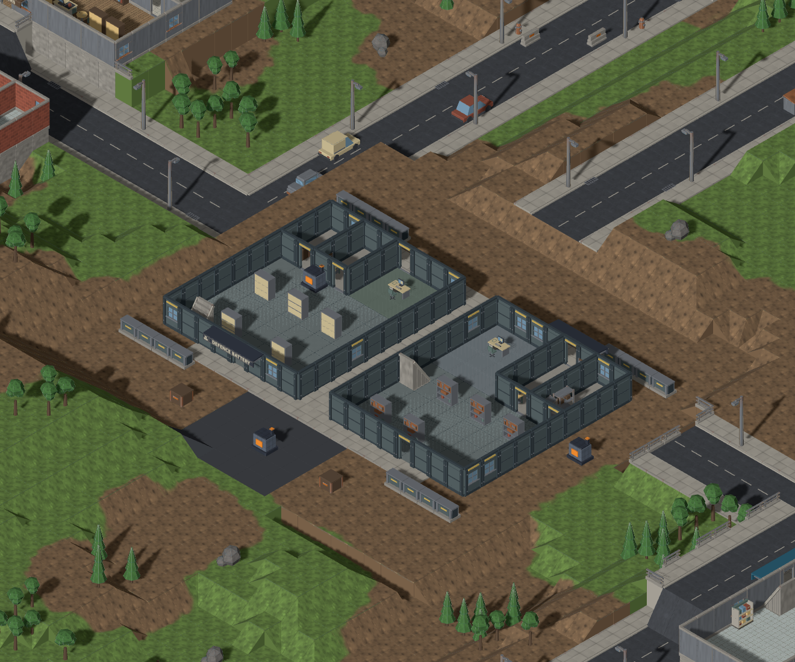
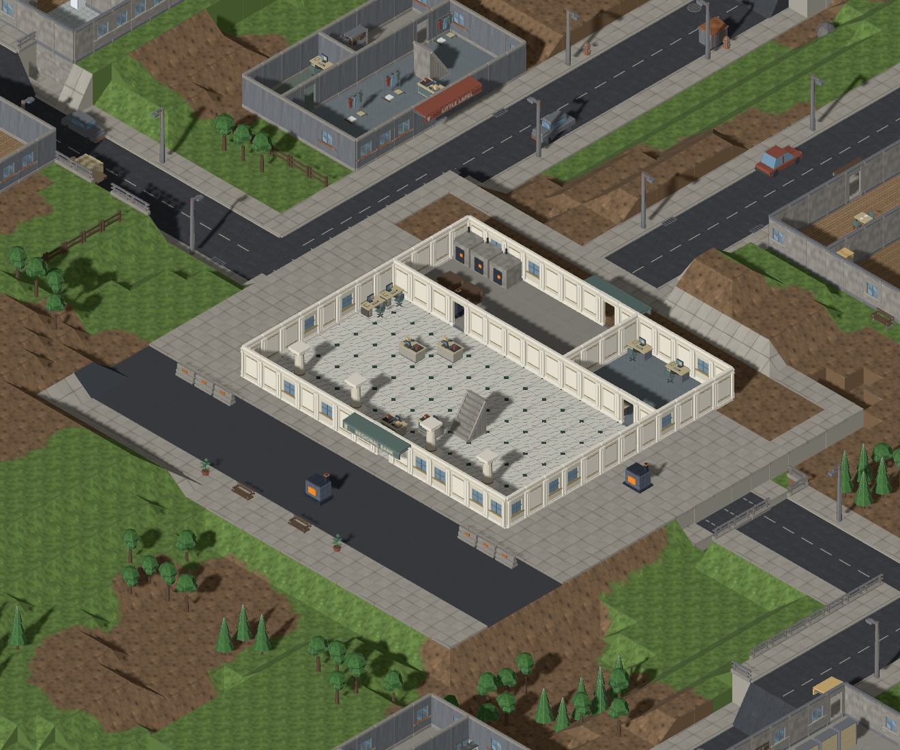

# Installation buildings (#1175)

Defense installations are ordinary, enterable buildings assembled from the same
floor, wall, window, door, stair and roof modules as the surrounding town. Each
has its own architectural plan, room uses, furnishings and service yard. Infantry
can fight inside, climb to the roof and breach individual walls. The normal
storey cut reveals the rooms and hides their roofs and rooftop equipment.

| Installation | Buildings | Interior | Compound / generators |
| --- | --- | --- | --- |
| Sensor array | 12×10, two storeys; separate 5×5 radar on the roof | Reception, operations consoles, offices, workshop and meeting rooms | 22×20 / 2 |
| Repellent dispersal | 8×8 pump hall, with separate tank and spray equipment outside | Pump skids, control room, workbenches and service storage | 24×22 / 4 |
| Defensive battery | Two 8×10 magazine buildings, each with a separate 4×5 gun on its roof | Ammunition racks, crates, control and maintenance rooms; passage between buildings | 24×22 / 3 |
| Bank | 14×12, two storeys | Public banking hall with teller counters, secure storage rooms, upstairs offices and meeting space | 22×22 / 3 |

Every building has front and rear entrances, interior stairs and a walkable roof.
The external generator counts, hit points, wave schedule and victory rules are
unchanged. Tanks and machines occupy prop footprints; the buildings themselves
are traversable floor tiles bounded by normal, individually destructible walls.

## Generated-map gallery

These are actual Map Lab captures through the production generator and tactical
renderer, using seed `installation-review`, temperate / town / medium. The second
column uses the game's building storey cut to expose the ground-floor interiors.
The captures wait for all assets and reject placeholder fallbacks.

| Installation exterior | Ground-floor interior |
| --- | --- |
|  |  |
|  |  |
|  |  |
|  |  |

Reproduce with `pnpm exec playwright test e2e/installation-sites.spec.ts` or open
`/mapgen-preview.html?seed=installation-review&biome=temperate&settlement=town&size=medium&site=sensor-array&models=1&units=1`.
The Installation selector retains the facility when regenerating or sharing a URL.

## Extending generation

`MissionSiteDefinition` in `src/mapgen/model/mission-site.ts` composes a graded
yard, terrain patches, building parcels, external equipment and objective sockets.
The injected `missionSites` catalogue selects a definition through `recipe.site`;
there is no installation-specific branch in the generation or rendering code.

A building parcel requests a registered template, exact footprint, floor count,
frontage, optional extra entrances and optional roof equipment. The site pass
writes normal `Lot` records. `BuildingPass` realizes their requested template;
`InteriorPass` supplies the ordinary rooms, stairs, roofs and ladders; the usual
furnishing pass arranges furniture around doors and routes. Unspecified lots
continue to choose buildings from biome weights. Authored lots are preserved
when ensuring settlement verticality or legacy landmarks.

```text
recipe.site -> catalogue definition
                    |
roads + landing -> grade yard and reserve shoulder
                    |
          +---------+-------------------+
          |                             |
   authored building lots       terrain / equipment / sockets
          + surrounding lots            |
          |                             |
   ordinary building shells             |
          |                             |
   roof fixtures -> rooms/stairs -> furnishing
          |                             |
          +---- hooks / ramps / connectivity
                            |
              ordinary saved buildings, tiles, props and hooks
```

Roof fixtures are placed before stairs choose their holes and landings. Their
full footprints therefore participate in access planning, instead of a large
machine either blocking the only stair or disappearing when the roof is dressed.
The rooftop pass counts existing fixtures against its quota and validates the
complete footprints of additional equipment. Placement validation requires a
clear roof perimeter and a clear apron outside building walls.

The site planner chooses a central location outside aircraft clearance, prefers
dry ground and grades to the median elevation. It discards obsolete road ramps
before the usual ramp pass reconstructs terrain joins. Ordinary lots, vegetation,
fences and colony development respect the yard reservation. Definitions reject
unknown templates, invalid dimensions/floor counts, overlapping buildings or
props, blocked approaches and malformed roof equipment before altering the map.

A future mission can register a new site using existing building templates, or
add a new template with its own architectural plan and room programme. The custom
catalogue test composes a two-storey house, rotated equipment and terrain without
changing any generator. No new building runtime type or save migration is needed.
Active saved missions retain their stored maps; the earlier sealed models remain
registered only so those saves still render. New defense maps use modular buildings.

## Art and validation

`tools/art/models/installation-equipment.py` builds the separate radar, gun and
interior pump. The radar and gun reuse the mechanical geometry from the earlier
facility source, with all bunker geometry removed. Each module passed trimesh
validation and review of all three fixed isometric renders under
`docs/design/renders/installation.{radar,cannon,pump}_*.png`. The exterior tanks
and spray towers retain their existing equipment models. Building shells use the
existing modular kit throughout. `installation-frontages.py` prints the four
installation names on the existing entrance-canopy geometry; those ordinary wall
attachments follow the same cutaway and demolition ownership as other signs.

```sh
blender -b -t 4 --python-exit-code 1 --python tools/art/make_model.py -- \
  --script tools/art/models/installation-equipment.py --build-arg kind=radar \
  --id installation.radar --category buildings --file installation-radar.glb \
  --footprint 5x5 --max-triangles 800 --no-textured
```

Use `cannon` / `4x5` for the gun; use `pump` / `1x1`, category `props` and
`--max-triangles 300` for the interior machine.

The four-installation, twelve-biome, three-size sweep checks map invariants,
exact building and generator placement, room and roof reachability, entrances,
furniture, equipment collision, serialization and infestation compatibility.
Browser checks exercise real models and both exterior and interior storey views.
