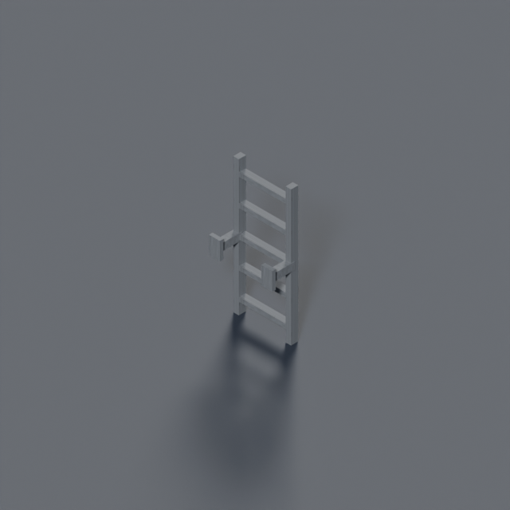
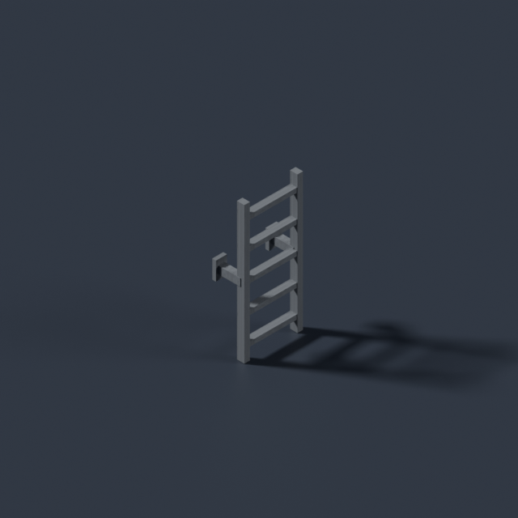
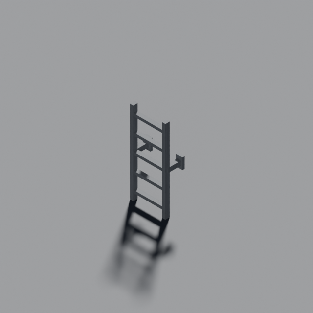
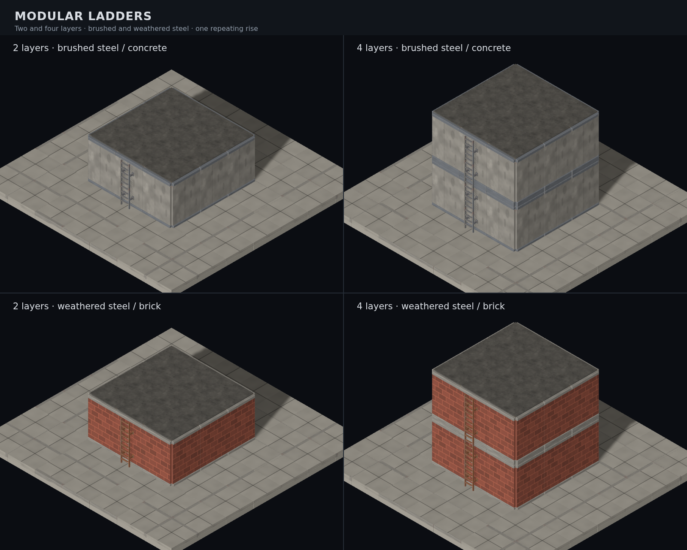

# Materialled ladder connector — #891

`building.ladder` is a wall-mounted steel section with two rails, five rungs,
stand-offs and back plates. It replaces the last connector placeholder class.
It is **132 triangles, 10,712 bytes, watertight**, registered in both manifests
and consumed by the instanced tactical scene.

## Source and placement contract

Source: `tools/art/models/building-ladder.py`, through `make_model.py`.
It imports the terrain kit's single `RISE = 0.75` from `terrain_slope_parts.py`.
The section's base-centred footprint is **0.35 × 0.16 u**, height one RISE.
Back plates face glTF **+Z**; the rungs face **−Z**.

The consumer repeats one section per integer layer, instead of stretching the
whole ladder. At today's rise, the rungs stay **0.15 u apart** with a 0.025-u
thickness. Two, three and four layers therefore have 10, 15 and 20 rungs.
Eight-layer geometry is also verified; the generator currently emits only 2–4.
The scene scales each section against the manifest height, so its total height
is exactly the lower-to-upper tile-top difference.

The pivot sits between the connector's horizontal endpoints, displaced **0.13 u
toward the lower tile**. Its back plate reaches the wall's outer face, 0.05 u
from the wall centre, with the rung line held in front of it. All four directions
use the connector's existing endpoints. Data, movement and building walls are
unchanged. The lower ground slab remains.

## Material and ownership

The authored GLB references the existing environment atlas's `env-metal` cell.
The facade actually drawn behind the ladder's midpoint selects the finish:

| Support | Finish |
| --- | --- |
| Brickwork | Weathered steel, `env-rust` atlas cell |
| Concrete or panel facade | Brushed steel, `env-metal` atlas cell |

Looking at the resolved wall matters: a building id may choose concrete upstairs
while an untagged ground-floor wall is brick. The entire ladder keeps one finish,
including when it spans both materials. If no wall covers its midpoint, the
owning building's wall family supplies the fallback.

`LadderModelFactory` copies geometry once per finish and remaps U to the neighbouring
rust cell when needed. It borrows the loader's material and texture. The view caches
these two prototypes across connector ids, sections, heights and level batches;
the mist material is shared too. Nothing modifies or disposes the loader prototype.
Each ladder's placeholder retires permanently when its sections resolve. Arrival-tile
vision and upper-level peeling retain the old connector contract.

## Three fixed Blender angles

| 045 | 135 | 225 |
| --- | --- | --- |
|  |  |  |

## Live-scene composite



The composite uses the shipped resolver, factory, atlas and `TacticalMapView`.
It shows the front in the standard scene light so the rungs and stand-offs can
be judged against the facade. All three angles and this composite were opened.

```sh
blender -b --python-exit-code 1 --python tools/art/make_model.py -- \
  --script tools/art/models/building-ladder.py --id building.ladder \
  --category buildings --file building-ladder.glb --quality final --max-triangles 160
CAPTURE=1 pnpm exec playwright test e2e/ladder-connector-screenshot.spec.ts
```

[Seeded before/after controls, full sweep and fog comparison](../diagnostics/891/README.md).
