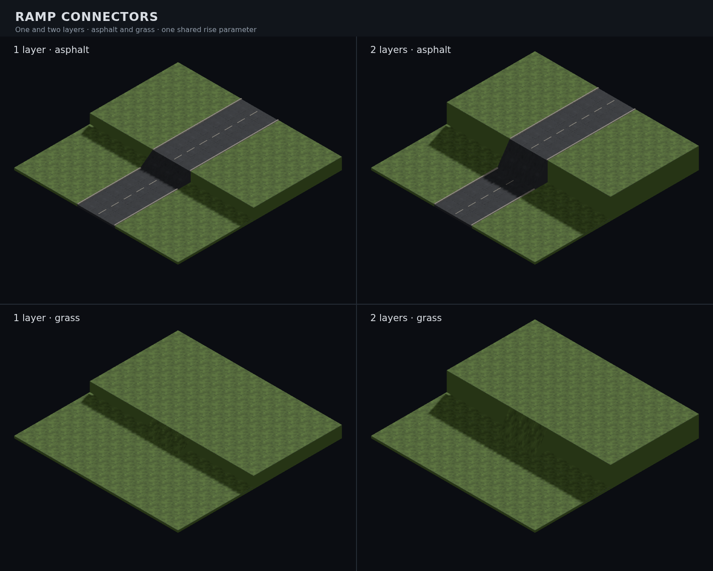

# Parameterised ramp connector (#875)



The connector uses the terrain kit's solid straight-wedge section: full tile
width, a closed foundation, and a materialled surface reaching the upper
terrace edge. Adjacent road lanes form one continuous asphalt apron. On
natural ground the same shape takes the ground atlas and terrace side colour.

| Asset | Footprint / pivot | Authored rise | Triangles | Bytes |
| --- | --- | --- | --- | --- |
| `tile.ramp.connector` | 1 × 1, base-centred | 0.75 | 8 | 1,792 |

| 45° | 135° | 225° |
| --- | --- | --- |
| [view](../renders/tile.ramp.connector_045.png) | [view](../renders/tile.ramp.connector_135.png) | [view](../renders/tile.ramp.connector_225.png) |

## Geometry and materials

`tools/art/models/terrain-ramp-connector.py` calls the shared straight-wedge
builder. It inherits the single `RISE` in `terrain_slope_parts.py`, its neutral
material, flat normals and projected UVs. The model loop validates the closed
mesh, exports the GLB, renders three angles, and records the manifest entry.
There is no separate rise constant in the connector source.

In glTF, the low edge is −Z and the high edge +Z; bounds are
`[-0.5, 0, -0.5] … [0.5, 0.75, 0.5]`. The scene scales Y by the connector's
layer difference, so one source spans one or two layers. Full-tile ramps
start at the lower tile's far edge and meet the upper terrace at its near
edge. The old centre-to-centre plank buried its upper half inside the bank.

`resolveRampModels` supplies the registered model, orientation, rise and
support material. Carriageways borrow asphalt; rural trails borrow their
resolved dirt road style; other surfaces borrow their ground material.
The shared `TerrainSlopeModelFactory` splits surface and terrace sides and
maps the surface UVs into that material's atlas cell. No material is baked
into a terrain-specific copy of the GLB.

Ramp prototypes cache by kind and material surface, excluding placement,
rotation, rise and elevation. They use the scene's existing instancing and
shared mist material path. Vision and level peeling remain owned by the
upper arrival tile, as for the old connector. The underlying flat surface
and individual grey placeholder retire after the model loads; later vision
changes cannot restore the placeholder. Unmapped custom surfaces retain
their fallback, and slope-supported legacy connectors keep their existing
materialled slope. Neither occurs among the 3,779 surveyed ramps.

Three surveyed lower tiles have two ramp exits. Those ramps use half-length
approaches from the tile centre, keeping the centre low and retaining its
flat ground. Both opposite and adjacent exits have actual-GLB ray tests.
All other connectors use the full lower tile. Map generation, traversal,
wall placement, stairs and ladders are unchanged.

## Evidence and reproduction

[K2 and ground controls, before/after, exact neighbourhoods and sweep](../diagnostics/875/README.md).
The composite above uses the real scene consumer, at one and two layers in
asphalt and grass; its road approaches are long enough to exercise the
carriageway resolver. All three neutral views and final captures were opened.

```bash
blender -b --python-exit-code 1 --python tools/art/make_model.py -- \
  --script tools/art/models/terrain-ramp-connector.py --id tile.ramp.connector \
  --category tiles --file terrain-ramp-connector.glb --quality final \
  --max-triangles 60 --no-textured
CAPTURE=1 pnpm exec playwright test e2e/ramp-connector-screenshot.spec.ts e2e/fog-screenshot.spec.ts
CAPTURE_BASE_URL=http://localhost:4173 node tools/art/preview/capture-ramp-controls.mjs after
```

The capture helper resumes completed controls. Clear only the intended phase's
outputs when regenerating it. The model geometry test covers both rises in
all four directions in asphalt and grass, continuous adjacent lane joins,
both terrace edges, actual atlas borrowing, fog ownership, level peeling,
placeholder retirement and prototype sharing across different rises.
