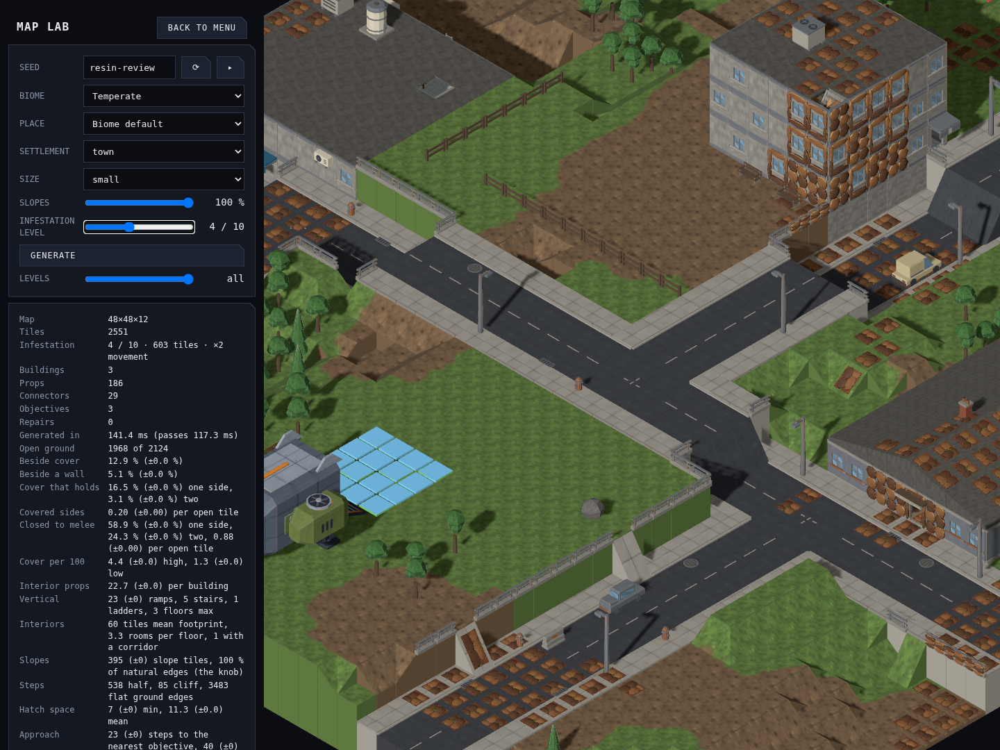
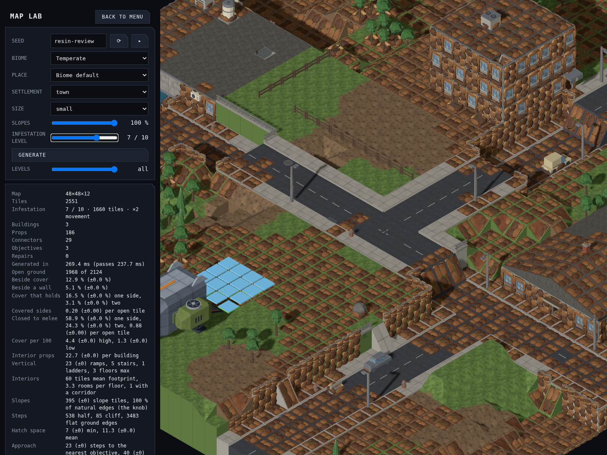
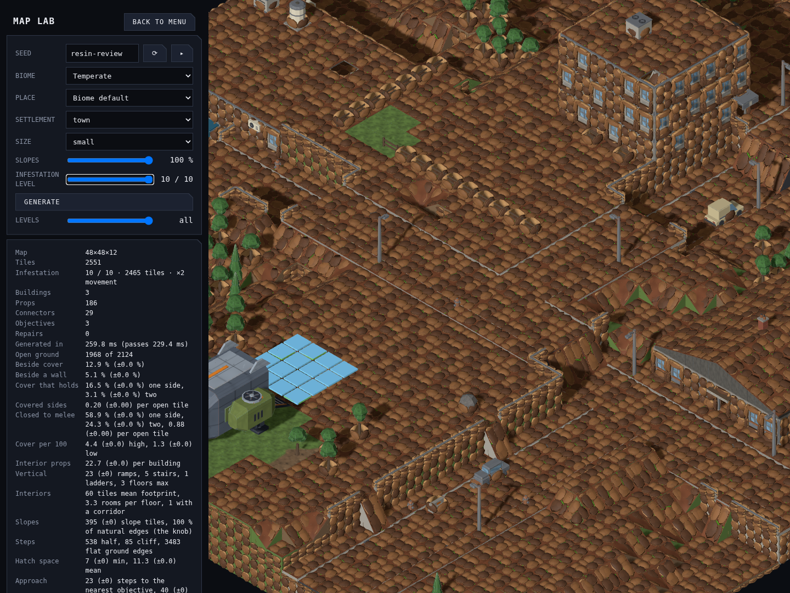
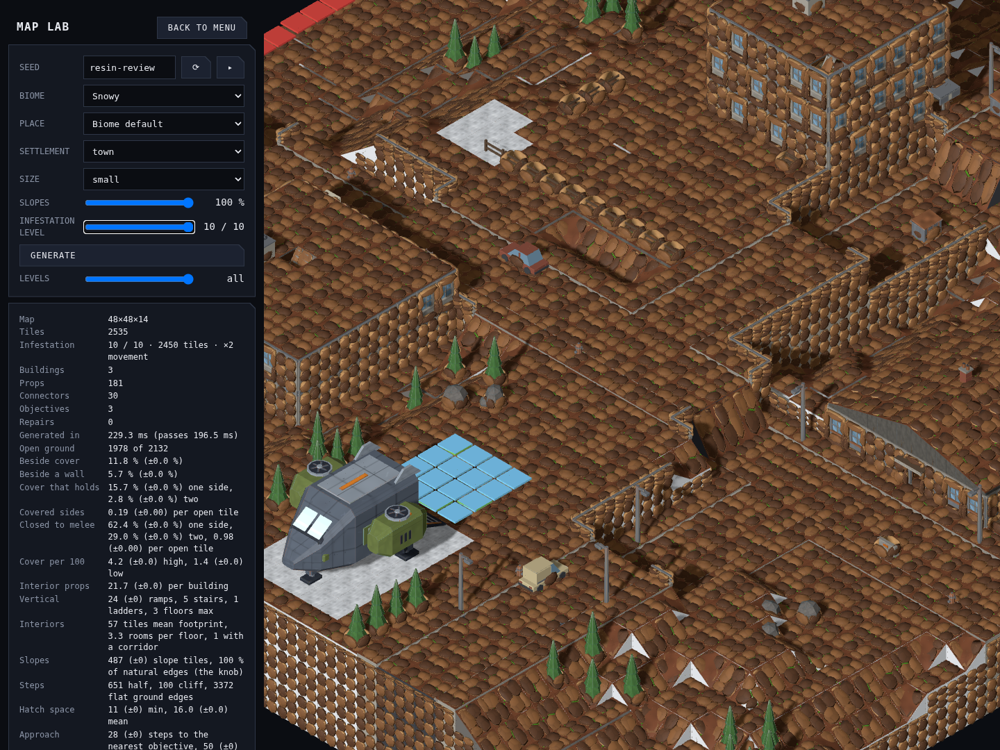
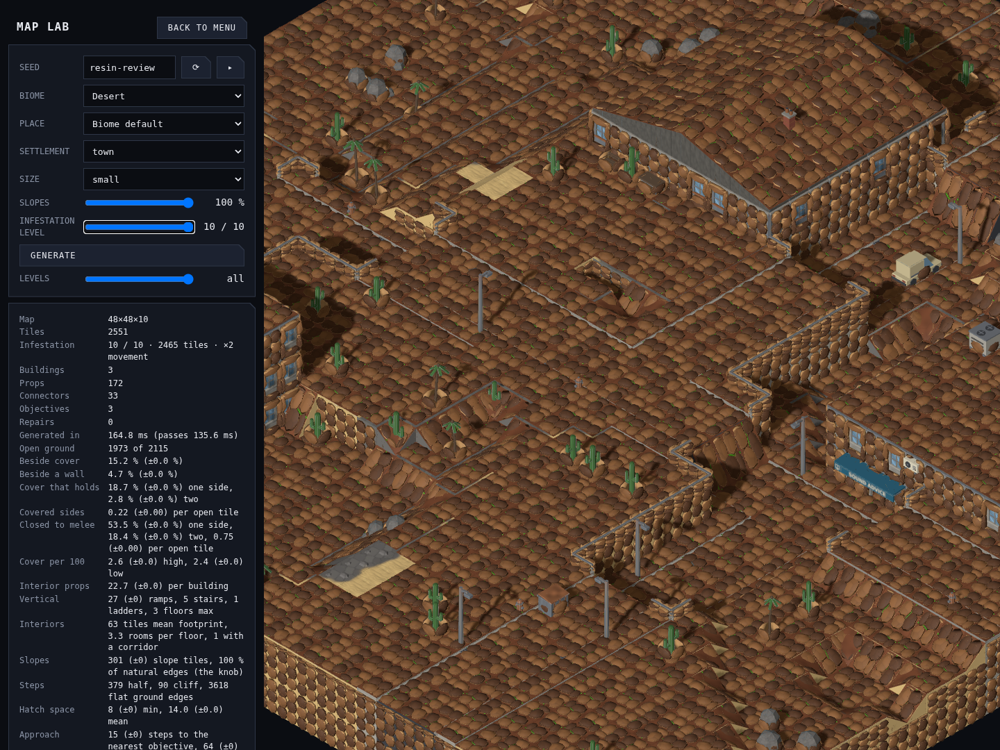
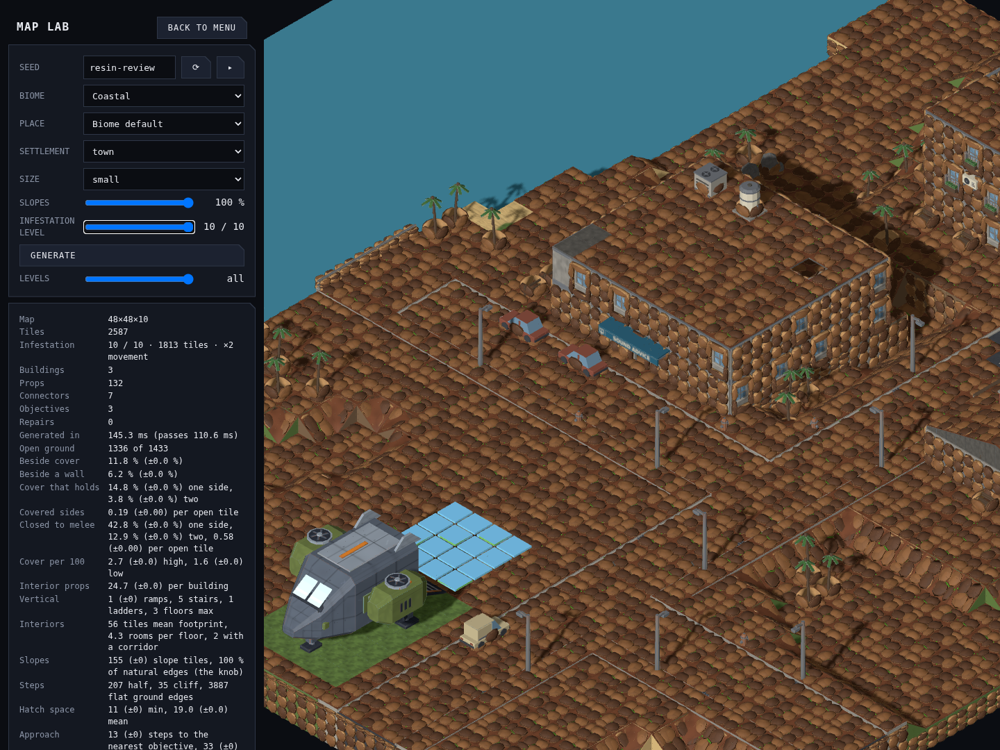
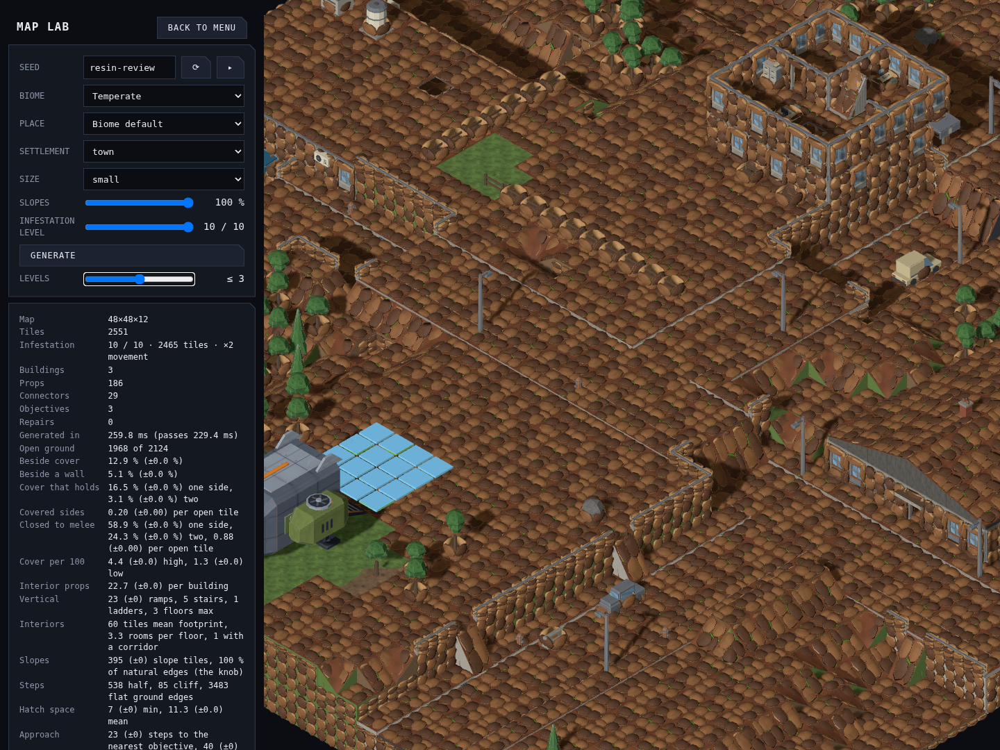
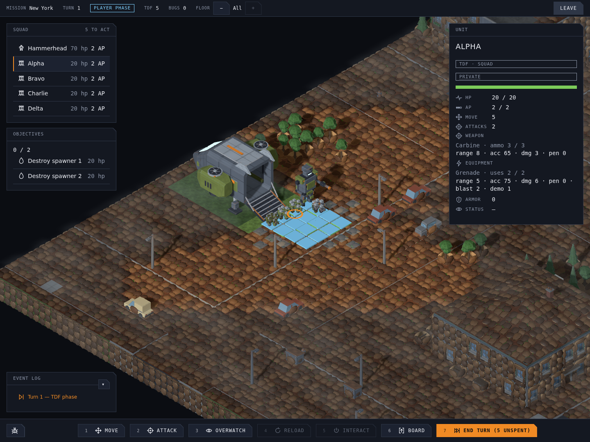

# Resin Shell infestation

Implemented from the user's selection of **B — Resin Shell**, the approved 0–10 progression, and the request for double movement cost and a Map Lab slider (2026-09-17, [#1166](https://github.com/BenjaminBenetti/tut/issues/1166)). [Original concept review](../concepts/infestation-level/README.md).

## Review in Map Lab

Run `pnpm dev`, open Map Lab from the menu, and drag **Infestation Level**. A fixed comparison is `/mapgen-preview.html?seed=resin-review&biome=temperate&settlement=town&size=small&models=1&infestation=10`. Changing infestation preserves the seed, layout, camera and selected floor cut. The URL stores the dial; the stats show the marked tile count and movement penalty.

These are actual production-renderer captures of the same generated map and camera, not concept paint-overs:

| Level 0 | Level 1 |
|---|---|
|  |  |
| **Level 4** | **Level 7** |
|  |  |



The ground is a continuous low skin with overlapping walnut/chestnut scutes, tan lips and small wet green seams. Wall growth starts at level 3; thicker collars and exposed cliff/foundation courses start at level 5. Skin size and thickness increase at every level. Ground height tops out at 0.16 world units to keep infantry readable; heavy volume grows around the existing vertical structures. Original materials remain underneath. Door/window apertures remain open, and decorative growth does not create cover, collision, damage or spawns.

## Dial and movement

| Level | Eligible tiles marked | Treatment |
|---:|---:|---|
| 0 | 0% | Existing map generation and art |
| 1 | 2.5% | Small isolated resin patches |
| 2 | 6% | Wider patches |
| 3 | 13% | Patches begin wrapping walls |
| 4 | 24% | Established shell pockets |
| 5 | 38% | Ground joins cliffs, foundations and prop bases |
| 6 | 52% | Majority coverage, heavier shell |
| 7 | 66% | Connected hive territory |
| 8 | 80% | Remaining clean areas become islands |
| 9 | 91% | Almost consumed |
| 10 | 98% | Maximum shell size and thickness |

Coverage is a fraction of non-water tiles outside the landed dropship hull, rounded down to whole tiles. Floors and roofs participate. A dedicated seeded noise field ranks tiles; the same ranking at every level makes growth monotonic. None of the terrain, buildings, props, connectors or hooks rerolls when the dial changes. These percentages are initial tuning in `src/mapgen/data/infestation-tuning.ts`.

New mission offers snapshot `ceil(clamp(city infestation, 0, 100) / 10)`: 0 stays clean, 1–10 maps to level 1, and 91–100 to level 10. Missing fields on older mission offers and maps remain clean. The map's additive `infested: true` marker survives normal JSON saves without a schema migration.

Entering a marked tile costs **2 movement distance**, versus **1** on clean ground. For example, a unit with 6 distance per action crosses 3 infested tiles in one action. Pathfinding chooses the least expensive legal route, so a longer clean route can beat a shorter infested one. The move bands, action wheel, command validation, interrupted-move AP charge and AI projections share the rule. All units, including bugs, use it; multi-tile units pay twice once if any destination cell is infested. Clean arrivals cost one even when departing resin. Existing connector and collision rules still apply.

## In-game checks

| Snow | Desert |
|---|---|
|  |  |
| **Coastal** | **Floor cut** |
|  |  |



Sloped tiles, shortened ramps, stairs and pitched roofs fit the authored skin to the actual rendered support. Fitted geometry is cached by support shape and shared by instanced batches. Ground skins remain solid; walls and collars inherit ghost cutaway eligibility. Shells retain their support's fog ownership, floor level and demolition identity. Deploy and movement markers clear the resin surface.

## Authored kit

Every piece is a closed Blender mesh built from `tools/art/models/infestation_parts.py` through its corresponding `infestation-<name>.py` wrapper. All six GLBs are registered in both asset manifests, use the existing bug atlas, and pass the watertight/base/budget validator. Ground skins have a 300-triangle overlay budget; walls use the existing 800-triangle building budget and collars the 300-triangle prop budget.

| Model | Triangles | 45° | 135° | 225° |
|---|---:|---|---|---|
| Ground A | 294 | [render](../renders/infestation.resin.ground-a_045.png) | [render](../renders/infestation.resin.ground-a_135.png) | [render](../renders/infestation.resin.ground-a_225.png) |
| Ground B | 294 | [render](../renders/infestation.resin.ground-b_045.png) | [render](../renders/infestation.resin.ground-b_135.png) | [render](../renders/infestation.resin.ground-b_225.png) |
| Wall | 720 | [render](../renders/infestation.resin.wall_045.png) | [render](../renders/infestation.resin.wall_135.png) | [render](../renders/infestation.resin.wall_225.png) |
| Window | 720 | [render](../renders/infestation.resin.window_045.png) | [render](../renders/infestation.resin.window_135.png) | [render](../renders/infestation.resin.window_225.png) |
| Door | 600 | [render](../renders/infestation.resin.door_045.png) | [render](../renders/infestation.resin.door_135.png) | [render](../renders/infestation.resin.door_225.png) |
| Prop collar | 240 | [render](../renders/infestation.resin.collar_045.png) | [render](../renders/infestation.resin.collar_135.png) | [render](../renders/infestation.resin.collar_225.png) |

Regenerate one piece, substituting its wrapper, id, category and budget:

```sh
blender -b --python tools/art/make_model.py -- \
  --script tools/art/models/infestation-ground-a.py \
  --id infestation.resin.ground-a --category tiles \
  --file infestation-ground-a.glb --quality final --max-triangles 300
```

Regenerate the Map Lab gallery with `node tools/art/preview/capture-infestation.mjs`; URLs, counts and browser errors are recorded in [captures.json](../diagnostics/infestation/captures.json). Capture the deployed squad with `CAPTURE=1 pnpm exec playwright test e2e/infestation-movement.spec.ts --workers=1`.

Automated coverage includes all 11 levels, unchanged level-0 maps, nested growth, all biomes, deterministic serialization, mission meter conversion, weighted routes/AP/interruption/connectors/footprints, support fitting, and Map Lab URL/regeneration/floor-cut behavior. The tactical browser test launches a real level-10 mission, spends two AP on a route that would cost one on clean ground, and reloads the saved mission.
