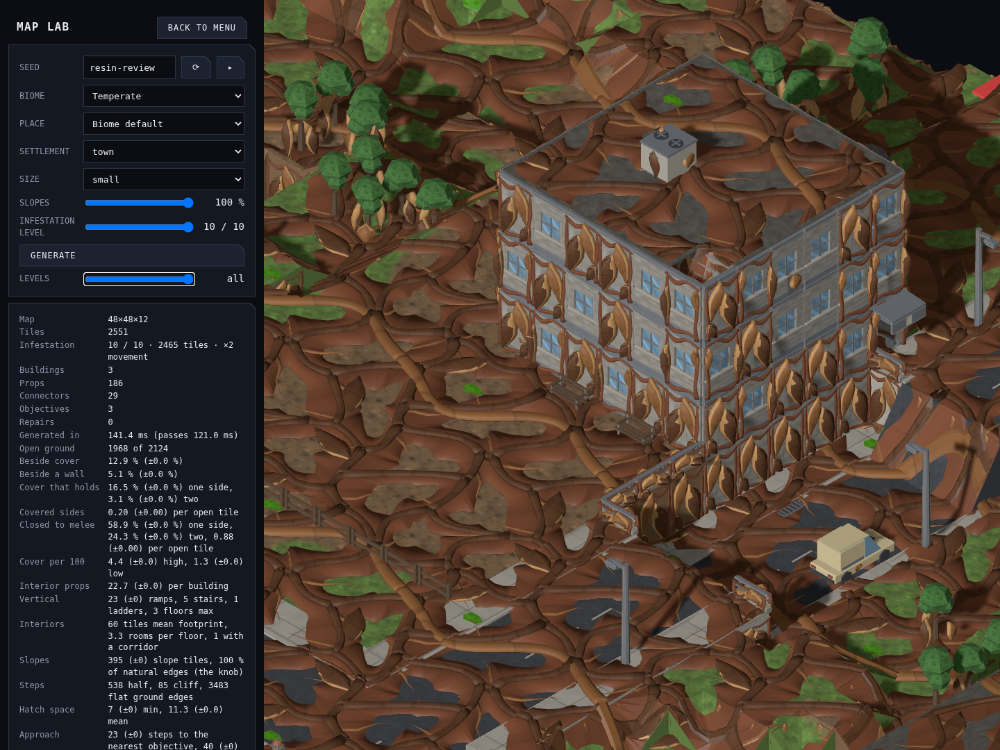
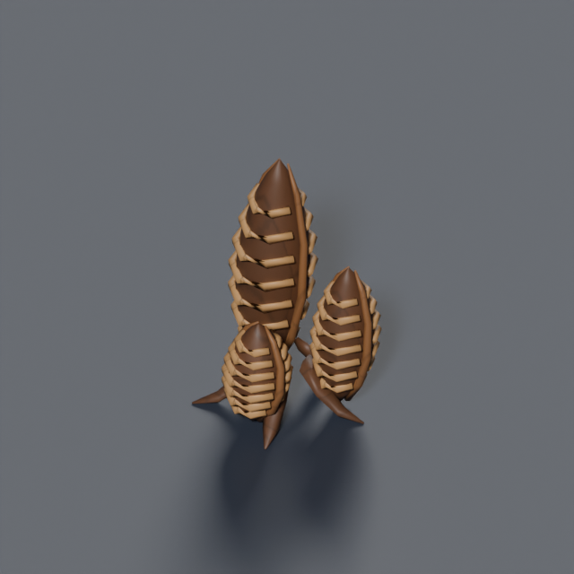
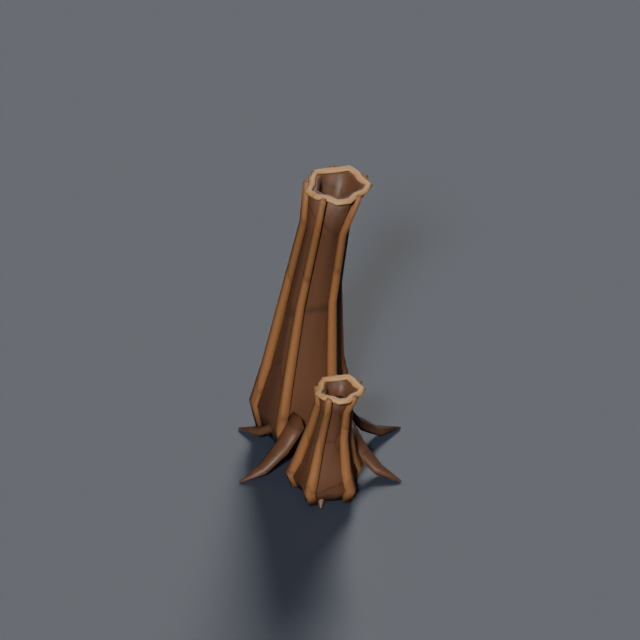
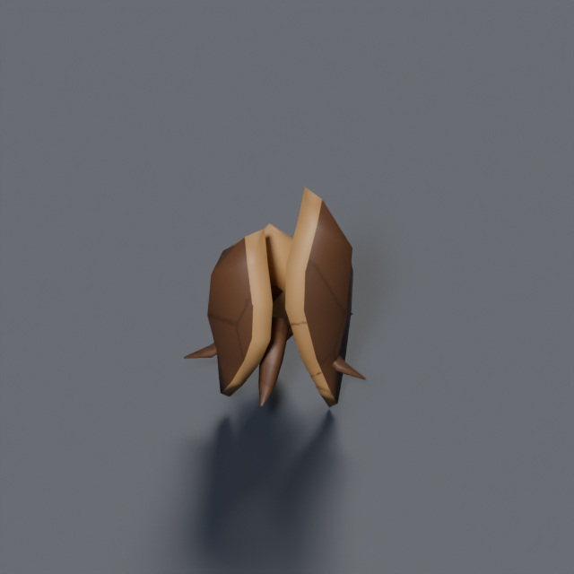

# Resin Shell infestation

Implemented from the user's selection of **B — Resin Shell**, the approved 0–10 progression, and the request for double movement cost and a Map Lab slider (2026-09-17, [#1166](https://github.com/BenjaminBenetti/tut/issues/1166)). [Original concept review](../concepts/infestation-level/README.md).

## Review in Map Lab

Run `pnpm dev`, open Map Lab from the menu, and drag **Infestation Level**. A fixed comparison is `/mapgen-preview.html?seed=resin-review&biome=temperate&settlement=town&size=small&models=1&infestation=10`. Changing infestation preserves the seed, layout, camera and selected floor cut. The URL stores the dial; the stats show the marked tile count and movement penalty.

These are actual production-renderer captures of the same generated map and camera, not concept paint-overs:

| Level 0 | Level 1 |
|---|---|
|  |  |
| **Level 4** | **Level 7** |
|  |  |


The hive now has eight additional forms: ribbed nursery clusters, hollow breathing vents, raised shell fans, two wall-mounted nursery variants, green wet seeps, shed shell plates and amber blisters. Large organs grow on existing occupied props and selected non-walkable pitched roofs. Their height follows the host, so mature growth can climb a tree trunk instead of remaining a small collar. The organs are decorative: they do not spawn bugs or add cover.

A smooth, seeded colony field controls the ground web's local maturity and bending. Dense shell beds give way to narrow tendrils and scattered wet pockets. Neighbouring props favour a shared organ family, with occasional secondary growth. Walls mix bare climbing roots and different-sized cocoons; the nursery arrangement varies between storeys. Windows and doors retain their apertures. Walkable floor details stay under 0.18 world units, including their lift, to keep movement overlays and infantry readable.



| Nursery clusters | Hollow vents | Shell fans |
|---|---|---|
|  |  |  |

### How adjacent tiles merge

`infestation_network.py` authors a **6 × 6 tile** source network from irregular warped cells, a winding main artery and tapered branches. `infestation-ground-a.glb` carries its `Mature` morph target; Ground B is the independently validated mature review model. The seed chooses a common source phase and rotation.

Before clipping, the renderer samples the colony field at each source vertex's actual map position. That sample controls the maturity morph, height and a second, larger-scale bend. The field continues across source-canvas boundaries, so the six-tile source no longer repeats with the same silhouette or thickness everywhere. Each prepared canvas is cached, then sliced into tile footprints. Shared vertices use identical inputs on both sides, retaining exact seams at neighbouring tiles and canvas wraps. Missing neighbours trim and flatten the fringe. Shortened ramps sample the corresponding portion of the web; ramp and stair links join across a storey rise.

The ownership split preserves fog and floor cuts. Attached organs keep the host prop or wall's demolition identity. All ground colours sample the existing bug atlas through one skin material. Distinct world-space slices require more geometry batches than the former periodic web; the capture metadata records scene batch and triangle totals, including instances outside the camera. Those totals are not a frame-rate benchmark. The authored forms still repeat, but their combination, local growth and placement vary across the map.

## Dial and movement

| Level | Eligible tiles marked | Treatment |
|---:|---:|---|
| 0 | 0% | Existing map generation and art |
| 1 | 2.5% | Fine roots and small patches |
| 2 | 6% | Wider strands |
| 3 | 13% | Patches begin wrapping walls |
| 4 | 24% | Established shell pockets |
| 5 | 38% | Ground joins cliffs, foundations and prop bases |
| 6 | 52% | Nursery sacs, vents and fans emerge on occupied props |
| 7 | 66% | Connected hive territory; non-walkable roof colonies |
| 8 | 80% | Remaining clean areas become islands |
| 9 | 91% | Almost consumed |
| 10 | 98% | Mature nursery clusters, tall vents, shell beds and wet pockets |

Coverage is a fraction of non-water tiles outside the landed dropship hull, rounded down to whole tiles. Floors and roofs participate. A dedicated seeded noise field ranks tiles; the same ranking at every level makes growth monotonic. None of the terrain, buildings, props, connectors or hooks rerolls when the dial changes. These percentages are initial tuning in `src/mapgen/data/infestation-tuning.ts`.

New mission offers snapshot `ceil(clamp(city infestation, 0, 100) / 10)`: 0 stays clean, 1–10 maps to level 1, and 91–100 to level 10. Missing fields on older mission offers and maps remain clean. The map's additive `infested: true` marker survives normal JSON saves without a schema migration.

Entering a marked tile costs **2 movement distance**, versus **1** on clean ground. For example, a unit with 6 distance per action crosses 3 infested tiles in one action. Pathfinding chooses the least expensive legal route, so a longer clean route can beat a shorter infested one. The move bands, action wheel, command validation, interrupted-move AP charge and AI projections share the rule. All units, including bugs, use it; multi-tile units pay twice once if any destination cell is infested. Clean arrivals cost one even when departing resin. Existing connector and collision rules still apply.

## In-game checks

| Snow | Desert |
|---|---|
|  |  |
| **Coastal** | **Floor cut** |
|  |  |


Sloped tiles, shortened ramps, stairs and pitched roofs fit the authored skin to the actual rendered support. Fitted geometry is cached by support shape and shared by instanced batches. Ground skins remain solid; walls and large hive organs inherit ghost cutaway eligibility. Shells retain their support's fog ownership, floor level and demolition identity. Deploy and movement markers clear the resin surface.

## Authored kit

The kit is built from `tools/art/models/infestation_parts.py`, `infestation_network.py` and `infestation_hive.py` through fourteen wrapper scripts. Every GLB uses the existing bug atlas and passes the watertight/base/budget validator. The web source allows 9,000 triangles across 36 cells; bare vertical roots allow 1,700; the original collar allows 450. The new paired nursery wall pieces allow 6,000, prop organs 4,000, and walkable patches 750 triangles. Every file remains under 500 KiB. These are overlay budgets; the underlying terrain and building models are unchanged.

| Model | Triangles | 45° | 135° | 225° |
|---|---:|---|---|---|
| collar | 396 | [render](../renders/infestation.resin.collar_045.png) | [render](../renders/infestation.resin.collar_135.png) | [render](../renders/infestation.resin.collar_225.png) |
| vent | 1984 | [render](../renders/infestation.resin.vent_045.png) | [render](../renders/infestation.resin.vent_135.png) | [render](../renders/infestation.resin.vent_225.png) |
| fan | 520 | [render](../renders/infestation.resin.fan_045.png) | [render](../renders/infestation.resin.fan_135.png) | [render](../renders/infestation.resin.fan_225.png) |
| pool | 670 | [render](../renders/infestation.resin.pool_045.png) | [render](../renders/infestation.resin.pool_135.png) | [render](../renders/infestation.resin.pool_225.png) |
| scales | 400 | [render](../renders/infestation.resin.scales_045.png) | [render](../renders/infestation.resin.scales_135.png) | [render](../renders/infestation.resin.scales_225.png) |
| blisters | 448 | [render](../renders/infestation.resin.blisters_045.png) | [render](../renders/infestation.resin.blisters_135.png) | [render](../renders/infestation.resin.blisters_225.png) |
| brood | 3358 | [render](../renders/infestation.resin.brood_045.png) | [render](../renders/infestation.resin.brood_135.png) | [render](../renders/infestation.resin.brood_225.png) |
| wall | 1128 | [render](../renders/infestation.resin.wall_045.png) | [render](../renders/infestation.resin.wall_135.png) | [render](../renders/infestation.resin.wall_225.png) |
| window | 928 | [render](../renders/infestation.resin.window_045.png) | [render](../renders/infestation.resin.window_135.png) | [render](../renders/infestation.resin.window_225.png) |
| door | 696 | [render](../renders/infestation.resin.door_045.png) | [render](../renders/infestation.resin.door_135.png) | [render](../renders/infestation.resin.door_225.png) |
| wall-nest | 5312 | [render](../renders/infestation.resin.wall-nest_045.png) | [render](../renders/infestation.resin.wall-nest_135.png) | [render](../renders/infestation.resin.wall-nest_225.png) |
| window-nest | 5112 | [render](../renders/infestation.resin.window-nest_045.png) | [render](../renders/infestation.resin.window-nest_135.png) | [render](../renders/infestation.resin.window-nest_225.png) |
| ground-a | 7744 | [render](../renders/infestation.resin.ground-a_045.png) | [render](../renders/infestation.resin.ground-a_135.png) | [render](../renders/infestation.resin.ground-a_225.png) |
| ground-b | 7744 | [render](../renders/infestation.resin.ground-b_045.png) | [render](../renders/infestation.resin.ground-b_135.png) | [render](../renders/infestation.resin.ground-b_225.png) |

Regenerate one piece, substituting its wrapper, id, category and budget:

```sh
blender -b --python tools/art/make_model.py -- \
  --script tools/art/models/infestation-ground-a.py \
  --id infestation.resin.ground-a --category tiles \
  --file infestation-ground-a.glb --quality final --max-triangles 9000
```

Regenerate the Map Lab gallery with `node tools/art/preview/capture-infestation.mjs`; URLs, counts and browser errors are recorded in [captures.json](../diagnostics/infestation/captures.json). The recorded timings include regeneration and PNG readback under SwiftShader. Capture the deployed squad with `CAPTURE=1 pnpm exec playwright test e2e/infestation-movement.spec.ts --workers=1`.

Automated coverage includes all 11 levels, unchanged level-0 maps, nested growth, all biomes, deterministic serialization, mission meter conversion, weighted routes/AP/interruption/connectors/footprints, shared strand seams and wrap boundaries, concave fringes, growth morph identity, visible isolated cells after deformation, hive model clearance and open apertures, deterministic organ diversity and host ownership, rotated-support fitting, and Map Lab URL/regeneration/floor-cut behavior. The tactical browser test launches a real level-10 mission, spends two AP on a route that would cost one on clean ground, and reloads the saved mission.
