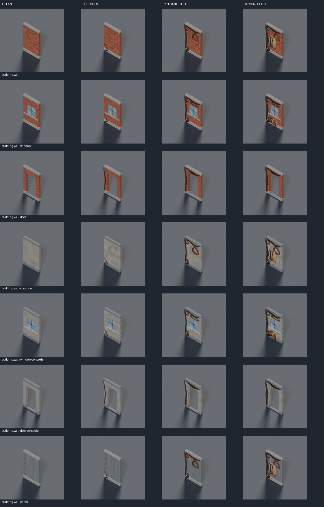
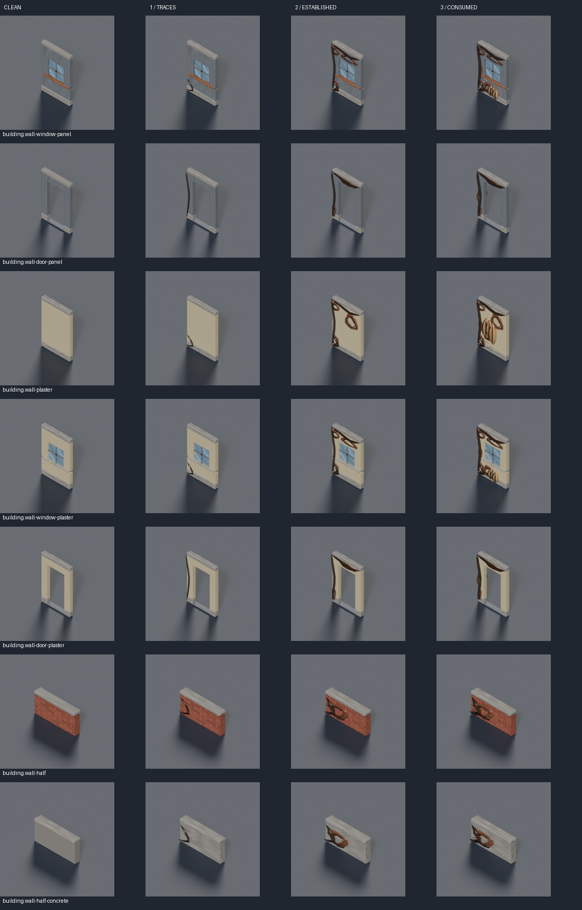
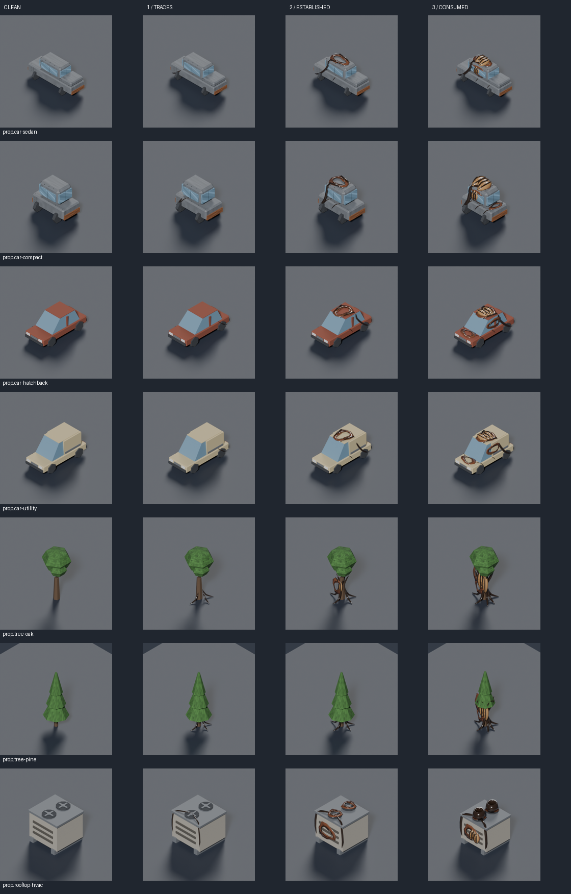

# Resin Shell infestation

Infestation now selects **complete, authored versions of city models at three stages**. Wet films grow from masonry joints, larvae nest below sills and inside vehicle windows, tree bark becomes vascular roots, and rooftop fan wells become breathing throats. Original building materials, vehicle paint and recognizable structures remain visible. This follows the user's request to replace the clay-like blanket with infested models ([#1166](https://github.com/BenjaminBenetti/tut/issues/1166)). [Approved Resin Shell concept](../concepts/infestation-level/README.md).

## Three stages

| Map Lab level | Model treatment |
|---|---|
| 0 | Original models and clean terrain. |
| 1–3 | Traces: fine wet tendons following joints and wheel arches. Coverage increases with the dial. |
| 4–6 | Established: perforated membranes stretch across solid recesses, roots climb trunks, fan wells acquire organic lips. |
| 7–10 | Consumed models mix into established growth: embedded larval clutches, hollow breathing throats, webbed vehicle cabins and partially stripped tree crowns. Their share grows from 25% to 70%, using a stable hash so a host never becomes less mature when the dial rises. |

The first kit contains **63 GLBs: 21 existing models × three stages**. It covers solid, window and door modules in brick/concrete/panel/plaster, brick/concrete half walls, sedan/compact/hatchback/utility vehicles, oak/pine trees, and rooftop HVAC. Other props retain their existing art; the resolver supports extending the catalogue without putting a generic organism on every object.

Each sheet compares the clean host and all three stages. Every model also has individual 45°, 135° and 225° renders under `docs/design/renders/`.

Other projections: [masonry 135°](../diagnostics/infestation/hosts/host-stages-1-135.png), [225°](../diagnostics/infestation/hosts/host-stages-1-225.png); [remaining walls 135°](../diagnostics/infestation/hosts/host-stages-2-135.png), [225°](../diagnostics/infestation/hosts/host-stages-2-225.png); [props 135°](../diagnostics/infestation/hosts/host-stages-3-135.png), [225°](../diagnostics/infestation/hosts/host-stages-3-225.png).

## Review in Map Lab

Run `pnpm dev`, open Map Lab, and drag **Infestation Level**. Fixed comparison: `/mapgen-preview.html?seed=resin-review&biome=temperate&settlement=town&size=small&models=1&infestation=10`. Changing infestation preserves the seed, layout, camera and floor cut. The URL stores the dial; stats show marked tiles and the ×2 movement penalty.

These are actual production-renderer captures:

| Level 0 | Level 1 |
|---|---|
|  |  |
| **Level 4** | **Level 7** |
|  |  |

Additional reviews: [snow](../diagnostics/infestation/snowy-level-10.png), [desert](../diagnostics/infestation/desert-level-10.png), [coastal](../diagnostics/infestation/coastal-level-10.png), [rural pitched roofs](../diagnostics/infestation/rural-temperate-level-10-detail.png), [tactical movement](../diagnostics/infestation/tactical-level-10-move-range.png).

## Connected ground and wet surfaces

Broad brown sheets and generic wall/prop overlays have been removed from placement. Thin tendons and occasional wet seeps connect the host models. `infestation_network.py` retains a continuous 6 × 6 source and a true `Mature` morph target. The renderer varies it in world space, then clips it to tile ownership. Shared vertices preserve joins across adjacent tiles, periodic source boundaries and rotations. Isolated marked tiles still contain visible growth. Ramps, stairs, slopes and pitched roofs fit the real supporting geometry. Walkable growth remains below the 0.08-unit clearance.

Smooth dark tissue has a glossy coat; amber larval cuticle uses a softer highlight. These are separate materials from the host's masonry, paint and foliage. `ResinWetMaterials` gives only resin a shared, deterministic sky reflection so it catches broad highlights under actual game lighting. The view owns and disposes the copied materials and texture; loader prototypes remain unchanged.

## Gameplay and ownership

Entering an infested tile costs **2 movement distance** instead of 1. Ranges, path choice, AP, interrupted moves and AI use that rule. A multi-tile unit pays twice once if any destination cell is marked. Coverage remains `[0, 2.5, 6, 13, 24, 38, 52, 66, 80, 91, 98]%`; water and the landed dropship hull remain clear. Level 0 preserves the clean generator. Mission offers snapshot `ceil(city infestation / 10)`; older offers without the field stay clean.

Variant selection changes only the model id. Position, rotation, scale, ownership tiles, demolition part and floor level remain the host's. Any marked occupied cell can infect a multi-tile prop; either side can infect a shared wall. Wall height, door sockets and open apertures are preserved. Existing cutaway prefixes still apply because variants retain their `building.` or `prop.rooftop-` ids. Infection adds no collision, cover, line-of-sight rule or bug spawner.

## Source and validation

`tools/art/build-infested-models.py` calls the original builders through `models/infested_models.py`. Each growth profile follows its host's geometry. Original untextured hosts retain their flat paint. Run the kit with `python3 tools/art/build-infested-models.py`, or one entry with `--only prop.car-sedan --stage 3`. The standard pipeline exports, validates, renders three views and updates the art manifest. The runtime catalogue is `src/graphics/data/infested-model-variants.ts`.

Complete variants have a 6,500-triangle / 250-KB budget, including the original object; actual maximum is 5,688 triangles and 152,476 bytes. The 63 variants total 3.78 MB. The shared six-tile network retains its 9,000-triangle / 500-KiB budget. Existing experimental organ assets remain in the art catalogue but are no longer placed on maps.

Regenerate comparison sheets with `art-python tools/art/preview/review-infested-models.py`. Capture gameplay with `node tools/art/preview/capture-infestation.mjs`, then `--rural`; use `CAPTURE=1 pnpm exec playwright test e2e/infestation-movement.spec.ts --workers=1` for movement. Metadata records browser errors and geometry counts, including complete replacement hosts; those counts include original object geometry and are not a frame-rate benchmark.

Tests load shipped GLBs to check pivots, footprints, wall height, sockets, aperture clearance and physical materials. Resolver checks cover monotonic stages, mixed maturity, mirrored walls, multi-tile ownership and clean level 0. Seam checks compare all source cells and rotations, including legitimately empty edges between thin strands. Browser tests exercise the slider, reload, cuts and weighted movement.
