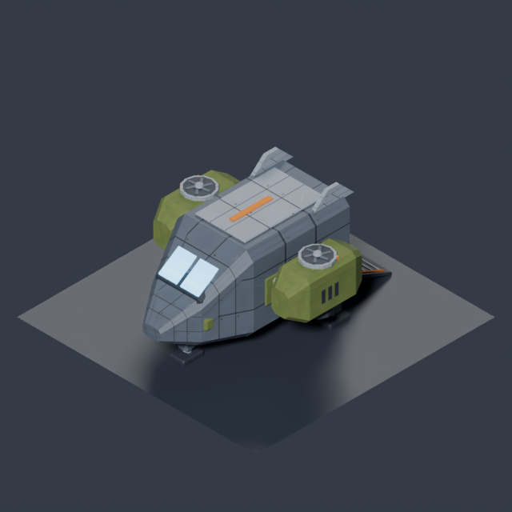
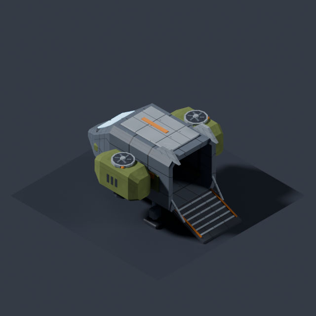
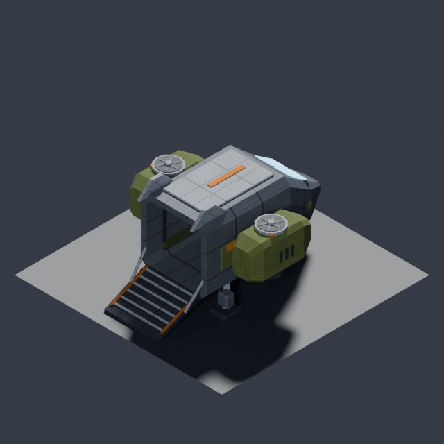

# TDF dropship (#911)

`tdf.dropship` is a landed cargo VTOL in the TDF palette: a broad grey bay,
short olive lift nacelles, split cockpit glazing, three landing pads and a
lowered rear ramp. The rear opening is actual geometry. Existing TDF atlas
materials carry the panel treatment; orange remains a restrained identifier.

[MapGen's agreement before geometry](https://github.com/BenjaminBenetti/tut/issues/911#issuecomment-5591821453)
fixes the full envelope at **5×7 tiles, maximum height 3.6 u**. This includes
the nacelles, fins, landing feet and lowered ramp. At two metres per tile it
is a 10 m span / 14 m length transport. The exported geometry is **4.992×7 u,
3.54 u high**, **1,908 triangles**, **141,328 bytes**, eight material primitives.
All are closed. [Measured bounds, contacts and hash](../diagnostics/911/model-validation.json).

## Asset and source

- Script: [`tools/art/models/tdf-dropship.py`](../../../tools/art/models/tdf-dropship.py).
- GLB: [`public/assets/models/props/tdf-dropship.glb`](../../../public/assets/models/props/tdf-dropship.glb).
- Registry: `MODEL_IDS`, `MODEL_MANIFEST`, and the art manifest agree on
  `tdf.dropship`, category `props`, footprint `{w:5,d:7}`, height `3.54`.
- Preview consumer: `tools/art/preview/capture-dropship.mjs` resolves the
  registered ID through the art manifest and instantiates the exported model.
  MapGen's reserved-site placement remains separate implementation work.

The source bakes its bevels and joins static parts by material before export,
so the aircraft does not require a mesh node for every tread and strut.
It uses a dedicated 3,000-triangle / 200 KB transport budget in the style guide.

## Placement contract

glTF **+Y up, +Z nose**, pivot at the base centre on the landing-foot contact
plane. The mesh bounds are x=−2.496…+2.496, z=−3.5…+3.5, y=0…3.54.
Every landing contact and both ramp endpoints are retained as named GLB sockets.

| Socket | Local position (x,y,z) | Outer landing-pad size (x,z) |
|---|---|---|
| `socket_contact_nose` | (0, 0, 2.33) | 0.50×0.70 |
| `socket_contact_port` | (−1.35, 0, −1.19) | 0.60×0.72 |
| `socket_contact_starboard` | (1.35, 0, −1.19) | 0.60×0.72 |
| `socket_ramp_left` | (−1.05, 0, −3.5) | rear contact-segment endpoint |
| `socket_ramp_right` | (1.05, 0, −3.5) | rear contact-segment endpoint |

The pads have 0.035-u chamfers. Their centre contacts are on y=0; reserve support
under the whole pad. The ramp's rear contact segment is 2.10 u wide and reaches
the rear envelope boundary. Its loading-deck top rises from 0.08 to 0.80 u.
The nominal open bay is 2.12 u wide, 3.22 u long and 2.14 u high, with chamfered
corners; it is cargo space, not an extra traversable game floor.

For an unrotated reservation starting at column `(x,z)`, MapGen supplies pivot
`(x+2.5, layer*0.75+0.15, z+3.5)`. The 0.15 is the actual ground top. Rotate
the complete model and its contacts cardinally together, with the nose toward
the selected outer map edge and the ramp toward the map interior.

The full hull reservation is separate from **16 clear boarding/start columns**,
normally a connected 4×4 patch meeting the rear ramp. It may shift half a tile
relative to the five-wide hull to retain grid-aligned columns. No part of the
aircraft may occupy those columns. Keep the agreed one-column side/front
circulation margin, level real support, and clearance from terrain, buildings,
carriageways and connectors. Reserve the site before incidental props. Deploy
and extraction continue to use the same boarding columns. No plinth is part
of this model.

## Render evidence

| Blender 45° | Blender 135° | Blender 225° |
|---|---|---|
|  |  |  |

[Rural and town support fixtures with the existing mech and squads](../diagnostics/911/README.md)
show the same model at game scale and under the shared preview's game lighting.
They are constructed art fixtures. The current grown deploy blob has not been
replaced by a site reserver in this model change, so these frames do not claim
that generated missions already place the aircraft.

## Reproduce

```sh
blender -b --python tools/art/make_model.py -- \
  --script tools/art/models/tdf-dropship.py --id tdf.dropship \
  --category props --file tdf-dropship.glb --quality final --max-triangles 3000
node tools/art/preview/capture-dropship.mjs
```

The first command exports, validates, renders all three angles and updates the
art manifest. The second renders each of four fixed support views in three
separate browser launches, requiring exact PNG equality before saving the
evidence. All GLTF loads complete before the shared scene draws and signals
readiness; no camera key presses or fixed settling sleeps are used.
