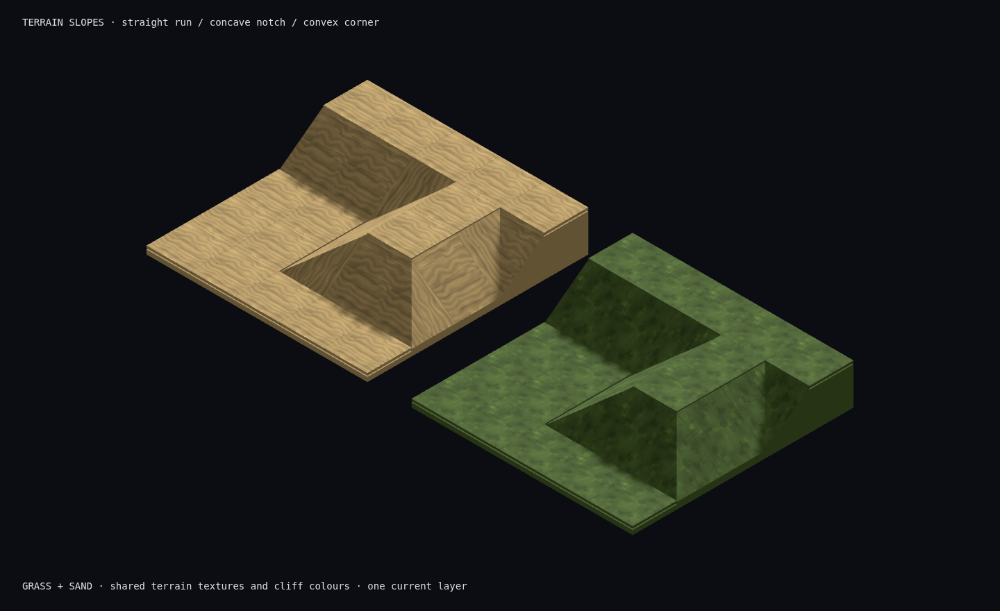
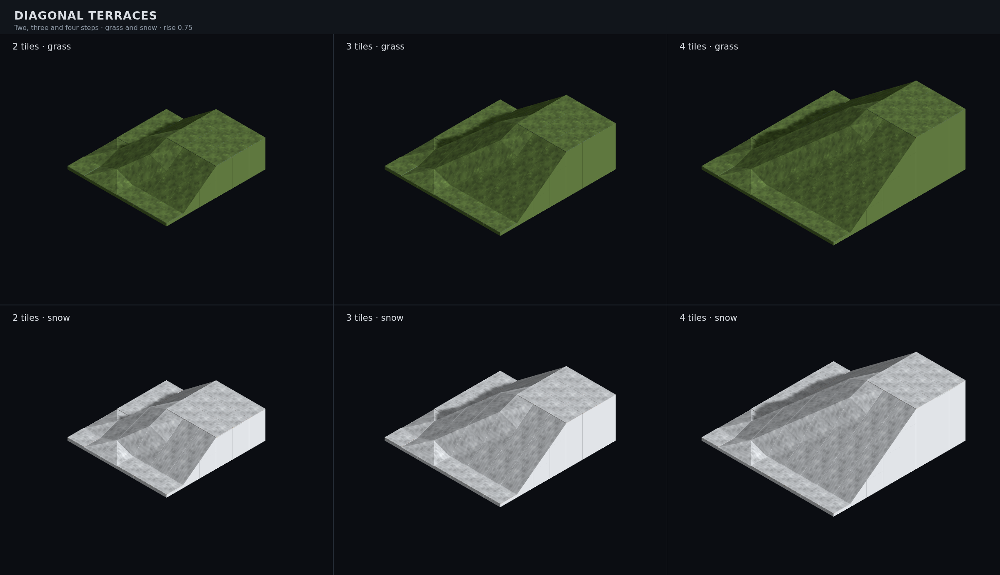

# Kit: terrain slopes (#798, half rise #809, diagonal #848)



Four meshes share the ground material selected by the scene. Straight runs
meet a concave notch and a convex hip; rotation supplies the four directions.
The composite uses the actual GLBs through `TerrainSlopeModelFactory`, the
existing grass/sand atlas materials, and the game's camera and lighting.
The exposed side faces borrow the same solid material as adjoining terrace
pillars. There is no bevel, skirt, inset, or gap at the shared edges.

## Shape contract for #799

All four footprints are **1 × 1**, centred on local X/Z, with bounds
`[-0.5, 0, -0.5]` to `[0.5, 0.75, 0.5]` in glTF/three coordinates. The origin
is the **base centre at the low surface plane**, not the centre of the wedge.
One elevation layer is 0.75 world units under ADR 0008. The single authoring
control is `RISE = 0.75` in `tools/art/models/terrain_slope_parts.py`. #809
re-emits all three meshes at this height; a building storey remains 1.5 u.

For local `u = x + 0.5`, `v = z + 0.5`:

| Kind | Model id | Height field | High/low features | Triangles | GLB bytes |
| --- | --- | --- | --- | --- | --- |
| Straight | `tile.slope.straight` | `RISE × v` | Low −Z edge, high +Z edge | 8 | 1,792 |
| Inner | `tile.slope.inner` | `RISE × max(u, v)` | Low (−X, −Z) corner; +X and +Z high edges | 10 | 1,992 |
| Outer | `tile.slope.outer` | `RISE × min(u, v)` | High (+X, +Z) corner; −X and −Z low edges | 6 | 1,712 |
| Diagonal | `tile.slope.diagonal` | `RISE × (u + v) / 2` | Low (−X, −Z), high (+X, +Z); other corners at half rise | 10 | 1,932 |

Corners split along the (−X, −Z) → (+X, +Z) diagonal. All sloping faces have
upward normals, every exported mesh is watertight, and each is below the
60-triangle / 20 KB ground-piece budget. Rotate the **whole group** around Y
by multiples of π/2. A one-layer step uses the authored dimensions directly.
The resolver follows #799's clockwise `slope.turns`: straight uses that value;
inner and outer use `(turns + 1) % 4` because the map-data corner starts high
to the west/south, while the exported corner starts high to the east/south.

For a tile at lower level `y`, place the pivot at
`(tile.x + 0.5, y * LAYER_HEIGHT + SLAB_HEIGHT, tile.z + 0.5)`.
The high endpoint then meets the next layer's surface. A slope replaces the
flat top at that cell; keep the ground pillar beneath the low plane. The
flat ground model's centre-pivot slab offset does not apply to this wedge.

`terrainSlopeRise` is the high-neighbour measurement already used by the
#815 placeholder wedge, now shared with the model resolver. It fits loaded
art to the existing map's vertical gap with `ModelPlacement.scaleY`: 1 for
one-layer terrain, 2 for the two-layer steps generated before #808. This is
an instance transform, so prototypes, materials and footprint are shared.
It neither selects nor repairs a corner kind. #808/#823 now emits one-layer
natural steps and includes the #817 classification fix. The vertical fit
remains a guard for older maps; the hills-1 test requires every slope to use
scale 1.

## Material consumer

`SLOPE_MODELS` in `graphics/data/map-model-table.ts` is the kind-to-id mapping.
`graphics/service/terrain-slope-model-factory.ts` loads those registered GLBs:

```ts
const factory = new TerrainSlopeModelFactory(models);
const prototype = await factory.create("inner", {
  surface: groundTopMaterial,
  sides: terraceSideMaterial,
  uv: { u0, v0, u1, v1 }, // the existing ground atlas cell; omit for full UVs
});
```

The returned group contains `slope-surface` and `slope-sides`, each with one
material, ready for the map's per-part instanced batching. Cache this group
per kind/material in the scene. Returned geometries belong to the caller;
dispose them on scene teardown. Supplied materials and loader prototypes
remain borrowed and unchanged. The factory does not own or dispose them.

The GLBs have neutral materials and projected 0–1 top UVs, with **no embedded
texture or material variant files**. Grass, dirt, sand, snow, rock, and asphalt
all can use the same four meshes. Pass the chosen top material/atlas region and
the existing cliff material; road markings are a separate renderer decision.
`slopeMaterialsFromGround` borrows the broadest upward face's material and
UV region from the existing surface model. It selects the road deck over
small road markings, or the rock slab over its lumps. The composite uses
the same helper, so no atlas-cell coordinates are duplicated.

#799's scene mapping landed while this kit was being built. `resolveMapModels`
now maps its slope metadata to these assets; `TacticalMapView` replaces the
initial wedges with the materialised art and retires those placeholders.
It caches one prototype per shape/surface, batches instances by level and
surface, and applies the existing visibility and mist treatment to both
parts. The ground pillars remain. Generation, map data and traversal remain
as supplied by #808/#823. The resolver restores the model seam that #823
left temporarily disabled; the corner quarter-turn mapping is unchanged.

In-game review controls: [city seed 730982385](../shots/799-preview-control-seed730982385.png)
and [snowy rural hills-1](../shots/799-preview-terrain-heavy-snowy-rural-hills-1.png).

## Diagonal chains (#848)



`DIAGONAL_SLOPE_MODEL` registers the fourth shape separately from MapGen's
three existing `Tile.slope.kind` values. `resolveDiagonalSlopeAppearances`
finds consecutive outer corners with the same high direction, rising one
layer per diagonal tile. A chain must contain at least two. The scene places
its planes with the existing corner quarter-turn reconciliation. Isolated
corners retain the outer mesh, and two-layer legacy slopes retain their
existing fit. The mixed-turn QA chain keeps its first, reversed outer corner
and replaces the two aligned corners after it.

A plane has side vertices half a rise above an outer corner's side vertices.
Swapping only the chain meshes would expose cracks against their neighbours.
The resolver shares those raised vertices with the incident natural tiles;
`TerrainTransitionModelFactory` fits their existing ground-slab topology to
these heights. These caps borrow the chosen ground atlas and terrace side
material. Their top split follows the chain diagonal, so the outer transition
strip also forms a plane. Only a flat foot cap uses the other split to avoid
a triangle coplanar with the pillar beneath it. A cap can reach 1.5 layers
above its tile's base; the exported diagonal itself remains exactly one layer.

This fit only joins vertices already shared by editable natural surfaces.
Walls, connectors, isolated outer corners and existing cliffs prevent it;
it does not bridge an unrelated retaining edge. Map generation, tile heights,
`Tile.slope` and traversal remain unchanged. The scene caches each diagonal
or cap by shape and surface, independently of elevation and rotation. Geometry
is scene-owned and disposed; atlas and mist materials stay shared.

[Before/after controls and exact neighbourhoods](../diagnostics/848/README.md)
include all four filed chains, QA's new four-chain, the isolated S2 control
and #849's three-high slot. #849 is **not covered** by a monotone diagonal
plane: it still requires its own geometry decision. No second piece is cut.

The diagonal geometry tests load the shipped GLBs through `TacticalMapView`:
2/3/4-step chains × all four rotations, 16 interior samples per diagonal,
all four core borders within 0.0001 u, and off-edge samples through the outer
strip to catch creases even when the borders are closed. The existing flat
placeholder slab has a 0.025 u placement lip; the all-map border check allows
that at untouched flat edges. This change does not revise that older slab
contract. A pure neighbourhood test also checks every incident vertex, the
rescaled four-chain and the isolated/walled controls. Mist sharing across
levels is asserted against the final instanced meshes.

## Review and reproduce

The twelve neutral renders show the geometry independently of material choice:

| Shape | 45° | 135° | 225° |
| --- | --- | --- | --- |
| Straight | [view](../renders/tile.slope.straight_045.png) | [view](../renders/tile.slope.straight_135.png) | [view](../renders/tile.slope.straight_225.png) |
| Inner | [view](../renders/tile.slope.inner_045.png) | [view](../renders/tile.slope.inner_135.png) | [view](../renders/tile.slope.inner_225.png) |
| Outer | [view](../renders/tile.slope.outer_045.png) | [view](../renders/tile.slope.outer_135.png) | [view](../renders/tile.slope.outer_225.png) |
| Diagonal | [view](../renders/tile.slope.diagonal_045.png) | [view](../renders/tile.slope.diagonal_135.png) | [view](../renders/tile.slope.diagonal_225.png) |

```bash
for shape in straight inner outer diagonal; do
  blender -b --python-exit-code 1 --python tools/art/make_model.py -- \
    --script tools/art/models/terrain-slope-$shape.py --id tile.slope.$shape \
    --category tiles --file terrain-slope-$shape.glb --quality final \
    --max-triangles 60 --no-textured
done
CAPTURE=1 pnpm exec playwright test e2e/terrain-slope-screenshot.spec.ts e2e/diagonal-slope-screenshot.spec.ts e2e/slope-screenshot.spec.ts e2e/fog-screenshot.spec.ts
```

After a future rise change, copy the emitted heights into the TypeScript
manifest along with the generated JSON metadata. The geometry tests compare
the actual exported bounds to `LAYER_HEIGHT`, so stale exports fail.

The browser harness is `/tools/art/preview/terrain-slopes.html` on the Vite
server. Its 1440 × 880 composite uses two matching L-shaped terraces, including
a straight run, concave and convex turns, and a slope side abutting a sheer
cliff. All nine angles and the final composite were opened and inspected.

Validation for #809: all three Blender/trimesh loops and the manifest guard
pass. The new neighbourhood test loads the real GLBs through the tactical
view and checks all four turns of both corner kinds at both one- and
two-layer rises: 16 cases, 320 shared-edge comparisons. A generated hills-1
case checks all 767 slopes resolve to the kit at scale 1 and exercises
all three kinds. Placement, placeholder retirement and material-sharing
coverage disabled by #823 is restored.

The four preview controls and both seed-4242 fog frames are regenerated
on #823's half-step terrain and opened for review. The hills-1 frame now
shows the textured 0.75-rise kit. The grass/sand composite and all nine
neutral angles retain the accepted half-rise geometry. The Director judges
the textured hills-1 frame before the Tech Lead merges.

Typecheck, lint, 1,980 unit tests (one skipped), build and five capture tests
pass. The full browser suite passes: 59 tests, 11 opt-in captures skipped.
Both seed-4242 fog PNGs are byte-identical to main.
