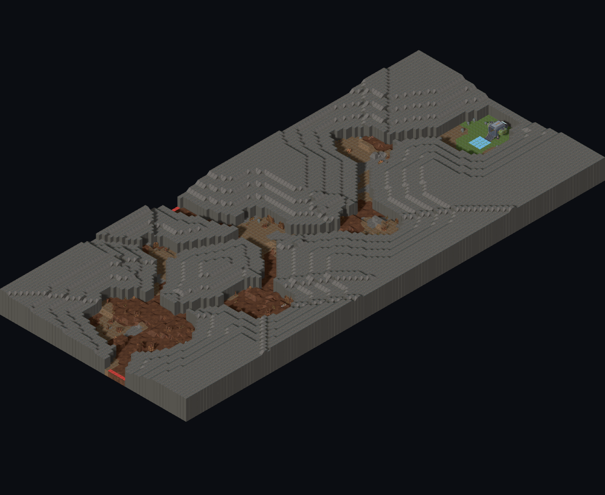
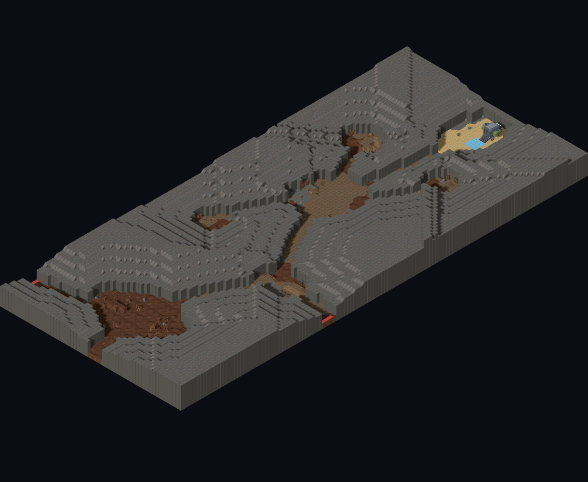
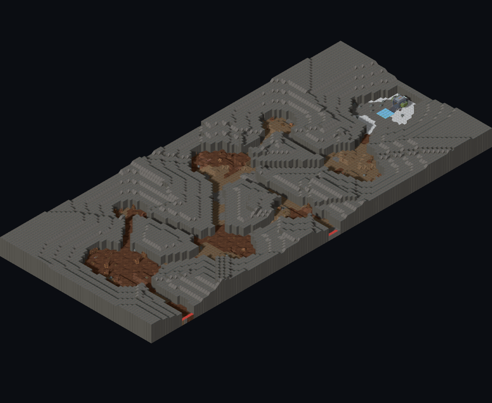
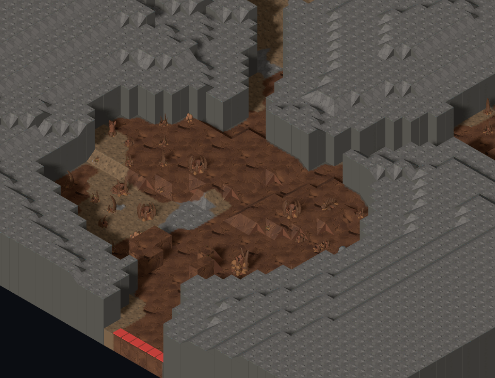
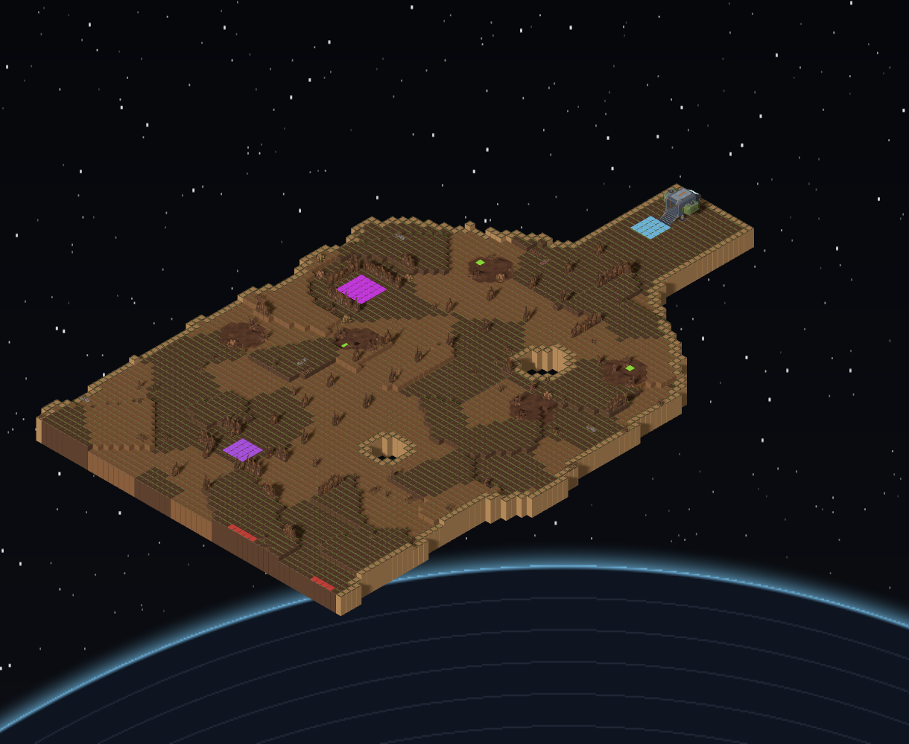
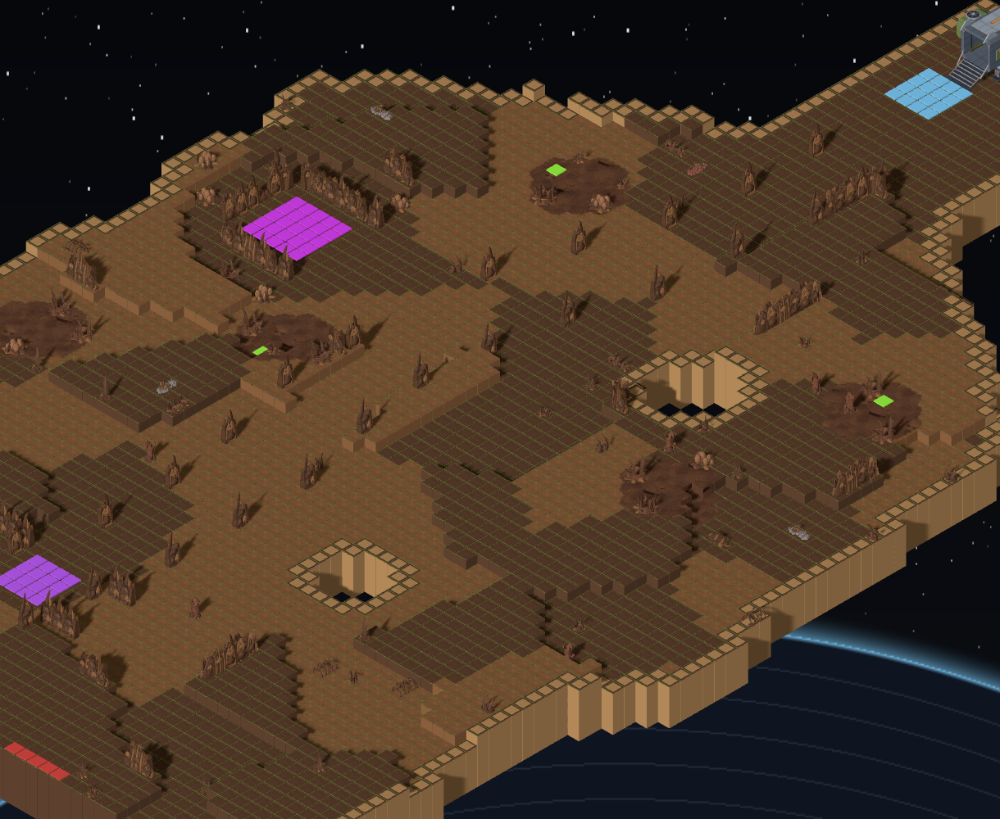
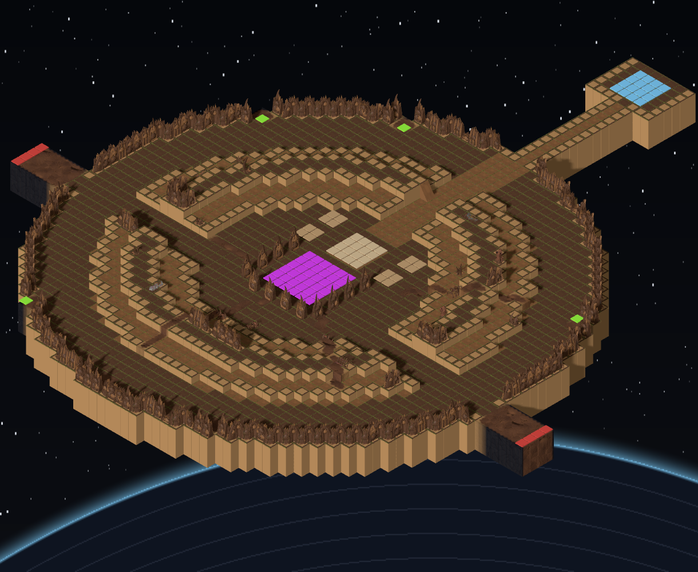
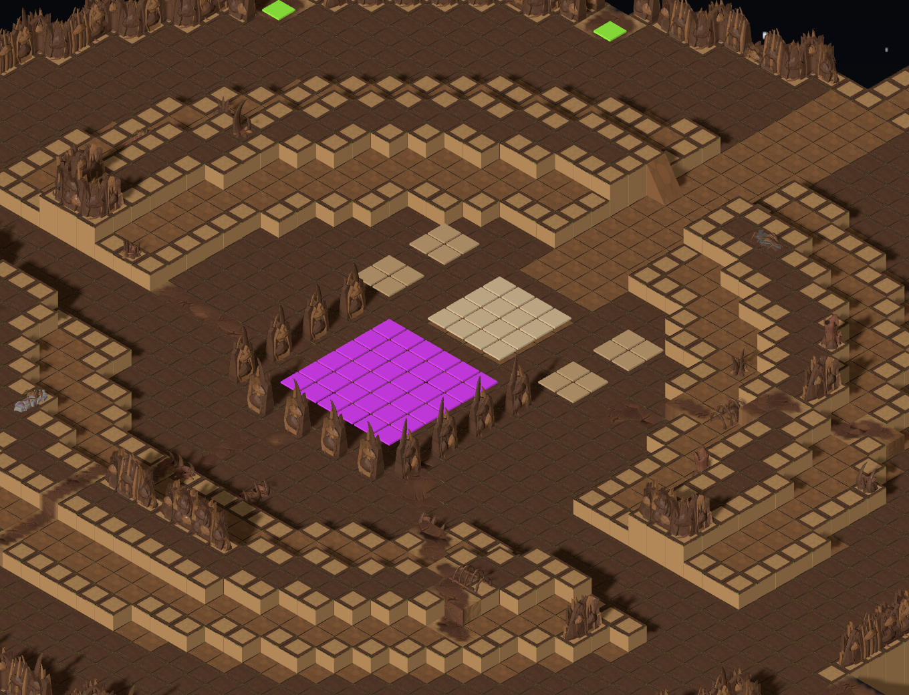

# Map generation pipeline

How a `MapRecipe` becomes a `TacticalMap`. Salvaged from the Map Generation Specialist's handoff on 2026-09-15; pass names match `src/mapgen/generator/`.

```
 MapRecipe ─► hashSeed ─► Rng ─► PipelineMapGenerator(createSettlementPasses())
   terrain ─► water ─► roads ─► landing sites ─► mission sites ─► infestation plan ─► lots ─► buildings ─► interiors ─► props ─► ramps ─► hooks ─► infestation ─► connectivity
   ─► freezeDraft ─► validateTacticalMap (throws MapGenerationError) ─► TacticalMap
```

| Pass | What it does | Key decisions |
|---|---|---|
| terrain | fbm value noise, contrast ×2.2, quantised to levels; surface patches at 2× freq | raw fbm piles on one level |
| water | coastal band along one edge, level 0, sand beach | edge = rng pick |
| roads | builder per style (trail/streets/grid); largest network; 8-col chunks ±1; ramps at chunk steps; sidewalks; flat networks grade the whole plat; grid lays `roadWidth` lanes every `blockSize ± blockJitter` | cities: block 12 ± 2, two lanes, one level |
| mission-sites | resolves optional `recipe.site` through the injected catalogue; reserves and grades a central compound, stamps terrain/equipment, requests ordinary building lots (template, footprint, storeys, doors, roof fixtures), records objective sockets | before lots; preserves landing clearances; stale road ramps rebuilt; see [installation facilities](kits/installation-facilities.md) |
| infestation-plan | chooses separated colony centres and connecting feeding routes; quantized pressure field expands with level; reserves clearings before parcel allocation; safely excavates mature level cores; plans joined carapace wall contours, open courtyards and two-cell passages in selected large colonies; limits passage grading to one layer and preserves existing connector endpoints | integer 0–10, default 0 is a no-op; independent RNG fork; landing clearance retained; shared metadata drives simulation and graphics |
| lots | shuffled (road column, side) anchors; rect beside corridor; gap 1, margin 1; count × `areaFactor` | inner-lane anchors reject themselves |
| buildings | authored template and exact footprint where a lot requests one; otherwise weighted template per lot (house, shop, warehouse, tower, apartment); `ensureMultiStorey`; `ensureLandmark` re-plans the lot nearest the centre with the recipe's `landmark` kind (legacy recipes) | templates in `data/building-templates`; authored roof fixtures precede stair planning; installations never come from biome weights |
| interiors | recursive bisection with a door per cut; room kinds `hall`/`room`/`storage` (`data/room-kind-ids`); stairs BFS-verified, holes interior-first; roof tiles; ladders ≤ 2 storeys and ≤ 2 levels of climb (#253) | `interiors` capability |
| props | vegetation by density with per-kind clusters; width-aware street props; yard clutter; room furnishing via `registries.roomFurnishing`; every interior placement BFS-verified | blocked: thresholds, connector ends |
| ramps | union-find over ground (`service/ground-components`); ramp per one-level step between components; spacing ramps | 2-level steps stay cliffs |
| hooks | `HookPlacer` registry; deploy (largest ground component, edge band); egg spawners (≥ 12 from deploy, ≥ 6 apart, half indoors, `HATCH_SPACE_MIN` 6 reachable tiles within `hatchRadius`, checked lazily in draw order); edge spawns (strict spacing first, relaxed only for zones that do not fit); extraction = deploy; tech carcass (one, ≥ 8 from deploy, clear of other hooks); authored site objective sockets take priority for requested kinds; generators without sockets (`count` point hooks on open ground in widening rings of 3/5/8/12 around the landmark, ≥ 3 apart, ≥ 6 from deploy, #1175); spore pod (crater floor near its centre, see the crash site below) | placers share one `snapshotDraft` |
| connectivity | per hook × class: freeze, check, 0-1 BFS for cheapest repairs (prop / door / ramp), else relocate | I7 guarantee; authored structural props cannot be removed by repair |
| infestation | invades ground, streets, slopes and ground-floor interiors; removes mature-colony vegetation; cuts connected wall/roof/upper-floor breaches; places footprint-aware colony organisms, modular carapace walls, ruins and urban shelters | surviving interior routes verified before slab removal; preserve entrances, connectors, firing positions and landing sites; final connectivity repair still applies |

Entry: `service/generate-tactical-map.ts`. Adapter: `service/mission-map-recipe-adapter.ts` plus
`data/hook-kind-defaults.ts`; what differs by mission type (archetype, extra hooks, site, landmark)
comes from the type's rule in `service/missions/mission-map-rules.ts` (`MISSION_MAP_RULES`, ADR 0013 §2.3). Metrics: `service/map-metrics.ts` (`computeMapMetrics`).
Hatch BFS: `service/hatch-space.ts`. Wide sweep: `MAPGEN_WIDE=1 pnpm exec vitest run generation-wide-sweep`.

Infestation is frozen into a mission's map parameters at offer time, in completed ten-point overworld bands. Both passes use their own RNG forks and level zero preserves baseline geometry exactly. `TacticalMap.infestation` records colony centres, optional modular carapace formations, corridors, a row-major pressure field and breach locations. The same field drives ground growth, asset substitutions and damage, keeping clean districts visually clean even on a heavily infested map. Slopes retain their shape and connectors while gaining the movement cost of resin. Ground-floor interiors retain their infantry-only pass mask. See [the infestation kit](kits/infestation.md) for art and review renders.

## Crash-site archetype

Where a spore pod came down (campaign arc §6.3, §7): open ground, a terraced impact crater, a debris
field, and the pod on the crater floor. `createCrashSitePasses()` in `service/settlement-pipeline.ts`;
a mission type picks it by returning `archetype: "crash-site"` from its `MissionMapRule`.

```
 terrain ─► water ─► crater ─► landing sites ─► infestation plan ─► debris ─► slopes ─► ramps ─► hooks ─► infestation ─► connectivity
```

| Pass | What it does | Key decisions |
|---|---|---|
| terrain, water | as the settlement | – |
| crater | raises the plat two storeys, flattens a disc of radius 0.22–0.32 of the shorter side (≥ 6 columns off every edge) to its modal level, then steps one storey down per ring to a flat floor of 0.45 × radius; records the bowl as `draft.crater` (`CraterSite`: centre, radius, floorRadius, rimLevel, floorLevel) | terraced, never dug, so every ring can be sloped or ramped; `draft.crater` is scratch, never frozen into the map |
| landing sites | the settlement's dropship pass, run after the crater (`DropshipSitePass("elevation")`) | edge band, so the drop zone sits outside the bowl |
| debris | boulders, crates and barriers at 14 per 100 open columns inside the bowl, boulders and sandbags at 3 outside | no vegetation: wreckage and plants compete for the same tiles (#714) |
| slopes, ramps | as the settlement; they make the terraces walkable for both classes | – |
| hooks | the same placer registry; the crash-site hook set is `CRASH_SITE_MISSION_HOOKS`: deploy, one `spore-pod`, two edge spawns, extraction, and the mission's tech carcass when it has one | no egg spawners by default; a recipe that asks for them still gets them |
| infestation, connectivity | as the settlement | hook tiles stay clear of colony props |

**The spore pod hook** (`HookKinds.SPORE_POD = "spore-pod"`, `generator/placer/spore-pod-placer.ts`,
priority 5, so the spawners, edge spawns and carcass keep clear of it). One point hook in
`hooks.objectives`, `requiredPass: ALL`, at least 10 manhattan tiles from deploy
(`HOOK_KIND_DEFAULTS`). It stands on flat open ground: no prop, no slope piece, no connector landing,
off the boundary and off every hook placed before it. It is placed on the tile nearest
`draft.crater.centre`, with a random pick among the tiles within `POD_SCATTER` (1.5) of that nearest
distance. The pool widens in order: crater floor reachable by every required class, then the crater
floor alone, then reachable open ground, then any open ground. Without a crater (a pod asked of a
settlement), it is placed near the board's centre. Over 360 maps (12 biomes × 10 seeds × small, medium
and large) every pod landed on the floor within 2.3 columns of the centre, with no connectivity
repairs. The preview draws it violet (`HOOK_COLOURS`).

Look at one in Map Lab: `/mapgen-preview.html?archetype=crash-site&models=1`, or pick **Crash site**
in the Archetype control. Renders: [pod close-up](crash-site-pod-hook-close.png),
[whole crater](crash-site-pod-hook-overview.png), [desert, small](crash-site-pod-hook-desert.png).

Elevation layers, half walls, the crash-site archetype and map scale are recorded in ADR 0008, ADR 0004 and ADR 0009. Tuning knobs and their measured effect are in `tactical-tuning.md`.

## Hive cavern archetype (#1179)

`archetype: "hive-cavern"` is the Hive Assault map ([campaign arc §7.5](campaign-arc.md)). `createHiveCavernPasses(tuning)` in `service/hive-cavern-pipeline.ts` keeps the settlement tail and replaces the town with a chain of chambers cut into bedrock. Tuning is `HIVE_CAVERN_TUNING`; the board is `HIVE_CAVERN_SIZE` (64 × 144, 9,216 columns, the same count as the 96 × 96 preset). `withArchetypeDefaults(recipe, ARCHETYPE_RECIPE_DEFAULTS)` gives the Map Lab preview that size and `HIVE_CAVERN_HOOKS`.

```
 terrain ─► cavern ─► dropship-sites (north edge only) ─► cavern-dressing
   ─► slopes ─► ramps ─► hooks (eggs in brood chambers) ─► brood-chambers ─► connectivity

 z=0   lip ─ mouth (drop ship pad, deploy = extraction)
            │ main tunnel ≥ 3 wide, level spine
           route chambers, zig-zagging down the board ── side tunnel ≥ 2 wide ─ side chamber
            │
 z=143     core (3×3 hive-core pad, hives ringed round it) ── burrow ─ map edge (edge spawns)
```

| Pass | What it does | Key decisions |
|---|---|---|
| terrain | the ordinary terrain pass; only lends the biome's ground surfaces | the cavern pass replaces its heightmap |
| cavern | `planCavern` draws 5–8 chambers (4+ on the route, 1–3 side chambers) as lobed blobs and bowed tunnels; `carveCavern` floors them and raises `SurfaceIds.BEDROCK` rock everywhere else; records `MapDraft.cavern` (`CavernLayout`, capability `"cavern"`) | mouth → route → core and every burrow sit on one level spine (`spineLevel`), so 2×2 brutes and 3×3 blocks pass; side chambers step ±1 and terraces, ledges and pits stay off the spine; rock stands `wallLayers` (4) above the floor it walls; the planner replans with more side chambers when none fit |
| dropship-sites | `DropshipSitePass("elevation", ["n"])` | lands on the flat pad behind the mouth's lip; `hasStandableSurface` keeps boarding columns off bedrock and water |
| cavern-dressing | core hives (`coreHives`, 3–5 on a ring), carapace runs, brood clutches and clutter | bands every tunnel and the core pad clear; lifts a prop that would seal a pocket |
| slopes, ramps | as in settlements | rock faces stay cliffs |
| hooks | `HookPass([new EggSpawnerPlacer(isBroodFloor)])` overrides the egg placer; `HiveCorePlacer` places the core | eggs only on brood-chamber floor, never in a tunnel or the mouth |
| brood-chambers | one `brood-chamber` hook per chamber other than the mouth | not requested by the recipe: emitted for however many chambers the seed drew |
| connectivity | as in settlements | I7 over the recipe's hooks |

Hooks (`HIVE_CAVERN_HOOKS` plus the brood pass):

| Kind | Count | Where | `meta` |
|---|---|---|---|
| `deploy`, `extraction` | 1 each | the drop ship pad in the mouth | — |
| `hive-core` (`HookKinds.HIVE_CORE`) | 1 | a level 3×3 in the core chamber, ≥ `HIVE_CORE_MIN_DISTANCE` (80) from deploy; the hook-kind default is 60 | `{ chamberId, footprint: 3 }` |
| `brood-chamber` (`HookKinds.BROOD_CHAMBER`) | one per non-mouth chamber | one tile: the free floor nearest the chamber's centre (the chamber mask stays on `MapDraft.cavern` and is not frozen into `TacticalMap`) | `{ chamberId, role, radius, depth }` |
| `egg-spawner` | 3 (2–4 allowed) | brood-chamber floor | `{ hatchRadius: 3 }` |
| `edge-spawn` | 2 | where burrows meet the map edge, ≥ a third of the way in | — |

The pipeline test (`service/hive-cavern-pipeline.test.ts`) sweeps every biome × 3 seeds through `validateTacticalMap` and checks the counts above, a 3×3 mech block and a 2×2 brute along the main route and the burrows, a 2×2 block into each side chamber, and wall height. Measured on 36 maps: 190–370 ms to generate idle (400–700 ms under load), 12–14 levels, 85–140 props. The Map Lab renders it at 2.6–2.9 fps under SwiftShader, against 0.4 fps for the large city, and `zoomToFit` fits the whole board at about 7.6 px per tile in 1280 × 720, above `ZOOM_FIT_FLOOR`.

**Open-topped, not roofed.** The cavern is open-topped: chambers and tunnels are floors sunk into rock at least four layers high, with no ceiling tiles. The isometric camera sees into every chamber from its usual pitch, the renderer needs no roof cut-away, and the map uses only existing tile, wall and ramp geometry, so `validateTacticalMap` passes without changes. Rock still blocks sight: the sight service treats ground higher than the line as opaque. The costs are that four-layer walls can hide units behind them from the camera, and that the fog of war (ADR 0006) over rock tops, which no unit ever stands on, has not been looked at in a mission. A wall occlusion or height cut, and a fog check on a cavern mission, are tactical follow-ups.






## Spore platform archetypes (#1179)

The finale is fought on the spore platform in orbit ([campaign arc](campaign-arc.md)), over two linked boards. `archetype: "spore-platform-hull"` is stage 1: a deck of terraced chitin plates hanging in space, the drop ship docked at the prow, the docking ring's iris on one flank and a hatch down to the core at the far end. `archetype: "spore-platform-core"` is stage 2: a round chamber reached along one narrow causeway, the core seed behind the Sovereign's dais. `createSporePlatformHullPasses(tuning)` and `createSporePlatformCorePasses(tuning)` in `service/spore-platform-pipeline.ts` build them. Tuning is `SPORE_PLATFORM_TUNING`. The boards are `SPORE_PLATFORM_HULL_SIZE` (72 × 104) and `SPORE_PLATFORM_CORE_SIZE` (64 × 80), and the hook sets are `SPORE_PLATFORM_HULL_HOOKS` and `SPORE_PLATFORM_CORE_HOOKS`, all in `data/spore-platform-recipe.ts`. `ARCHETYPE_RECIPE_DEFAULTS` gives the Map Lab preview those sizes and hooks. No mission type uses either archetype yet: the finale package adds one and links the two boards.

```
 hull:  hull-deck ─► dropship-sites (north edge only) ─► platform-dressing ─► ramps
          ─► hooks (pods on pod beds) ─► connectivity
 core:  core-chamber ─► platform-dressing ─► ramps
          ─► hooks (deploy on the start pad, pods in wall niches) ─► connectivity

 stage 1, hull                        stage 2, core
 ······▓▓▓······  prow dock plate     ··········[D]··········  D start pad (deploy)
 ····▓▓▓║▓▓▓····  · void (space)      ···········║···········  ║ causeway, 3 wide
 ·▓▓▓▓▓▓║▓▓▓▓▓▓·  ║ spine, 5 wide     ······▒▒▒▒▒║▒▒▒▒▒······  ▒ rim walkway, niches
 ·▓▓▓▓▓▓╠═══(R)·  R docking ring      ····▒▒░░░░░║░░░░░▒▒····  ░ berm +1 +2 +1
 ·▓▓P▓▓▓║▓▓○▓▓▓·  P pod beds          ···▒▒░░ g ·S· g ░░▒▒···  S dais, g guard posts
 ·▓▓▓▓▓[X]▓▓▓▓▓·  X hatch, ○ breach   ═══════════ C ═════════  C core seed, ═ ducts
 ·▓▓▓▓▓▓║▓▓▓▓▓▓·  runs off far edge   ····▒▒░░░░░░░░░░░▒▒····
```

| Pass | What it does | Key decisions |
|---|---|---|
| hull-deck | `shapeHull` grows Voronoi plates (walnut or chestnut, 40% raised one layer), outlines a deck that narrows to the prow and runs on past the far edge, then carves the level routes: the spine from the dock plate to the far edge, and a branch to the ring's plaza off one flank at 45–56% of the depth. It also places the ring (5×5) and hatch (4×4) pads, 4–6 pod beds and 1–3 breaches into space. It records `MapDraft.platform` (`PlatformLayout`, capability `"platform"`) | no terrain pass: the hull is its own relief, and plates rise at most one layer, so every step is a free walk (ADR 0008 §2.3) |
| core-chamber | `shapeCore` lays the start pad at the near edge and a causeway (12–15 long, 3 wide) into a chamber of radius 26. Inside it are a rim walkway at deck level with 5–8 wall niches, a berm of terraces 1, 2 and 1 layers up, and an arena at deck level. A 4-wide lane cuts through the berm from the gate to the dais. Two 4-wide ducts run from the side edges through the berm's back flanks into the arena. Pads: the 4×4 start pad, 4×4 dais, 6×6 core seed and four 2×2 guard posts | causeway, lane, walkway, ducts, arena, dais and seed share the deck's level: a 2×2 brute never changes level (`footprintCanStep`, #1130), and the Sovereign must be able to leave its dais |
| dropship-sites | `DropshipSitePass("elevation", ["n"])` | docks on the flat plate at the prow |
| platform-dressing | the stage's kit from the infestation and carapace props. **Hull:** spine buttresses in rows beside the spine, a carapace collar and a cradle of pods round the ring, gate buttresses at the hatch, pods heaped on the pod beds, low rib walls on raised plates' lips, clutter. **Core:** a carapace wall round the rim, buttresses either side of each niche, a rib cage round the seed's back and sides, rib walls on terrace lips, flesh arteries. A flood fill then lifts any prop that sealed a pocket off the routes | routes, pads and their aprons (`keepClear`) are never dressed |
| ramps | as in settlements | adds 3 spacing ramps in the core chamber, and none on the hull |
| hooks | `HookPass([new EggSpawnerPlacer(isPodBed)])` puts the pods on pod beds (hull) or in wall niches (core). The core also overrides deploy with a `PlatformPadPlacer` on the start pad | `PlatformPadPlacer` stands every planned pad on the ground it was levelled to. Off a platform it falls back to the flat square farthest from deploy that a mech can reach, so the kinds work on any archetype |
| connectivity | as in settlements | 0 repairs and 0 relocations over 60 seeds per stage |

Hooks:

| Stage | Kind | Count | Where | `meta` |
|---|---|---|---|---|
| both | `deploy`, `extraction` | 1 each | hull: the drop ship at the prow; core: the 4×4 start pad before the causeway | — |
| hull | `docking-ring` (`HookKinds.DOCKING_RING`) | 1 | a level 5×5 on its plaza off one flank, ≥ `DOCKING_RING_MIN_DISTANCE` (36) from deploy | `{ footprint: 5, side }` (`east` or `west`) |
| hull | `platform-exit` | 1 | a level 4×4 on the spine, 12 rows short of the far edge, ≥ `PLATFORM_EXIT_MIN_DISTANCE` (60) | `{ footprint: 4 }` |
| hull | `egg-spawner` | 3 | pod beds, the nearest within 30 of deploy | `{ hatchRadius: 3 }` |
| hull | `edge-spawn` | 2 | the far edge, where the deck runs on | — |
| core | `platform-core` | 1 | the 6×6 seed pad in the arena, ≥ `PLATFORM_CORE_MIN_DISTANCE` (30) | `{ footprint: 6 }` |
| core | `sovereign-dais` | 1 | the 4×4 at the lane's end, flush with the arena and nearer deploy than the seed, ≥ `SOVEREIGN_DAIS_MIN_DISTANCE` (24) | `{ footprint: 4 }` |
| core | `guard-post` | 4 | 2×2 posts either side of the dais, within 4 of it | `{ footprint: 2, side }` (`east`, `east`, `west`, `west`) |
| core | `egg-spawner` | 4 | the rim's wall niches | `{ hatchRadius: 3 }` |
| core | `edge-spawn` | 2 | the ducts' ends on the west and east edges | — |

**The void.** A column off the deck is `SurfaceIds.VOID`: pass mask `NONE`, not interior, so it joins `IMPASSABLE_GROUND_SURFACES` beside water and bedrock, and nothing stands, spawns or lands on it. `UNDRAWN_SURFACES` in `graphics/data/map-model-table.ts` holds it, and `TacticalMapView` draws no tile for it, so the backdrop shows through the platform's edge and its breaches. The deck uses three new surfaces and one 48-triangle tile model each, built by `tools/art/models/spore-platform-kit.py`: `hull-plate` (`bug-chitin-mid`), `hull-plate-dark` (`bug-chitin-dark`) and `hull-rim` (a dark slab with a `bug-chitin-tan` scute, only on columns beside void or a lower terrace). Pads and pod beds are `infested` flesh. Magenta is the preview's hook colour for the ring, exit and seed. The iris and seed models belong to the finale package.

**Space backdrop.** `MAP_BACKDROPS` (`graphics/data/map-backdrops.ts`) sets a backdrop for each archetype, and only the two platform stages use `"space"`. `backdropFor(map)` returns `createSpaceBackdrop()`, a 1024 × 512 `DataTexture` of black space with stars from a fixed seed and Earth's night side curving across the bottom. The limb is lit in `ui-info` blue and the face ruled with the `ui-line` graticule. `SceneService.setBackdrop` owns and disposes it; the Map Lab and `DomTacticalSceneHost` set it when a map is shown. The texture stretches with the viewport, so a wide window flattens Earth's curve a little.

**One biome.** No platform pass reads the biome: the deck, surfaces and props are the same on every biome. The pipeline test therefore pins `temperate`, and one test checks that a `snowy` map equals it.

The pipeline test (`service/spore-platform-pipeline.test.ts`) runs 12 seeds per stage through `validateTacticalMap`. It checks the hook counts and pads above, that every column off the deck is void and rim sits only at an edge, and that every route is at least 2 wide with a 2×2 brute level block along its whole path. On the core it checks that every row between the start pad and the chamber is exactly the causeway, and that with the causeway cut neither infantry nor mechs reach the chamber from deploy. `generator/placer/platform-pad-placer.test.ts` covers the placer's plan, level, fallback and deploy group.

Measured over 60 seeds per stage, at a load average around 50: generation takes 200–530 ms (hull) and 210–420 ms (core). The hull has 4,640–4,960 deck columns (62–66% of the board) and 150–181 props; the core has 2,304–2,317 deck columns (45%), 218–237 props and 5–8 wall niches. Validator errors: none. Under SwiftShader, again at a load average of 50–70, the Map Lab ran the hull at 1.5 fps at its opening zoom and 4.0 zoomed out to the whole board, and the core at 2.3–2.9. For comparison, the hive cavern measured 2.6–2.9 and the large city 0.4.

Open either stage in Map Lab with `/mapgen-preview.html?archetype=spore-platform-hull&models=1` (or `spore-platform-core`), or pick **Spore platform: hull** or **Spore platform: core** in the Archetype control.





