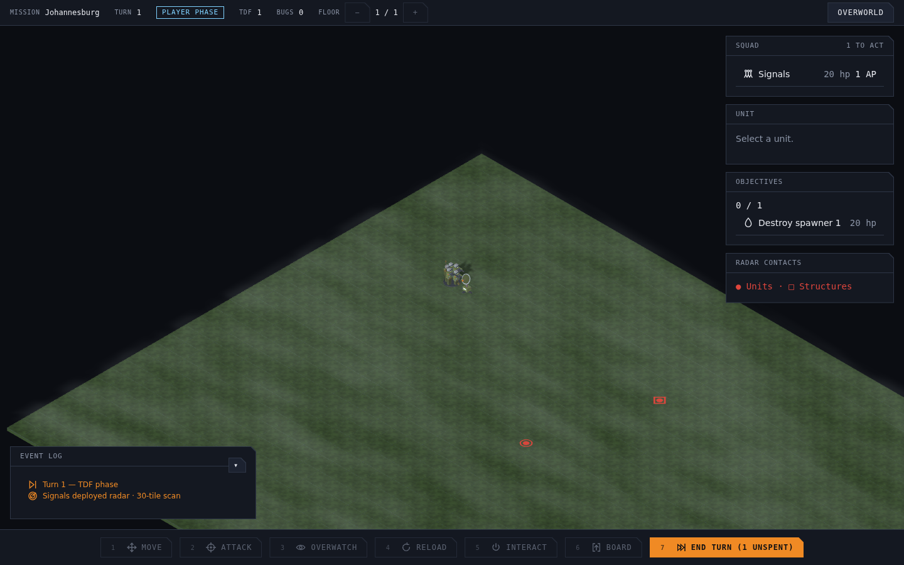

# Radio squad and deployable radar

Radio squads help locate egg nests before committing troops to a long search.
Hire a **Radio Squad** for **650 credits**, deploy it with the force, then select
it and left-click an adjacent free tile. Choose **Deploy radar** on the action
wheel. Deployment costs **1 AP** and uses the same adjacent terrain and wall
rules as infantry movement.

The scanner detects living enemy units and structures within a **30-tile
horizontal circle**, through walls, floors and fog. Red round blips indicate
units; red square blips indicate structures, including egg nests. Blips give
locations, without revealing terrain or granting line of sight for attacks.
They update as enemies move, disappear when targets die or leave coverage, and
leave the normal model to represent a target once it is visible. Overlapping
scanners do not duplicate a contact.

Scanners last for the mission, including after their deploying squad extracts.
They have no charges or upkeep, allow units to walk through their tile, and are
saved with the active mission. Existing version-17 saves migrate to version 18
with no scanners deployed. These are the initial balance choices for the
2026-09-12 request; costs and range live in the squad catalogue and radar tuning.

## Art

The radio operator carries a backpack and tall whip aerial. The scanner has a
small power pack, mast and tilted dish. Both use the existing TDF palette and
atlas. The radio squad retains named leg and upper-body groups for the infantry
motion rig. Blender sources live under `tools/art/models/`.

| Asset | Triangles | Bytes | Review angles |
| --- | ---: | ---: | --- |
| Radio squad | 1,028 | 97,688 | [45°](renders/tdf.infantry.radio_045.png), [135°](renders/tdf.infantry.radio_135.png), [225°](renders/tdf.infantry.radio_225.png) |
| Radar scanner | 188 | 20,184 | [45°](renders/tdf.radar-scanner_045.png), [135°](renders/tdf.radar-scanner_135.png), [225°](renders/tdf.radar-scanner_225.png) |

Both GLBs passed the Blender/trimesh validation loop, including closed meshes,
ground pivots, triangle budgets and file budgets. A roster thumbnail is
registered for the new squad.

## Verification

`e2e/radio-radar.spec.ts` hires a radio squad through the roster UI and starts a
mission to verify its template. It then uses a deterministic saved board to
exercise wheel deployment, the AP cost, duplicate placement refusal, rendered
contacts without enemy models, and save/reload persistence. Regenerate the frame
above with `CAPTURE=1 pnpm exec playwright test e2e/radio-radar.spec.ts`.

Unit coverage includes the circular boundary, multiple scanners, hidden units,
structures on upper floors, side isolation, blocked deployment, invalid commands,
wall-obscured targets within weapon range, moving/dead contacts, migration and
renderer disposal during asynchronous model loading.
