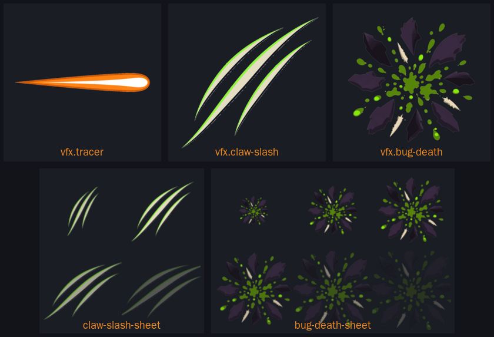
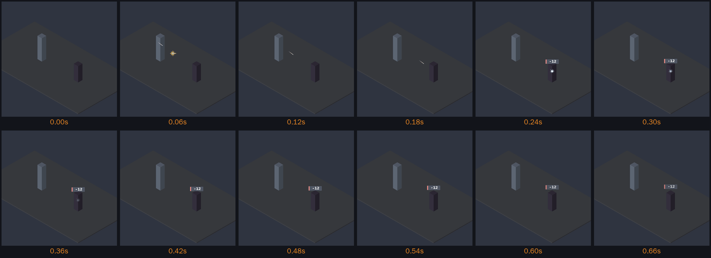
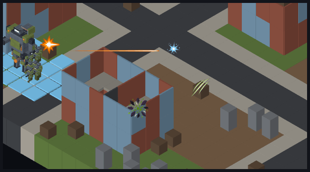

# VFX sprites

Transparent RGBA PNGs under `public/assets/sprites/vfx/`, registered in `src/graphics/data/sprite-manifest.ts`. Each has a sidecar here with the exact prompt (architecture §7). Regenerate with:

```
tools/art/gen-image.sh docs/design/sprites/prompts/<name>.txt public/assets/sprites/vfx/<name>.png
```



## In sequence



`node tools/art/preview/shoot-vfx.mjs out.png ranged|melee|death` runs the real
`TacticalAnimationQueue` against stand-in units at 64 px per tile and steps it
0.06 s at a time, so a filmstrip is reproducible where sampling a live mission
is not. Use it to judge sizes, anchors and timing after any change; playing to
contact takes twenty turns and still misses the 0.12 s frames.

## At game scale



The five effects composited over a real mission frame (`tools/art/preview/shoot-mission.mjs`) at the world sizes the animation queue uses, which is the only honest way to size a sprite. What it settled:

| Effect | Size in tiles | Why |
|---|---|---|
| Muzzle flash | **0.8** (shipped) | Reads as a hard star at 51 px. Correct as is. |
| Impact | **0.7** (shipped) | The spark reads. Correct as is. |
| Tracer | **0.22 thick**, stretched shooter → target | At 0.15 it is a 10 px hairline that disappears over asphalt. |
| Claw slash | **0.9** | At 0.7 the three gashes merge into a smudge; a melee hit should also feel bigger than a bullet. |
| Bug death | **1.0** | Dark chitin shards vanish against a dark tile at 0.8; the green ichor carries it, the shards need the size. |

These are recommendations for whoever wires #457, not something the queue does today — it plays only the flash and the impact.

| Sprite | Id | Size | Blend |
|---|---|---|---|
| [muzzle-flash](muzzle-flash.md) | `vfx.muzzle-flash` | 512² | additive |
| [impact](impact.md) | `vfx.impact` | 512² | additive |
| [egg-burst](egg-burst.md) | `vfx.egg-burst` | 512² | normal |
| [tracer](tracer.md) | `vfx.tracer` | 512² | additive |
| [claw-slash](claw-slash.md) | `vfx.claw-slash` | 512² | additive |
| [bug-death](bug-death.md) | `vfx.bug-death` | 512² | normal |
| [muzzle-flash-sheet](sheets.md) | `vfx.muzzle-flash-sheet` | 256² (2×2 frames of 128) | additive |
| [impact-sheet](sheets.md) | `vfx.impact-sheet` | 256² (2×2 frames of 128) | additive |
| [egg-burst-sheet](sheets.md) | `vfx.egg-burst-sheet` | 384×256 (3×2 frames of 128) | normal |
| [claw-slash-sheet](sheets.md) | `vfx.claw-slash-sheet` | 256² (2×2 frames of 128) | additive |
| [bug-death-sheet](sheets.md) | `vfx.bug-death-sheet` | 384×256 (3×2 frames of 128) | normal |

Rules: ≤ 512² (sheets ≤ 512 wide), alpha actually used, under 150 KB, hard-edged three-tone bands on the style guide palette (§4), no background. Animation sheets are derived from the single sprites by `tools/art/build-vfx-strips.sh`; regenerate them after changing a source sprite. `vfx.tracer` has no sheet: the renderer stretches it along the shot axis, and frames would fight the stretch. Generated PNGs are quantised with `magick -strip +dither -colors 32 png32:` before committing — `png32:` keeps colour type 6, which the manifest test requires.
